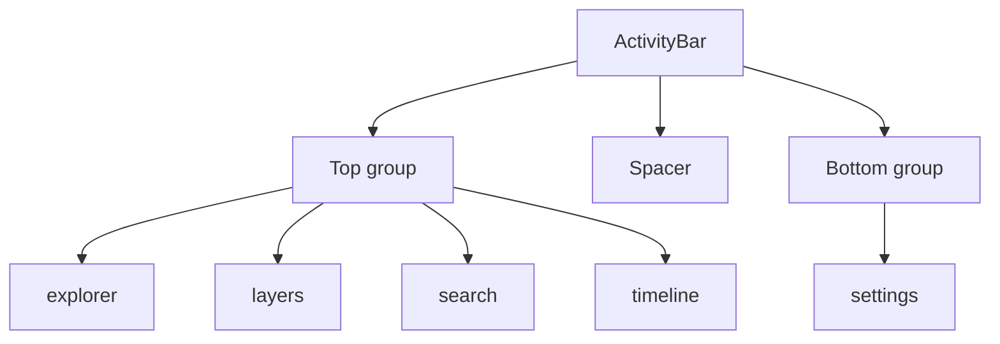

# ActivityBar

> Source: `src/components/layout/ActivityBar.tsx`

## Purpose & UX role

`ActivityBar` is the 48-pixel-wide rail on the very left of `WorkspaceLayout`'s main area. It is a deliberate VS Code clone:

- **Top group of 4 tabs**: `explorer` / `layers` / `search` / `timeline`
- **Bottom group of 1 tab**: `settings`
- The active tab gets a `2×20px` cyan highlight bar against its left edge
- Hovering a button shows the `title` tooltip

`ActivityBar` does not render any panel content — it merely calls `onTabChange(tab)`, which the parent forwards into `SidebarContext`. `SidebarPanel` then renders the matching panel (`MapOutline` / `LayerTree` / `SearchPanel` / `SettingsPanel` / `TimelinePanel`).

## Composition tree



## Types & props

```ts
export type ActivityTab = 'explorer' | 'layers' | 'search' | 'timeline' | 'settings';

interface ActivityBarProps {
  activeTab: ActivityTab;
  onTabChange: (tab: ActivityTab) => void;
}
```

| Prop          | Type                         | Default | Description                                         |
| ------------- | ---------------------------- | ------- | --------------------------------------------------- |
| `activeTab`   | `ActivityTab`                | —       | Currently active tab                                |
| `onTabChange` | `(tab: ActivityTab) => void` | —       | Click handler — the parent updates `SidebarContext` |

The `tabs` array is a file-local constant (`ActivityBar.tsx:11-17`); adding or removing a tab requires editing the source.

## Internal state

No `useState` and no `useEffect` — `ActivityBar` is a pure display component. The parent `WorkspaceLayoutInner` reads `activeTab` / `setActiveTab` via `useSidebar()`.

## Render anatomy

```jsx
<div className="w-12 bg-ams-bg-base border-r border-ams-border-subtle flex flex-col items-center py-2 shrink-0">
  <div className="flex flex-col items-center gap-1">{/* top 4 tabs */}</div>
  <div className="flex-1" />
  <div className="flex flex-col items-center gap-1">{/* bottom settings */}</div>
</div>
```

Each tab button:

```jsx
<button onClick={() => onTabChange(id)} title={label} className={…}>
  {activeTab === id && <div className="absolute left-0 top-1/2 -translate-y-1/2 w-[2px] h-5 bg-ams-accent rounded-r" />}
  <Icon className="w-5 h-5" />
</button>
```

## Performance notes

- 5 fixed buttons, no re-render pressure.
- Active check `activeTab === id` is O(1).
- No portals, lazy boundaries, or suspense — the activity bar is always present.

## Design tokens

`ActivityBar` is — alongside [StatusBar](./status-bar.md) — one of the **reference migrations** for the `ams-*` token system:

- Container: `bg-ams-bg-base border-r border-ams-border-subtle`
- Active tab: `text-ams-text-primary bg-ams-surface-active`
- Idle: `text-ams-text-muted hover:text-ams-text-primary hover:bg-ams-surface-hover`
- Highlight bar: `bg-ams-accent`

## Source map

| Concern                | File location                    |
| ---------------------- | -------------------------------- |
| Component body         | `ActivityBar.tsx:19-69`          |
| `tabs` constant array  | `ActivityBar.tsx:11-17`          |
| Top group render       | `ActivityBar.tsx:23-42`          |
| Bottom settings render | `ActivityBar.tsx:48-67`          |
| `SidebarContext`       | `src/context/SidebarContext.tsx` |

## Cross-references

- [WorkspaceLayout](./workspace-layout.md) — parent
- `SidebarPanel` — renders the panel content for the active tab (`src/components/layout/panels/SidebarPanel.tsx`)
- [MapOutline](./map-outline.md) / [LayerTree](./layer-tree.md) / [SearchPanel](./search-panel.md) / [SettingsPanel](./settings-panel.md) / [TimelinePanel](./timeline-panel.md) — content for each tab
