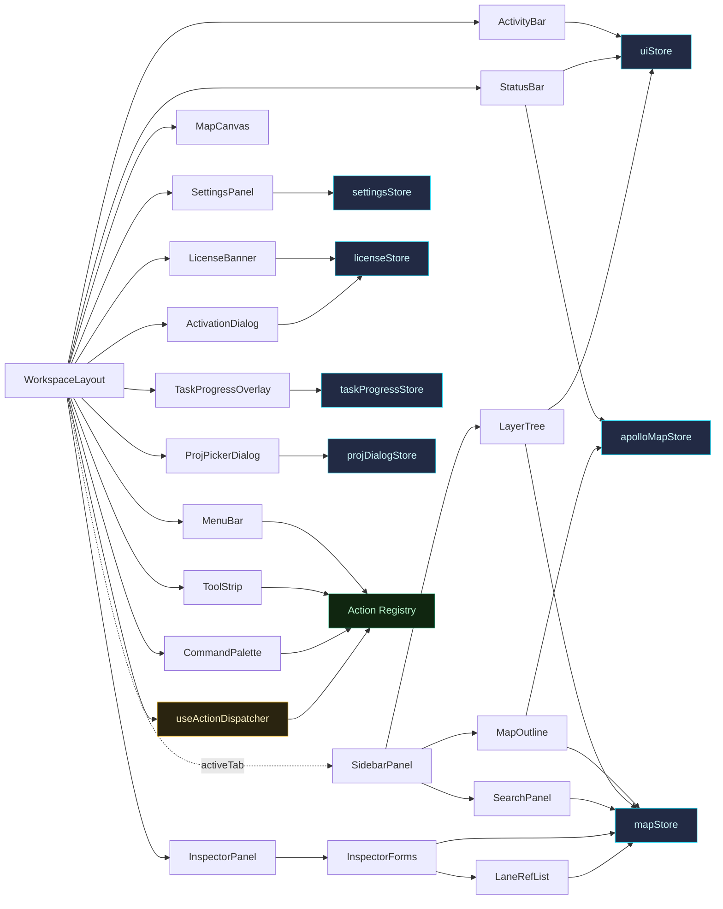

# Components API Overview

This section is the authoritative reference for the **React components** that
make up Apollo Map Studio's UI. Every component has its own page covering:

- **Purpose & UX role**
- **Props interface** table (name / type / default / description)
- **Internal state** (`useState`, Zustand selectors, XState selectors)
- **Side effects** (event subscriptions, MapLibre layer registration, FSM event sends)
- **Render anatomy** (DOM / layer structure)
- **Performance notes** (`memo`, `RAF`, effect deps)
- **Source map** (file:line)
- Cross-links to guide pages, architecture pages, and sibling components

## Component layering

```mermaid
flowchart TB
  Root[WorkspaceLayout] --> MenuBar
  Root --> LicenseBanner
  Root --> ToolStrip
  Root --> ActivityBar
  Root --> Dockview[Dockview Shell]
  Dockview --> MapPanel[Map Panel<br/>= MapCanvas]
  Dockview --> SidebarPanel[Sidebar Panel<br/>= MapOutline / LayerTree / SearchPanel / SettingsPanel]
  Dockview --> InspectorPanel[Inspector Panel<br/>= InspectorForms + LaneRefList]
  Dockview --> TimelinePanel
  Root --> StatusBar
  Root --> CommandPalette
  Root --> SettingsModal[SettingsPanel \(modal\)]
  Root --> ProjPickerDialog
  Root --> TaskProgressOverlay
  Root --> ActivationDialog
```

Per [`ARCHITECTURE.md`](/en/architecture/), `components/` sits at the top of
the import hierarchy. It freely consumes `hooks/`, `store/`, `lib/`, `core/`,
and `types/`, but downward references are **forbidden**. Each component page
lists which lower-tier modules it directly consumes.

## Component index

| Component                                         | Tier             | Primary role                                                                                                               | Source                                                                                   |
| ------------------------------------------------- | ---------------- | -------------------------------------------------------------------------------------------------------------------------- | ---------------------------------------------------------------------------------------- |
| [WorkspaceLayout](./workspace-layout.md)          | Shell (root)     | Full-screen grid: MenuBar / LicenseBanner / ToolStrip / Dockview / StatusBar; injects `EditorProvider` + `SidebarProvider` | `src/components/layout/WorkspaceLayout.tsx`                                              |
| [MapCanvas](./map-canvas.md)                      | Map (core)       | MapLibre GL container; hosts cold/hot/grid/Apollo layers + event router                                                    | `src/components/map/MapCanvas.tsx`                                                       |
| [MenuBar](./menu-bar.md)                          | Shell            | Top-level menu (File / Edit / View / Tools / Help) + mode toggle                                                           | `src/components/layout/MenuBar.tsx`                                                      |
| [ToolStrip](./tool-strip.md)                      | Shell            | Tool strip: default/connect + 11 element icons + tool variants + view toggles                                              | `src/components/layout/ToolStrip.tsx`                                                    |
| [ActivityBar](./activity-bar.md)                  | Shell            | VS Code-style left activity rail: Explorer / Layers / Search / Timeline / Settings                                         | `src/components/layout/ActivityBar.tsx`                                                  |
| [MapOutline](./map-outline.md)                    | Sidebar Panel    | Read-only structural overview: per-type counts, health checks, Apollo header metadata                                      | `src/components/layout/panels/MapOutline.tsx`                                            |
| [LayerTree](./layer-tree.md)                      | Sidebar Panel    | `react-arborist` drag-and-drop tree: Road / Junction / Lane parenthood                                                     | `src/components/layout/panels/LayerTree.tsx` + `LayerTree/`                              |
| [SearchPanel](./search-panel.md)                  | Sidebar Panel    | Flat substring search across id / entityType (200-result safety cap)                                                       | `src/components/layout/panels/SearchPanel.tsx`                                           |
| [InspectorForms](./inspector-forms.md)            | Inspector Panel  | Entity-form dispatcher (Lane / Road / Signal / PNCJunction / Overlap / 17 Apollo entities)                                 | `src/components/layout/panels/InspectorForms.tsx` + `InspectorForms/` + `SchemaForm.tsx` |
| [LaneRefList](./lane-ref-list.md)                 | Inspector Helper | Clickable lane-id pill row that routes `SELECT_ENTITY` FSM events                                                          | `src/components/layout/panels/LaneRefList.tsx`                                           |
| [SettingsPanel](./settings-panel.md)              | Modal            | Undo limit / viewport center / lane half-width / arrow spacing etc. user prefs                                             | `src/components/layout/panels/SettingsPanel.tsx` + `MapMetadataForm.tsx`                 |
| [StatusBar](./status-bar.md)                      | Shell            | Bottom status bar: mode / entity count / cursor / zoom / Apollo info                                                       | `src/components/layout/StatusBar.tsx`                                                    |
| [TimelinePanel](./timeline-panel.md)              | Bottom Panel     | Scene-mode timeline: tracks + keyframes + playhead (PoC, not yet wired to a store)                                         | `src/components/layout/panels/TimelinePanel.tsx`                                         |
| [CommandPalette](./command-palette.md)            | Overlay          | `cmdk` palette, ⌘K to open, bound to Action Registry                                                                       | `src/components/layout/panels/CommandPalette.tsx`                                        |
| [TaskProgressOverlay](./task-progress-overlay.md) | Overlay          | Full-screen long-running task progress (import/export, spatial worker tasks)                                               | `src/components/layout/TaskProgressOverlay.tsx`                                          |
| [ProjPickerDialog](./proj-picker-dialog.md)       | Modal            | Opens when an Apollo map is imported without a PROJ string, three input modes                                              | `src/components/dialogs/ProjPickerDialog.tsx`                                            |
| [LicenseBanner](./license-banner.md)              | Shell            | Trial countdown / expiry warning banner, opens the activation dialog                                                       | `src/components/license/LicenseBanner.tsx`                                               |
| [ActivationDialog](./activation-dialog.md)        | Modal            | Surfaces machine code + accepts an activation token → Ed25519 verification                                                 | `src/components/license/ActivationDialog.tsx`                                            |

## Suggested reading order

1. **[WorkspaceLayout](./workspace-layout.md)** — start with the skeleton, then drill down.
2. **[MapCanvas](./map-canvas.md)** — see how cold/hot layers, the worker bridge, and the event router are assembled in one component.
3. **[InspectorForms](./inspector-forms.md)** — schema-driven forms are where the R2 anti-corruption layer surfaces in the UI.
4. **[LayerTree](./layer-tree.md)** + **[ToolStrip](./tool-strip.md)** — drag-and-drop semantics and the Action Registry single source.

## Cross-references

- Architecture overview → [`/en/architecture/`](/en/architecture/)
- Action Registry → `src/core/actions/registry.ts` ([`/en/api/core/actions/`](/en/api/core/actions/))
- FSM state machine → `src/core/fsm/editorMachine.ts` ([`/en/api/core/fsm/`](/en/api/core/fsm/))
- Zustand stores → [`mapStore`](/en/api/store/store-map) / [`uiStore`](/en/api/store/store-ui)
- Hooks overview → [`/en/api/hooks`](/en/api/hooks)

::: tip Reading conventions

- Notes tagged **R1** refer to the R1 risk in the [architecture audit](/en/architecture/) (undo + drawing-FSM sync); **R2** refers to the Apollo proto anti-corruption layer.
- All `file:line` references are pinned to v1 HEAD; re-verify when migrating to v2.
  :::

## Entity ↔ component matrix

The following table maps each of the 17 Apollo HD-Map entity types and the
6 drawing primitives to the components that render or edit them. Use this
as a fast lookup when locating "the file that lets me edit X":

| entityType     | LayerTree group            | Inspector form         | Outline count key | Action category |
| -------------- | -------------------------- | ---------------------- | ----------------- | --------------- |
| `lane`         | Lanes / Junction / Section | LaneForm (SchemaForm)  | `lane`            | `lane`          |
| `road`         | Roads / Junction           | RoadForm               | `road`            | `road`          |
| `junction`     | Junctions                  | JunctionForm           | `junction`        | `junction`      |
| `signal`       | Signals                    | SignalForm             | `signal`          | `signal`        |
| `crosswalk`    | Crosswalks                 | CrosswalkForm (RO)     | `crosswalk`       | `crosswalk`     |
| `stopSign`     | Stop Signs                 | StopSignForm           | `stopSign`        | `stopSign`      |
| `yieldSign`    | Yield Signs                | YieldSignForm (RO)     | `yieldSign`       | `yieldSign`     |
| `speedBump`    | Speed Bumps                | SpeedBumpForm (RO)     | `speedBump`       | `speedBump`     |
| `clearArea`    | Clear Areas                | ClearAreaForm (RO)     | `clearArea`       | `clearArea`     |
| `parkingSpace` | Parking Spaces             | ParkingSpaceForm       | `parkingSpace`    | `parkingSpace`  |
| `parkingLot`   | Parking Lots               | (DrawingForm fallback) | `parkingLot`      | `parkingLot`    |
| `pncJunction`  | PNC Junctions              | PNCJunctionForm        | `pncJunction`     | `pncJunction`   |
| `rsu`          | RSUs / Junction            | RSUForm (RO)           | `rsu`             | `rsu`           |
| `area`         | Areas                      | AreaForm               | `area`            | `area`          |
| `barrierGate`  | Barrier Gates              | BarrierGateForm        | `barrierGate`     | `barrierGate`   |
| `overlap`      | Overlaps                   | OverlapForm            | `overlap`         | `overlap`       |
| `speedControl` | Speed Controls             | (DrawingForm fallback) | `speedControl`    | `speedControl`  |
| `polyline`     | Polylines                  | DrawingForm            | (drawingCount)    | `drawing`       |
| `bezier`       | Beziers                    | DrawingForm            | (drawingCount)    | `drawing`       |
| `arc`          | Arcs                       | DrawingForm            | (drawingCount)    | `drawing`       |
| `rect`         | Rectangles                 | DrawingForm            | (drawingCount)    | `drawing`       |
| `polygon`      | Polygons                   | DrawingForm            | (drawingCount)    | `drawing`       |
| `catmullRom`   | CatmullRom                 | DrawingForm            | (drawingCount)    | `drawing`       |

**RO** = read-only (renders `<Section><Value /></Section>` only).

## Wiring overview

This compact graph shows who calls whom and which stores each component
subscribes to. Legend: white = component, blue = store, yellow = hook,
green = registry.



## Test coverage

Test file locations per component (see [contributing guide](/en/contributing)):

| Component             | Tests                                                          |
| --------------------- | -------------------------------------------------------------- |
| WorkspaceLayout       | (integration; covered via `e2e/` Playwright)                   |
| MapCanvas             | `src/components/map/__tests__/MapCanvas.test.tsx`              |
| InspectorForms.lane   | `src/components/layout/panels/__tests__/lane-form.test.tsx`    |
| LayerTree.treeBuilder | `src/components/layout/panels/__tests__/treeBuilder.test.ts`   |
| SearchPanel           | `src/components/layout/panels/__tests__/search.test.tsx`       |
| SchemaForm            | `src/components/layout/panels/__tests__/SchemaForm.test.tsx`   |
| Overlap inspector     | `src/components/layout/panels/__tests__/overlap-form.test.tsx` |
| Action Registry       | `src/core/actions/__tests__/registry.test.ts`                  |

## Maintenance contract

1. When adding a new component, decide which tier it belongs to (Shell /
   Sidebar / Inspector / Overlay) and update the corresponding row in
   the index table.
2. Adding a new prop requires updating the component page's Props table.
3. When changing a `file:line` cited in a Source map — `git grep` for
   the coordinate across docs and update every reference together.
4. Do not paste long code blocks in the docs — keep API signatures and
   line references; readers can click through.

## Naming conventions

Every component file, directory, and test follows these conventions:

| Category                                 | Pattern                                     | Example                               |
| ---------------------------------------- | ------------------------------------------- | ------------------------------------- |
| Main component file                      | `PascalCase.tsx`                            | `WorkspaceLayout.tsx`                 |
| Sibling directory (split-out submodules) | `PascalCase/`                               | `WorkspaceLayout/dockviewLayout.ts`   |
| Submodule helper                         | `camelCase.ts`                              | `dockviewLayout.ts`, `treeBuilder.ts` |
| Test directory                           | `__tests__/`                                | `panels/__tests__/`                   |
| Test file                                | `{component}.test.tsx` / `{module}.test.ts` | `lane-form.test.tsx`                  |
| Hook file                                | `use{Name}.ts`                              | `useColdLayer.ts`                     |
| Store file                               | `{name}Store.ts`                            | `mapStore.ts`                         |

Any deviation from these patterns must be justified in the PR.

## Risk map (cross-reference with the architecture audit)

The table below ties project-level risk items to component directories,
so reviewers can quickly identify "which PRs might affect R-x":

| Risk ID | Description                        | Affected components                                                                                         |
| ------- | ---------------------------------- | ----------------------------------------------------------------------------------------------------------- |
| R1      | Undo + FSM sync                    | [WorkspaceLayout](./workspace-layout.md) (dispatcher) + [InspectorForms](./inspector-forms.md) (drift sync) |
| R2      | Apollo proto anti-corruption layer | [InspectorForms](./inspector-forms.md), [LayerTree](./layer-tree.md), [MapOutline](./map-outline.md)        |
| R4      | Cold-layer performance             | [MapCanvas](./map-canvas.md), [TaskProgressOverlay](./task-progress-overlay.md)                             |
| R5      | Action Registry single source      | [MenuBar](./menu-bar.md), [ToolStrip](./tool-strip.md), [CommandPalette](./command-palette.md)              |
| Labels  | Hardcoded component labels         | Components that render user-facing text                                                                     |
| (a11y)  | Not yet WCAG AA                    | All components                                                                                              |

## Adding a new component checklist

When adding a new component page, follow this order:

1. **Decide the tier**: Shell / Sidebar / Inspector / Modal / Overlay / License. Then add a row to the "Component index" table on this page.
2. **Create the source file**: follow the naming conventions above; place it under the right directory (`layout/` / `layout/panels/` / `dialogs/` / etc.).
3. **Write tests**: `__tests__/{name}.test.tsx`, covering at minimum render + basic interaction.
4. **Write the component page** with sections in this order: Purpose / Props / Internal state / Side effects / Render anatomy / Performance / Source map / Cross-references.
5. **Update this index page**: add a row to the "Component index" table.
6. **Update the diagrams**: if the new component changes the mermaid composition tree or wiring diagram, update the relevant diagram on this page.
7. **Attach a docs preview to the PR**: let reviewers read the markdown directly so inconsistencies are caught before merge.

## Documentation readability guide

- Prefer tables over prose — readers scan tables faster.
- Add a caption sentence next to every mermaid diagram.
- Use `file:line` links instead of pasting source code — avoids the maintenance burden of duplication.
- Keep VitePress containers (`::: tip` / `::: warning` / `::: info`).
- Keep component pages compact: explain behavior once, then link to source for implementation details.
