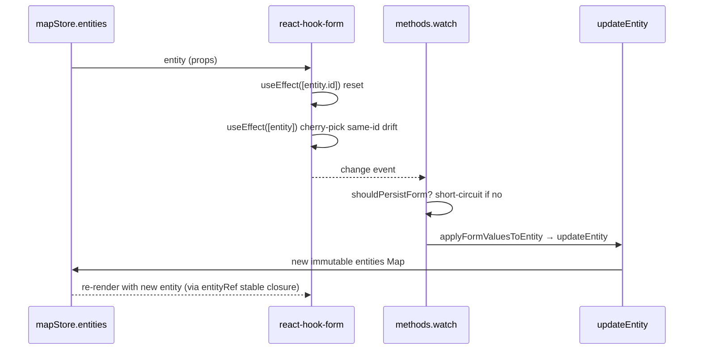

# InspectorForms

> Source:
>
> - `src/components/layout/panels/InspectorForms.tsx` (dispatcher + re-exports)
> - `src/components/layout/panels/InspectorForms/lane.tsx` (Lane → SchemaForm wrapper)
> - `src/components/layout/panels/InspectorForms/pncJunction.tsx` (bespoke)
> - `src/components/layout/panels/InspectorForms/overlap.tsx` (bespoke + override pinning)
> - `src/components/layout/panels/InspectorForms/<entity>.tsx` (simple hand-written forms)
> - `src/components/layout/panels/InspectorForms/readOnly.tsx` (read-only summary forms)
> - `src/components/layout/panels/InspectorForms/formSync.ts` (hand-written form sync hook)
> - `src/components/layout/panels/InspectorForms/DrawingForm.tsx` (fallback for drawing primitives)
> - `src/components/layout/panels/InspectorForms/resolver.ts` (zod resolver helper)
> - `src/components/layout/panels/SchemaForm.tsx` (schema-driven generic form)

## Purpose & UX role

`InspectorForms` powers the form view inside the Inspector panel (the right Dockview panel) when an entity is selected. It comprises:

1. **EntityForm dispatcher** — switches on `entity.entityType` to the right form.
2. **17 entity form variants** (the full Apollo set) + DrawingForm fallback (polyline / bezier / arc …).
3. **SchemaForm** — a generic schema-driven form. Today only `LaneForm` consumes it; future entities can opt in.
4. **Bespoke editors**: `PNCJunctionForm` (passage groups) and `OverlapForm` (per-lane is_merge + region polygon override pinning).

The entire form subsystem is shaped by the **R2 anti-corruption layer**: schema validation and entity↔form conversion route through `@/types/inspectorSchema` + `@/lib/schemas`. Proto types never appear inside form components directly.

## Composition tree

```mermaid
flowchart TB
  EF[EntityForm dispatcher]
  EF -->|lane| LF[LaneForm \(SchemaForm\)]
  EF -->|junction / parkingSpace / signal / stopSign / road / area / barrierGate| HW[entity-specific forms]
  EF -->|crosswalk / speedBump / yieldSign / clearArea / rsu| RO[readOnly.tsx]
  EF -->|pncJunction| PNC[PNCJunctionForm]
  EF -->|overlap| OV[OverlapForm]
  EF -->|polyline / bezier / arc / rect / polygon / catmullRom| DF[DrawingForm \(fallback\)]
  HW --> Sync[formSync.ts]
  LF --> SF[SchemaForm]
  SF --> Hook[react-hook-form + zodResolver]
  SF --> Adapter["entity ↔ form via formValuesFromEntity / applyFormValuesToEntity"]
```

## EntityForm dispatcher

```ts
export function EntityForm({ entity }: { entity: MapEntity }): JSX.Element;
```

| Prop     | Type        | Default | Description                                                |
| -------- | ----------- | ------- | ---------------------------------------------------------- |
| `entity` | `MapEntity` | —       | Currently selected entity; dispatch on `entity.entityType` |

`switch` table (`InspectorForms.tsx:46-80`):

| `entityType`                                            | Form component                              |
| ------------------------------------------------------- | ------------------------------------------- |
| `lane`                                                  | `LaneForm` (→ `SchemaForm`)                 |
| `junction`                                              | `JunctionForm` (`junction.tsx`)             |
| `parkingSpace`                                          | `ParkingSpaceForm` (`parkingSpace.tsx`)     |
| `signal`                                                | `SignalForm` (`signal.tsx`)                 |
| `stopSign`                                              | `StopSignForm` (`stopSign.tsx`)             |
| `road`                                                  | `RoadForm` (`road.tsx`)                     |
| `pncJunction`                                           | `PNCJunctionForm` (`pncJunction.tsx`)       |
| `overlap`                                               | `OverlapForm` (`overlap.tsx`)               |
| `area`                                                  | `AreaForm` (`area.tsx`)                     |
| `barrierGate`                                           | `BarrierGateForm` (`barrierGate.tsx`)       |
| `crosswalk`                                             | `CrosswalkForm` (read-only, `readOnly.tsx`) |
| `speedBump`                                             | `SpeedBumpForm` (read-only, `readOnly.tsx`) |
| `yieldSign`                                             | `YieldSignForm` (read-only, `readOnly.tsx`) |
| `clearArea`                                             | `ClearAreaForm` (read-only, `readOnly.tsx`) |
| `rsu`                                                   | `RSUForm` (read-only, `readOnly.tsx`)       |
| any other (polyline/bezier/arc/rect/polygon/catmullRom) | `DrawingForm` (fallback)                    |

## SchemaForm (generic)

`SchemaForm<TEntity, TFormValues>` is the schema-driven form. Given an `EntitySchema<TEntity, TFormValues>`, it:

1. Seeds the default values via `formValuesFromEntity(schema, entity)`.
2. Uses `react-hook-form` with `zodResolver(schema.validation)` and **`mode: 'onChange'`** (R1 validation gate, see the long comment block at the top of the source file).
3. **Re-seeds** only on `entity.id` change — guards against the form's own watch callback clobbering the field the user is typing into.
4. **Same-id drift sync** via `diffFormAgainstEntity` cherry-picks — undo/redo / canvas drag changes one field, only that field is refreshed.
5. **Persistence** via `methods.watch(...)`: `shouldPersistForm` is the dedupe gate that breaks the death loop, then calls `applyFormValuesToEntity` + `mapStore.updateEntity`.
6. **Rendering** is grouped by `schema.sectionOrder`; editable fields render before read-only rows inside each section.

```ts
interface SchemaFormProps<TEntity extends MapEntity, TFormValues extends FieldValues> {
  schema: EntitySchema<TEntity, TFormValues>;
  entity: TEntity;
}
```

`renderField` (`SchemaForm.tsx:140-166`) supports two `kind`s:

- `number` → `<Input type="number" min/max/step />`
- `enum` → `<Select options enumCategory />`

## LaneForm

```ts
export function LaneForm({ entity }: { entity: LaneEntity }): JSX.Element;
```

Wraps `<SchemaForm schema={LaneInspectorSchema} entity={entity} />`. It also re-exports three helpers:

```ts
laneFormValuesFromEntity(entity); // for useDrawCommit / tests
diffLaneFormAgainstEntity(form, entity);
shouldPersistLaneForm(form, entity);
```

## Simple hand-written forms and read-only summaries

Simple hand-written forms live in `InspectorForms/<entity>.tsx`. Each follows the same template:

1. `formValuesFrom<Entity>(entity)` projects the entity into form values.
2. `useForm<…>({ resolver: zodResolverZ4(schema), mode: 'onChange', defaultValues })`.
3. `useEntityFormSync(entity, methods, formValuesFrom<Entity>)` handles id-swap reset and same-id drift sync.
4. `methods.watch(...)` keeps only the real store-write rule, dedupes, then calls `updateEntity`.

The read-only forms (`CrosswalkForm` / `SpeedBumpForm` / `YieldSignForm` / `ClearAreaForm` / `RSUForm`) live in
`readOnly.tsx` and just render `<Section>` + `<Value>` rows — no react-hook-form involvement.

`SignalForm` is a special case: in addition to a `type` enum + a `signInfo` checkbox group, it edits `subsignals` inline and exposes a "Regenerate from stop line" button — the latter calls `regenerateSignalGeometry`, which rebuilds the signal silhouette.

## PNCJunctionForm (bespoke)

PNC junctions are topologically special: nested two-level structure `passageGroups[].passages[]`, where each passage references multiple `lane / signal / stopSign / yieldSign` ids. `pncJunction.tsx` provides:

- `IdMultiSelect`: multi-select dropdown + selected-id pills (with `×` to remove).
- `PassageBlock`: edit card for one passage (type select + four id multi-selects).
- Top-level: add/remove passage group, add passage to a group.

Sub-IDs are minted via `nextSubId(SUB_PREFIX.passage, …)` / `nextSubId(SUB_PREFIX.passageGroup, …)`. Every edit calls `updateEntity(id, next)` synchronously.

## OverlapForm (bespoke + override pinning)

`overlap.tsx` implements two "pin" mechanisms:

1. **`is_merge` pin**: in lane × lane overlaps, when the user toggles `is_merge` in the UI, the path `objects.<i>.laneOverlapInfo.isMerge` is appended to `entity._userOverrides`. The next reconcile run will not overwrite it.
2. **`regionOverlaps` pin**: `entity._userOverrides += 'regionOverlaps'` freezes the region polygon list and the related `regionOverlapId` references.

`withOverride` / `clearOverride` are pure functions (exported for tests). The UI renders:

- "Lane × Lane Semantics" — one row per lane object with a checkbox; pinned rows expose a `pinned ×` button.
- "Region Overlaps" — `pin` / `pinned ×` toggle, plus an enumeration of region polygons (ring count + vertex count).

## DrawingForm (fallback)

`DrawingForm` covers polyline / bezier / arc / rect / polygon / catmullRom. It is stateless and only displays:

- ID
- Vertex count (tries `points` / `anchors` / `polygon.points` in turn)

## resolver

`resolver.ts` is a thin type-narrowed wrapper:

```ts
export function zodResolverZ4<T extends FieldValues>(schema: ZodType<T, T>): Resolver<T>;
```

Only exists to work around TS inference issues in `@hookform/resolvers/zod` under zod v4.

## Side effects & lifecycle

The canonical pattern across every form:



## Performance notes

- **latest entity ref**: `SchemaForm` owns the latest-entity ref internally; hand-written
  forms get the same behavior through `useEntityFormSync`, so `methods.watch` callbacks can read the latest entity without rewiring the subscription.
- **`shouldPersistForm` is the death-loop gate**: watch writes the store → store triggers re-render → useEffect drift-sync runs → which fires watch → loop. `shouldPersistForm` returns true only if the form value still differs from the entity, otherwise short-circuits.
- **`mode: 'onChange'`**: this is the regression gate from commit 6a83d9d (R1) — must not revert to `onSubmit`.
- **Lazy load**: `InspectorForms` is loaded via `WorkspaceLayout/lazyPanels.tsx:36-39` (`LazyEntityForm`).

## Source map

| Concern                      | File location                                         |
| ---------------------------- | ----------------------------------------------------- |
| EntityForm dispatcher        | `InspectorForms.tsx:45-80`                            |
| Lane re-exports              | `InspectorForms.tsx:39-44`                            |
| LaneForm                     | `InspectorForms/lane.tsx:32-34`                       |
| SchemaForm body              | `SchemaForm.tsx:53-136`                               |
| SchemaForm same-id drift     | `SchemaForm.tsx:85-101`                               |
| SchemaForm watch persistence | `SchemaForm.tsx:105-114`                              |
| Hand-written form sync hook  | `formSync.ts`                                         |
| SignalForm special case      | `signal.tsx`                                          |
| PNCJunctionForm              | `pncJunction.tsx:151-262`                             |
| OverlapForm + override       | `overlap.tsx:65-212`                                  |
| DrawingForm fallback         | `DrawingForm.tsx:4-23`                                |
| zodResolverZ4                | `resolver.ts:9-11`                                    |
| Schema definitions           | `src/types/inspectorSchema.ts` / `src/lib/schemas.ts` |

## Cross-references

- [WorkspaceLayout](./workspace-layout.md) → InspectorPanelContent → `LazyEntityForm`
- [`mapStore.updateEntity`](/en/api/store/store-map)
- [`entityOps`](/en/api/lib/) — R2 anti-corruption layer
- [LaneRefList](./lane-ref-list.md) — clickable lane-id pill list inside the inspector
- [Architecture overview](/en/architecture/) — anti-corruption layer + R1 validation gate
