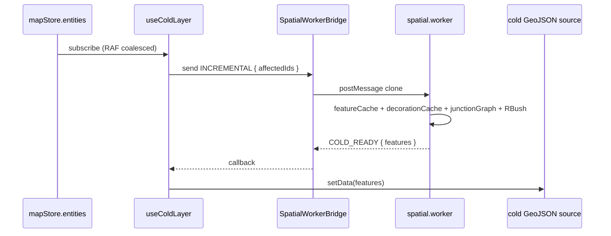

# MapCanvas

> Source: `src/components/map/MapCanvas.tsx`, with `src/components/map/coldLayerConfig.ts` and `src/components/map/entityMutations.ts`

## Purpose & UX role

`MapCanvas` is the **assembly point** for map rendering — a thin React
component that wires together the MapLibre GL container, the spatial
worker bridge, and a stack of supporting hooks. It contains **almost no
business logic**: every rendering concern, event subscription, and
performance optimization is split out into a `src/hooks/use*Layer.ts`
or `src/hooks/useMap*` module. `MapCanvas`'s job is to call them all
once, in the right order.

The split serves two goals:

1. **Separation of concerns** — each hook owns a single layer or event channel and can be unit-tested or swapped in isolation.
2. **Lifecycle ownership** — `MapCanvas` creates the worker bridge on mount and disposes it on unmount; `mapRef` / `mapLoadedRef` / `bridgeRef` are the shared stable refs that the hook stack reads.

## Composition tree

```mermaid
flowchart TB
  Root[MapCanvas]
  Root --> Container[div.containerRef \(MapLibre container\)]
  Root --> Init[useMapLibreInit]
  Init --> Map[(maplibregl.Map)]
  Root --> WB[SpatialWorkerBridge]
  WB --> Worker[spatial.worker.ts]
  Root --> Hooks[Hook stack]
  Hooks --> H1[useDrawCommit]
  Hooks --> H2[useMapEventRouter]
  Hooks --> H3[useOverlayLayer]
  Hooks --> H4[useColdLayer]
  Hooks --> H5[useHotLayer]
  Hooks --> H6[useGridLayer]
  Hooks --> H7[useApolloLayer]
  Hooks --> H8[useCursorManager]
  Hooks --> H9[useDragPan]
```

## Props

```ts
interface MapCanvasProps {
  actorRef: ActorRefFrom<typeof editorMachine>;
}
```

| Prop       | Type                                 | Default | Description                                                                                        |
| ---------- | ------------------------------------ | ------- | -------------------------------------------------------------------------------------------------- |
| `actorRef` | `ActorRefFrom<typeof editorMachine>` | —       | XState actor reference (provided by `EditorProvider`) — every hook reads/writes the FSM through it |

::: tip Best practice
Do not create the actor outside of `MapCanvas`'s parent. The component
should **always** receive the actor created at the top of
`WorkspaceLayout` (typically via `useEditorActor()` inside
`MapPanelContent`). Creating a second FSM in a child would split editor
state.
:::

## Internal state

| Ref                      | Type                                           | Lifecycle                                                                  |
| ------------------------ | ---------------------------------------------- | -------------------------------------------------------------------------- |
| `containerRef`           | `React.RefObject<HTMLDivElement>`              | Bound to `<div ref={containerRef}>` — MapLibre initializes inside this div |
| `bridgeRef`              | `React.RefObject<SpatialWorkerBridge \| null>` | `new SpatialWorkerBridge()` on mount; `bridge.dispose()` on unmount        |
| `mapRef`, `mapLoadedRef` | from `useMapLibreInit(containerRef)`           | Shared MapLibre instance + "load complete" flag for the hook stack         |

## Side effects

| When                                                         | Behavior                                                                                                                       |
| ------------------------------------------------------------ | ------------------------------------------------------------------------------------------------------------------------------ |
| `useEffect(() => new SpatialWorkerBridge(); return cleanup)` | Establishes the worker bridge on mount; explicitly `dispose()`s the worker on unmount (`MapCanvas.tsx:24-31`)                  |
| `useMapLibreInit(containerRef)`                              | Creates the MapLibre `Map` instance; subscribes to `load`; returns `mapRef` + `mapLoadedRef`                                   |
| `useDrawCommit(actorRef)`                                    | Subscribes to FSM transitions; when a draw state exits, calls `mapStore.addEntity` (reads the **post-transition** snapshot)    |
| `useMapEventRouter(mapRef, actorRef, bridgeRef)`             | Routes MapLibre `click` / `mousemove` / `dblclick` / `mouseup` to the FSM; `isDuplicateInput` dedupes `dblclick` after `click` |
| `useOverlayLayer(...)`                                       | Renders selection / edit-point highlight overlays                                                                              |
| `useColdLayer(mapRef, mapLoadedRef, actorRef, bridgeRef)`    | RAF-coalesces `mapStore.entities` changes; ships them through `bridgeRef` to the worker; setData on the `cold` source          |
| `useHotLayer(...)`                                           | Reads in-flight FSM draw context and rewrites the `hot` source every frame                                                     |
| `useGridLayer(...)`                                          | Renders a debug grid; toggled by `uiStore.gridEnabled`                                                                         |
| `useApolloLayer(...)`                                        | After Apollo `.bin/.txt` import, renders lane / road / signal Apollo entities                                                  |
| `useCursorManager(mapRef, actorRef)`                         | Switches the canvas `cursor` CSS class based on FSM state                                                                      |
| `useDragPan(mapRef, actorRef)`                               | Disables maplibre's built-in dragPan in some FSM states and substitutes a custom pan behavior                                  |

## Render anatomy

```jsx
return <div ref={containerRef} className="w-full h-full" />;
```

Inside the React tree `MapCanvas` only renders one div — every MapLibre
element is owned directly by maplibregl in the DOM.

### Layer stack (z-order)

```
┌──────────────── overlayLayer (selection / editPoints highlights)
├──────────────── hotLayer (in-flight draw preview)
├──────────────── apolloLayer (imported HD-map: lane corridor, boundaries, decorations)
├──────────────── coldLayer (committed entity GeoJSON, junction-stitched + decorated)
├──────────────── gridLayer (debug grid, optional)
└──────────────── basemap (MapLibre raster / vector)
```

### Data flow (cold/hot split)



See the [cold layer pipeline / Phase E](/en/architecture/) section for the
incremental decoration optimization.

## Performance notes

- **RAF coalesce**: `useColdLayer` batches consecutive `mapStore.entities` writes into the next animation frame before dispatching to the worker, killing jank.
- **Worker boundary clone**: `SpatialWorkerBridge` serializes data via `postMessage` — never hold a worker-side mutable reference on the main thread.
- **Hot layer is uncached**: `useHotLayer` recomputes a small FeatureCollection every frame; cheaper than a worker round-trip and never stale.
- **Single mount**: `MapCanvas` is destroyed only when its parent panel unmounts (e.g. switching layouts). Normal FSM transitions do not dispose the bridge.
- **Bridge is one-shot**: `SpatialWorkerBridge` must not be re-created by a parent; `bridgeRef` is shared across hooks.

## Source map

| Concern                           | File location                           |
| --------------------------------- | --------------------------------------- |
| Component body                    | `MapCanvas.tsx:20-46`                   |
| Worker bridge lifecycle           | `MapCanvas.tsx:24-31`                   |
| Hook stack                        | `MapCanvas.tsx:33-43`                   |
| Cold worker entrypoint            | `src/core/workers/spatial.worker.ts`    |
| Cold layer hook                   | `src/hooks/useColdLayer.ts`             |
| Hot layer hook                    | `src/hooks/useHotLayer.ts`              |
| Map event router (dblclick dedup) | `src/hooks/useMapEventRouter.ts`        |
| Entity mutations                  | `src/components/map/entityMutations.ts` |
| Cold layer styling                | `src/components/map/coldLayerConfig.ts` |

## Cross-references

- [WorkspaceLayout](./workspace-layout.md) — parent component
- [`useColdLayer`](/en/api/hooks) / [`useHotLayer`](/en/api/hooks) / [`useMapEventRouter`](/en/api/hooks) — key hook docs
- [`spatial.worker.ts`](/en/api/core) — worker protocol
- [Architecture overview](/en/architecture/) — cold/hot pipeline, Phase E incremental decoration

## Hook ordering rationale

The order of hooks in `MapCanvas` is **meaningful**. React guarantees a
stable hook order, but each hook's internal subscription order against
`mapRef` / `mapLoadedRef` / `actorRef` / `bridgeRef` determines the
layer z-order and the event routing priority:

1. `useMapLibreInit` — must run first to create the maplibre `Map` instance. Every later hook expects a non-null `mapRef.current`.
2. `useDrawCommit` — does not depend on the map instance (only on the actor). Position is conventional.
3. `useMapEventRouter` — depends on the map instance; binds click/move/dblclick. First in the interaction chain.
4. `useOverlayLayer` — selection/edit highlights. Top of the stack — always above other layers.
5. `useColdLayer` — committed entities; cold layer setData via worker round-trip.
6. `useHotLayer` — in-flight draw preview; setData every frame.
7. `useGridLayer` — debug grid; near the bottom but above the basemap.
8. `useApolloLayer` — imported Apollo entities (lane corridor / road / signal).
9. `useCursorManager` — CSS cursor switching.
10. `useDragPan` — drag behavior overrides.

::: tip Ordering principle
"Build the map first → high-priority events → high z-order layers → low z-order layers → CSS modifiers." Reordering changes either the layer stack or the event hit chain. Place new hooks accordingly.
:::

## Worker protocol detail

`SpatialWorkerBridge` exchanges these messages with `spatial.worker.ts`
(see `src/core/workers/protocol.ts` for the full schema):

| Message           | Direction     | Purpose                                                                          |
| ----------------- | ------------- | -------------------------------------------------------------------------------- |
| `SYNC`            | main → worker | Full rebuild — used on first load or reset; sends a serialized `entities`        |
| `INCREMENTAL`     | main → worker | Incremental update — sends `affectedIds`, worker re-decorates only those         |
| `HIT_TEST`        | main → worker | RBush nearest feature query for hit-testing                                      |
| `COLD_READY`      | worker → main | Carries the `features` FeatureCollection; main thread setData on the cold source |
| `HIT_TEST_RESULT` | worker → main | Hit-test response                                                                |

The cold-layer Phase E optimization keeps the worker maintaining:

- `featureCache: Map<entity_id, Feature[]>` — raw compiled features per entity
- `decorationCache: Map<lane_id, Feature[]>` — junction-stitched boundary decorations per lane
- `junctionGraph: LaneJunctionGraph` — endpoint dependency graph; O(K) lookup
- `tree: RBush` — spatial index; O(log N + K) hit-test

The affected set on INCREMENTAL = `pre-update dependents ∪ changed lanes ∪ post-update dependents`. Complexity O(K), with K typically 2-4.

## Event routing detail

`useMapEventRouter` routes maplibre native events into the FSM. Key dedup
logic:

```ts
// useMapEventRouter.ts isDuplicateInput
if (lastEventTime + DOUBLE_CLICK_THRESHOLD > now) {
  return true; // dblclick fired right after click — drop the click
}
```

This prevents a single tap from triggering two FSM branches at once.

## Known constraints

- **MapLibre instance is created once**: `new maplibregl.Map(...)` runs inside `useMapLibreInit` on mount. `map.remove()` runs on unmount, but mid-life dispose has no rebuild path.
- **Worker bridge is not reusable**: `bridgeRef` is created on mount; once disposed it can't be reactivated — `MapCanvas` must re-mount.
- **Cold layer setData is overwrite, not merge**: every SYNC / INCREMENTAL replaces the FeatureCollection wholesale.

## Troubleshooting

| Symptom                          | Likely cause                                                       | Fix                                                           |
| -------------------------------- | ------------------------------------------------------------------ | ------------------------------------------------------------- |
| Lanes don't render after import  | Apollo import didn't trigger SYNC (timing in `useColdLayer`)       | Confirm `mapStore.entities` is populated; trace `bridge.send` |
| dblclick triggers click behavior | `isDuplicateInput` dedup window is wrong                           | Check `useMapEventRouter.ts` window                           |
| Drag stutters                    | RAF coalesce broken — every mousemove triggers a worker round-trip | Verify `useColdLayer` wraps changes in RAF                    |
| Worker stuck                     | postMessage payload contains cyclic refs                           | `structuredClone`/deep-clone before send                      |

## FAQ

**Q: Can I trigger setData from outside MapCanvas?**
A: Discouraged. Cold-layer setData should always go through `useColdLayer`'s source; direct `map.getSource('cold').setData()` will be overwritten on the next RAF.

**Q: Can the hot layer be moved into a worker?**
A: Technically yes, but latency-sensitive — the hot layer needs <16ms responsiveness to feel attached to the cursor. A worker round-trip is at least 5ms — not worth it.

**Q: How does the MapLibre zoom reach StatusBar?**
A: `useMapLibreInit` writes the zoom into `useUIStore.currentZoom` on every `move` event; StatusBar subscribes to that field.
