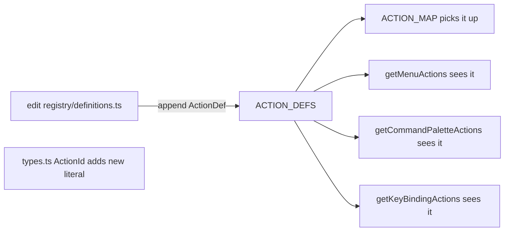
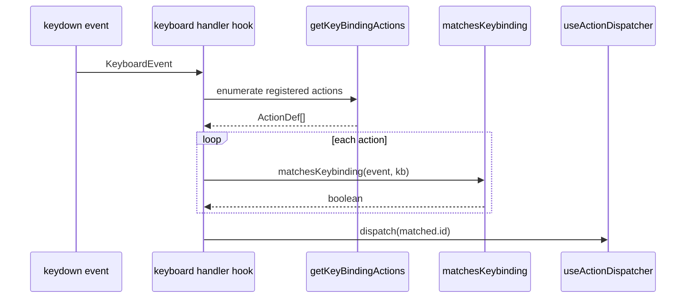

# `actions/registry` — Action Registry

> Source: `src/core/actions/registry.ts` (barrel) + `src/core/actions/registry/{definitions,helpers,types}.ts`
> Tests: `src/core/actions/__tests__/registry.test.ts`

## Purpose & Invariants

The action registry is the single source of truth for every user-executable
operation in Apollo Map Studio (R5 doctrine). Anything with a button, menu
entry, or keybinding registers one row in `ACTION_DEFS`; consumers
(MenuBar, CommandPalette, ToolStrip, keyboard handler) read it through helpers.

### Why centralise?

Historically, menu strings, the keyboard dispatcher's `if (e.key === 'p')`
ladder, and the ToolStrip icon list were three independent hard-codes. Adding
a new draw tool meant editing five files and frequently missing a menu sort
order or shortcut hint.

After centralisation, the rule is simple:

> Adding a new action = editing one file (`registry/definitions.ts`); all
> consumers update automatically.

### Invariants (must hold)

1. **`ActionDef.id` is globally unique** — `ACTION_MAP` uses it for O(1) lookup.
2. **`drawTool` corresponds to the FSM's `DrawTool`** — `getToolAction(drawTool)`
   reverse-maps via this field.
3. **`shortcut` uses Mac glyph form** (`⌘S`, `⇧⌘Z`); `formatShortcut`
   substitutes `⌘ → Ctrl+`, `⇧ → Shift+`, `⌥ → Alt+` on non-Mac platforms.
4. **`keybinding.ctrl: true` matches `ctrlKey || metaKey`** in
   `matchesKeybinding` — one config covers both macOS ⌘ and Win/Linux Ctrl.
5. **`category` is a closed enum** (`'file' | 'edit' | 'view' | 'tool' | 'selection'`)
   used by command-palette grouping.

## Public API

### Types

```ts
export type ActionId =
  | 'importApollo'
  | 'exportApolloBin'
  | 'exportApolloText'
  | 'settings'
  | 'undo'
  | 'redo'
  | 'delete'
  | 'toggleGrid'
  | 'toggleSnap'
  | 'resetLayout'
  | 'commandPalette'
  | 'defaultMode'
  | 'connectLanes'
  | 'tool:drawPolyline'
  | 'tool:drawBezier'
  | 'tool:drawArc'
  | 'tool:drawRotatedRect'
  | 'tool:drawPolygon'
  | 'tool:drawCatmullRom';

export type ActionCategory = 'file' | 'edit' | 'view' | 'tool' | 'selection';
export type ToolStripSlot = 'selection' | 'view';

export interface KeyBinding {
  key: string;
  ctrl?: boolean;
  shift?: boolean;
  alt?: boolean;
  global?: boolean;
}

export interface ActionDef {
  id: ActionId;
  label: string;
  category: ActionCategory;
  shortcut?: string; // Mac glyph form: '⌘S', '⇧⌘Z', '⌫', 'P'
  keybinding?: KeyBinding;
  icon?: IconType;
  inCommandPalette: boolean;
  menu?: string; // 'File' | 'Edit' | 'View'
  menuOrder?: number; // ascending within menu; default 99
  isToggle?: boolean;
  drawTool?: DrawTool; // only for category='tool'
  uiSlot?: ToolStripSlot;
  uiOrder?: number;
}
```

Defined in `src/core/actions/registry/types.ts`.

### `ACTION_DEFS: ActionDef[]`

Static array in `registry/definitions.ts`, **currently 19 entries**:

| id                     | category  | shortcut | menu      | drawTool        |
| ---------------------- | --------- | -------- | --------- | --------------- |
| `importApollo`         | file      | —        | File / 1  | —               |
| `exportApolloBin`      | file      | ⌘S       | File / 11 | —               |
| `exportApolloText`     | file      | ⇧⌘S      | File / 12 | —               |
| `settings`             | file      | ⌘,       | File / 90 | —               |
| `undo`                 | edit      | ⌘Z       | Edit / 10 | —               |
| `redo`                 | edit      | ⇧⌘Z      | Edit / 20 | —               |
| `delete`               | edit      | ⌫        | Edit / 40 | —               |
| `connectLanes`         | edit      | C        | Edit / 50 | —               |
| `toggleGrid`           | view      | ⌘G       | View / 20 | —               |
| `toggleSnap`           | view      | —        | View / 30 | —               |
| `resetLayout`          | view      | —        | View / 10 | —               |
| `commandPalette`       | view      | ⌘K       | —         | —               |
| `defaultMode`          | selection | H        | —         | —               |
| `tool:drawPolyline`    | tool      | P        | —         | drawPolyline    |
| `tool:drawBezier`      | tool      | B        | —         | drawBezier      |
| `tool:drawArc`         | tool      | A        | —         | drawArc         |
| `tool:drawRotatedRect` | tool      | R        | —         | drawRotatedRect |
| `tool:drawPolygon`     | tool      | G        | —         | drawPolygon     |
| `tool:drawCatmullRom`  | tool      | —        | —         | drawCatmullRom  |

Source: `src/core/actions/registry/definitions.ts:22-222`.

### `ACTION_MAP: Map<ActionId, ActionDef>`

`new Map(ACTION_DEFS.map((a) => [a.id, a]))` — O(1) lookup by id.
`ToolStrip` resolves `tool:drawX` actions via `ACTION_MAP.get(id)?.drawTool`.

Defined at `src/core/actions/registry/helpers.ts:10`.

### `getActionsByCategory(category) => ActionDef[]`

Filter by category; **does not sort** (preserves declaration order).
(`helpers.ts:12-14`)

### `getMenuActions(menu: string) => ActionDef[]`

Filter by `a.menu === menu`, sort ascending by `menuOrder` (defaults to 99).
MenuBar uses this to render File / Edit / View dropdowns.
(`helpers.ts:16-20`)

```ts
getMenuActions('Edit');
// → [undo, redo, delete, connectLanes] (menuOrder 10/20/40/50)
```

### `getMenuNames() => string[]`

Collects every distinct menu name. MenuBar enumerates the top-level menus from
this set.
(`helpers.ts:22-28`)

### `getCommandPaletteActions() => ActionDef[]`

Subset where `a.inCommandPalette === true`. CommandPalette builds its
searchable list from this.
(`helpers.ts:30-32`)

### `getKeyBindingActions() => ActionDef[]`

Subset with a `keybinding`. The keyboard handler iterates and runs
`matchesKeybinding`.
(`helpers.ts:34-36`)

### `getToolAction(drawTool: DrawTool) => ActionDef | undefined`

DrawTool → ActionDef reverse lookup. When the FSM exits a draw state,
`useDrawCommit` uses this to map the tool back to its action id for telemetry.
(`helpers.ts:38-40`)

### `getToolStripSlotActions(slot: ToolStripSlot) => ActionDef[]`

Filter by `uiSlot === slot`, sort by `uiOrder`. `ToolStrip` calls it for the
top button groups (current slots: `'selection'`, `'view'`).
(`helpers.ts:42-46`)

### `matchesKeybinding(e: KeyBindingEvent, kb: KeyBinding) => boolean`

Keyboard event matching:

```ts
key.toLowerCase() === kb.key.toLowerCase() &&
  !!kb.ctrl === (e.ctrlKey || e.metaKey) && // ⌘ ≡ Ctrl
  !!kb.shift === e.shiftKey &&
  !!kb.alt === e.altKey;
```

Crucial: `kb.ctrl` matches both macOS `metaKey` and Win/Linux `ctrlKey`, so
`{ key: 's', ctrl: true }` fires on both.
(`helpers.ts:48-54`)

### `formatShortcut(shortcut: string | undefined) => string`

Platform-aware shortcut display. Mac keeps glyphs (`⌘S`); other platforms
substitute:

| Glyph | Replacement |
| ----- | ----------- |
| `⌘`   | `Ctrl+`     |
| `⌃`   | `Ctrl+`     |
| `⇧`   | `Shift+`    |
| `⌥`   | `Alt+`      |

Non-modifier glyphs (`⌫` Backspace, `⏎` Return) pass through unchanged.
(`helpers.ts:98-108`)

### `isMacPlatform() => boolean`

Memoised platform detection. Prefers `navigator.userAgentData.platform`,
falls back to `navigator.platform` + `navigator.userAgent` (covers iPad
masquerading as desktop Safari). Tests reset via `_resetIsMacCache()`.
(`helpers.ts:69-91`)

## Algorithm / flow

### Registering a new action



If the new action is a draw tool, also add a literal to the `DrawTool`
union in `fsm/editorMachine.ts` and a state name to `DRAW_STATES`.

### Keyboard dispatch chain



`KeyBinding.global` is reserved for "respond even when an input is focused"
(e.g. `⌘S`); the consuming hook decides — the registry itself does not read
the field.

### Display chain

```
ActionDef.shortcut = '⇧⌘Z'
        │
        ├── isMacPlatform() === true  → '⇧⌘Z'         (MenuBar / palette)
        └── isMacPlatform() === false → 'Shift+Ctrl+Z'
```

## Complexity

| Function                   | Complexity     | Note                                   |
| -------------------------- | -------------- | -------------------------------------- |
| `ACTION_MAP.get(id)`       | O(1)           | Map                                    |
| `getActionsByCategory`     | O(N)           | unsorted                               |
| `getMenuActions`           | O(N log N)     | sorted; N=19 → constant in practice    |
| `getCommandPaletteActions` | O(N)           | filter                                 |
| `getKeyBindingActions`     | O(N)           | filter                                 |
| `getToolAction(drawTool)`  | O(N)           | find; N=6 → constant                   |
| `matchesKeybinding`        | O(1)           | 4 boolean compares                     |
| `formatShortcut`           | O(L)           | 4 string replaces; L = shortcut length |
| `isMacPlatform`            | O(1) amortised | UA scan once, cached                   |

## Test coverage

`src/core/actions/__tests__/registry.test.ts` covers:

- Every `ActionId` resolves to **exactly one** entry in `ACTION_DEFS`.
- `getMenuActions` ordering matches `menuOrder` ascending.
- `matchesKeybinding` exhausts the 4-boolean field combinations
  (ctrl-without-shift / ctrl+shift / ...).
- `formatShortcut` snapshots Mac and non-Mac branches.
- `isMacPlatform` falls back through `userAgentData.platform`,
  `navigator.platform`, then UA string.
- `getToolAction` returns a hit for every `DrawTool` literal.

## Consumer index

| Consumer                                          | Calls                                                                                                                |
| ------------------------------------------------- | -------------------------------------------------------------------------------------------------------------------- |
| `src/components/layout/MenuBar.tsx`               | `getMenuNames()` + `getMenuActions(menu)`                                                                            |
| `src/components/layout/panels/CommandPalette.tsx` | `getCommandPaletteActions()`                                                                                         |
| `src/components/layout/ToolStrip.tsx`             | `getToolStripSlotActions('view' \| 'selection')` + `ACTION_MAP.get(id)?.drawTool`                                    |
| `src/hooks/useActionDispatcher.ts`                | `getKeyBindingActions()` + `matchesKeybinding(e, kb)`, then switches on `ActionId` (compiler-checked exhaustiveness) |

## Adding-an-action checklist

1. `registry/types.ts`: append a literal to the `ActionId` union.
2. `registry/definitions.ts`: append an `ActionDef` to `ACTION_DEFS`. At minimum
   set `id` / `label` / `category` / `inCommandPalette`. For menu visibility add
   `menu` + `menuOrder`; for shortcuts add `shortcut` + `keybinding`.
3. `useActionDispatcher.ts`: add a switch case (TS will flag the missing
   exhaustive case).
4. Tests: add an assertion in `registry.test.ts` that the new id exists and
   carries the expected properties.

For new draw tools, additionally:

5. `fsm/editorMachine.ts`: add the literal to `DrawTool`, the state name to
   `DRAW_STATES`, and the `on` transition map for the new state.
6. `useDrawCommit.ts`: handle the corresponding commit path.
7. `core/elements.ts`: ensure some `MapElementDef.tools` includes the new tool.

## See also

- [FSM / editorMachine](./fsm-editor-machine) — `DrawTool` type and draw state list
- [elements](./elements) — `MAP_ELEMENTS` per-element allowed tools
- [hooks/useActionDispatcher](/en/api/hooks/use-action-dispatcher) — action id → effect bridge
- [components/MenuBar](/en/api/components/menu-bar) — primary consumer
