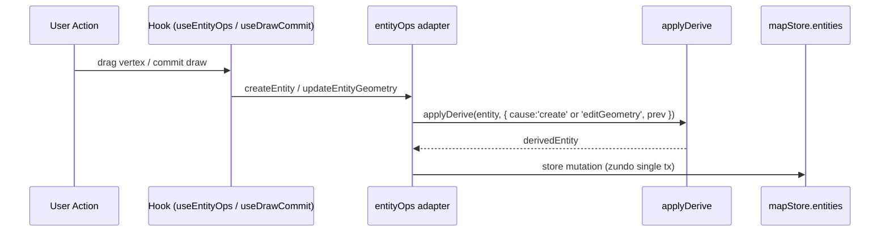

# `elements/derive` — Derivation Engine

> Source: `src/core/elements/derive/index.ts` + `types.ts` + `rules/{lane,parkingSpace}.ts`
> Tests: `src/core/elements/derive/__tests__/`

## Purpose & Invariants

The derivation engine is responsible for **computing geometry-derivable fields
once, before the entity lands** in the store.

Business background:

- `lane.length` = `polylineLengthMeters(centralCurve)` — stale after geometry edit.
- `lane.turn` = start/end heading delta classification — stale after geometry edit.
- `parkingSpace.heading` = `_sourceRect.rotation` (rotate handle changes rotation) — must stay in sync.
- `lane.boundaryType[s=0]` = the project default `DEFAULT_LANE_BOUNDARY_TYPE` — seeded on create.

Without a single choke point, these fields drift: "computed at create-time,
forgotten on drag" or "inspector edits geometry but length never refreshes".
`applyDerive(entity, ctx)` is the **only** fold point for `create` and
`editGeometry` events; every code path must call it.

### Core contract

1. **Pure functions** — rules hold no external state; given `(entity, ctx)`,
   they return a new entity (or the same reference for no-op).
2. **Order-of-declaration fold** — rules are reduced in array order; each
   rule's output feeds the next.
3. **`_userOverrides` wins** — if the entity's `_userOverrides: string[]`
   contains **any** path in the rule's `owns`, the rule is skipped entirely.
4. **Trigger filtering** — rules default to `['create', 'editGeometry']`;
   `rule.on` narrows to a subset.

### Invariants

- `applyDerive` does not modify `_userOverrides` itself (writes go through
  `markUserOverride`).
- Entity types with no registered rules take a fast path: `return entity`.
- Rule `apply` must be idempotent (running multiple times yields the same
  result); tests assert this via reference equality on no-op runs.

## Public API

### Types

```ts
export type DeriveCause = 'create' | 'editGeometry' | 'editAttribute';

export interface DeriveContext<E extends MapEntity> {
  cause: DeriveCause;
  /** Entity state before the change; used for diff-based gating (optional). */
  prev?: E;
  /** Field paths the user just patched manually (for editAttribute). */
  changedPaths?: readonly string[];
}

export interface DeriveRule<E extends MapEntity> {
  id: string; // debugging + dedup
  owns: readonly string[]; // paths this rule writes
  on?: readonly DeriveCause[]; // default ['create','editGeometry']
  apply(entity: E, ctx: DeriveContext<E>): E;
}
```

Defined in `src/core/elements/derive/types.ts`.

### `applyDerive<E>(entity: E, ctx: DeriveContext<E>) => E`

Main entry point. Looks up `REGISTRY` by `entity.entityType` and reduces:

```ts
export function applyDerive<E extends MapEntity>(entity: E, ctx: DeriveContext<E>): E {
  const rules = REGISTRY[entity.entityType];
  if (!rules || rules.length === 0) return entity;

  const overrides = readOverrides(entity);
  let next: MapEntity = entity;

  for (const rule of rules) {
    const triggers = rule.on ?? DEFAULT_TRIGGERS; // ['create','editGeometry']
    if (!triggers.includes(ctx.cause)) continue;
    if (rule.owns.some((path) => overrides.has(path))) continue;
    next = rule.apply(next, ctx);
  }

  return next as E;
}
```

Source: `src/core/elements/derive/index.ts:42-57`.

### `markUserOverride<E>(entity: E, path: string) => E`

Adds `path` to `entity._userOverrides`; returns the same reference if already
present (idempotent). Inspector forms call this after manually setting a
field so subsequent geometry edits do not clobber the manual value.

```ts
export function markUserOverride<E extends MapEntity>(entity: E, path: string): E {
  const arr = (entity as { _userOverrides?: readonly string[] })._userOverrides ?? [];
  if (arr.includes(path)) return entity;
  return { ...entity, _userOverrides: [...arr, path] } as E;
}
```

Source: `src/core/elements/derive/index.ts:63-67`.

### `clearUserOverride<E>(entity: E, path: string) => E`

Releases a path back to derivation; returns the same reference if the path
is not in the list. Used by the inspector "release this field" button.

```ts
export function clearUserOverride<E extends MapEntity>(entity: E, path: string): E {
  const arr = (entity as { _userOverrides?: readonly string[] })._userOverrides;
  if (!arr || !arr.includes(path)) return entity;
  const next = arr.filter((p) => p !== path);
  return { ...entity, _userOverrides: next.length > 0 ? next : undefined } as E;
}
```

Source: `src/core/elements/derive/index.ts:74-79`.

## Registered rules

### lane rules (`derive/rules/lane.ts`)

| id                  | owns                                                          | on           | apply                                                                                    |
| ------------------- | ------------------------------------------------------------- | ------------ | ---------------------------------------------------------------------------------------- |
| `lane.length`       | `['length']`                                                  | (default)    | `polylineLengthMeters(centerPoints(e))`; same-value short-circuits to original reference |
| `lane.turn`         | `['turn']`                                                    | (default)    | `inferLaneTurn(centerPoints(e))`; same-value short-circuits                              |
| `lane.boundarySeed` | `['leftBoundary.boundaryType', 'rightBoundary.boundaryType']` | `['create']` | If empty, seeds `[{ s:0, types:[DEFAULT_LANE_BOUNDARY_TYPE] }]`                          |

`boundarySeed` is intentionally **create-only**: a mid-edit drag should not
rewrite the boundaryType array the user may have edited via the inspector.

### parkingSpace rules (`derive/rules/parkingSpace.ts`)

| id                             | owns          | on        | apply                                                      |
| ------------------------------ | ------------- | --------- | ---------------------------------------------------------- |
| `parkingSpace.headingFromRect` | `['heading']` | (default) | If `_sourceRect` exists, sync `heading` to `rect.rotation` |

Business rationale: parking spaces created via `drawRotatedRect` carry
`_sourceRect`; the rotate handle updates `rect.rotation`, but the inspector
shows the proto `heading` field. `derive` keeps the two in lockstep.

## Trigger flow



## `_userOverrides` path expressions

Paths use dot notation:

- `length` → `entity.length`
- `leftBoundary.boundaryType` → `entity.leftBoundary.boundaryType`
- `regionOverlaps` → `(OverlapEntity).regionOverlaps` (used in overlap pipeline)

**Match semantics**: if **any** path in `rule.owns` appears in `_userOverrides`,
the entire rule is skipped. So `lane.length` / `lane.turn` are 1:1 ownership;
the boundary-type rule binds two paths together (overriding the left
boundary's type array also locks the right — open to future adjustment).

## Complexity

| Operation              | Complexity                                                                                                                                                          |
| ---------------------- | ------------------------------------------------------------------------------------------------------------------------------------------------------------------- |
| `applyDerive` per call | O(R · O · A); R = rules registered for type (lane=3, parking=1); O = overrides count (typically 0–3); A = per-rule cost (e.g. `lane.length` polyline length = O(N)) |
| `markUserOverride`     | O(K) where K = existing overrides count                                                                                                                             |
| `clearUserOverride`    | O(K)                                                                                                                                                                |

In practice: lane apply ≈ 0.05ms for a 500-point centralCurve; safe to call
multiple times per frame.

## Test coverage

`src/core/elements/derive/__tests__/` covers:

- `applyDerive` runs `boundarySeed` on `create` and skips it on `editGeometry` (`on` filter).
- Path in `_userOverrides` skips the corresponding rule.
- `markUserOverride` is idempotent.
- `clearUserOverride` returns the same reference when the path is absent.
- Each lane rule short-circuits to the same reference when no value change occurred (perf contract).

## Adding-a-rule checklist

1. In `derive/rules/<entityType>.ts` (or new file), declare a `DeriveRule<EntityType>`:

   ```ts
   const myRule: DeriveRule<LaneEntity> = {
     id: 'lane.myField',
     owns: ['myField'],
     on: ['create', 'editGeometry'],
     apply: (e) => {
       const next = computeMyField(e);
       return next === e.myField ? e : { ...e, myField: next };
     },
   };
   ```

2. Append to that entity type's exported rules array (e.g. `laneRules`).
3. No `index.ts` change required — `REGISTRY` already pulls `laneRules` /
   `parkingSpaceRules`.
4. Tests: happy path + `_userOverrides` skip + reference-equality idempotency.

## See also

- [elements](./elements) — `MapElementType` and allowed tools
- [elements/overlap](./elements-overlap) — also uses `_userOverrides` to pin
  user-edited `isMerge` / `regionOverlaps`
- [geometry/apolloCompile](./geometry-apollo-compile) — `inferLaneTurn` implementation
- [lib/entityOps](/en/api/lib/entity-ops) — single UI entry to write entities;
  create / update paths invoke `applyDerive`
