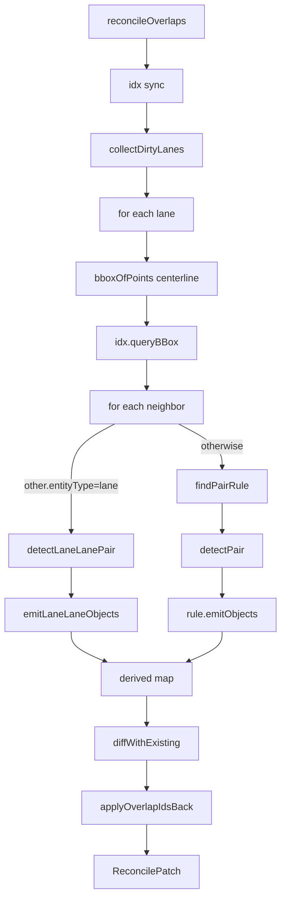
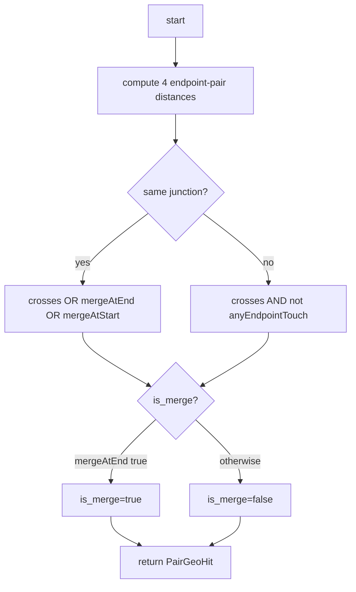

# `elements/overlap` — Overlap Reconcile Pipeline

> Source: `src/core/elements/overlap/` (12 files)
> Tests: `src/core/elements/overlap/__tests__/`
> Key files: `reconcile.ts`, `spatialIndex.ts`, `pairTable.ts`, `intersect.ts`

## Purpose & Invariants

Apollo HD Map's `OverlapEntity` describes the metadata of a lane intersecting
another entity (junction, crosswalk, signal, stopSign, signalLine,
parkingSpace, …): participant ids, the lane arc-length interval
`start_s / end_s`, the merge flag `is_merge`, and an optional region polygon.

This pipeline turns the computation into a **pure function**:
`(entities, mode) → patch`.

- Input: `ReadonlyMap<id, MapEntity>` + `ReconcileMode`
- Output: `ReconcilePatch { changes, removedOverlapIds, stats }`
- The store applies the patch on the main thread in a single mutation
  (preserves zundo single-transaction semantics).

### Invariants

1. **Single id system (post B.3 refactor)**: every overlap id is
   `overlap_<sortedParticipants...>`. After the first reconcile on imported
   data, ids are normalised to sorted form; subsequent set-diffs match.
   There is **no** "imported preserve" branch — overlap = a geometric
   derivation, fully managed by reconcile.
2. **Manual edits pinned via `_userOverrides`** — `isMerge` and
   `regionOverlaps` are user-overridable; override paths go through
   `parseLaneIsMergeOverride` and `REGION_OVERLAPS_OVERRIDE_PATH`.
3. **Lane is the primary** — proto's `LaneOverlapInfo` is the only oneof
   branch carrying `start_s / end_s`, so the scan loop is "per lane ×
   neighbors", O(L · k_avg), not O(N²).
4. **At most one OverlapEntity per pair** — dedup is via the semantic id
   `makeOverlapId([a,b])`.
5. **lane × lane within / across a junction differs** (GAP-2 / GAP-7):
   - same junction: crossings, end-end merge, start-start fork all count
     (intra-junction trajectory conflicts)
   - across junctions: only true crossings that are **not** purely endpoint-shared
     count; endpoint sharing is pred/succ topology
   - `is_merge` is true only when end-end coincide (other endpoint sharings
     are split / topology, not merge).

## File map

| File                  | Purpose                                                                                   |
| --------------------- | ----------------------------------------------------------------------------------------- |
| `index.ts`            | Public API barrel (`reconcileOverlaps`, `SpatialIndex`, `makeOverlapId`, ...)             |
| `reconcile.ts`        | Main pipeline                                                                             |
| `spatialIndex.ts`     | RBush wrapper; bbox-signature incremental sync; module-level singleton                    |
| `intersect.ts`        | Geometric primitives (segments, polyline×polyline, polyline×polygon, point-in-polygon)    |
| `pairTable.ts`        | lane × secondary pair rules + `detectLaneLanePair` + emitter factory                      |
| `geometryAdapters.ts` | proto → geometry adapters (`getCenterline`, `getPolygon`, `getStopLines`, `getPolylines`) |
| `computeLaneS.ts`     | lane arc-length cache + `projectSegmentParam` (segIdx,t → s meters)                       |
| `overlapId.ts`        | Semantic derived id (`overlap_<sortedParts>`)                                             |
| `regionId.ts`         | Region id (`makeRegionId([a,b], idx)`)                                                    |
| `overridePaths.ts`    | `_userOverrides` path parsing                                                             |
| `laneCorridor.ts`     | Lane corridor polygon (GAP-5: lane × crosswalk region intersection)                       |
| `polyClip.ts`         | polygon-clipping wrapper (`intersectPolygons`, `largestRing`)                             |
| `types.ts`            | `BBox`, `IndexNode`, `ReconcileMode`, `ReconcilePatch`, `PairHit`                         |

## Public API

### Types

```ts
export type ReconcileMode =
  | { mode: 'incremental'; dirtyIds: ReadonlySet<string> }
  | { mode: 'full' };

export interface ReconcilePatch {
  changes: Map<string, MapEntity>;
  removedOverlapIds: Set<string>;
  stats: {
    pairsTested: number;
    pairsMatched: number;
    overlapsCreated: number;
    overlapsRemoved: number;
    durationMs: number;
  };
}

export interface BBox {
  minX: number;
  minY: number;
  maxX: number;
  maxY: number;
}
export interface IndexNode extends BBox {
  id: string;
  entityType: MapEntity['entityType'];
}
```

### `reconcileOverlaps(entities, mode, index?) => ReconcilePatch`

Main entry point (`reconcile.ts:57`). Flow:

1. `idx = index ?? getSharedSpatialIndex()` and sync per mode:
   - `'full'` → `idx.syncFromEntities(entities)` — O(N) full bbox-signature compare
   - `'incremental'` → `idx.syncDirty(entities, dirtyIds)` — O(|dirtyIds|)
2. `collectDirtyLanes` returns the lane set to rescan this round.
3. For each lane: bbox-query neighbors, then for each neighbor:
   - Neighbor is also a lane → `detectLaneLanePair`
   - Otherwise → `findPairRule(other.entityType)` + `detectPair`
4. For each pair `(lane, other)`, derive a stable id via
   `makeOverlapId([lane.id, other.id])`; set-based dedup (symmetric in (A,B)).
5. `diffWithExisting` compares against existing `OverlapEntity`s and produces
   `changes` + `removedOverlapIds`; `mergeWithOverrides` preserves pinned
   `isMerge` / `regionOverlaps`.
6. `applyOverlapIdsBack` writes derived overlap ids back into each
   participant's `overlapIds: string[]` (in incremental mode, only entities
   in `dirtyIds` are updated).

### `invalidateLaneCaches(removedLaneIds): void`

Clears arc-length cache entries for deleted lane ids in `computeLaneS`.
Pair with `mapStore.deleteEntity` so id reuse never produces stale arc lengths.

### `SpatialIndex`

RBush wrapper. Key methods:

- `build(entities)` — full O(N) load
- `syncFromEntities(entities)` — full compare; only re-insert/remove on bbox-signature change
- `syncDirty(entities, dirtyIds)` — O(|dirtyIds|) incremental
- `insert(entity)` / `remove(id)` — single-entity
- `queryBBox(bbox) => IndexNode[]` — neighbor query
- `queryNeighbors(id) => IndexNode[]` — single-entity neighbors (excluding self)
- `clear()`, `size()`, `getBBox(id)`

### `bboxForEntity(entity) => BBox | null`

Per entityType:

- lane → `bboxOfPoints(centerline)`
- polygon-bearing types → `bboxOfPoints(polygon.points)`
- stopLines / polylines types → bbox union over the line groups
- otherwise → null (not indexed)

### `getSharedSpatialIndex() / resetSharedSpatialIndex()`

Module-level singleton. The store reuses one instance to avoid `new RBush() +
load(N)` on every reconcile. Workers run in their own V8 isolate and call
`resetSharedSpatialIndex()` on startup (`overlap.worker.ts`).

### `makeOverlapId / isDerivedOverlapId`

```ts
makeOverlapId(['lane_3', 'junction_1']) === 'overlap_junction_1__lane_3';
isDerivedOverlapId('overlap_a__b') === true;
```

Sort then join with `__`; symmetric in (A,B) / (B,A).

## Algorithm details

### Pair scan loop



### Geometric strategy matrix

| secondary type                                           | geometry           | trigger                                             |
| -------------------------------------------------------- | ------------------ | --------------------------------------------------- |
| junction / pncJunction / clearArea / parkingSpace / area | polygon            | `polylineIntersectsPolygon`                         |
| crosswalk                                                | polygon (+ region) | above + `laneCorridor × polygon` precise region     |
| signal / stopSign / yieldSign / barrierGate              | stopLines          | `polylinesIntersect(centerline, line)` for any line |
| speedBump                                                | polylines          | `polylinesIntersect(centerline, line)`              |
| lane                                                     | special            | `detectLaneLanePair` (in/out junction rules differ) |

### `detectLaneLanePair` rules (GAP-2 / GAP-7)



`cosLat` is computed locally from `laneA.start.y`; using the global average
across a wide-latitude map introduces meter-space error.

### bbox-signature incremental sync

`SpatialIndex.bboxSig: Map<id, "minX|minY|maxX|maxY">` caches a stringified
bbox **signature** instead of the entity reference. Reason: when `entities`
flow through immer's producer, the draft proxy is frozen on producer exit and
the reference changes — `prev === e` reference comparison would miss every
entity and trigger a full rebuild. Signature cache fixes this:

- `lane.junctionId` and similar non-geometric fields → signature unchanged →
  skip tree mutation.
- `centralCurve` content change → signature change → re-insert.
- immer freeze swaps reference → signature unchanged → skip.

### User-pin protection (`mergeWithOverrides`)

`OverlapEntity._userOverrides` may contain:

| path                                    | meaning                                                                                               |
| --------------------------------------- | ----------------------------------------------------------------------------------------------------- |
| `'objects.<i>.laneOverlapInfo.isMerge'` | the i-th ObjectOverlapInfo's isMerge is pinned (manual merge toggle)                                  |
| `'regionOverlaps'`                      | the entire regionOverlaps array is pinned (manual edits to lane×crosswalk polygons survive reconcile) |

reconcile still derives all objects; `mergeOneObject` then:

- If i is pinned → restore `existing.isMerge` over the derived value.
- If region pinned → preserve `existing.regionOverlaps` and sync
  `regionOverlapId` references.

## Complexity

| Operation                       | Complexity   | Note                                  |
| ------------------------------- | ------------ | ------------------------------------- | ---- | ------------------- |
| `reconcileOverlaps` full        | O(L · k)     | L=lane count; k=avg neighbors (RBush) |
| `reconcileOverlaps` incremental | O(           | dirty                                 | · k) | dirty typically 1–3 |
| `idx.syncFromEntities`          | O(N)         | signature compare                     |
| `idx.syncDirty`                 | O(           | dirtyIds                              | )    |                     |
| `idx.queryBBox`                 | O(log N + k) | RBush                                 |
| `detectLaneLanePair`            | O(M·M)       | M=segment count; typically < 100      |
| `polylineIntersectsPolygon`     | O(M·V)       | V=polygon edges                       |

50k-entity scale measurements:

- Edit-time incremental (dirty=1) < 6 ms
- Full reconcile ~450 ms (off-thread via worker; main thread does not stall)

## Test coverage

Key tests in `src/core/elements/overlap/__tests__/`:

- `reconcile.test.ts` — full/incremental modes, all secondary types
- `spatialIndex.test.ts` — bbox-signature incremental, no false update on
  immer reference swap
- `intersect.test.ts` — half-open ray, collinear segments, polygon degeneracy
- `pairTable.test.ts` — every PairRule emits the right ObjectOverlapInfo
- `detectLaneLanePair` — same/different junction × 4 endpoint-share combinations
- `mergeWithOverrides` — isMerge pin, regionOverlaps pin, reference equality

## Main thread vs worker

| Trigger                                                              | Path                    | Reason                                          |
| -------------------------------------------------------------------- | ----------------------- | ----------------------------------------------- |
| Edit-time dirty                                                      | Main-thread incremental | < 6 ms; postMessage round-trip not worth it     |
| Import completed / user "Recompute overlaps" / pre-export validation | overlap.worker          | ~450 ms at 50k entities; main thread would jank |

`overlap.worker.ts` wraps full mode; the main thread issues requests via
`OverlapWorkerBridge` (see [workers-overlap](./workers-overlap)).

## See also

- [elements/derive](./elements-derive) — same `_userOverrides` pin semantics
- [workers/overlap](./workers-overlap) — Overlap worker bridge and protocol
- [geometry/laneTopology](./geometry-lane-topology) — pred/succ/neighbor
  derivation (complements overlap on endpoint-share semantics)
- [lib/entityOps](/en/api/lib/entity-ops) — store mutation entry that
  computes the dirty set
