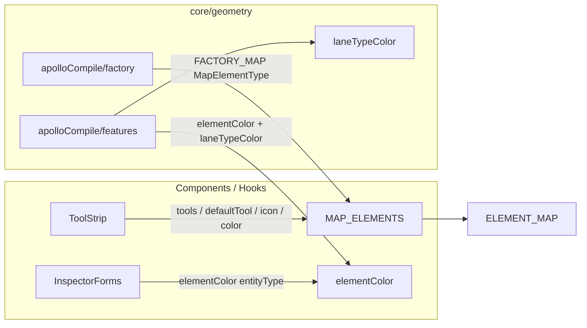

# `elements` — MapElement Catalogue

> Source: `src/core/elements.ts`
> Subfolders: `src/core/elements/derive/`, `src/core/elements/overlap/` (own docs)

## Purpose & Invariants

`elements.ts` declares the metadata card for **every** of the 12 Apollo HD-map
entity types editable in the studio:

- Render color (hot layer + ToolStrip icon tint)
- Display icon (react-icons direct reference, not string registry)
- Allowed draw tools
- Default draw tool
- Geometry kind (line / polygon)

It is the data source for the ToolStrip element groups, and the lookup key in
`core/geometry/apolloCompile/factory.ts` that dispatches to per-type
`createXxx` factories by `entityType`.

### Invariants

1. **`MapElementType` union ↔ `MAP_ELEMENTS` array.** Each literal must have a
   row, and vice versa. `ELEMENT_MAP.get(t)!` can use `!` because of this.
2. **`tools` is a subset of FSM `DrawTool`.** Tools the FSM does not know about
   would never reach ToolStrip.
3. **`defaultTool ∈ tools`.** ToolStrip switches to `defaultTool` when an
   element is picked.
4. **`color` is a hex RGB string** (not an `ams-*` token). The hot layer goes
   straight into MapLibre paint expressions, which take hex.

## Public API

### Types

```ts
export type MapElementType =
  | 'lane'
  | 'junction'
  | 'pncJunction'
  | 'parkingSpace'
  | 'crosswalk'
  | 'signal'
  | 'stopSign'
  | 'speedBump'
  | 'yieldSign'
  | 'clearArea'
  | 'barrierGate'
  | 'area';

export interface MapElementDef {
  type: MapElementType;
  label: string; // user-visible localized label
  tools: DrawTool[]; // allowed draw tools
  defaultTool: DrawTool; // tool selected when this element is picked
  color: string; // hex RGB
  geometry: 'line' | 'polygon';
  icon: IconType; // react-icons component
}
```

### `MAP_ELEMENTS: MapElementDef[]`

12 static definitions. Key fields:

| type           | label meaning  | tools                        | defaultTool     | color     | geometry |
| -------------- | -------------- | ---------------------------- | --------------- | --------- | -------- |
| `lane`         | lane           | drawBezier, drawArc          | drawBezier      | `#4a9eff` | line     |
| `junction`     | junction       | drawPolygon                  | drawPolygon     | `#ffcc00` | polygon  |
| `pncJunction`  | PNC junction   | drawPolygon                  | drawPolygon     | `#ff9933` | polygon  |
| `parkingSpace` | parking space  | drawRotatedRect, drawPolygon | drawRotatedRect | `#7c5cbf` | polygon  |
| `crosswalk`    | crosswalk      | drawRotatedRect, drawPolygon | drawRotatedRect | `#ffffff` | polygon  |
| `signal`       | traffic signal | drawBezier                   | drawBezier      | `#22cc44` | line     |
| `stopSign`     | stop sign      | drawBezier                   | drawBezier      | `#ff0000` | line     |
| `speedBump`    | speed bump     | drawBezier                   | drawBezier      | `#ffaa00` | line     |
| `yieldSign`    | yield sign     | drawBezier                   | drawBezier      | `#ff6600` | line     |
| `clearArea`    | clear area     | drawRotatedRect, drawPolygon | drawRotatedRect | `#ff4466` | polygon  |
| `barrierGate`  | barrier gate   | drawBezier                   | drawBezier      | `#aa66ff` | line     |
| `area`         | area           | drawPolygon                  | drawPolygon     | `#66aaff` | polygon  |

Source: `src/core/elements.ts:49-158`.

`stopSign / speedBump / yieldSign / barrierGate / signal` have `geometry: 'line'`
because of the **drawn** geometry — the corresponding Apollo proto has
`stopLines: Curve[]`, not a physical "line vs polygon" distinction.

### `ALL_DRAW_TOOLS`

```ts
export const ALL_DRAW_TOOLS = [
  { tool: 'drawBezier', label: 'Bezier', color: 'bg-pink-500' },
  { tool: 'drawArc', label: 'Arc', color: 'bg-amber-500' },
  { tool: 'drawRotatedRect', label: 'Rectangle', color: 'bg-red-500' },
  { tool: 'drawPolygon', label: 'Polygon', color: 'bg-purple-500' },
];
```

ToolStrip uses this for the 4 raw geometric tools when no element is selected.
`drawPolyline` and `drawCatmullRom` are absent — they are **lower-level**
draw tools backing other elements but are not directly exposed in the UI.
(`elements.ts:161-166`)

### `ELEMENT_MAP: Map<MapElementType, MapElementDef>`

`new Map(MAP_ELEMENTS.map((e) => [e.type, e]))` — O(1) lookup.
(`elements.ts:168`)

### `elementColor(entityType: string): string | undefined`

```ts
ELEMENT_MAP.get(entityType as MapElementType)?.color;
```

Used by `apolloCompile/features.ts` to obtain the default render color, which
then composes with `lane.type` semantic coloring (see `laneTypeColor`).
(`elements.ts:170-173`)

### `laneTypeColor(type: string | undefined): string`

Per-`LaneType` semantic palette (Apollo `LaneType` enum):

| LaneType       | color     | meaning                               |
| -------------- | --------- | ------------------------------------- |
| `CITY_DRIVING` | `#4a9eff` | drivable (default / fallback)         |
| `BIKING`       | `#22cc44` | bicycle (green mobility)              |
| `SIDEWALK`     | `#cfd4dc` | sidewalk (neutral light grey)         |
| `PARKING`      | `#7c5cbf` | parking (purple, echoes parkingSpace) |
| `SHOULDER`     | `#ffaa00` | shoulder (amber warning)              |
| `SHARED`       | `#66aaff` | shared lane (light blue)              |
| `NONE`         | `#6b7280` | undefined (cool grey)                 |
| anything else  | `#4a9eff` | falls back to driving blue            |

Hues sampled from the `ams-*` palette but remain hex (hot layer consumes them
directly).
(`elements.ts:187-206`)

## Caller graph



## Test coverage

There is no dedicated `elements.test.ts`; correctness is covered indirectly:

- `apolloCompile.label.test.ts` — every `MapElementType` round-trips through
  `createApolloEntity`, asserting `MAP_ELEMENTS` 12 ↔ `FACTORY_MAP` 12 1:1.
- `apolloCompile.gaps.test.ts` — `compileApolloFeatures` returns features for
  each entityType, ensuring `elementColor` fallback never makes a type invisible.
- `signalFactory.test.ts` and other per-factory specs.

## Adding-an-element checklist

> Adding a new map element is a heavy lift — it touches proto types,
> reconcile pipelines, ToolStrip rendering, the geometry factory, and feature
> compilation. This list covers only the `core/elements.ts` step.

1. Append a literal to `MapElementType`.
2. Append a row to `MAP_ELEMENTS` with at minimum `type`, `label`, `tools`,
   `defaultTool`, `color`, `geometry`, `icon`.
3. Concurrently update:
   - `src/types/apollo.ts` — proto type + `MapEntity` union
   - `src/core/geometry/apolloCompile/factory.ts` — `FACTORY_MAP` +
     `createXxx` factory
   - `src/core/geometry/apolloCompile/features.ts` — `RENDERERS` entry
   - `src/core/elements/overlap/pairTable.ts` — add `PairRule` if it should
     participate in overlap reconcile
   - `src/components/layout/panels/InspectorForms.tsx` — form
4. Run `apolloCompile.label.test.ts` — it asserts 12 → 13 types are reflected
   in `MAP_ELEMENTS` / `FACTORY_MAP` / `RENDERERS`.

## See also

- [elements/derive](./elements-derive) — derivation engine (lane.length / parking.heading)
- [elements/overlap](./elements-overlap) — overlap reconcile pipeline
- [geometry/apolloCompile](./geometry-apollo-compile) — `createApolloEntity` factory
- [actions/registry](./actions-registry) — `SELECT_TOOL` actions for `DrawTool`
- [fsm/editorMachine](./fsm-editor-machine) — `DrawTool` type origin
