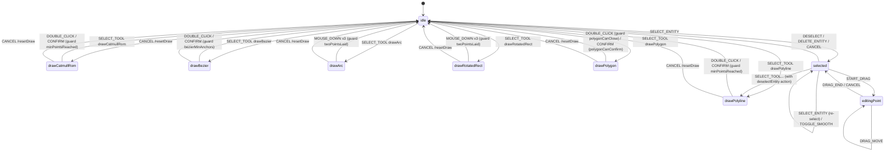

# `fsm/editorMachine` — Editor State Machine

> Source: `src/core/fsm/editorMachine.ts`
> Tests: `src/core/fsm/__tests__/editorMachine.test.ts` (~47 KB — the largest unit test in the repo)

## Purpose & Invariants

`editorMachine` is the **single** source of truth for editor interaction
behavior. Every "where did the mouse click → should we add a point / commit /
dispatch DRAG_END" decision lives here. The UI layer (MapCanvas / hooks) only
translates DOM events into `EditorEvent`s and reads FSM snapshots to render
the hot layer.

### Invariants

1. **`idle` is the initial state and the destination for every commit/cancel.**
   Drawing / selected / editingPoint paths all converge back to `idle`
   (commit path special-cased; see RESET below).
2. **Commit does not clear context.** DOUBLE_CLICK / CONFIRM transitions
   target `idle` **without actions** — `drawPoints` / `bezierAnchors` /
   `activeElement` survive so `useDrawCommit` can read the post-snapshot.
   `useDrawCommit` then sends `RESET` after the commit lands; otherwise
   `activeElement` lingers and ToolStrip element highlight never clears.
3. **Input-layer dedup is the dblclick single source of truth.**
   `useMapEventRouter`'s `isDuplicateInput` swallows the second click of a
   dblclick. The FSM **no longer** compensates with `slice(-1)` on
   DOUBLE_CLICK — that was a historical R1 bug (now fixed; see
   `editorMachine.ts:84-87` comment).
4. **`// @ts-nocheck` is a temporary trade-off.** XState 5's `assign(...)`
   takes 5 generics; lifting it to a top-level const widens `_out_TEvent` to
   `EventObject` and breaks the structural match against `setup({ types
}).actions`. Inlining `assign` sidesteps the issue. The `// @ts-nocheck`
   pragma in older revisions covered an experimental typed-machine pattern;
   current code uses inline assigns and does not need it (see comments at
   `editorMachine.ts:120-128`).
5. **`selectToolTransitions` is single-source.** The 6 `SELECT_TOOL`
   transitions are generated by `DRAW_STATES.map(...)`, avoiding manual drift.

## State chart



## Public API

### `DrawTool`

```ts
export type DrawTool =
  | 'drawPolyline'
  | 'drawCatmullRom'
  | 'drawBezier'
  | 'drawArc'
  | 'drawRotatedRect'
  | 'drawPolygon';
```

The single "draw tool" enum; `actions/registry` and `core/elements` both
import this type so the three never drift.

### `isDrawingState(state: string) => boolean`

Tests whether a FSM `state.value` is one of the 6 draw states.
(`editorMachine.ts:28-30`)

### `EditorContext`

```ts
export interface EditorContext {
  drawPoints: LngLat[]; // shared by polyline / arc / rect / polygon
  previewPoint: LngLat | null; // mousemove cursor position
  bezierAnchors: BezierAnchor[]; // drawBezier only
  isDraggingHandle: boolean; // drawBezier only
  selectedEntityId: string | null;
  dragPointIndex: number; // -1 = none
  dragPointType: DragPointType; // 'vertex' | 'control' | 'rotate' | ...
  dragCurrentPoint: LngLat | null;
  dragAltKey: boolean; // Alt held during handle drag (unlock corner)
  activeElement: MapElementType | null;
}
```

### `EditorEvent`

```ts
export type EditorEvent =
  | { type: 'SELECT_TOOL'; tool: DrawTool; element?: MapElementType }
  | { type: 'MOUSE_DOWN'; point: LngLat }
  | { type: 'MOUSE_MOVE'; point: LngLat }
  | { type: 'MOUSE_UP'; point: LngLat }
  | { type: 'DOUBLE_CLICK'; point: LngLat }
  | { type: 'CONFIRM' }
  | { type: 'CANCEL' }
  | { type: 'RESET' }
  | { type: 'SELECT_ENTITY'; id: string }
  | { type: 'DESELECT' }
  | { type: 'START_DRAG'; index: number; pointType: DragPointType; altKey?: boolean }
  | { type: 'DRAG_MOVE'; point: LngLat }
  | { type: 'DRAG_END'; point: LngLat }
  | { type: 'DELETE_ENTITY' }
  | { type: 'TOGGLE_SMOOTH'; index: number };
```

#### Why `RESET` exists alongside `CANCEL`

| Event    | Trigger                            | Sender                    | Modifies context |
| -------- | ---------------------------------- | ------------------------- | ---------------- |
| `CANCEL` | User-initiated (Esc / tool switch) | keyboard / ToolStrip      | `resetDraw`      |
| `RESET`  | Cleanup **after** commit           | `useDrawCommit` (in idle) | `resetDraw`      |

`useDrawCommit` watches FSM transitions; once a draw → idle commit completes
and `mapStore.addEntity(...)` returns, it dispatches `RESET` to clear
`activeElement`. Without RESET, ToolStrip would keep highlighting the last
element type until the next SELECT_TOOL.

### `editorMachine`

XState 5 `setup({ types, guards, actions }).createMachine({ id, initial, context, states })`.

```ts
import { createActor } from 'xstate';
import { editorMachine } from '@/core/fsm/editorMachine';

const actor = createActor(editorMachine);
actor.start();
actor.send({ type: 'SELECT_TOOL', tool: 'drawPolyline' });
const snapshot = actor.getSnapshot();
console.log(snapshot.value); // 'drawPolyline'
console.log(snapshot.context.drawPoints); // []
```

## Guards

| Guard                    | Predicate                                              | Used in                                              |
| ------------------------ | ------------------------------------------------------ | ---------------------------------------------------- |
| `minPointsReached`       | `drawPoints.length >= 2`                               | drawPolyline / drawCatmullRom DOUBLE_CLICK / CONFIRM |
| `bezierMinAnchors`       | `bezierAnchors.length >= 2`                            | drawBezier DOUBLE_CLICK / CONFIRM                    |
| `isDraggingHandle`       | `context.isDraggingHandle === true`                    | drawBezier MOUSE_MOVE branch                         |
| `twoPointsLaid`          | `drawPoints.length === 2`                              | drawArc / drawRotatedRect third MOUSE_DOWN commit    |
| `polygonNoSelfIntersect` | adding new point would not self-intersect              | drawPolygon MOUSE_DOWN                               |
| `polygonCanClose`        | `points.length >= 3 && !polygonSelfIntersects(points)` | drawPolygon DOUBLE_CLICK                             |
| `polygonCanConfirm`      | same                                                   | drawPolygon CONFIRM (palette path)                   |

## Actions

| Action                | Writes context                                                                                                 | Trigger                              |
| --------------------- | -------------------------------------------------------------------------------------------------------------- | ------------------------------------ |
| `resetDraw`           | drawPoints/bezierAnchors/previewPoint/isDraggingHandle cleared; activeElement from SELECT_TOOL.element or null | SELECT_TOOL / CANCEL / RESET         |
| `addPoint`            | `drawPoints.push(event.point)`                                                                                 | MOUSE_DOWN in most draw states       |
| `updatePreview`       | `previewPoint = event.point`                                                                                   | MOUSE_MOVE                           |
| `bezierAddAnchor`     | append `{ point, handleIn:null, handleOut:null }`; isDraggingHandle=true                                       | drawBezier MOUSE_DOWN                |
| `bezierDragHandle`    | mutate last anchor's handleOut/handleIn (mirror)                                                               | drawBezier MOUSE_MOVE while dragging |
| `bezierConfirmHandle` | distance < 1e-6 → handleIn/Out = null (corner)                                                                 | drawBezier MOUSE_UP                  |
| `bezierPreview`       | `previewPoint = event.point`                                                                                   | drawBezier MOUSE_MOVE not dragging   |
| `selectEntity`        | `selectedEntityId = event.id` + reset drag fields                                                              | SELECT_ENTITY                        |
| `deselectEntity`      | selectedEntityId=null + drag fields cleared                                                                    | DESELECT / DELETE_ENTITY / CANCEL    |
| `startDrag`           | dragPointIndex/dragPointType/dragAltKey from event                                                             | START_DRAG                           |
| `dragMove`            | dragCurrentPoint = event.point                                                                                 | DRAG_MOVE                            |

## Shared transition maps

To avoid 6× duplication across draw states, the FSM uses three shared objects:

### `selectToolTransitions`

`DRAW_STATES.map(tool => ({ guard: ev.tool === tool, target: tool, actions: ['resetDraw'] }))`

Every transition carries `resetDraw`, so switching from one draw state to
another wipes the context.

### `selectToolFromSelected`

`selectToolTransitions.map(t => ({ ...t, actions: ['deselectEntity', ...t.actions] }))`

Switching tools while `selected` first deselects the entity.

### `sharedDrawEvents`

Shared by drawPolyline / drawCatmullRom:

```ts
{
  SELECT_TOOL: selectToolTransitions,
  MOUSE_DOWN: { actions: 'addPoint' },
  MOUSE_MOVE: { actions: 'updatePreview' },
  DOUBLE_CLICK: { guard: 'minPointsReached', target: 'idle' },
  CONFIRM: { guard: 'minPointsReached', target: 'idle' },
  CANCEL: { target: 'idle', actions: 'resetDraw' },
}
```

### `threeClickCommitEvents`

Shared by drawArc / drawRotatedRect (click 1 = start, click 2 = mid, click 3 = commit):

```ts
{
  SELECT_TOOL: selectToolTransitions,
  MOUSE_DOWN: [
    { guard: 'twoPointsLaid', target: 'idle', actions: 'addPoint' },
    { actions: 'addPoint' },
  ],
  MOUSE_MOVE: { actions: 'updatePreview' },
  CANCEL: { target: 'idle', actions: 'resetDraw' },
}
```

`MOUSE_DOWN` is an array — XState 5 selects the first transition whose guard
passes. On the third click, `drawPoints.length === 2` so the guard wins, the
new point is added, the FSM transitions to `idle`, and `useDrawCommit` reads
3 points to commit.

## drawPolygon specifics

```ts
drawPolygon: {
  on: {
    SELECT_TOOL: selectToolTransitions,
    MOUSE_DOWN: { guard: 'polygonNoSelfIntersect', actions: 'addPoint' },
    MOUSE_MOVE: { actions: 'updatePreview' },
    DOUBLE_CLICK: { guard: 'polygonCanClose', target: 'idle' },
    CONFIRM:     { guard: 'polygonCanConfirm', target: 'idle' },
    CANCEL: { target: 'idle', actions: 'resetDraw' },
  },
}
```

`polygonNoSelfIntersect` runs **before** appending — if the new edge would
cross an existing edge, the click is dropped. `polygonCanClose` enforces ≥ 3
points and a non-self-intersecting closure on DOUBLE_CLICK.

## drawBezier specifics

```ts
drawBezier: {
  on: {
    MOUSE_DOWN: { actions: 'bezierAddAnchor' }, // anchor + enter handle-drag mode
    MOUSE_MOVE: [
      { guard: 'isDraggingHandle', actions: 'bezierDragHandle' },
      { actions: 'bezierPreview' },
    ],
    MOUSE_UP: { actions: 'bezierConfirmHandle' }, // tiny distance → corner
    DOUBLE_CLICK: { guard: 'bezierMinAnchors', target: 'idle', actions: assign({ isDraggingHandle: false }) },
    CONFIRM: { guard: 'bezierMinAnchors', target: 'idle' },
    CANCEL: { target: 'idle', actions: 'resetDraw' },
  },
}
```

Each MOUSE_DOWN drops a new anchor; DOWN-MOVE-UP draws a handle. MOUSE_UP
distance < 1e-6 (same pixel) means "user did not drag a handle" → corner anchor;
both handleIn and handleOut are nulled.

## Complexity

- Per transition: O(g) where g = number of guards (≤ 4 candidate transitions).
- Context update: O(P) where P = drawPoints / bezierAnchors length (spread copy).
- N SELECT_TOOL transitions generated: O(|DRAW_STATES|) = O(6).

## Test coverage

`editorMachine.test.ts` covers:

- A complete happy path for every draw state: select → click → commit → idle.
- DOUBLE_CLICK no longer trims an extra point (regression for the historical
  `slice(-1)` double-compensation bug).
- drawBezier corner detection (MOUSE_UP distance < 1e-6 → handles nulled).
- drawPolygon `polygonNoSelfIntersect` rejects an intersecting click.
- selected → editingPoint → DRAG_MOVE → DRAG_END → selected loop.
- CANCEL targets across all states.
- selectToolFromSelected deselects before switching.
- TOGGLE_SMOOTH self-loops without leaving `selected`.
- RESET clears `activeElement` in idle.

## Relationship with mapStore (R1 closure)

```
useActionDispatcher.ts:76-82
   ↓
   undo path:
     1. fsmActor.send({ type: 'CANCEL' })   ← critical: cancel first, FSM → idle
     2. mapStore.temporal.getState().undo() ← then zundo undo

   Skip step 1 → drawPoints stay mid-edit while entities roll back. The next
   CONFIRM commits stale drawPoints as a new entity → data corruption (R1 bug).
```

Regression test: `src/hooks/__tests__/undoCancel.test.ts`.

## See also

- [actions/registry](./actions-registry) — `DrawTool` + SELECT_TOOL action definitions
- [elements](./elements) — `MapElementType` and element → tool mapping
- [geometry/validation](./geometry-validation) — `wouldSelfIntersect` / `polygonSelfIntersects`
- [geometry/interpolate](./geometry-interpolate) — `mirrorPoint` / `BezierAnchor` / `cubicBezier`
- [hooks/useDrawCommit](/en/api/hooks/use-draw-commit) — FSM commit → mapStore.addEntity
- [hooks/useActionDispatcher](/en/api/hooks/use-action-dispatcher) — undo CANCEL closure
