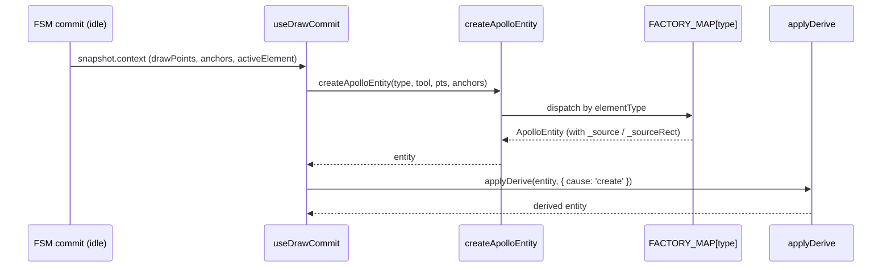
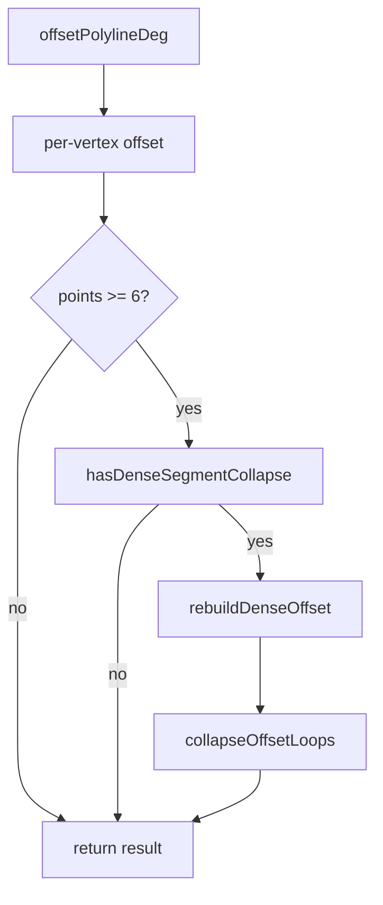

# `geometry/apolloCompile` — Apollo Entity Compile & Edit

> Source: `src/core/geometry/apolloCompile.ts` (barrel) + `apolloCompile/` subfolder (10 files)
> Tests: `src/core/geometry/__tests__/apolloCompile.{gaps,label}.test.ts`,
> `apolloEntityCoords.test.ts`, `signalFactory.test.ts`, `signalHeading.test.ts`,
> `signalTemplate.test.ts`, `offsetPolyline.{test,bench}.ts`

## Purpose & Invariants

`apolloCompile` is the **central choke point** for entity geometry:

1. **Create** (`createApolloEntity`): build one of the 12 ApolloEntity types
   from the FSM's drawTool + drawPoints + bezierAnchors.
2. **Edit-point abstraction** (`getApolloEditPoints` /
   `setAllApolloEditPoints` / `setApolloEditPoint` / `moveApolloEntity` /
   `deleteApolloVertex`): map each entity's distinct geometry fields
   (centralCurve / polygon / stopLines / position / boundary) to a unified
   "editable GeoPoint[]" interface for vertex drag.
3. **GeoJSON compile** (`compileApolloFeatures`): translate entities into the
   feature list that maplibre renders (line + polygon + label points).
4. **Helpers**: `pointsToCurve` / `pointsToPolygon` / `offsetPolylineDeg` /
   `inferLaneTurn` / `apolloEntityCoords` / `isApolloAreaEntity` /
   `isApolloPolygonEditPoints`.

### Invariants

1. **`FACTORY_MAP` ↔ `MAP_ELEMENTS` 1:1** — every element has a factory
   (`apolloCompile.label.test.ts` enforces this).
2. **`getApolloEditPoints` / `setAllApolloEditPoints` are inverses** —
   `set(get(e), pts) === e` is asserted in `apolloEntityCoords.test.ts`.
3. **`isApolloAreaEntity` ≠ `isApolloPolygonEditPoints`** — lane is "area"
   for hit-testing (fill interior counts) but its edit points are the
   central polyline. They are **distinct** predicates.
4. **`offsetPolylineDeg` works in meter space** — geometry projects through
   cosLat into equidistant meters before computation, then projects back to
   lng/lat to avoid high-latitude distortion.

## File map

| File                      | Purpose                                                                                                                                                                                         |
| ------------------------- | ----------------------------------------------------------------------------------------------------------------------------------------------------------------------------------------------- |
| `factory.ts`              | `createApolloEntity` + `inferLaneTurn` + 12 `createXxx` sub-factories                                                                                                                           |
| `features.ts`             | `compileApolloFeatures` + 12 `renderXxx` renderers                                                                                                                                              |
| `editPoints.ts`           | `getApolloEditPoints` / `setAllApolloEditPoints` / `setApolloEditPoint` / `moveApolloEntity` / `deleteApolloVertex` / `apolloEntityCoords` / `isApolloAreaEntity` / `isApolloPolygonEditPoints` |
| `conversions.ts`          | `pointsToCurve` / `pointsToPolygon`                                                                                                                                                             |
| `offsetPolyline.ts`       | `offsetPolylineDeg` (meter-space equidistant offset)                                                                                                                                            |
| `projection.ts`           | `projectPoint` / `unprojectPoint` / `Vec2`                                                                                                                                                      |
| `laneBoundaryGeometry.ts` | `curvePoints(curve)` / `explicitLaneBoundaryEdges(lane)`                                                                                                                                        |
| `signalHeading.ts`        | `computeSignalHeading` / `headingToIconRotate`                                                                                                                                                  |
| `signalTemplate.ts`       | `buildSignalTemplate({ type, anchor, heading })`                                                                                                                                                |

## Public API (barrel `apolloCompile.ts`)

```ts
export { pointsToCurve, pointsToPolygon } from './apolloCompile/conversions';
export { offsetPolylineDeg } from './apolloCompile/offsetPolyline';
export {
  apolloEntityCoords,
  deleteApolloVertex,
  getApolloEditPoints,
  isApolloAreaEntity,
  isApolloPolygonEditPoints,
  moveApolloEntity,
  setAllApolloEditPoints,
  setApolloEditPoint,
} from './apolloCompile/editPoints';
export { createApolloEntity, inferLaneTurn } from './apolloCompile/factory';
export { compileApolloFeatures } from './apolloCompile/features';
```

### `createApolloEntity(elementType, drawTool, points, anchors, options?) => ApolloEntity`

```ts
createApolloEntity(
  elementType: MapElementType,
  drawTool: string,         // FSM DrawTool string form
  points: LngLat[],
  anchors: BezierAnchor[],
  options?: { laneHalfWidth?: number; entities?: ReadonlyMap<string, MapEntity> },
): ApolloEntity;
```

Dispatches to `FACTORY_MAP[type]`. `options.entities` is consumed by
`nextEntityId` to allocate non-colliding ids. Sub-factories extract line or
polygon points by drawTool:

| drawTool                       | extraction                                |
| ------------------------------ | ----------------------------------------- |
| `drawBezier` (anchors ≥ 2)     | sample `cubicBezier(anchors)`             |
| `drawArc` (points ≥ 3)         | sample `threePointArc(p1,p2,p3)`          |
| `drawCatmullRom` (points ≥ 2)  | sample `catmullRom(points)`               |
| `drawRotatedRect` (points ≥ 3) | `rectCorners(rotatedRectFromPoints(...))` |
| otherwise                      | direct `coordsToPoints(points)`           |

Source-aware: `_source` / `_sourceRect` preserve anchors / arcPoints / rect so
subsequent vertex drag follows the source-aware path (see `connectLanes` doc).

### `inferLaneTurn(centerPts: GeoPoint[]) => LaneTurn`

Classify by start/end heading delta:

|                                   | Δ              |     | result |
| --------------------------------- | -------------- | --- | ------ |
| < `TURN_INFER_NO_TURN_RAD` (~10°) | `'NO_TURN'`    |
| ≥ `TURN_INFER_U_TURN_RAD` (~150°) | `'U_TURN'`     |
| Δ > 0                             | `'LEFT_TURN'`  |
| Δ < 0                             | `'RIGHT_TURN'` |

Uses lane mid-latitude cosLat for meter projection, then `Math.atan2(dy, dx)`.

### `compileApolloFeatures(entity: ApolloEntity) => GeoJSON.Feature[]`

Dispatch to `RENDERERS[type]`:

| entity                             | features emitted                                                                                               |
| ---------------------------------- | -------------------------------------------------------------------------------------------------------------- |
| lane                               | 1 fill polygon (left + reversed-right) + 2 boundary lines (left/right) + 1–2 center lines (single/bidirection) |
| junction / pncJunction             | 1 polygon                                                                                                      |
| parkingSpace                       | polygon + label point                                                                                          |
| crosswalk                          | polygon                                                                                                        |
| signal                             | stopLines + label point (with iconRotate)                                                                      |
| stopSign / yieldSign / barrierGate | stopLines + label                                                                                              |
| speedBump                          | doubled line (dark shadow + dashed top) + label                                                                |
| clearArea / area                   | polygon                                                                                                        |
| road                               | outer-edge polylines from `section.boundary.outerPolygon.edges`                                                |

Feature ids follow `<entity.id>:<role>[:noStroke][:<side>][:<direction>]` so
maplibre `setData` diffs are stable.

### Edit-point API

#### `getApolloEditPoints(entity) => GeoPoint[]`

| entityType                                                                        | returns                                                                               |
| --------------------------------------------------------------------------------- | ------------------------------------------------------------------------------------- |
| junction / pncJunction / parkingSpace / crosswalk / clearArea / area / parkingLot | `entity.polygon.points`                                                               |
| barrierGate                                                                       | `stopLines[0].segments[0].lineSegment.points` (fallback `polygon.points`)             |
| signal                                                                            | same, with fallback `boundary.points`                                                 |
| lane                                                                              | `curvePoints(centralCurve)` (centerline only — no left/right edges)                   |
| stopSign / speedBump / yieldSign                                                  | first segment of stopLines / position                                                 |
| road                                                                              | `section[0].boundary.outerPolygon.edges[0].curve` (multi-edge editing is future work) |

#### `setAllApolloEditPoints(entity, points) => ApolloEntity`

Writes back to the corresponding field. For lane it **clears** the explicit
left/right boundary curves (so `offsetPolylineDeg` recomputes them) and
recomputes `length`.

#### `setApolloEditPoint(entity, index, point) => ApolloEntity`

`get → splice → set` sugar.

#### `moveApolloEntity(entity, dx, dy) => ApolloEntity`

Whole translation. Lane walks `translateCurve` over central + left + right;
others run `get + map(translate) + set`.

#### `deleteApolloVertex(entity, index) => ApolloEntity | null`

Min-point check: polygon types ≥ 3, polyline types ≥ 2; returns `null` if
below threshold so the caller does not perform the delete.

### `apolloEntityCoords(entity) => LngLat[]`

Returns the entity's "outer shape" for hit-testing. Lane uses left + reversed
right (matching `compileApolloFeatures`), others convert directly.

### `isApolloAreaEntity(entity) => boolean`

"Does this entity's hitTest include the fill interior?" — true for lane and
polygon-bearing types.

### `isApolloPolygonEditPoints(entity) => boolean`

"Are `getApolloEditPoints` outputs a closed ring?" — false for lane (centerline),
true for polygon types. Used by `deleteApolloVertex` to choose the min point
threshold.

### `pointsToCurve(points) => Curve`

Wraps as `{ segments: [{ lineSegment:{points}, s:0, startPosition, heading:0, length:0 }] }`.

### `pointsToPolygon(points) => ApolloPolygon`

`{ points }`.

### `offsetPolylineDeg(points, widthMeters, side) => GeoPoint[]`

Offsets a polyline by `widthMeters` to `'left'` or `'right'` in meter space,
then unprojects. Three corner cases:

- Inner corner: exact miter (so the inner line shortens correctly)
- Outer miter ≤ MAX_MITER (3): exact miter
- Outer miter > 3: bevel + cap (avoids unbounded miter spikes)

For dense polylines (≥ 6 points) it extra-checks for collapse loops; on hit
it calls `rebuildDenseOffset` + `collapseOffsetLoops`. This is critical for
lane edges in tight turns to avoid the "long triangle" failure mode.

## Algorithm details

### Creation flow



### offsetPolylineDeg dense collapse



### compileApolloFeatures dispatch

Each renderer receives `(entity, base)` where `base = { color, id, entityType }`.
It returns `Feature[]`; properties carry at minimum `{ id, entityType, role?,
color, lineWidth?, lineOpacity?, dashed?, fillOpacity? }` — the cold-layer
paint expressions read these.

## Complexity

| Operation                | Complexity                                      |
| ------------------------ | ----------------------------------------------- |
| `createApolloEntity`     | O(P), P = drawPoints / anchors count            |
| `getApolloEditPoints`    | O(1) reference + O(P) when lane via curvePoints |
| `setAllApolloEditPoints` | O(P) spread                                     |
| `moveApolloEntity`       | O(P); lane = 3·P (three curves)                 |
| `compileApolloFeatures`  | O(P) per entity                                 |
| `offsetPolylineDeg`      | O(P) base + O(P²) worst-case collapse           |
| `inferLaneTurn`          | O(P) project + O(1) atan2                       |

## Test coverage

- `apolloCompile.label.test.ts` — all 12 element types create through the factory.
- `apolloCompile.gaps.test.ts` — `compileApolloFeatures` emits ≥ 1 feature for each entity type.
- `apolloEntityCoords.test.ts` — lane left+right ring is non-self-intersecting; `set(get())` round-trips.
- `inferLaneTurn.test.ts` — 4 turn-class boundaries (NO_TURN / LEFT / RIGHT / U_TURN).
- `offsetPolyline.test.ts` — tight-radius collapse, outer bevel, cosLat projection.
- `signal*.test.ts` — signal template + heading derived from stopLine.
- `offsetPolyline.bench.ts` — perf benchmarks (part of CI perf budget).

## See also

- [geometry/connectLanes](./geometry-connect-lanes) — uses `_source` for source-aware endpoint translation
- [geometry/laneJunctions](./geometry-lane-junctions) — `applyLaneJunctions` stitch + decorate
- [elements/derive](./elements-derive) — `applyDerive` runs after create / editGeometry
- [lib/entityOps](/en/api/lib/entity-ops) — UI entry that wraps `createApolloEntity`
- [hooks/useDrawCommit](/en/api/hooks/use-draw-commit) — FSM commit → `createApolloEntity` bridge
