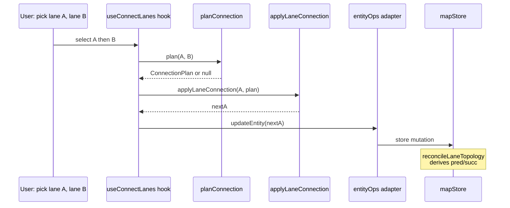

# `geometry/connectLanes` — Lane Connection

> Source: `src/core/geometry/connectLanes.ts`
> Tests: `src/core/geometry/__tests__/connectLanes.test.ts` (~11 KB)

## Purpose & Invariants

`connectLanes` is the geometry choke point for "snap two lanes end-to-end".
The user activates `Connect Lanes` (shortcut `C`) and picks two lanes; this
module:

1. **Picks the best endpoint pair** (`planConnection`): 4 combinations —
   (Astart, Bstart) / (Astart, Bend) / (Aend, Bstart) / (Aend, Bend) — pick
   the one with minimum meter-space distance.
2. **Performs the move** (`applyLaneConnection`): translates A's chosen
   endpoint to B's, **keeping `_source` consistent** — bezier shifts anchors,
   arc rewrites arcPoints, polyline overwrites centerline directly — then
   `applyDerive(editGeometry)` recomputes length / turn.

Afterwards `reconcileLaneTopology(Incremental)` derives pred/succ from the
shared endpoint.

### Invariants

1. **B never moves.** B is the anchor; all translation acts on A.
2. **Mode determines semantics**:
   - `'AendToBstart'` → A.end ≡ B.start → A.successor includes B
   - `'AstartToBend'` → A.start ≡ B.end → A.predecessor includes B
   - `'AstartToBstart'` / `'AendToBend'` → fork / merge — pred/succ are **not**
     written (but `applyLaneJunctions` still stitches the boundaries).
3. **Source-awareness is critical.** Naively overwriting `centralCurve`
   endpoints while ignoring `_source` makes the worker re-sample the bezier
   from stale anchors, snapping the endpoint back to its old position — the
   "connection didn't take" failure mode.

## Public API

### Types

```ts
export type ConnectionMode = 'AendToBstart' | 'AstartToBend' | 'AstartToBstart' | 'AendToBend';

export interface ConnectionPlan {
  mode: ConnectionMode;
  distanceMeters: number;
  /** Whether pred/succ can be derived (false for fork/merge) */
  isContinuous: boolean;
  /** Index in A's centerline of the moving endpoint (0 or N-1) */
  indexToMove: number;
  /** Target lng/lat A's endpoint will land on */
  target: GeoPoint;
}
```

### `planConnection(a: LaneEntity, b: LaneEntity): ConnectionPlan | null`

```ts
const candidates = [
  { mode: 'AendToBstart', distance: dist(aE, bS), indexToMove: aLast, target: bS },
  { mode: 'AstartToBend', distance: dist(aS, bE), indexToMove: 0, target: bE },
  { mode: 'AstartToBstart', distance: dist(aS, bS), indexToMove: 0, target: bS },
  { mode: 'AendToBend', distance: dist(aE, bE), indexToMove: aLast, target: bE },
];
candidates.sort((x, y) => x.distance - y.distance);
return candidates[0];
```

Distance uses `cosLat`-corrected meter-space Euclidean. Returns `null` if
either lane lacks both endpoints (degenerate).
(`connectLanes.ts:79-110`)

The UI may then:

- Execute immediately (small distance, auto-snap)
- Show "distance X m, confirm connection?" dialog
- Branch on `isContinuous` to flag fork/merge differently

### `applyLaneConnection(lane: LaneEntity, plan: ConnectionPlan): LaneEntity`

Three branches by `lane._source.drawTool`:

```mermaid
flowchart TD
    AC[applyLaneConnection] --> S{_source.drawTool}
    S -->|drawBezier| BZ[shiftAnchor on first/last anchor;<br/>cubicBezier resample]
    S -->|drawArc| AR[overwrite arcPoints[0 or 2];<br/>threePointArc resample]
    S -->|polyline / unknown| PL[overwrite centralCurve points at index]
    BZ --> WR[writeCenterline + applyDerive]
    AR --> WR
    PL --> WR
    WR --> R[return new lane]
```

#### Bezier branch (`connectLanes.ts:172-180`)

```ts
const idx = isStartIndex(plan) ? 0 : anchors.length - 1;
anchors[idx] = shiftAnchor(anchors[idx], plan.target); // shift anchor + handles
const newPoints = coordsToPoints(cubicBezier(anchors.map(anchorToRuntime)));
return writeCenterline(lane, newPoints, { ...source, anchors });
```

`shiftAnchor` is the key helper: sets `anchor.point` to the target and
**translates** `handleIn` / `handleOut` by the same dx/dy (preserving
relative handle positions).

#### Arc branch (`connectLanes.ts:183-191`)

```ts
const idx = isStartIndex(plan) ? 0 : 2;
arcPoints[idx] = { ...arcPoints[idx], x: plan.target.x, y: plan.target.y };
const newPoints = coordsToPoints(threePointArc(...));
return writeCenterline(lane, newPoints, { ...source, arcPoints });
```

#### Polyline / unsourced branch (`connectLanes.ts:194-203`)

```ts
const idx = isStartIndex(plan) ? 0 : pts.length - 1;
const newPoints = pts.map((p, i) => i === idx ? { ...p, x:..., y:... } : p);
return writeCenterline(lane, newPoints, source);
```

### `writeCenterline` internals

Replaces `centralCurve.segments[0].lineSegment.points` and recomputes
`length`. Carries `_source` through if present. Always finishes with
`applyDerive({ cause:'editGeometry', prev: lane })` so length / turn close
the loop.

## Why not just call `setAllApolloEditPoints`

An earlier attempt routed connect through `setAllApolloEditPoints(lane, pts)`
— concise, but that function **clears** the explicit `leftBoundary` /
`rightBoundary` curves so the worker re-samples them. Combined with sparse
centerline samples and `_source.anchors`, the result is:

- Bezier anchors and centerline points become 1:N misaligned (typical
  anchor=2, samples=48).
- `applyDrag(a, indexToMove, 'vertex', target)` reads `_source.anchors[N-1]`
  as if it were `arcPoints[N-1]` → `Cannot read properties of undefined
(reading 'x')`.
- Re-sampled centerline length disagrees with the endpoint.

`connectLanes` keeps a separate source-aware path to **avoid** this mismatch.

## Complexity

| Operation                        | Complexity                                      |
| -------------------------------- | ----------------------------------------------- |
| `planConnection`                 | O(P) for `curvePoints` + O(1) compares          |
| `applyLaneConnection` (bezier)   | O(A) + O(A·S); A=anchors, S=samples per segment |
| `applyLaneConnection` (arc)      | O(64); `threePointArc` defaults to 64 segments  |
| `applyLaneConnection` (polyline) | O(P) spread                                     |

## Test coverage

`connectLanes.test.ts` covers:

- All 4 modes happy-path (specified lane geometry → expected mode)
- After bezier translation, centerline first/last point lands on `target` and
  handleIn/Out shift consistently
- After arc translation, the third point lands on `target` and the new circle
  passes through the three new points
- Polyline branch cleanly hits the index
- `applyDerive` runs: `length` / `turn` updated
- Degenerate input: lane with < 2 centerline points → `null`

## Caller flow



## See also

- [geometry/laneTopology](./geometry-lane-topology) — `reconcileLaneTopology(Incremental)`
  derives pred/succ from shared endpoints
- [geometry/apolloCompile](./geometry-apollo-compile) — `_source` field semantics
- [geometry/interpolate](./geometry-interpolate) — `cubicBezier` / `threePointArc` resampling
- [elements/derive](./elements-derive) — `applyDerive` closes length/turn loop
- [useMapEventRouter](/en/api/hooks/use-map-event-router) — connect-mode UI event entry
