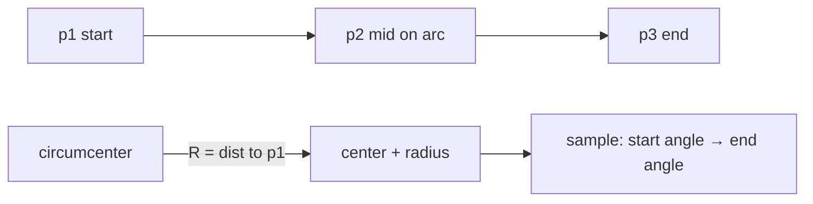
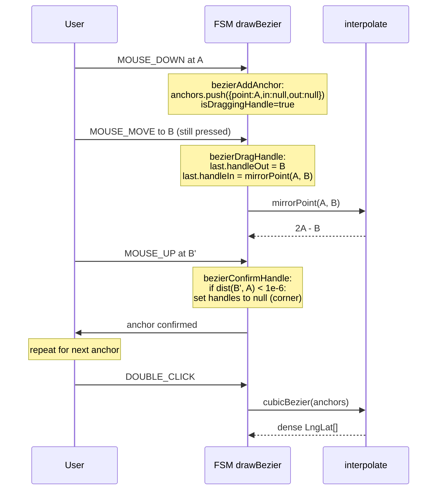

# `geometry/interpolate` — Curve Interpolation

> Source: `src/core/geometry/interpolate.ts`
> Tests: indirectly covered via `apolloCompile.gaps.test.ts`, `connectLanes.test.ts`,
> `signalFactory.test.ts`

## Purpose & Invariants

`interpolate.ts` is the sampling backend for the draw tools: the FSM collects
click events into `drawPoints` and `bezierAnchors`; on commit,
`apolloCompile/factory.ts` calls these functions to turn control points into
dense `LngLat[]` sequences for `centralCurve` / `polygon`.

### Invariants

1. **I/O is uniformly `LngLat = [lng, lat]`.** All curves project into
   equidistant meter space (cosLat from control-point latitude average) and
   project back to lng/lat after sampling.
2. **Bezier handle mirroring.** During handle drag, the FSM uses
   `mirrorPoint(pivot, pt)` so `handleIn` always mirrors `handleOut` about
   the anchor (C1 continuity). `bezierConfirmHandle` nulls both handles only
   when the drag distance < 1e-6 (corner), otherwise symmetry is preserved.
3. **`rotatedRectFromPoints` / `rectCorners` are inverses.** `rectCorners`
   rotates by `-rotation`; `rotatedRectFromPoints` returns `-atan2`, ensuring
   round-trip consistency.

## Public API

### Types

```ts
export type LngLat = [number, number];

export interface BezierAnchor {
  point: LngLat;
  handleIn: LngLat | null;
  handleOut: LngLat | null;
}
```

### `mirrorPoint(pivot: LngLat, pt: LngLat) => LngLat`

```ts
[2 * pivot[0] - pt[0], 2 * pivot[1] - pt[1]];
```

Mirrors `pt` about `pivot`. The FSM's `bezierDragHandle` action uses it to
keep `handleIn` symmetric with `handleOut`.
(`interpolate.ts:20-22`)

### `catmullRom(points: LngLat[], segments?: number, alpha?: number) => LngLat[]`

Catmull-Rom spline through every control point.

| param      | default | meaning                               |
| ---------- | ------- | ------------------------------------- |
| `points`   | —       | at least 2                            |
| `segments` | 32      | samples per segment                   |
| `alpha`    | 0.5     | 0=uniform, 0.5=centripetal, 1=chordal |

`alpha=0.5` (centripetal) is the Yuksel-recommended value — avoids
self-intersection and overshoot.

Implementation: extends the first/last with mirror "ghost" points, then for
each interval `[P_i, P_{i+1}]` computes the Catmull-Rom equivalent cubic
Bezier control points b1/b2 from `P_{i-1}, P_i, P_{i+1}, P_{i+2}` and samples
`cubicBezierPoint(p1, b1, b2, p2, t)`.
(`interpolate.ts:32-93`)

### `cubicBezier(anchors: BezierAnchor[], segments?: number) => LngLat[]`

Multi-segment cubic Bezier interpolation.

| param      | default                                     |
| ---------- | ------------------------------------------- |
| `anchors`  | at least 2; each with optional handleIn/Out |
| `segments` | 48                                          |

Per segment: `(p0=anchors[i].point, p1=anchors[i].handleOut ?? p0,
p2=anchors[i+1].handleIn ?? p3, p3=anchors[i+1].point)` sampled by the
cubic Bezier formula. A null handle degenerates to the anchor (straight
segment, i.e. corner).
(`interpolate.ts:106-130`)

### `threePointArc(p1, p2, p3, segments?: number) => LngLat[]`

Arc through three points.



Implementation:

1. cosLat-project the three points.
2. Compute `circumcenter`; collinear (`|D| < 1e-12`) → fall back to the
   three points as a polyline.
3. Compute angles a1 / a2 / a3; correct `sweep` so the arc passes through p2.
4. Equispaced sample `segments + 1` points (inclusive endpoints).
5. Unproject back to LngLat.

`segments` defaults to 64.
(`interpolate.ts:153-194`)

### `rectCorners(p1, p2, rotation: number) => LngLat[]`

Two diagonal points + rotation radians → closed 5-point rectangle.

1. cosLat-project p1/p2.
2. Center c = (p1+p2)/2; raw axis-aligned 4 corners.
3. Rotate around c by `-rotation` (visual clockwise positive).
4. Push `corners[0]` to close.

Returns 5 points (last duplicates first).
(`interpolate.ts:235-271`)

### `rotatedRectFromPoints(a, b, c) => { p1, p2, rotation }`

3 points → rectangle parameters (drawRotatedRect's three-click geometry):

| click | role                              |
| ----- | --------------------------------- |
| `a`   | axis start                        |
| `b`   | axis end (length + rotation)      |
| `c`   | width point perpendicular to axis |

Output is `rectCorners`-compatible: `p1` / `p2` (axis-aligned diagonal points)

- `rotation` (radians).

Degeneracy: axis length < 1e-12 → fallback `{ p1: a, p2: c, rotation: 0 }`.
(`interpolate.ts:280-335`)

### `rectRotateHandle(p1, p2, rotation) => LngLat`

Position of the rotate handle: above center, offset = half-height + max(W, H)
× 0.18, so the handle never touches the rectangle edge.
(`interpolate.ts:340-364`)

## Algorithm details

### Bezier handle flow (from the FSM perspective)



### Three-point arc sweep correction

```ts
let sweep = normalizeAngle(a3 - a1); // base sweep
const midSweep = normalizeAngle(a2 - a1);
if (
  (sweep > 0 && midSweep > sweep) || // p2 outside p1→p3 sector
  (sweep < 0 && midSweep < sweep)
) {
  sweep = sweep > 0 ? sweep - 2 * PI : sweep + 2 * PI; // reverse sweep
}
```

Ensures the resulting arc passes through p2.

## Complexity

| Function                | Complexity                 |
| ----------------------- | -------------------------- |
| `mirrorPoint`           | O(1)                       |
| `catmullRom`            | O((P-1)·segments)          |
| `cubicBezier`           | O((A-1)·segments)          |
| `threePointArc`         | O(segments) (default 64+1) |
| `rectCorners`           | O(1) (4 corners)           |
| `rotatedRectFromPoints` | O(1)                       |
| `rectRotateHandle`      | O(1)                       |

## Test coverage

Mostly indirect:

- `apolloCompile.gaps.test.ts` — every drawTool produces geometry
  (implicitly exercises cubicBezier / threePointArc / rectCorners / catmullRom).
- `connectLanes.test.ts` — bezier source translation + `cubicBezier` resample.
- `signalFactory.test.ts` — signal template rotation equivalent to `rectCorners`.
- `editorMachine.test.ts` — FSM mirrorPoint usage.

Degenerate-case guards:

- `threePointArc` collinear → straight polyline fallback.
- `rotatedRectFromPoints` zero-length axis → axis-aligned 1-point rect.
- `rectCorners` at rotation=0 matches axis-aligned rectangle pixel-for-pixel.

## See also

- [fsm/editorMachine](./fsm-editor-machine) — `bezierAddAnchor`,
  `bezierDragHandle`, `bezierConfirmHandle` actions call into this module
- [geometry/apolloCompile](./geometry-apollo-compile) — `factory.ts` calls
  cubicBezier / threePointArc / rectCorners / catmullRom to extract
  line/polygon points
- [geometry/connectLanes](./geometry-connect-lanes) — bezier / arc resampling
- [geometry/validation](./geometry-validation) — self-intersection checks
  (complementary to interpolation)
