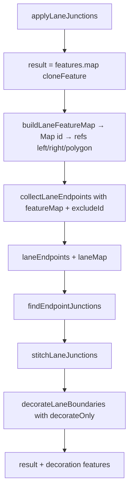
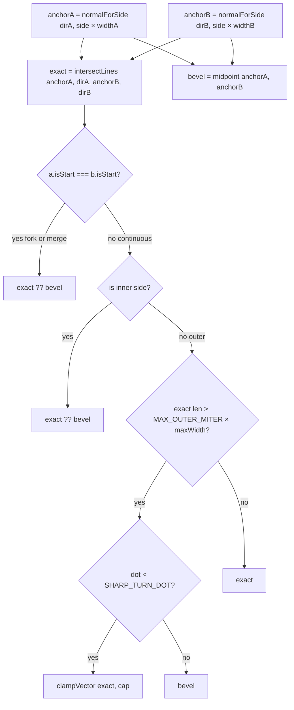
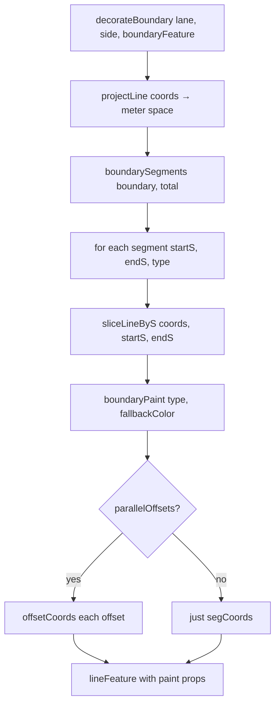
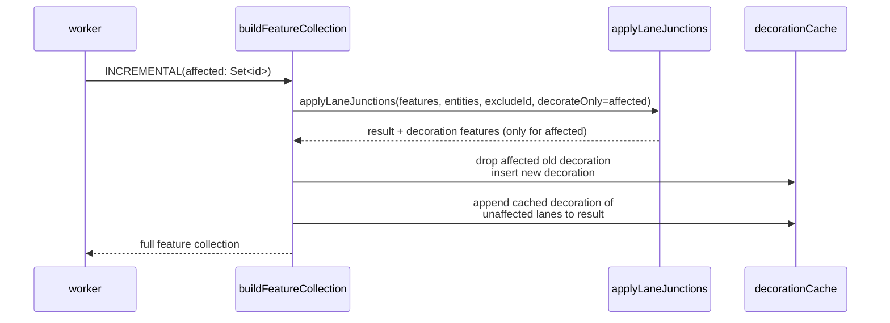

# `geometry/laneJunctions` — Endpoint Stitch + Boundary Decoration

> Source: `src/core/geometry/laneJunctions.ts` + `laneJunctions/internal.ts`
> Tests: `src/core/geometry/__tests__/laneJunctions.test.ts` (~29 KB) +
> `laneJunctions.bench.ts` (~3.5 KB)

## Purpose & Invariants

`applyLaneJunctions` is the **final step** of the cold-layer feature pipeline:

1. **Endpoint stitch** (`stitchLaneJunctions`): when two lanes share an
   endpoint (`toFixed(6)` ≈ 1 cm precision), pull their left and right
   boundaries to a shared miter / bevel point so there is no T-shape or gap.
2. **Boundary decoration** (`decorateBoundary`): per lane's
   `boundaryType: [{s, types[]}]` segments, render the left/right edges
   piecewise — solid white, dashed yellow, double yellow, curb, dotted, …
   This function emits the GeoJSON `Feature[]`.
3. **Polygon sync** (`syncPolygonFromEdges`): left + reversed right is the
   lane fill polygon, which must be recomputed after stitching moves the
   endpoint.

Performance: boundary decoration is the dominant cost of
`buildFeatureCollection` (~3 ms × N lanes for a naive rebuild). The
**Phase E** optimization caches decoration features per-lane on the worker
side (`decorationCache: Map<lane_id, Feature[]>`) and re-decorates only the
affected set via the `decorateOnly` parameter.

### Invariants

1. **Endpoint hash precision = `toFixed(6)` ≈ 1 cm** — matches `laneTopology.ts`.
2. **Forks / merges are not stitched** — `isContinuousJunction` checks
   `a.isStart !== b.isStart`. Start-start forks and end-end merges are
   semantic junctions but **not** continuous lane-to-lane edges; pulling
   left-left and right-right boundaries to a shared miter would corrupt the
   visible split/merge geometry. Topology / overlap pipelines own that case.
3. **Arc / Bezier / CatmullRom lanes do not trim** (`shouldTrimBoundaryOnStitch`):
   they are densely sampled curves; trimming the terminal segments after a
   junction join can cut the arc and turn the lane fill into a long triangle.
   Only sparse polyline lanes (≤ 6 points) allow trim.
4. **`decorateOnly` defaults to "decorate everything"** — the incremental
   path passes the affected lane set explicitly.

## File split

| File                        | Purpose                                                                                                                                                                                                                       |
| --------------------------- | ----------------------------------------------------------------------------------------------------------------------------------------------------------------------------------------------------------------------------- |
| `laneJunctions.ts`          | Top-level `applyLaneJunctions`: collectLaneEndpoints + findEndpointJunctions + stitchLaneJunctions + decorateLaneBoundaries                                                                                                   |
| `laneJunctions/internal.ts` | Types / helpers: `LaneEndpoint`, `LaneFeatureRefs`, `endpointDirection`, `sideJoinOffset`, `updateLineEndpoint`, `syncPolygonFromEdges`, `buildLaneFeatureMap`, `cloneFeature`, `laneEndpointsFromEntity`, `decorateBoundary` |

## Public API

### `applyLaneJunctions(features, entities, excludeId?, decorateOnly?) => Feature[]`

```ts
applyLaneJunctions(
  features: GeoJSON.Feature[],
  entities: Iterable<MapEntity>,
  excludeId?: string | null,
  decorateOnly?: Set<string> | null,
): GeoJSON.Feature[];
```

- `features` — upstream cold features from `compileApolloFeatures` (lane
  `laneEdgeLeft` / `laneEdgeRight` / fill polygon / center line included).
- `entities` — used to fetch LaneEntity for endpoint + width info.
- `excludeId` — id of the lane currently being dragged; skip stitching to
  avoid jitter.
- `decorateOnly` — affected lane set; null/undefined means decorate all.

Returns cloned features (no input mutation) plus decoration features.

### `decorateBoundary(lane, side, boundaryFeature) => Feature[]`

Per `lane.boundary[side].boundaryType: [{s, types[]}]` segment, emits 1–2
LineString features (DOUBLE_YELLOW emits 2 — double rule).

`boundaryPaint(type, fallbackColor)` decides color / lineWidth / opacity /
dashed / dotted / parallelOffsets:

| BoundaryLineType | color                  | dashed | dotted | parallelOffsets    |
| ---------------- | ---------------------- | ------ | ------ | ------------------ |
| DOTTED_YELLOW    | `#f3d046`              | yes    | yes    | —                  |
| DOTTED_WHITE     | `#ffffff`              | yes    | yes    | —                  |
| SOLID_YELLOW     | `#f3d046`              | —      | —      | —                  |
| SOLID_WHITE      | `#ffffff`              | —      | —      | —                  |
| DOUBLE_YELLOW    | `#f3d046`              | —      | —      | `[-0.18, +0.18]` m |
| CURB             | `#9aa6b2`, +1 px width | —      | —      | —                  |
| other / UNKNOWN  | fallbackColor          | —      | —      | —                  |

`sliceLineByS(coords, startS, endS)` extracts a sub-polyline along arc length;
`offsetCoords(segCoords, m, side)` calls `offsetPolylineDeg` for parallel lines.

## Algorithm details

### Overall flow



### Find endpoint junctions

```ts
const endpointIndex = new Map<string, LaneEndpoint[]>();
for (const ep of endpoints) {
  const key = `${pt.x.toFixed(6)},${pt.y.toFixed(6)}`;
  endpointIndex.get(key) || endpointIndex.set(key, []);
  endpointIndex.get(key).push(ep);
}

for (const grouped of endpointIndex.values()) {
  const pair = uniquePair(grouped); // O(K) dedup by id; only returns when exactly 2
  if (!pair) continue;
  junctions.push({ pt, a: pair[0], b: pair[1] });
}
```

`uniquePair` only accepts **exactly 2 distinct** lane endpoints. Three-way
forks/merges are not stitched (more complex structures handled by topology /
overlap).

### `sideJoinOffset` geometry

Pulls two lane endpoints' `'left'` / `'right'` boundaries at the shared
point to a miter / bevel:



Thresholds (`internal.ts:16-19`):

- `MAX_OUTER_MITER = 3`
- `SHARP_TURN_DOT = -0.5` (cos 120°)
- `SPARSE_BOUNDARY_TRIM_POINT_LIMIT = 6`

### `decorateBoundary` segments



## Phase E incremental decoration

Worker-side cooperation:



Depends on `LaneJunctionGraph.getDependents(id)` (worker side) to compute the
affected set (lanes sharing an endpoint).

## Complexity

| Operation                          | Complexity             | Note                                                                                                   |
| ---------------------------------- | ---------------------- | ------------------------------------------------------------------------------------------------------ |
| `applyLaneJunctions`               | O(F + L + J + L_aff·B) | F=features cloneFeature; L=lanes; J=junction pairs; L_aff=affected lanes; B=boundary segments per lane |
| `findEndpointJunctions`            | O(L)                   | endpoint hash + scan                                                                                   |
| `stitchLaneJunctions` per junction | O(1)                   | 4 sideJoinOffset calls                                                                                 |
| `decorateBoundary` per lane        | O(B + sliceCost)       | B=segments; slice is O(P)                                                                              |
| `offsetPolylineDeg` per parallel   | O(P)                   | dense collapse worst-case O(P²)                                                                        |

Measured: 500 lanes × full decorate ≈ 250 ms naive; Phase E incremental on
1 dirty lane < 5 ms.

## Test coverage

`laneJunctions.test.ts` covers:

- Two lanes end-end / start-start / end-start / start-end shared-endpoint stitch results
- fork / merge skipped (continuous=false)
- 3-way junction (3 lanes shared) → not stitched (`uniquePair` returns null)
- `decorateBoundary` for each BoundaryLineType color / dashed / parallelOffsets
- DOUBLE_YELLOW emits 2 features
- `decorateOnly` subset emits only those lanes' decoration
- Sparse lane (≤ 6 points) trim folded; dense lane no trim
- Explicit boundary edges (non-empty `lane.leftBoundary` curve) skip stitch / decorate

`laneJunctions.bench.ts` covers perf benchmarks (CI perf budget).

## See also

- [workers/spatial](./workers-spatial) — entry point that calls `applyLaneJunctions`
- [workers/junction-graph](./workers-junction-graph) — `LaneJunctionGraph.getDependents` computes affected set
- [geometry/laneTopology](./geometry-lane-topology) — same `toFixed(6)`
  endpoint precision aligns pred/succ derivation with stitch
- [geometry/apolloCompile](./geometry-apollo-compile) — `compileApolloFeatures`
  produces the base lane features (laneEdgeLeft/Right, polygon, center line)
