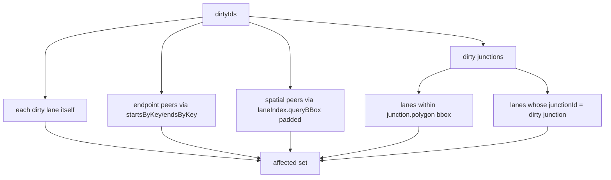

# `geometry/laneTopology` — Lane Topology Reconcile

> Source: `src/core/geometry/laneTopology.ts` (~22 KB)
> Tests: `src/core/geometry/__tests__/laneTopology.test.ts` (~15 KB)

## Purpose & Invariants

`reconcileLaneTopology` translates **geometric facts** — endpoint sharing,
lateral neighborhood, junction containment — into a lane's topology fields:

- `predecessorIds` / `successorIds`: 1 cm-precision endpoint sharing
- `selfReverseLaneIds`: B is A's reverse twin (B.start ≈ A.end ∧ B.end ≈ A.start)
- `junctionId`: lane centerline geometrically intersects a junction polygon
- `leftNeighborForwardIds` / `rightNeighborForwardIds` / `leftNeighborReverseIds`
  / `rightNeighborReverseIds`: lateral neighbor classification in local meter space

The whole computation is a **symmetric pure function**: A→B and B→A edges are
produced by the same predicate, so "bidirectional sync" is a side-effect of
geometric recompute — there is no need to actively notify the other side.

### Invariants

1. **Does not write non-derived fields.** `overlapIds` (semantically conflict
   regions, owned by the overlap pipeline) and geometry-derived fields like
   `leftSamples` / `rightSamples` (owned by the derive engine) are untouched.
2. **Endpoint precision = `toFixed(6)` ≈ 1 cm.** Aligned with rendering-side
   endpoint hashing in `applyLaneJunctions` (`COORD_KEY_PRECISION = 6`); two
   endpoints must match to that precision to count as "shared".
3. **`junctionId` matches the overlap pipeline.** lane × junction containment
   uses `polylineHitsPolygon` (endpoint inside OR any segment crossing) —
   identical to the overlap pipeline. Avoids contradiction between
   `lane.junctionId` and a derived `OverlapEntity{lane, junction}`.

## Public API

```ts
export interface LaneTopologyDiff {
  /** Only lanes whose topology fields actually changed */
  changes: Map<string, LaneEntity>;
}

export interface LaneTopologyIncrementalOptions {
  dirtyIds: ReadonlySet<string>;
  previousEntities?: ReadonlyMap<string, MapEntity>;
}

export function reconcileLaneTopology(entities: ReadonlyMap<string, MapEntity>): LaneTopologyDiff;

export function reconcileLaneTopologyIncremental(
  entities: ReadonlyMap<string, MapEntity>,
  options: LaneTopologyIncrementalOptions,
): LaneTopologyDiff;
```

### `reconcileLaneTopology(entities)`

Full entry (import complete / undo-redo / bulk mutation). Flow:

1. `buildTopologyIndices(entities)` builds in one pass:
   - `lanes: LaneEntity[]`, `laneGeometry: Map<id, {start, end, centerline}>`
   - `frames: Map<id, LocalFrame>` — ENU local meter space
   - `startsByKey / endsByKey: Map<endpointKey, Endpoint[]>` — inverted index
   - `junctionPolygons` + `junctionIndex` (RBush) + `laneIndex` (RBush)
2. `deriveChangesForLanes(indices, allLaneIds)` derives the four field
   classes per lane, set-equality compares with old values, and writes only
   actual changes into `changes`.

### `reconcileLaneTopologyIncremental(entities, { dirtyIds, previousEntities? })`

Incremental entry. `dirtyIds` covers all geometric mutations of lanes /
junctions this tick. Flow:

1. `buildTopologyIndices(entities)` (incremental does **not** reuse the old
   index — cost is small).
2. `collectAffectedLanes(indices, dirtyIds, previousEntities)` collects
   endpoint peers, spatial neighbors, and same-junction lanes for each dirty
   lane. Dirty junctions pull in all lanes whose junctionId matches.
3. `deriveChangesForLanes(indices, affected)` only recomputes the affected
   subset.

## Algorithm details

### pred/succ derivation

```ts
const predHits = endsByKey.get(endpointKey(s.x, s.y)).filter((ep) => ep.laneId !== lane.id);
const succHits = startsByKey.get(endpointKey(t.x, t.y)).filter((ep) => ep.laneId !== lane.id);
```

`endpointKey(x, y)` = `${x.toFixed(6)},${y.toFixed(6)}`.

### selfReverse derivation

```
B.end ≈ A.start  ∧  B.start ≈ A.end
```

Walk `endsByKey.get(sKey)` reverseCandidates, filter
`endpointKey(B.start) === tKey`.

### junctionId derivation

`polylineHitsPolygon(centerline, junction.polygon)`:

```mermaid
flowchart TD
    L[lane centerline] --> P0{point[0] in polygon?}
    P0 -->|yes| Y[match]
    P0 -->|no| PN{point[N-1] in polygon?}
    PN -->|yes| Y
    PN -->|no| SEG[for each segment vs each polygon edge]
    SEG --> SC{any cross?}
    SC -->|yes| Y
    SC -->|no| N[no match]
```

Candidate junctions are filtered via `junctionIndex.queryBBox(laneBBox)`
and sorted by `order` (insertion order), making multi-overlap deterministic.

### Neighbor derivation (4 arrays)

Project lane B into lane A's local frame and classify on `(forward, left)`:

```mermaid
flowchart TD
    A[for each candidate B] --> D{direction dot >= 0.95?}
    D -->|forward parallel| F[isForward=true]
    D -->|antiparallel <= -0.95| R[isForward=false]
    D -->|otherwise| SK[skip]
    F --> O{longitudinal overlap >= 50%?}
    R --> O
    O -->|no| SK
    O -->|yes| L{lateral offset in [1,8] m?}
    L -->|no| SK
    L -->|yes| LR{lateral > 0?}
    LR -->|yes| LL[Left]
    LR -->|no| RR[Right]
```

Thresholds (`laneTopology.ts:82-89`):

- `NEIGHBOR_MIN_LATERAL_M = 1.0`
- `NEIGHBOR_MAX_LATERAL_M = 8.0`
- `NEIGHBOR_MIN_OVERLAP_RATIO = 0.5`
- `NEIGHBOR_QUERY_PADDING_M = 12`
- `PARALLEL_DOT_THRESHOLD = 0.95` (cos 18°)

Candidates fetched via `laneIndex.queryBBox(paddedLaneBBox)`.

### Diff

After deriving all fields per lane, `setEqual` (unordered set equality)
compares against old values; only when **any** field changed does the
new lane land in `changes.set(lane.id, { ...lane, ...newFields })`.

## Affected-set collection (incremental)



`previousEntities` provides the lane's geometry **before** mutation so old
endpoint peers / bboxes are also affected — without this, dragging a lane
endpoint leaves the previous-position peers' pred/succ stale.

## Complexity

| Operation                          | Complexity    | Note                                                         |
| ---------------------------------- | ------------- | ------------------------------------------------------------ | ------- | ------------------- |
| `buildTopologyIndices`             | O(N)          | N=entities count; one scan + RBush load                      |
| `derivePredSucc` per lane          | O(1+1)        | endpoint Map lookup                                          |
| `deriveSelfReverse` per lane       | O(K)          | K=lanes sharing sKey (typically 0–2)                         |
| `deriveJunctionId` per lane        | O(B + S·V)    | B=junction bbox candidates; S=lane segments; V=polygon edges |
| `deriveNeighbors` per lane         | O(C)          | C=neighbor candidates via bbox                               |
| `reconcileLaneTopology`            | O(N + L·avgC) | full                                                         |
| `reconcileLaneTopologyIncremental` | O(            | affected                                                     | · avgC) | dirty typically 1–3 |

1000 lanes full reconcile < 10 ms (no persistent index — index is rebuilt
each call to avoid stale-index bugs).

## Test coverage

`laneTopology.test.ts` covers:

- 1 cm-precision endpoint sharing → pred/succ derivation
- Imprecise endpoint sharing → no derivation
- selfReverse: A.start = B.end ∧ A.end = B.start
- junction containment via endpoint-inside / segment-crossing / both
- All 4 neighbor arrays — lateral / longitudinal / direction thresholds
- Incremental: dirty=1 lane only affects endpoint peers
- Dirty junction → all internal lanes affected
- `previousEntities` rehydrates old endpoint peers
- No topology change → empty `changes` Map

## Primary callers

| Caller                                             | When              | Mode             |
| -------------------------------------------------- | ----------------- | ---------------- |
| `mapStore` `addEntity` / `updateEntity` middleware | per mutation      | incremental      |
| `useImportApollo` completion                       | after import      | full             |
| `usePostUndoReconcile`                             | after undo / redo | full (defensive) |

## See also

- [geometry/connectLanes](./geometry-connect-lanes) — endpoint snap, then this module derives pred/succ
- [elements/overlap](./elements-overlap) — same `polylineHitsPolygon` predicate keeps `junctionId`
  consistent with `OverlapEntity{lane, junction}`
- [geometry/laneJunctions](./geometry-lane-junctions) — rendering-side endpoint
  `toFixed(6)` precision matches here
- [store/mapStore](/en/api/store/map-store) — invokes reconcile via middleware
