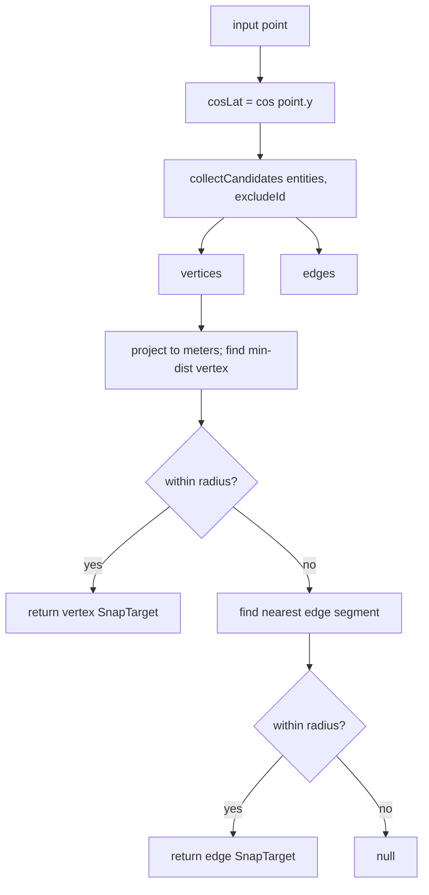
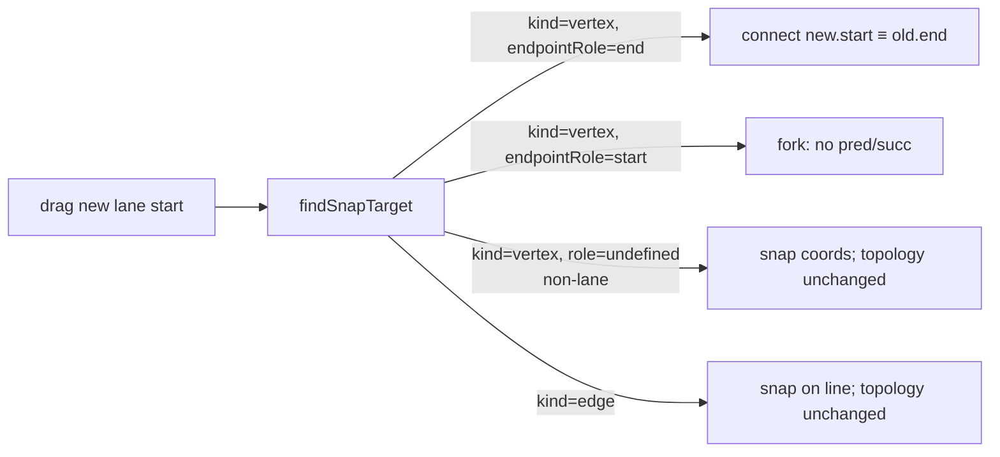

# `geometry/snap` — Snap

> Source: `src/core/geometry/snap.ts`
> Tests: `src/core/geometry/__tests__/snap.test.ts` (~9.9 KB)

## Purpose & Invariants

`findSnapTarget` is a **pure geometry** module: given a cursor / drag point,
all entities, and a radius, returns the best snap target with source entity,
entity type, and snap kind (`vertex` / `edge`).

Design tenets:

- **Vertex first**: at equal distance, vertex wins over edge ("snap to that
  endpoint" beats "snap near the line").
- **Lane endpoint specialisation**: lane vertex candidates are **endpoints
  only**, tagged with `endpointRole: 'start' | 'end'`. Reason: topology
  (pred/succ) is meaningful only at endpoints; allowing snap to interior
  vertices yields coincident geometry without a topological link, leaving
  the user with what looks like a connection but acts like a stray point —
  a footgun.
- **No store / hooks / maplibre import**: callers pass data in.
- **No spatial index**: scans `Iterable<MapEntity>` end-to-end; at 1k entities
  / 60 fps mousemove, < 1 ms per call.

### Invariants

1. **Radius is in meters.** `pixelsToMeters(px, lat, zoom)` converts a pixel
   threshold to meter radius.
2. **`excludeId` excludes the dragged entity** (no self-snap).
3. **Lane edge candidates still cover the whole polyline**, so a mid-lane
   proximity yields an `edge` snap (not an endpoint snap).

## Public API

### Types

```ts
export type SnapKind = 'vertex' | 'edge';
export type LaneEndpointRole = 'start' | 'end';

export interface SnapTarget {
  kind: SnapKind;
  point: GeoPoint; // snapped lng/lat
  entityId: string;
  entityType: string;
  vertexIndex?: number; // for vertex hits
  endpointRole?: LaneEndpointRole;
}
```

### `findSnapTarget(point, entities, radiusMeters, excludeId?) => SnapTarget | null`

```ts
findSnapTarget(
  point: GeoPoint,
  entities: Iterable<MapEntity>,
  radiusMeters: number,
  excludeId: string | null = null,
): SnapTarget | null;
```

Flow:



The vertex pass runs first; the edge pass runs only if no vertex is in range.

### `pixelsToMeters(pixels, lat, zoom) => number`

Web-Mercator pixel → meters:

```
metersPerPixel ≈ cos(lat) · earth_circumference / (512 · 2^zoom)
```

The 512-pixel tile is MapLibre GL's default (not the 256-pixel raster tile).
(`snap.ts:87-91`)

Typical caller usage:

```ts
const radiusM = pixelsToMeters(8, cursor.lat, currentZoom);
const snap = findSnapTarget(cursor, entities.values(), radiusM, excludeId);
```

### `collectCandidates(entities, excludeId) => { vertices, edges }`

Per-type extraction:

| entityType                                        | vertex candidates                                          | edge candidates          |
| ------------------------------------------------- | ---------------------------------------------------------- | ------------------------ |
| lane                                              | **endpoints only** (start / end) with `endpointRole`       | full centerline segments |
| junction / pncJunction / parkingSpace / crosswalk | all polygon vertices                                       | closed ring edges        |
| signal                                            | `boundary.points` vertices                                 | closed ring edges        |
| road                                              | (skip; geometry comes from member lanes)                   | (same)                   |
| other                                             | `points: GeoPoint[]` or `anchors: BezierAnchor[]` vertices | polyline segments        |

Source: `snap.ts:185-249`.

## Algorithm details

### Meter-space projection

```ts
function project(p, cosLat) {
  return { x: p.x * cosLat * DEG_TO_M, y: p.y * DEG_TO_M }; // DEG_TO_M = 111320
}
```

Lng/lat degrees → meter-space Euclidean. Distance compares directly via
`dx*dx + dy*dy <= radiusSq`.

### Closest point on segment

`closestOnSegment(p, a, b)` — standard projection:

1. segLenSq = |b - a|²; if 0 → degenerate to point.
2. t = clamp((p-a)·(b-a) / segLenSq, 0, 1).
3. Return (a + t·(b-a), distSq).

Edge distance uses `closestOnSegment(p, a, b).distSq`.

### Lane endpoint `role` drives pred/succ



`endpointRole` is the signal hooks like `useConnectLanes` / `useDrawCommit`
use to decide whether to derive pred/succ.

## Complexity

| Function | Complexity |
| ------------------- | -------------------------------------------- | -------- | ------ | ----- | ---------- |
| `pixelsToMeters` | O(1) |
| `collectCandidates` | O(N · V_avg); N=entities, V_avg=avg vertices |
| `findSnapTarget` | O( | vertices | ) + O( | edges | ) per call |

Measured: 1000 entities × 30 vertices / 30 edges average, < 1 ms per call.

## Test coverage

`snap.test.ts` covers:

- Vertex wins over equal-distance edge.
- Lane interior centerline vertices do **not** appear as vertex candidates.
- Lane edge candidates still cover the whole polyline.
- `excludeId` excludes both vertex and edge candidates from that entity.
- Outside the radius → null.
- Entities exposing `anchors` fall back to `anchor.point` vertices.
- `pixelsToMeters` returns physically correct meters across various lat / zoom.

## See also

- [geometry/hitTest](./geometry-hit-test) — same cosLat / radius semantics
- [geometry/laneTopology](./geometry-lane-topology) — endpointRole='end'
  matched against another lane's 'start' triggers pred/succ
- [hooks/useDrawCommit](/en/api/hooks/use-draw-commit) — feeds snap result as
  the last drawPoint on commit
- [config/mapConstants](/en/api/config/) — thresholds like `SNAP_RADIUS_PX`
