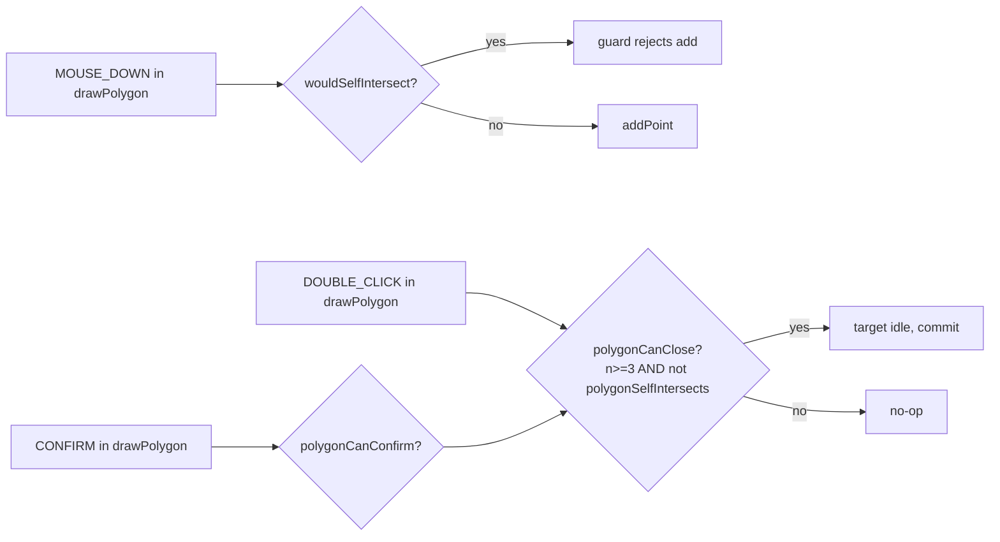

# `geometry/validation` — Self-Intersection Checks

> Source: `src/core/geometry/validation.ts`
> Tests: `src/core/geometry/__tests__/validation.test.ts` (~3.4 KB)

## Purpose & Invariants

`validation` is a **minimal** set of pure geometric predicates dedicated to
the FSM polygon guards and entity mutation paths:

- `segmentsIntersect` — strict segment crossing (excludes endpoints / collinear)
- `wouldSelfIntersect` — would adding `newPt` create a self-crossing edge?
- `polygonSelfIntersects` — closed-polygon self-intersect (adjacent /
  first-last edges excluded)

None of these project into meter space — they operate directly in lng/lat
degrees via cross products. At fork/join scales below 1°, cosLat correction
does not matter for a binary "does it cross" answer.

### Invariants

1. **Strict intersection** — endpoint coincidence is not a hit (requires
   strict sign change `d > 0 && d < 0`). The polygon "last == first" closing
   point is handled by the **input** layer (dedup).
2. **`polygonSelfIntersects` excludes adjacent edges and the first-last
   shared closure**: it skips `i === 0 && j === n-1` explicitly.

## Public API

### `segmentsIntersect(a1, a2, b1, b2: LngLat): boolean`

```ts
function cross(o, a, b) {
  return (a[0] - o[0]) * (b[1] - o[1]) - (a[1] - o[1]) * (b[0] - o[0]);
}

const d1 = cross(a1, a2, b1);
const d2 = cross(a1, a2, b2);
const d3 = cross(b1, b2, a1);
const d4 = cross(b1, b2, a2);
return ((d1 > 0 && d2 < 0) || (d1 < 0 && d2 > 0)) && ((d3 > 0 && d4 < 0) || (d3 < 0 && d4 > 0));
```

The classic double-cross-product test. Any `d == 0` (collinear / endpoint
touch) does not count as a hit.

### `wouldSelfIntersect(points: LngLat[], newPt: LngLat): boolean`

Simulates "append `newPt` to the polyline tail"; new edge = `points[n-1] →
newPt`. Tests against all non-adjacent existing edges.

```ts
const edgeStart = points[n - 1];
const edgeEnd = newPt;
for (let i = 0; i < n - 2; i++) {
  if (segmentsIntersect(edgeStart, edgeEnd, points[i], points[i + 1])) return true;
}
return false;
```

Loop bound is `n-2`, not `n-1`: skips the edge directly adjacent to the new
point (adjacent edges share an endpoint by definition).

FSM's `polygonNoSelfIntersect` guard uses this on `MOUSE_DOWN` to reject
self-crossing additions.

### `polygonSelfIntersects(points: LngLat[]): boolean`

Closed polygon self-intersection:

```ts
for (let i = 0; i < n; i++) {
  const a1 = points[i];
  const a2 = points[(i + 1) % n];
  for (let j = i + 2; j < n; j++) {
    if (i === 0 && j === n - 1) continue; // skip first-last closure
    const b1 = points[j];
    const b2 = points[(j + 1) % n];
    if (segmentsIntersect(a1, a2, b1, b2)) return true;
  }
}
return false;
```

- `j` starts at `i+2` to skip adjacent edges.
- Explicit skip of `i=0 ∧ j=n-1` for the closure-adjacency.

Returns `false` for fewer than 4 points.

FSM's `polygonCanClose` / `polygonCanConfirm` guards use this to gate
DOUBLE_CLICK / CONFIRM commits.

## Test coverage

`validation.test.ts` covers:

- `segmentsIntersect`: standard X, parallel non-cross, collinear non-cross,
  endpoint sharing non-cross, T-shape (endpoint on edge) non-cross.
- `wouldSelfIntersect`: new edge cuts an interior edge, new edge clean,
  adjacent-edge non-cross.
- `polygonSelfIntersects`: classic butterfly, convex / concave clean,
  fewer-than-4 returns false, closure-adjacent edges not counted.

## Complexity

| Function                | Complexity                      |
| ----------------------- | ------------------------------- |
| `segmentsIntersect`     | O(1) (4 crosses)                |
| `wouldSelfIntersect`    | O(N) (one edge vs N-2 existing) |
| `polygonSelfIntersects` | O(N²) (double loop)             |

`polygonSelfIntersects` is < 0.1 ms on a 30-point polygon — invisible at 60 fps.

## FSM coordination



`polygonCanClose` and `polygonCanConfirm` are currently equivalent; they are
kept separate to allow future divergence.

## See also

- [fsm/editorMachine](./fsm-editor-machine) — `polygonNoSelfIntersect`,
  `polygonCanClose`, `polygonCanConfirm` guards
- [geometry/interpolate](./geometry-interpolate) — complementary: curve
  generation vs self-intersection checks
- [geometry/hitTest](./geometry-hit-test) — `pointInPolygon` is a separate
  polygon predicate
