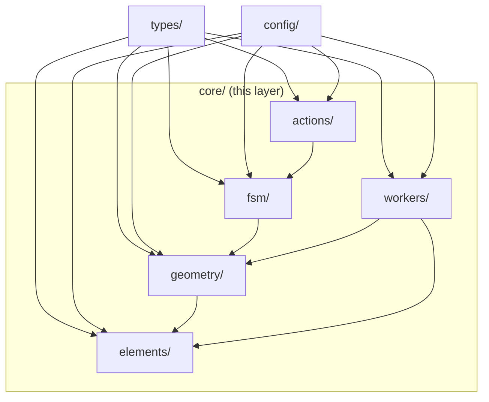

# core/ Layer Overview

`src/core/` is the bottom layer of the repository. Per the layering contract in
[`ARCHITECTURE.md`](/en/architecture/), `core/` may only import other `core/`
modules, `types/`, and `config/`. It must **not** depend on `lib/`, `store/`,
`hooks/`, or `components/`.

> This is the domain core of Apollo HD Map Studio: the FSM, geometry, workers,
> and action registry all live here. Higher tiers consume `core/` through
> explicit named exports and never reach into internals.

## Module map

```
src/core/
├── actions/             ← single source of truth for user actions
│   ├── registry.ts          barrel
│   └── registry/
│       ├── definitions.ts       static ActionDef[] (19 entries)
│       ├── helpers.ts           getMenuActions / matchesKeybinding / formatShortcut
│       └── types.ts             ActionId / ActionCategory / KeyBinding / ToolStripSlot
├── elements.ts          ← Apollo MapElement catalogue (12 types)
├── elements/
│   ├── derive/          ← derivation engine (lane.length / turn / boundarySeed / parking heading)
│   │   ├── index.ts             applyDerive / markUserOverride / clearUserOverride
│   │   ├── types.ts             DeriveCause / DeriveContext / DeriveRule
│   │   └── rules/
│   │       ├── lane.ts              lengthRule / turnRule / boundarySeedRule
│   │       └── parkingSpace.ts      headingFromRectRule
│   └── overlap/         ← overlap reconcile pipeline (lane × neighbors)
│       ├── reconcile.ts             main entry reconcileOverlaps
│       ├── spatialIndex.ts          RBush wrapper + bbox-signature incremental sync
│       ├── intersect.ts             geometric primitives
│       ├── pairTable.ts             lane × {junction,crosswalk,signal,...} pair rules
│       ├── overlapId.ts / regionId.ts derived semantic ids
│       ├── overridePaths.ts         _userOverrides path parsing
│       ├── computeLaneS.ts          lane arc-length cache + projectSegmentParam
│       ├── geometryAdapters.ts      proto → geometry adapters
│       ├── laneCorridor.ts          corridor polygon (lane × crosswalk region)
│       ├── polyClip.ts              polygon-clipping wrapper
│       └── types.ts                 ReconcileMode / ReconcilePatch / BBox / IndexNode
├── fsm/
│   └── editorMachine.ts ← XState 5 editor state machine
├── geometry/
│   ├── apolloCompile.ts             barrel
│   ├── apolloCompile/
│   │   ├── factory.ts                createApolloEntity + inferLaneTurn
│   │   ├── features.ts               compileApolloFeatures (GeoJSON)
│   │   ├── editPoints.ts             getApolloEditPoints / setAllApolloEditPoints
│   │   ├── conversions.ts            pointsToCurve / pointsToPolygon
│   │   ├── offsetPolyline.ts         equidistant offset (lane edges)
│   │   ├── projection.ts             local ENU projection
│   │   ├── signalHeading.ts          signal heading
│   │   ├── signalTemplate.ts         signal template geometry
│   │   └── laneBoundaryGeometry.ts   curvePoints / explicitLaneBoundaryEdges
│   ├── connectLanes.ts               lane endpoint alignment
│   ├── laneTopology.ts               reconcileLaneTopology(Incremental)
│   ├── interpolate.ts                Catmull-Rom / Bezier / 3-point arc / rotatedRect
│   ├── snap.ts                       findSnapTarget (vertex + edge candidates)
│   ├── validation.ts                 segmentsIntersect / wouldSelfIntersect / polygonSelfIntersects
│   ├── hitTest.ts                    pointToPolyline/PolygonDist(Geo)
│   ├── laneJunctions.ts              applyLaneJunctions (stitch + decorate)
│   ├── laneJunctions/internal.ts     decorateBoundary / endpointDirection / sideJoinOffset
│   └── coords.ts / anchorConvert.ts / compile.ts
└── workers/
    ├── spatial.worker.ts             main cold-layer worker (dispatch only)
    ├── spatialState.ts               SpatialState: tree + featureCache + decorationCache + junctionGraph
    ├── spatialRequests.ts            SYNC / INCREMENTAL / HIT_TEST / SYNC_BEGIN/CHUNK/FINISH
    ├── spatialFeatures.ts            buildFeatureCollection / groupFeaturesByEntity
    ├── spatialHitTest.ts             hitTest (PICK_TIER ordered)
    ├── spatialBridge.ts              SpatialWorkerBridge (main-thread RPC)
    ├── protocol.ts                   WorkerRequest / WorkerResponse / EntityFeatureGroup / HitResult
    ├── laneJunctionGraph.ts          LaneJunctionGraph (endpoint → dependent lane ids)
    ├── overlap.worker.ts             full-mode overlap reconcile worker
    └── overlapBridge.ts              OverlapWorkerBridge
```

## Module navigation

| Module                  | Doc                                                 | Key exports                                                                           |
| ----------------------- | --------------------------------------------------- | ------------------------------------------------------------------------------------- |
| Action registry         | [actions/registry](./actions-registry)              | `ACTION_DEFS`, `getMenuActions`, `matchesKeybinding`, `formatShortcut`                |
| Editor FSM              | [fsm/editorMachine](./fsm-editor-machine)           | `editorMachine`, `DrawTool`, `EditorContext`, `EditorEvent`                           |
| Element catalogue       | [elements](./elements)                              | `MAP_ELEMENTS`, `ELEMENT_MAP`, `elementColor`, `laneTypeColor`                        |
| Derive engine           | [elements/derive](./elements-derive)                | `applyDerive`, `markUserOverride`, `clearUserOverride`, `DeriveRule`                  |
| Overlap reconcile       | [elements/overlap](./elements-overlap)              | `reconcileOverlaps`, `SpatialIndex`, `makeOverlapId`                                  |
| Apollo geometry compile | [geometry/apolloCompile](./geometry-apollo-compile) | `createApolloEntity`, `compileApolloFeatures`, `inferLaneTurn`, `getApolloEditPoints` |
| Lane connection         | [geometry/connectLanes](./geometry-connect-lanes)   | `planConnection`, `applyLaneConnection`, `ConnectionMode`                             |
| Lane topology           | [geometry/laneTopology](./geometry-lane-topology)   | `reconcileLaneTopology(Incremental)`                                                  |
| Curve interpolation     | [geometry/interpolate](./geometry-interpolate)      | `cubicBezier`, `catmullRom`, `threePointArc`, `rectCorners`                           |
| Snap                    | [geometry/snap](./geometry-snap)                    | `findSnapTarget`, `pixelsToMeters`, `SnapTarget`                                      |
| Validation              | [geometry/validation](./geometry-validation)        | `segmentsIntersect`, `wouldSelfIntersect`, `polygonSelfIntersects`                    |
| Hit test                | [geometry/hitTest](./geometry-hit-test)             | `pointToPolylineDist(Geo)`, `pointToPolygonDist(Geo)`, `pointInPolygon`               |
| Lane junctions          | [geometry/laneJunctions](./geometry-lane-junctions) | `applyLaneJunctions`, `decorateBoundary`, `sideJoinOffset`                            |
| Spatial worker          | [workers/spatial](./workers-spatial)                | dispatch only; state lives in `SpatialState`                                          |
| Overlap worker          | [workers/overlap](./workers-overlap)                | `OverlapWorkerBridge.reconcileFull`                                                   |
| Worker protocol         | [workers/protocol](./workers-protocol)              | `WorkerRequest`, `WorkerResponse`, `EntityFeatureGroup`, `HitResult`                  |
| Junction graph          | [workers/junction-graph](./workers-junction-graph)  | `LaneJunctionGraph`, `endpointKeyOf`, `laneEndpointKeys`                              |

## Layered import rules



- `geometry/` is the geometric primitive layer; `elements/derive` calls
  `geometry/apolloCompile.inferLaneTurn`, and `elements/overlap` consumes
  `geometry/laneJunctions` indirectly.
- `workers/` consumes pure functions of `core/` over the worker boundary
  (`reconcileOverlaps`, `applyLaneJunctions`, `compileColdFeatures`); nothing
  imports back from workers.
- `actions/` references `DrawTool` from `fsm`, single-direction.

## Test coverage snapshot

| Module            | Test file                                                        | Size (approx)   |
| ----------------- | ---------------------------------------------------------------- | --------------- |
| FSM               | `src/core/fsm/__tests__/editorMachine.test.ts`                   | ~47 KB          |
| Action registry   | `src/core/actions/__tests__/registry.test.ts`                    | ~8.6 KB         |
| Apollo compile    | `src/core/geometry/__tests__/apolloCompile.{gaps,label}.test.ts` | ~13 KB + 3.4 KB |
| connectLanes      | `src/core/geometry/__tests__/connectLanes.test.ts`               | ~11 KB          |
| laneTopology      | `src/core/geometry/__tests__/laneTopology.test.ts`               | ~15 KB          |
| laneJunctions     | `src/core/geometry/__tests__/laneJunctions.{test,bench}.ts`      | ~29 KB + 3.5 KB |
| snap              | `src/core/geometry/__tests__/snap.test.ts`                       | ~9.9 KB         |
| hitTest           | `src/core/geometry/__tests__/hitTest.test.ts`                    | ~9.3 KB         |
| validation        | `src/core/geometry/__tests__/validation.test.ts`                 | ~3.4 KB         |
| spatial.worker    | `src/core/workers/__tests__/spatial.worker.test.ts`              | ~15 KB          |
| LaneJunctionGraph | `src/core/workers/__tests__/laneJunctionGraph.test.ts`           | ~6.1 KB         |
| Overlap           | `src/core/elements/overlap/__tests__/*.test.ts`                  | multi-file      |
| Derive            | `src/core/elements/derive/__tests__/*.test.ts`                   | multi-file      |

## See also

- [Architecture overview](/en/architecture/)
- [lib/entityOps](/en/api/lib/entity-ops) — proto anti-corruption layer (R2),
  the only bridge between UI code and `core/`.
- [hooks/useColdLayer](/en/api/hooks/use-cold-layer) — main-thread cold-layer
  scheduler that pushes entities to the worker via `SpatialWorkerBridge`.
