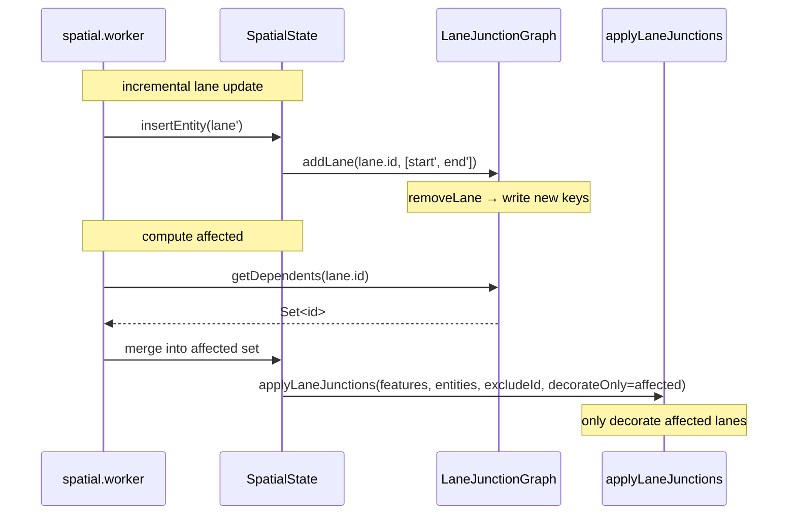

# `workers/junction-graph` — Endpoint Dependency Graph

> Source: `src/core/workers/laneJunctionGraph.ts`
> Tests: `src/core/workers/__tests__/laneJunctionGraph.test.ts` (~6.1 KB)

## Purpose & Invariants

Why this graph?

`applyLaneJunctions` stitches all lane junctions on every call, and the worker
calls it on every entity edit. At 500-lane scale, a single cold-layer rebuild
takes ~250 ms (boundary decoration dominates). The Phase E optimization
re-decorates **only affected lanes**, which requires answering quickly:
"which lanes share an endpoint with lane X?"

`LaneJunctionGraph` maintains two indexes:

```ts
private laneToKeys = new Map<string, [EndpointKey, EndpointKey]>();   // lane id → [start, end]
private keyToLanes = new Map<EndpointKey, Set<string>>();             // endpoint key → Set<lane id>
```

`getDependents(id)` returns the lane ids sharing at least one endpoint
with `id` (excluding self) in O(K) time, K being endpoint fan-out
(typically 2–4).

### Invariants

1. **Endpoint keys use `toFixed(6)`** — matches the rendering-side stitch
   precision in `geometry/laneJunctions` (≈ 1 cm). Mismatched precision
   would break the "decorate the right lanes" guarantee.
2. **`addLane` is idempotent** — internal `removeLane` first cleans old
   entries, then inserts.
3. **`removeLane` deletes empty buckets** — when `keyToLanes.get(key).size
=== 0`, the key is removed.

## Public API

### Types

```ts
export type EndpointKey = string;
```

### `endpointKeyOf(pt: GeoPoint): EndpointKey`

```ts
return `${pt.x.toFixed(6)},${pt.y.toFixed(6)}`;
```

≈ 1 cm precision (lng/lat both `toFixed(6)`).
(`laneJunctionGraph.ts:25-27`)

### `laneEndpointKeys(lane: LaneEntity): [EndpointKey, EndpointKey] | null`

Extracts the lane centerline first/last points and stringifies them.
Returns `null` if the centerline has fewer than 2 points.
(`laneJunctionGraph.ts:30-36`)

### `class LaneJunctionGraph`

#### `addLane(id, [startKey, endKey])`

Idempotent insert: `removeLane(id)` first, then write `laneToKeys` and add
`id` to both endpoint buckets in `keyToLanes`.
(`laneJunctionGraph.ts:47-58`)

#### `removeLane(id)`

Clears `laneToKeys[id]` and removes id from both endpoint buckets; deletes
empty buckets.
(`laneJunctionGraph.ts:61-71`)

#### `getDependents(id) => Set<string>`

```ts
const out = new Set<string>();
const keys = this.laneToKeys.get(id);
if (!keys) return out;
for (const key of keys) {
  const bucket = this.keyToLanes.get(key);
  if (!bucket) continue;
  for (const other of bucket) if (other !== id) out.add(other);
}
return out;
```

Returns **all** other lane ids sharing at least one endpoint.
(`laneJunctionGraph.ts:74-86`)

#### `has(id)` / `size()` / `clear()`

Convenience queries and reset.

## Workflow



## Algorithmic properties

### O(K) lookup

```
getDependents(X)
  = ∪ keyToLanes[key]  for key in laneToKeys[X]   (minus X)
```

K is the endpoint fan-out cap. A 4-way junction is 4 lanes × 2 endpoints =
fan-out at most 4 per endpoint, so `getDependents` averages < 10 set ops.

### What "endpoint share" means here

Two lanes "share an endpoint" in this graph when their `endpointKey` matches
— **regardless of** which side (start vs end). End-to-start (A.end ≡ B.start)
and start-to-start (A.start ≡ B.start) both make `getDependents(A)` include
B. That is exactly the "any endpoint sharing" semantics the stitch path
needs.

The finer-grained "is this actually a stitchable continuous junction" is
decided by `isContinuousJunction` inside `applyLaneJunctions` (see
[geometry/laneJunctions](./geometry-lane-junctions)).

## Difference from the topology layer (`laneTopology.ts`)

| Aspect      | `laneJunctionGraph` (worker)         | `laneTopology` (geometry)                              |
| ----------- | ------------------------------------ | ------------------------------------------------------ |
| Granularity | endpoint key share                   | same `toFixed(6)` endpoints                            |
| Output      | `Set<lane id>` (dependency)          | `LaneTopologyDiff.changes` (pred/succ/neighbor fields) |
| Use         | Phase E incremental decoration scope | reconcile writes back lane topology fields             |
| Persistent  | yes (worker singleton)               | no (rebuilds indices each call)                        |

They coexist: the worker graph is a perf lever; topology is a data-derivation truth.

## Complexity

| Operation          | Complexity                                       |
| ------------------ | ------------------------------------------------ |
| `endpointKeyOf`    | O(1)                                             |
| `laneEndpointKeys` | O(P) (curvePoints)                               |
| `addLane`          | O(1) amortised; idempotent                       |
| `removeLane`       | O(1)                                             |
| `getDependents`    | O(K), K = endpoint fan-out total (typically 2–4) |
| `has` / `size`     | O(1)                                             |
| `clear`            | O(N+K)                                           |

## Test coverage

`laneJunctionGraph.test.ts` covers:

- Single `addLane` → both endpoint buckets contain that id.
- Two lanes sharing an endpoint → mutually dependent.
- `removeLane` → bucket size decrements; empty bucket deletes key.
- Repeated `addLane` for the same id → idempotent (remove → insert).
- Geometry change (lane endpoint moves → endpointKeys change) → `addLane`
  refreshes mapping.
- `getDependents` excludes self.
- `clear` → size 0.

## See also

- [geometry/laneJunctions](./geometry-lane-junctions) — Phase E decoration
  consumer of `getDependents`
- [workers/spatial](./workers-spatial) — `addLane` / `removeLane` callers
  (`insertEntity` / `removeEntity`)
- [geometry/laneTopology](./geometry-lane-topology) — main-thread topology
  derivation (pred/succ)
- [workers/protocol](./workers-protocol) — INCREMENTAL → COLD_DELTA path
  uses dependents to compute affected
