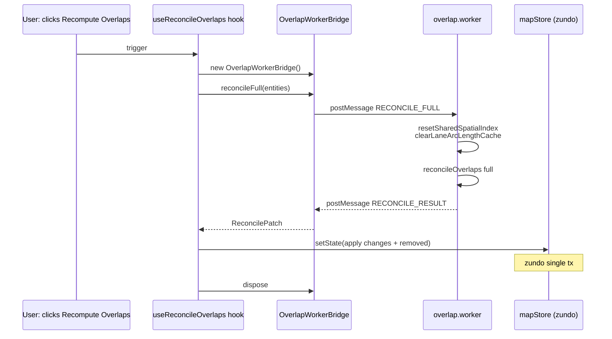

# `workers/overlap` — Overlap Reconcile Worker

> Source: `src/core/workers/overlap.worker.ts`
> Main-thread bridge: `src/core/workers/overlapBridge.ts`
> Tests: covered indirectly through `elements/overlap/__tests__/` reconcile
> tests (the worker is a thin wrapper)

## Purpose & Invariants

At 50k-entity scale, `reconcileOverlaps({ mode: 'full' })` runs ~450 ms on the
main thread — enough to drop frames at 60 fps editing. This worker wraps the
full mode behind a single request/response pair:

- **When to use the worker**: import completion, user-triggered "Recompute
  overlaps", pre-export validation.
- **When to stay on the main thread**: edit-time incremental (dirty=1–3) is
  < 6 ms; postMessage cloning 50k entities would dominate.

### Invariants

1. **Worker holds no store reference.** Pure computation: send `entities:
Map` to the worker, get a `ReconcilePatch` back, the main thread applies
   it (preserves zundo single-transaction semantics).
2. **Worker runs in its own V8 isolate.** `resetSharedSpatialIndex()` +
   `clearLaneArcLengthCache()` at the start of each request avoid stale
   indexes across consecutive `RECONCILE_FULL` calls.
3. **Protocol is independent of spatial.worker.** Overlap and spatial-index
   responsibilities are split — no two-jobs-in-one-file.

## Protocol

### Request

```ts
interface OverlapRequest {
  type: 'RECONCILE_FULL';
  requestId: string;
  entities: MapEntity[];
}
```

`entities` is an array (more direct for postMessage serialization); the
worker rehydrates a `Map<id, entity>` internally.

### Response

```ts
interface OverlapResponse {
  type: 'RECONCILE_RESULT';
  requestId: string;
  changes: Array<[string, MapEntity]>;
  removedOverlapIds: string[];
  stats: {
    pairsTested: number;
    pairsMatched: number;
    overlapsCreated: number;
    overlapsRemoved: number;
    durationMs: number;
  };
}
```

`changes` is sent as an array, not a Map: postMessage cannot transfer Maps
in older Safari. The bridge rehydrates `new Map(changes)` on receipt.

## Main-thread usage

```ts
import { OverlapWorkerBridge } from '@/core/workers/overlapBridge';

const bridge = new OverlapWorkerBridge();
try {
  const patch = await bridge.reconcileFull(entities);
  // single zundo transaction
  mapStore.setState((draft) => {
    for (const id of patch.removedOverlapIds) draft.entities.delete(id);
    for (const [id, e] of patch.changes) draft.entities.set(id, e);
  });
} finally {
  bridge.dispose(); // dispose after one-shot usage
}
```

### `OverlapWorkerBridge`

```ts
class OverlapWorkerBridge {
  reconcileFull(
    entities: ReadonlyMap<string, MapEntity>,
    timeoutMs?: number, // default 30_000
  ): Promise<ReconcilePatch>;

  dispose(): void; // terminate + reject pending
}
```

## Lifecycle



## Worker implementation (overlap.worker.ts)

```ts
self.onmessage = (e: MessageEvent<OverlapRequest>) => {
  const req = e.data;
  if (req.type !== 'RECONCILE_FULL') return;

  // The worker isolate has its own singleton
  resetSharedSpatialIndex();
  clearLaneArcLengthCache();

  const map = new Map<string, MapEntity>();
  for (const entity of req.entities) map.set(entity.id, entity);

  const patch = reconcileOverlaps(map, { mode: 'full' });
  self.postMessage({
    type: 'RECONCILE_RESULT',
    requestId: req.requestId,
    changes: Array.from(patch.changes.entries()),
    removedOverlapIds: Array.from(patch.removedOverlapIds),
    stats: patch.stats,
  });
};
```

35 lines — the worker is a **wrapper** around `reconcileOverlaps`, not a
reimplementation.

## Bridge implementation (overlapBridge.ts)

- **Timeout** — default 30 s: ample headroom over the ~450 ms full reconcile.
- **Pending Map** — `Map<requestId, { resolve, reject, timer }>`. On
  `worker.onmessage`, the entry is found, `clearTimeout`, then `resolve`.
- **Error handling** — `worker.onerror` rejects all pending entries.
- **Dispose** — terminate worker + reject pending; idempotent.

## Performance profile

| Scale | Main-thread incremental (dirty=1) | Worker full |
| ----- | --------------------------------- | ----------- |
| 5k    | < 1 ms                            | ~30 ms      |
| 50k   | < 6 ms                            | ~450 ms     |

postMessage cloning of 50k entities (a 30–50 MB JSON serialization) dominates
at ~100–200 ms; reconcile itself is ~250–300 ms. SharedArrayBuffer is a
future optimization knob.

## Test coverage

`overlap.worker` has no dedicated tests — it is a thin worker shim around
`reconcileOverlaps`. Logic coverage lives in
`src/core/elements/overlap/__tests__/reconcile.test.ts`:

- full mode is semantically equivalent to incremental with dirtyIds = all
  entities.
- stats (`pairsTested` / `pairsMatched` / etc.) accumulate correctly.

## See also

- [elements/overlap](./elements-overlap) — `reconcileOverlaps` main pipeline
- [workers/protocol](./workers-protocol) — spatial worker uses a separate
  protocol (this one is not reused there)
- [mapStore.recomputeOverlapsAsync](/en/api/store/map-store) — async recompute entry called by UI flows
- [store/mapStore](/en/api/store/map-store) — `setState` that applies the patch
