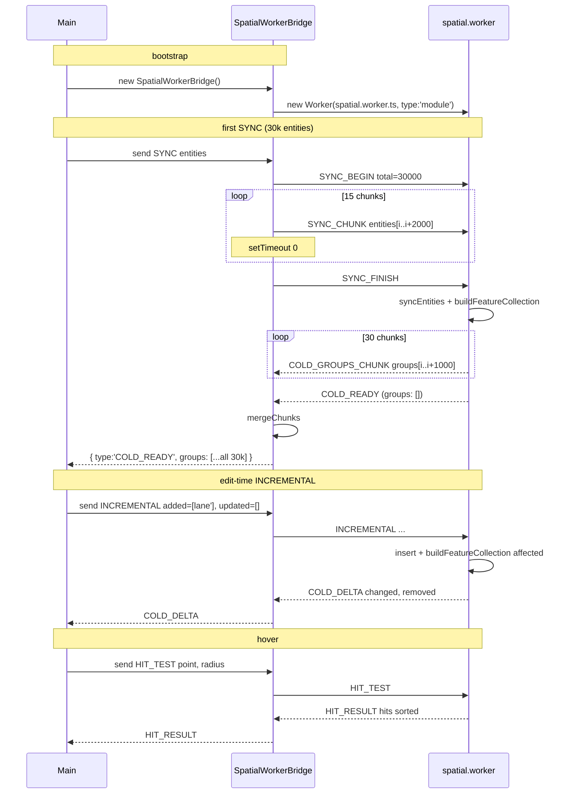

# `workers/protocol` — Worker Message Protocol

> Source: `src/core/workers/protocol.ts`
> Consumers: `workers/spatial.worker.ts`, `workers/spatialBridge.ts`,
> `workers/spatialRequests.ts`, `workers/spatialFeatures.ts`

## Purpose & Invariants

`protocol.ts` is the **type contract** for main-thread ↔ spatial worker
communication. Every message goes through postMessage (V8 structured clone,
cross-isolate copy), so:

1. **No Map / Set / Function** (postMessage cannot serialize them).
   `SerializedEntity` is just `MapEntity` (already a plain-object union).
2. **`requestId` pairs request/response.** The bridge tracks
   `Map<requestId, PendingEntry>`; the worker echoes `requestId` verbatim.
3. **Large payloads chunk.** SYNC with > 2000 entities uses `SYNC_BEGIN` +
   `SYNC_CHUNK[]` + `SYNC_FINISH`; responses with > 1000 groups use
   `COLD_GROUPS_CHUNK` followed by a terminating `COLD_READY` for merging.
4. **`overlap.worker` uses a separate protocol** — this one is for
   `spatial.worker` only.

## Main thread → worker

```ts
export type WorkerPublicRequest =
  | { type: 'SYNC'; requestId: string; entities: SerializedEntity[]; excludeId?: string | null }
  | {
      type: 'INCREMENTAL';
      requestId: string;
      added: SerializedEntity[];
      removed: string[];
      updated: SerializedEntity[];
      excludeId?: string | null;
    }
  | { type: 'HIT_TEST'; requestId: string; point: [number, number]; radius: number };

export type WorkerRequest =
  | WorkerPublicRequest
  | { type: 'SYNC_BEGIN'; requestId: string; total: number; excludeId?: string | null }
  | {
      type: 'SYNC_CHUNK';
      requestId: string;
      entities: SerializedEntity[];
      offset: number;
      total: number;
    }
  | { type: 'SYNC_FINISH'; requestId: string };
```

`SerializedEntity = MapEntity`.

### `'SYNC'` (small payload, single shot)

Main thread sends all entities at once. The worker calls `syncEntities` to
rebuild tree + featureCache + junctionGraph and replies with `COLD_READY`.

### `'SYNC_BEGIN' / 'SYNC_CHUNK' / 'SYNC_FINISH'` (large payload, chunked)

The bridge auto-chunks when `request.entities.length > SYNC_ENTITY_CHUNK_SIZE
(2000)`, yielding (`setTimeout(0)`) between chunks so the main thread can
service events.

```ts
SYNC_BEGIN(total, excludeId)
SYNC_CHUNK(entities[0..2000], offset=0, total)
SYNC_CHUNK(entities[2000..4000], offset=2000, total)
...
SYNC_FINISH                           // worker syncEntities + buildFeatureCollection in one shot
```

### `'INCREMENTAL'`

```ts
{ type: 'INCREMENTAL', requestId, added, removed, updated, excludeId? }
```

The worker remove / inserts each entry, computes affected lanes via
`junctionGraph`, re-decorates only the affected subset, and replies
`COLD_DELTA`.

### `'HIT_TEST'`

```ts
{ type: 'HIT_TEST', requestId, point: [lng, lat], radius: degrees }
```

`radius` is in lng-degree units (caller computes via `pixelToRadius(px, zoom)`).
The worker uses `tree.search` for narrowing, then
`pointToPolyline/PolygonDistGeo` for precise distance.

## Worker → main thread

```ts
export interface EntityFeatureGroup {
  id: string;
  features: GeoJSON.Feature[];
}

export type WorkerResponse =
  | {
      type: 'COLD_GROUPS_CHUNK';
      requestId: string;
      groups: EntityFeatureGroup[];
      offset: number;
      total: number;
    }
  | {
      type: 'COLD_READY';
      requestId: string;
      featureCollection?: GeoJSON.FeatureCollection;
      groups: EntityFeatureGroup[];
    }
  | { type: 'COLD_DELTA'; requestId: string; changed: EntityFeatureGroup[]; removed: string[] }
  | { type: 'HIT_RESULT'; requestId: string; hits: HitResult[] };

export interface HitResult {
  id: string;
  entityType: string;
  distance: number;
}
```

### `'COLD_READY'`

SYNC complete. `groups` is the per-entity bucketing (the main-thread
cold-layer cache keys by id). When `groups.length > 1000`, the worker emits
`COLD_GROUPS_CHUNK[]` and a final `COLD_READY` with `groups: []` /
`featureCollection: undefined` as a marker — the bridge's `mergeChunks`
reassembles a single response.

### `'COLD_GROUPS_CHUNK'`

Chunked group transfer to avoid single-message bloat (V8 structured clone
caps around ~1 GB but performance degrades well below 100 MB).

### `'COLD_DELTA'`

INCREMENTAL result. `changed` contains only entities affected by this
mutation (including endpoint-sharing lanes whose decoration was refreshed).
`removed` is the deleted ids. Main-thread cold cache simply does
`delete + set`.

### `'HIT_RESULT'`

Hits sorted by PICK_TIER then distance — the first entry is the
"visually picked" entity.

## EntityFeatureGroup ids and the unkeyed bucket

`groupFeaturesByEntity` (spatialFeatures.ts) buckets by
`feature.properties.id`. Features without a string id (rare, e.g. global
chrome decorations) land in the `__unkeyed` bucket. Within each group,
`withUniqueFeatureIds` ensures `feature.id` uniqueness (multiple features
per entity get `:1`, `:2` suffixes).

## Full sequence (typical edit)



## Test coverage

The protocol contract is a TS type; correctness is enforced by:

- `spatial.worker.test.ts` covers each request → response semantics.
- `WorkerRequest` / `WorkerResponse` exhaustiveness checks (switch default
  triggers a TS error if a branch is uncovered).

## See also

- [workers/spatial](./workers-spatial) — protocol consumer
- [workers/junction-graph](./workers-junction-graph) — used by INCREMENTAL
  affected-set computation
- [hooks/useColdLayer](/en/api/hooks/use-cold-layer) — main-thread bridge consumer
- [hooks/useHotLayer](/en/api/hooks/use-hot-layer) — does not go through the
  worker (live drag stays on the main thread)
