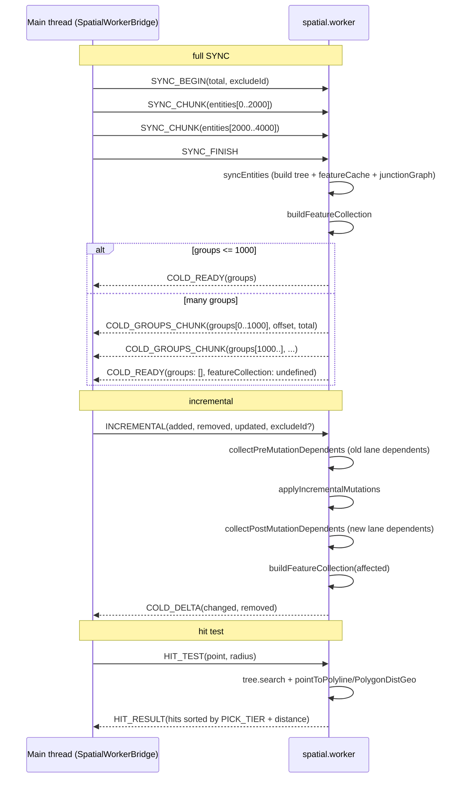
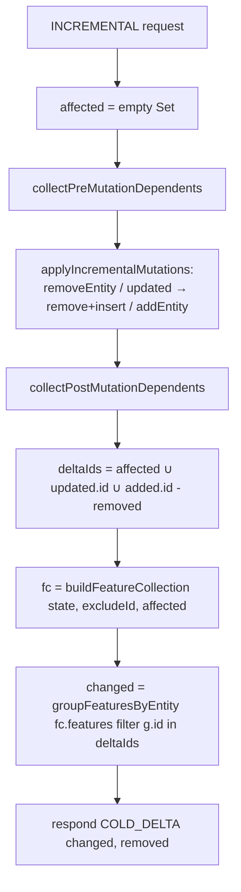
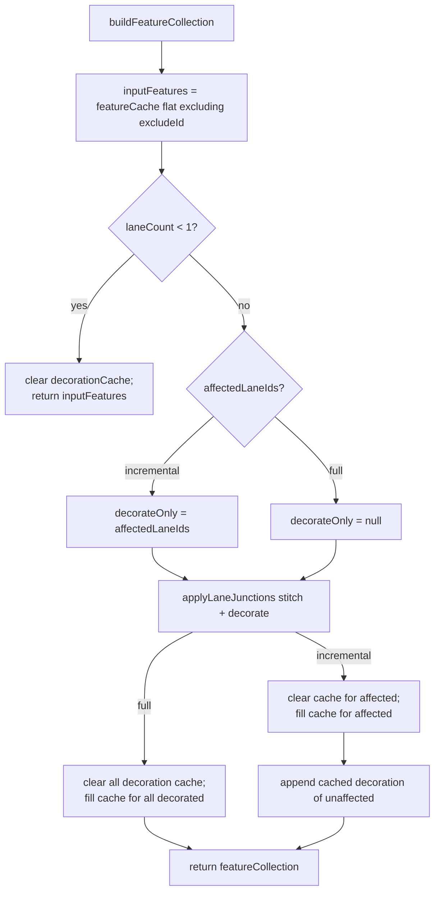
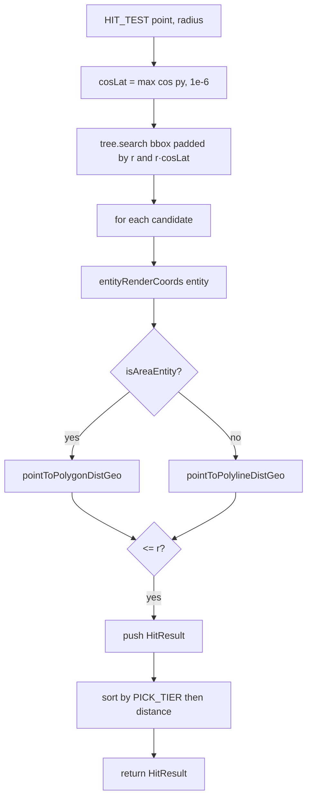

# `workers/spatial` — Cold Layer Worker

> Source (thin dispatcher): `src/core/workers/spatial.worker.ts`
> State: `spatialState.ts` (SpatialState factory + insert/remove/sync)
> Request handling: `spatialRequests.ts` (`handleRequest`)
> Feature build: `spatialFeatures.ts` (`buildFeatureCollection` / `groupFeaturesByEntity`)
> Hit test: `spatialHitTest.ts` (`hitTest` + `PICK_TIER`)
> Main-thread bridge: `spatialBridge.ts` (`SpatialWorkerBridge`)
> Tests: `src/core/workers/__tests__/spatial.worker.test.ts` (~15 KB)

## Purpose & Invariants

`spatial.worker.ts` moves cold-layer feature compilation + RBush hit testing
into a Web Worker so that the main thread does not jank at 50k-entity scale.
The worker file itself is a thin dispatcher (10 lines + chunked respond);
all logic lives in `spatialState` / `spatialRequests` / `spatialFeatures` /
`spatialHitTest`.

Worker-local state `SpatialState`:

```ts
interface SpatialState {
  tree: RBush<SpatialItem>; // spatial index
  entityMap: Map<string, MapEntity>; // id → entity
  itemMap: Map<string, SpatialItem>; // id → bbox node
  featureCache: Map<string, GeoJSON.Feature[]>; // id → compiled cold features
  decorationCache: Map<string, GeoJSON.Feature[]>; // id → boundary decoration features
  junctionGraph: LaneJunctionGraph; // endpoint → dependent lane ids
  pendingSyncs: Map<string, { entities; total; excludeId? }>; // chunked SYNC
  laneCount: number;
}
```

### Invariants

1. **One worker instance.** `spatialBridge` constructs one worker reused for
   the session.
2. **State lives in the worker.** Main thread synchronizes through
   postMessage; no shared memory (SharedArrayBuffer not currently used —
   cross-isolate cloning is the protocol cost).
3. **`featureCache` caches `compileColdFeatures(entity)` results per entity.**
   On edit, only mutated entities recompile; unchanged entities reuse their
   features.
4. **`decorationCache` is the Phase E lever.** Boundary decoration is
   cached separately; `INCREMENTAL` decorates only affected lanes.
5. **`junctionGraph` is maintained by `addLane`/`removeLane`.** Inserts
   `[startKey, endKey]` on lane mutations; cleans entries on delete.

## Worker protocol (high level)



Full message types are documented in [workers/protocol](./workers-protocol).

## handleRequest dispatch (spatialRequests.ts)

```ts
function handleRequest(state: SpatialState, req: WorkerRequest, respond: Respond) {
  switch (req.type) {
    case 'SYNC':
      handleSync(state, req, respond);
    case 'SYNC_BEGIN':
      handleSyncBegin(state, req);
    case 'SYNC_CHUNK':
      handleSyncChunk(state, req);
    case 'SYNC_FINISH':
      handleSyncFinish(state, req, respond);
    case 'INCREMENTAL':
      handleIncremental(state, req, respond);
    case 'HIT_TEST':
      respond({ type: 'HIT_RESULT', hits: hitTest(state, req.point, req.radius) });
  }
}
```

### `handleIncremental` details



`affected` includes endpoint-sharing lanes (pre + post) so decoration is
refreshed for every visibly affected lane. `deltaIds` is the set of entity
groups returned to the main thread.

## buildFeatureCollection (spatialFeatures.ts)



## hitTest (spatialHitTest.ts)



`PICK_TIER` (`spatialHitTest.ts:13-31`):

| tier        | entityType                                                       |
| ----------- | ---------------------------------------------------------------- |
| 0           | signal / stopSign / yieldSign / rsu / barrierGate / speedControl |
| 1           | crosswalk / speedBump / parkingSpace                             |
| 2           | lane / road / overlap                                            |
| 3           | clearArea / junction / pncJunction / parkingLot / area           |
| 9 (default) | other                                                            |

Lower tier wins, so a click on a signal icon is never stolen by the junction
polygon underneath.

## SpatialWorkerBridge (spatialBridge.ts)

Main-thread façade:

- `send(request, timeout?)` → `Promise<WorkerResponse>`
- Each request has a `requestId`; a pending Map tracks resolve/reject + timer.
- `SYNC` with > 2000 entities is automatically chunked (`postChunkedSync`),
  yielding to the main task loop between chunks.
- `mergeChunks` combines `COLD_GROUPS_CHUNK` and `COLD_READY` into a single
  response.
- `dispose()` clears pending and terminates the worker.

Default timeout = 120 s (a 50k-entity cold sync can take > 10 s; 12× headroom).

## Complexity

| Operation | Complexity |
| ----------- | ------------------------------------------------------------- | -------- | ------------------------------- |
| SYNC | O(N + L·B); N=entities, L=lanes, B=boundary segments per lane |
| INCREMENTAL | O( | affected | ·B + Δentities·feature_compile) |
| HIT_TEST | O(log N + k·V); k=candidates, V=avg vertices |

## Test coverage

`spatial.worker.test.ts` covers:

- SYNC: tree.search returns the right candidate count.
- SYNC_BEGIN/CHUNK/FINISH: chunked sync correctness.
- INCREMENTAL: added / removed / updated combinations produce correct changed sets.
- HIT_TEST: clicking on a lane returns the lane (not the underlying junction).
- excludeId: does not appear in the feature collection.
- Endpoint-shared lane modifications include the peer in `affected` (junctionGraph).

## See also

- [workers/protocol](./workers-protocol) — full message types
- [workers/junction-graph](./workers-junction-graph) — `LaneJunctionGraph` internals
- [geometry/laneJunctions](./geometry-lane-junctions) — `applyLaneJunctions`
- [geometry/hitTest](./geometry-hit-test) — `pointToPolylineDistGeo` /
  `pointToPolygonDistGeo`
- [hooks/useColdLayer](/en/api/hooks/use-cold-layer) — main-thread caller of
  `SpatialWorkerBridge.send`
