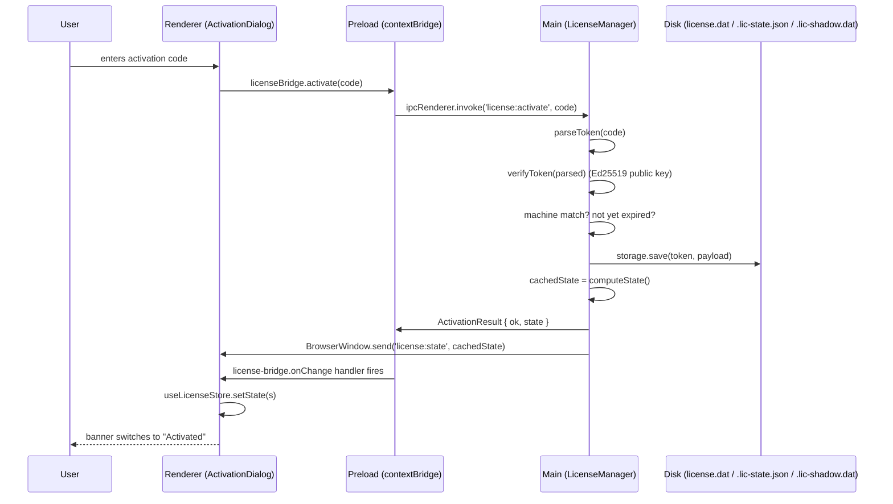
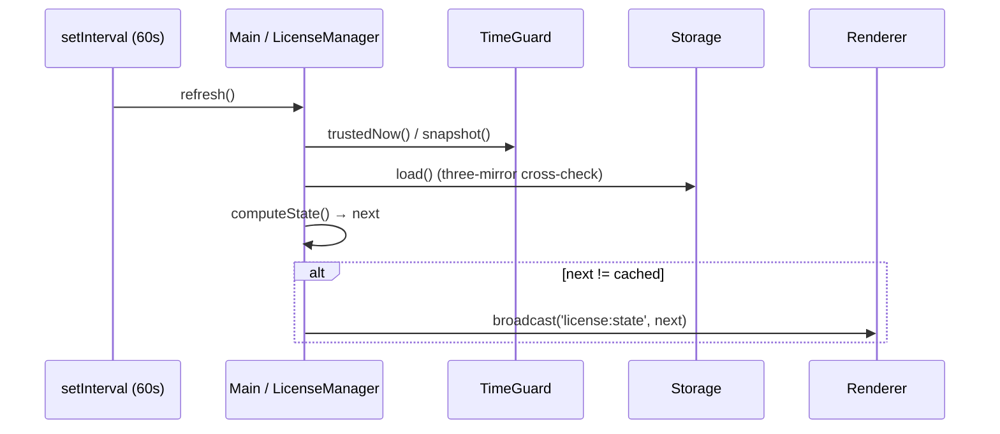

# Electron integration overview

Apollo Map Studio's desktop build is on Electron 41. This page is the single-glance reference for the main / preload / renderer relationship, IPC channels, security flags, and the licensing subsystem entry points.

## Process architecture

```
┌──────────────────────────────────────────────────────────────┐
│  Main process  (Node.js)                                     │
│  electron/main.cts                                           │
│  electron/license/manager.cts                                │
│  ─ window creation                                           │
│  ─ app lifecycle (single-instance lock, before-quit)         │
│  ─ LicenseManager: machine-id / time-guard / storage / IPC   │
└────────────────────────┬─────────────────────────────────────┘
                         │ IPC (license:get-state / activate / …)
                         │ Push (license:state broadcast)
                         ▼
┌──────────────────────────────────────────────────────────────┐
│  Preload  (sandboxed Node, contextIsolated)                  │
│  electron/preload.cts                                        │
│  ─ contextBridge.exposeInMainWorld('apolloMapStudio', …)     │
│  ─ contextBridge.exposeInMainWorld('apolloMapStudioLicense', │
│        { getState, getMachineCode, activate, deactivate,     │
│          onChange })                                         │
└────────────────────────┬─────────────────────────────────────┘
                         │ window.apolloMapStudio*
                         ▼
┌──────────────────────────────────────────────────────────────┐
│  Renderer  (Chromium)                                        │
│  src/lib/license-bridge.ts  (window wrapper + browser fallback) │
│  src/store/licenseStore.ts  (Zustand mirror)                 │
│  src/lib/editable-guard.ts  (mutator gate)                   │
│  React UI                                                    │
└──────────────────────────────────────────────────────────────┘
```

## Security configuration (`main.cts`)

```ts
new BrowserWindow({
  webPreferences: {
    preload: getPreloadPath(),
    contextIsolation: true, // ✓ renderer / preload isolated
    nodeIntegration: false, // ✓ no `require` in renderer
    sandbox: true, // ✓ preload also sandboxed (Chromium sandbox)
  },
});
```

All three flags are on — the Electron 14+ security baseline.

| Flag               | Value   | Meaning                                                                                     |
| ------------------ | ------- | ------------------------------------------------------------------------------------------- |
| `contextIsolation` | `true`  | preload and renderer V8 contexts are separate; only `contextBridge`-exposed APIs cross over |
| `nodeIntegration`  | `false` | `require` / `process` not visible in the renderer                                           |
| `sandbox`          | `true`  | preload runs inside the Chromium sandbox; only the safe subset of `electron` is available   |

External-link handler (`setWindowOpenHandler`):

```ts
mainWindow.webContents.setWindowOpenHandler(({ url }) => {
  if (url.startsWith('http://') || url.startsWith('https://')) {
    void shell.openExternal(url);
  }
  return { action: 'deny' }; // default deny: window.open routes to system browser
});
```

## IPC channel reference

License-related (the only public IPC surface):

| Channel                    | Pattern                | Renderer call                     | Main handler             |
| -------------------------- | ---------------------- | --------------------------------- | ------------------------ |
| `license:get-state`        | invoke → Promise       | `licenseBridge.getState()`        | `manager.refresh()`      |
| `license:get-machine-code` | invoke → Promise       | `licenseBridge.getMachineCode()`  | returns `machine.code`   |
| `license:activate`         | invoke(code) → Promise | `licenseBridge.activate(code)`    | `manager.activate(code)` |
| `license:deactivate`       | invoke → Promise       | `licenseBridge.deactivate()`      | `manager.deactivate()`   |
| `license:state`            | push (main → renderer) | `licenseBridge.onChange(handler)` | `manager.broadcast()`    |

All channels are string literals; `electron/license/manager.cts` and `electron/preload.cts` each carry a copy of the `LICENSE_IPC` constants — keep them in sync.

## Module map

### Main process

- [`main.cts`](./electron/main-process.md) — window creation, lifecycle, LicenseManager start/stop
- [`license/manager.cts`](./electron/license-manager.md) — license state machine, IPC handlers, refresh timer
- [`license/storage.cts`](./electron/license-storage.md) — three-mirror + HMAC blob storage
- [`license/crypto.cts`](./electron/license-crypto.md) — Ed25519 / AES-GCM / HMAC / HKDF
- [`license/machine-id.cts`](./electron/license-machine-id.md) — 16-char base32 fingerprint
- [`license/time-guard.cts`](./electron/license-time-guard.md) — clock tampering detector
- `license/public-key.cts` — embedded Ed25519 public key + APP_PEPPER
- `license/types.cts` — shared types (`LicenseState`, `ActivationResult`, `LicensePayload`)

### Preload

- [`preload.cts`](./electron/preload.md) — `contextBridge` exposes `apolloMapStudio` / `apolloMapStudioLicense`

### Renderer

- [`license-bridge`](./lib/license-bridge.md) — window API wrapper
- [`licenseStore`](./store/license-store.md) — React state mirror
- [`editable-guard`](./lib/editable-guard.md) — store-mutator gate

## Activation flow



## Periodic state refresh

The main process self-refreshes every 60 s; broadcasts only on change:



## License state machine

See [`licenseStore`](./store/license-store.md) for the full table; simplified:

```
       ┌───────────────────────┐
       │  not_started (clock?) │
       └─────────┬─────────────┘
                 │ time advances past trialStart
                 ▼
       ┌───────────────────────┐
       │       trial           │  (canEdit=true, 7 days)
       └─────────┬─────────────┘
                 │ activate(valid token)
                 ▼
       ┌───────────────────────┐
  ┌────│      activated        │
  │    └─────────┬─────────────┘
  │              │ expires < now
  │              ▼
  │    ┌───────────────────────┐
  │    │   expired_license     │
  │    └───────────────────────┘
  │
  │ Trial path: 7-day window elapses
  │  ▼
  │ ┌───────────────────────┐
  └►│   expired_trial       │
    └───────────────────────┘

  Any state + anomaly →
  ┌───────────────────────┐  ┌─────────────────┐  ┌──────────┐
  │    tampered           │  │ machine_mismatch│  │ invalid  │
  └───────────────────────┘  └─────────────────┘  └──────────┘
```

## Packaging / distribution

`electron-builder.yml` lives at the repo root; build outputs go to `release/`. The CI workflow `.github/workflows/desktop-package.yml` cross-compiles for macOS / Windows / Linux when a tag is pushed.

## Source files at a glance

- `electron/main.cts` (106 lines)
- `electron/preload.cts` (47 lines)
- `electron/license/manager.cts` (327 lines)
- `electron/license/storage.cts` (280 lines)
- `electron/license/crypto.cts` (201 lines)
- `electron/license/machine-id.cts` (233 lines)
- `electron/license/time-guard.cts` (251 lines)
- `electron/license/public-key.cts` (37 lines)
- `electron/license/types.cts` (88 lines)

## Build configuration highlights

### `tsconfig.electron.json`

Main-process code uses its own tsconfig:

- `module: "commonjs"` — Electron main is CJS only.
- `target: "ES2022"` — Node 22 supports the full set.
- Output: `dist-electron/`.

### `electron-builder.yml`

```yaml
appId: com.apollo-map-studio.app
productName: Apollo Map Studio
files:
  - dist/** # renderer
  - dist-electron/** # main + preload
  - node_modules/** # dependencies
mac:
  target: dmg
  category: public.app-category.developer-tools
win:
  target: nsis
linux:
  target: AppImage
```

CI workflow `.github/workflows/desktop-package.yml` cross-builds on tag push.

## Troubleshooting

### "Activation is only available in the desktop build"

Browser build called `licenseBridge.activate()`. `window.apolloMapStudioLicense` does not exist. Use `isDesktopBuild()` to guard the UI or check `import.meta.env`.

### Banner stuck on "trial"

The main-process `LicenseManager` never started. Verify `main.cts` runs `licenseManager.start()` _before_ `createMainWindow` inside `whenReady`.

### Status bar stuck on "Importing…"

A code path leaked an active task — the `endTask` call was outside `finally`. `grep beginTask` and verify each call has matching cleanup.

### Immediate `tampered` state

Most common cause: the user restored a userData backup onto a machine whose clock now reads later than `lastSeen` was when persisted. Re-activate to clear.

## Data directories

| Platform | userData path                                     |
| -------- | ------------------------------------------------- |
| macOS    | `~/Library/Application Support/Apollo Map Studio` |
| Windows  | `%APPDATA%\Apollo Map Studio`                     |
| Linux    | `~/.config/Apollo Map Studio`                     |

The licensing subsystem writes:

- `license.dat` — AES-GCM encrypted token + meta (primary)
- `.lic-state.json` — JSON state (hash + nonce + HMAC; intentionally inspectable)
- `.lic-shadow.dat` — encrypted shadow of the state
- `.lic-clock.dat` — time-guard state (HMAC sealed)
- `.lic-machine.dat` — machine-code hint (plaintext, HMAC-protected by storage)

## See also

- [Main process](./electron/main-process.md)
- [Preload](./electron/preload.md)
- [License Manager](./electron/license-manager.md)
- [License Storage](./electron/license-storage.md)
- [License Crypto](./electron/license-crypto.md)
- [Machine ID](./electron/license-machine-id.md)
- [Time Guard](./electron/license-time-guard.md)
- [`licenseStore`](./store/license-store.md)
- [`editable-guard`](./lib/editable-guard.md)
- [`license-bridge`](./lib/license-bridge.md)
