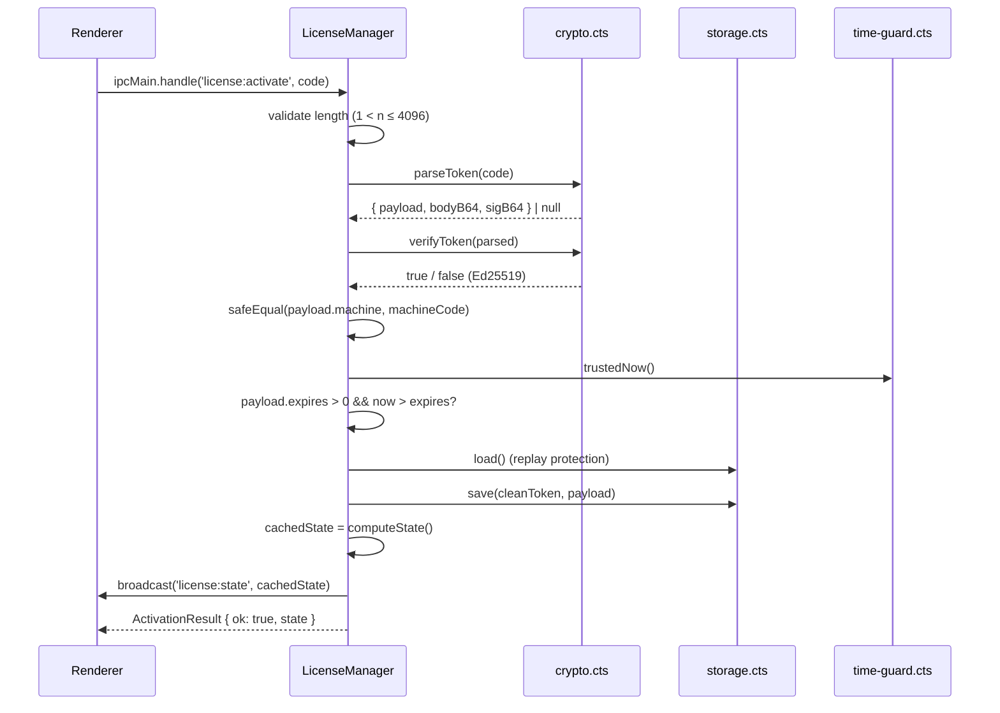
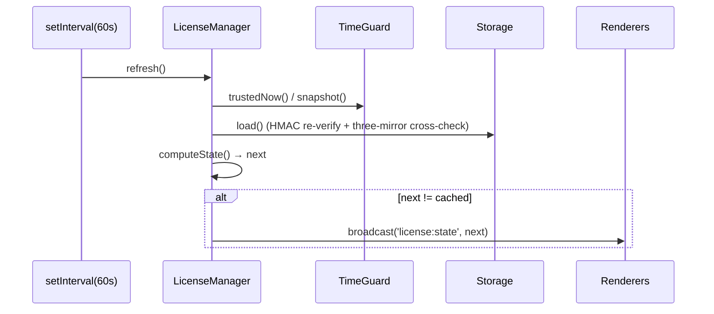

# `license/manager.cts` — main-process license state machine

> Source: `electron/license/manager.cts` · 327 lines

## Purpose

`LicenseManager` is the main-process single source of truth for licensing. It owns:

- **Machine fingerprint** (delegates to `machine-id.cts`)
- **Time guard** (delegates to `time-guard.cts`) — clock rollback / drift / mtime anchor checks
- **Encrypted storage** (delegates to `storage.cts`) — three-mirror + HMAC
- **Signature verification** (delegates to `crypto.cts`) — Ed25519 detached signature
- **IPC surface** — four invoke handlers + one push channel
- **Periodic refresh** — recomputes state every 60 s and broadcasts on change

The renderer **never** sees raw tokens or private state — only a sanitised `LicenseState` plus the boolean `canEdit`.

## Public API

| Symbol                     | Kind  | Summary                                             |
| -------------------------- | ----- | --------------------------------------------------- |
| `LicenseManager`           | class | The main class                                      |
| `LICENSE_IPC`              | const | Four IPC channel strings                            |
| `STATUS_BROADCAST_CHANNEL` | const | `'license:state'` push channel                      |
| Type re-exports            | type  | `LicenseState`, `ActivationResult`, `LicenseStatus` |

### `LICENSE_IPC` constants

```ts
export const LICENSE_IPC = {
  GET_STATE: 'license:get-state',
  GET_MACHINE_CODE: 'license:get-machine-code',
  ACTIVATE: 'license:activate',
  DEACTIVATE: 'license:deactivate',
} as const;
```

Must stay in sync with the same constants in `electron/preload.cts`.

### Class members

| Member             | Signature          | Summary                                                              |
| ------------------ | ------------------ | -------------------------------------------------------------------- |
| `constructor()`    | `()`               | Computes the machine code, builds storage / time guard               |
| `start()`          | `(): void`         | Starts the time guard, registers IPC handlers, starts the 60 s timer |
| `stop()`           | `(): void`         | Clears the timer, stops the time guard (persisting state)            |
| `getState()`       | `(): LicenseState` | Returns the cached state (no IO)                                     |
| `getMachineCode()` | `(): string`       | Returns the machine code                                             |

Private methods: `activate` / `deactivate` / `refresh` / `computeState` / `broadcast` / `failedActivation`.

## Detailed behaviour

### Constructor

```ts
constructor() {
  this.userDataDir = app.getPath('userData');
  this.machine = computeMachineCode(this.userDataDir);

  const anchorPaths = [
    app.getAppPath(),
    path.join(app.getAppPath(), 'package.json'),
    process.execPath,
  ].filter((p) => existsSync(p));

  this.timeGuard = new TimeGuard(this.userDataDir, this.machine.code, anchorPaths);
  this.storage = new LicenseStorage(this.userDataDir, this.machine.code);
  this.cachedState = this.computeState();
}
```

Notes:

- `userData` is Electron's recommended persisted directory (`%APPDATA%` / `~/Library/Application Support` / `~/.config`).
- `anchorPaths` are fed to `TimeGuard` — Electron binary / `package.json` mtimes act as monotonic anchors (system clock < anchor mtime → tampering).
- `computeState` is run at construction so the renderer's first `getState` returns the cached value.

### `start()`

```ts
start(): void {
  this.timeGuard.start();
  this.cachedState = this.computeState();

  // 60 s self-refresh — banner countdown ticks without renderer polling
  this.rebroadcastTimer = setInterval(() => this.refresh(), 60 * 1000);
  if (typeof this.rebroadcastTimer.unref === 'function') this.rebroadcastTimer.unref();

  ipcMain.handle(LICENSE_IPC.GET_STATE, () => this.refresh());
  ipcMain.handle(LICENSE_IPC.GET_MACHINE_CODE, () => this.machine.code);
  ipcMain.handle(LICENSE_IPC.ACTIVATE, (_e, code: unknown) => this.activate(code));
  ipcMain.handle(LICENSE_IPC.DEACTIVATE, () => this.deactivate());
}
```

`unref()` lets the timer not block process exit; environments without unref (Bun, very old Node) silently skip.

### `activate(code)` — flow

Eleven steps, fail-fast at any:

1. **Format** — `code` is a string, length in (0, 4096].
2. **Decode** — `parseToken(code)` returns `{ payload, bodyB64, sigB64 }` or null.
3. **Signature** — `verifyToken(parsed)` against the embedded Ed25519 public key.
4. **Machine match** — `safeEqual(payload.machine, this.machine.code)` (constant-time).
5. **Expiry** — `payload.expires > 0 && trustedNow() > payload.expires`.
6. **Replay protection** — same `lic` id already on disk _and_ the new token's `expires` is older → reject (downgrade).
7. **Persist** — `storage.save(cleanToken, payload)`; IO failure → `storage_error`.
8. **Recompute** — `cachedState = computeState()`.
9. **Broadcast** — `broadcast()`.
10. **Return** `{ ok: true, state }`.

Any failure returns:

```ts
return this.failedActivation('invalid_signature', 'Signature does not match.');
```

### `deactivate()`

```ts
private deactivate(): LicenseState {
  this.storage.clear();
  this.cachedState = this.computeState();
  this.broadcast();
  return this.cachedState;
}
```

Removes the three mirror files; the state falls back to `trial` or `expired_trial` based on the time-guard window.

### `computeState()` — the heart

Decided by priority (first match wins):

1. **`tampered`** — time guard tampered or persisted machine hint differs from current.
2. Stored license loaded:
   - `tampered` from storage's three-mirror cross-check.
   - Re-verify token (`parseToken + verifyToken`) defensively → `invalid` on failure.
   - Re-check machine match → `machine_mismatch`.
   - `expires > 0 && now > expires` → `expired_license` (`canEdit=false`).
   - Otherwise → `activated` (`canEdit=true`).
3. Trial path:
   - `now < trialStart` → `not_started` (clock skew forward).
   - `now >= trialEnd` → `expired_trial`.
   - Otherwise → `trial` (`canEdit=true`, `daysRemaining` countdown).

`trustedNow` is `max(Date.now(), lastSeen)` from the TimeGuard.

### `refresh()`

```ts
private refresh(): LicenseState {
  const next = this.computeState();
  const changed = JSON.stringify(next) !== JSON.stringify(this.cachedState);
  this.cachedState = next;
  if (changed) this.broadcast();
  return this.cachedState;
}
```

JSON-stringify equality is good enough — state is < 1 KB.

### `broadcast()`

```ts
private broadcast(): void {
  for (const win of BrowserWindow.getAllWindows()) {
    if (!win.isDestroyed()) {
      win.webContents.send(STATUS_BROADCAST_CHANNEL, this.cachedState);
    }
  }
}
```

Pushes to every live BrowserWindow (multi-window builds, About window, etc.).

### `summariseLicense(p)` — payload sanitisation

```ts
function summariseLicense(p: LicensePayload): NonNullable<LicenseState['license']> {
  return {
    id: p.lic,
    name: p.name ?? '',
    issued: p.issued,
    expires: p.expires,
  };
}
```

Exposes only four fields. `machine`, `features`, `nonce`, `v` never reach the renderer.

## Sequence diagrams

### Activation



### 60-second heartbeat



## Security model

| Threat                                      | Defence                                                                                                               |
| ------------------------------------------- | --------------------------------------------------------------------------------------------------------------------- |
| Forged activation code                      | Ed25519 public key (PEM embedded in `public-key.cts`)                                                                 |
| Code shared with another machine            | `payload.machine === computeMachineCode()` (HKDF + APP_PEPPER)                                                        |
| Copying license blob to another machine     | Storage is per-machine HKDF-keyed AES-GCM + HMAC                                                                      |
| Clock rollback to dodge expiry              | `TimeGuard` persists lastSeen + mtime anchor                                                                          |
| Replacing license.dat with an older version | Three-mirror cross-check + HMAC-sealed state file                                                                     |
| Downgrading expires                         | Replay protection — same `lic` id rejects shorter expires                                                             |
| Renderer bypass of `canEdit`                | Mutators consult `editable-guard.assertEditable()` (reads zustand directly); patching React state alone has no effect |

## Side effects

- Writes under `app.getPath('userData')`: `license.dat`, `.lic-state.json`, `.lic-shadow.dat`, `.lic-clock.dat`, `.lic-machine.dat`.
- Registers four `ipcMain.handle` callbacks.
- Starts a 60 s `setInterval`.
- Pushes broadcasts to every `BrowserWindow`.

## Test coverage

No repo-level unit tests (would live in `electron/license/__tests__/`). The CLI for issuing activation codes lives in `tools/license-gen/` and uses the same Ed25519 private key (kept out of git) for local testing.

## Consumers

- `electron/main.cts` — `whenReady` constructs + starts; `before-quit` calls `stop`
- `electron/preload.cts` — must keep `LICENSE_IPC` constants in sync

## Source map

| Lines   | Content                                                |
| ------- | ------------------------------------------------------ |
| 11–17   | imports                                                |
| 20–22   | `TRIAL_DAYS` / `TRIAL_MS` / `STATUS_BROADCAST_CHANNEL` |
| 24–29   | `LICENSE_IPC`                                          |
| 31–58   | constructor                                            |
| 60–74   | `start()`                                              |
| 76–82   | `stop()`                                               |
| 84–86   | `getState()`                                           |
| 88–90   | `getMachineCode()`                                     |
| 94–137  | `activate(code)`                                       |
| 139–144 | `deactivate()`                                         |
| 146–154 | `refresh()`                                            |
| 156–292 | `computeState()`                                       |
| 294–300 | `broadcast()`                                          |
| 302–312 | `failedActivation`                                     |
| 315–322 | `summariseLicense`                                     |

## See also

- [`crypto`](./license-crypto.md) — Ed25519 / AES-GCM / HMAC / HKDF
- [`storage`](./license-storage.md) — three-mirror storage
- [`machine-id`](./license-machine-id.md) — fingerprint generator
- [`time-guard`](./license-time-guard.md) — clock tampering detector
- [`preload`](./preload.md) — IPC bridge
- [`licenseStore`](../store/license-store.md) — renderer mirror
- `tools/license-gen/` — private-key + activation-code CLI
