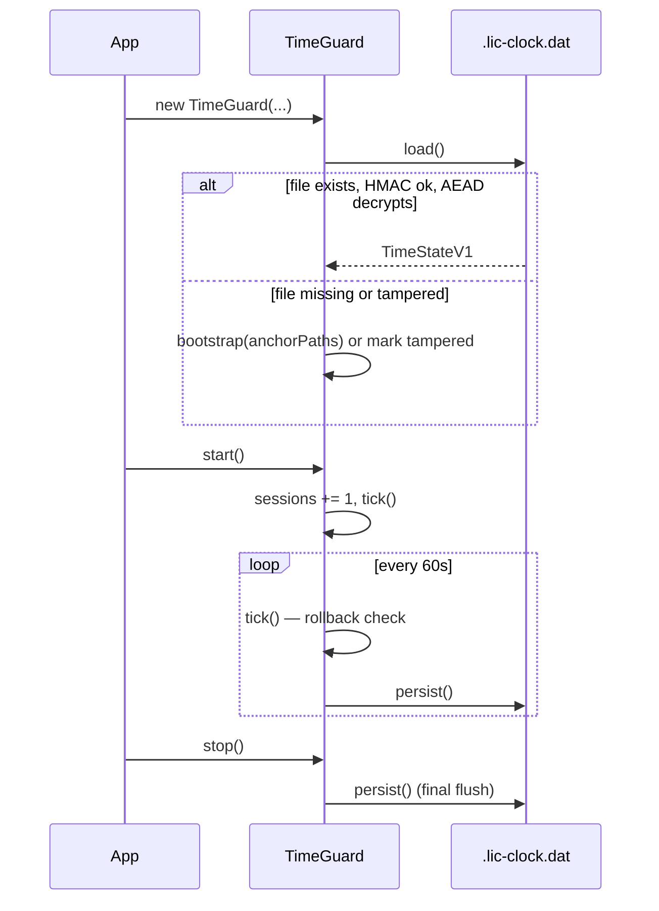

# License time-guard

> Source: `electron/license/time-guard.cts`

## Overview

`TimeGuard` is the license layer's defense against system-clock
manipulation. It records monotonic evidence — a strictly-increasing
high-water-mark timestamp, plus a session counter and binary-mtime
anchor — and flags the install as `tampered` if a future
`Date.now()` ever falls behind that evidence.

The guard's persisted state itself is encrypted with a per-machine
key and HMAC-sealed, so swapping in an old `.lic-clock.dat` from a
backup is detectable.

## Exports

```ts
export interface TimeGuardSnapshot {
  now: number;
  lastSeen: number;
  firstSeen: number;
  sessions: number;
  tampered: boolean;
  tamperedReason?: string;
  /** True if the wallclock is behind persisted time evidence. */
  suspiciousNow: boolean;
}

export class TimeGuard {
  constructor(userDataDir: string, machineCode: string, anchorPaths: string[]);
  start(): void;
  stop(): void;
  trustedNow(): number;
  snapshot(): TimeGuardSnapshot;
  markTampered(reason: string): void;
  reset(anchorPaths: string[]): void;
}
```

## Behavior

### Defenses (in order of cost-to-bypass)

1. **Monotonic high-water-mark**. Every minute (and on start /
   exit), `lastSeen = max(lastSeen, Date.now())` is persisted. A
   future call seeing `Date.now() < lastSeen - GRACE_MS` flags
   tampered.

2. **Anchor mtimes**. The Electron binary, `package.json`, and
   `app.getAppPath()` all carry mtimes set at install time. Seeing
   `now < anchorMtimeMs` is impossible without rolling the clock
   back behind the install date.

3. **Session counter**. Independent of wallclock, persists across
   restarts. Provides a "minimum elapsed" bound that license expiry
   can layer with a soft cap (e.g. "expired-license soft-fail after
   N additional sessions even if the wallclock looks fresh").

4. **Forward jumps are tolerated**. A forward wallclock jump cannot
   extend a trial or license window, and OS sleep/background
   suspension can look identical because app timers pause. Rollback
   remains fail-closed through the high-water-mark check.

```ts
const GRACE_MS = 5 * 60 * 1000; // 5min for NTP/DST quirks
const TICK_INTERVAL_MS = 60 * 1000;
```

### Persisted state shape

```ts
interface TimeStateV1 {
  v: 1;
  lastSeen: number;
  firstSeen: number;
  sessions: number;
  ticks: number;
  anchorMtimeMs: number;
  tampered: boolean;
  tamperedReason?: string;
}
```

Stored at `<userData>/.lic-clock.dat`, AES-256-GCM encrypted with
`getFileKey(machineCode, 'clock')` and prefixed by a hex HMAC line.

### Tick

```ts
private tick(): void {
  const now = Date.now();

  // (1) Rollback check
  if (now + GRACE_MS < this.state.lastSeen) {
    this.markTampered(`wallclock rollback: now=${now} < lastSeen=${this.state.lastSeen}`);
  }

  if (now > this.state.lastSeen) this.state.lastSeen = now;
  this.state.ticks += 1;
  this.persist();
}
```

::: warning Sticky tampered
Once `tampered === true` and a `tamperedReason` is recorded, the
flag never clears in this code path. Recovery requires a fresh
install (delete `userData`) — see `reset(anchorPaths)`, which is not
exposed in production.
:::

### trustedNow

```ts
trustedNow(): number {
  return Math.max(Date.now(), this.state.lastSeen);
}
```

The license manager calls `trustedNow()` instead of `Date.now()` for
all expiry decisions. Even if the user spins the wallclock backwards
mid-session, `lastSeen` clamps the floor — they can't extend a trial
by setting the clock to last week.

### detectDrift

```ts
private detectDrift(): string | null {
  if (now + GRACE_MS < this.state.lastSeen) return `now < lastSeen`;
  if (this.state.anchorMtimeMs > 0 && now + GRACE_MS < this.state.anchorMtimeMs)
    return `now < anchorMtime`;
  return null;
}
```

Surfaced via `snapshot().suspiciousNow`. Used by the UI to show a
"clock looks suspicious" hint without going all the way to tamper
mode.

### Bootstrap

```ts
private bootstrap(anchorPaths: string[]): TimeStateV1 {
  const now = Date.now();
  let anchorMtimeMs = 0;
  for (const p of anchorPaths) {
    if (existsSync(p)) anchorMtimeMs = Math.max(anchorMtimeMs, statSync(p).mtimeMs);
  }
  return { v: 1, lastSeen: now, firstSeen: now, sessions: 0, ticks: 0, anchorMtimeMs, tampered: false };
}
```

First run captures the latest anchor mtime — that's the install date.
Subsequent runs reuse the persisted state.

### Persistence flow



### Load failure modes

```ts
// HMAC mismatch
return { ..., tampered: true, tamperedReason: 'time-state HMAC mismatch' };

// AEAD decrypt failed (wrong machine key, corrupted ciphertext)
return { ..., tampered: true, tamperedReason: 'time-state AEAD decrypt failed' };
```

Both produce a tampered state immediately rather than rebuilding —
the persisted file's existence is itself evidence the user has run
before, and a corrupted file shouldn't reset the trial clock.

## Examples

### Boot and read trustedNow

```ts
const tg = new TimeGuard(userDataDir, machineCode, anchorPaths);
tg.start();
console.log('trusted now:', new Date(tg.trustedNow()).toISOString());
```

### Inspect tampering

```ts
const snap = tg.snapshot();
if (snap.tampered) {
  console.warn('reason:', snap.tamperedReason);
}
```

### Force tamper for tests

```ts
tg.markTampered('test-only manual mark');
```

### Admin recovery (not exposed in production)

```ts
tg.reset(anchorPaths); // clears tampered flag, recomputes anchor mtime
```

`reset(...)` is private to the API; nothing in main calls it. It
exists for future support tooling.

## Related

- [License crypto](/en/api/electron/license-crypto) — `aesEncrypt`, `getFileKey`, `getMacKey`
- [License manager](/en/api/electron/license-manager) — calls `trustedNow()` and `snapshot()`
- [License storage](/en/api/electron/license-storage) — same encryption pattern
- [Architecture: license system](/en/architecture/license-system)
