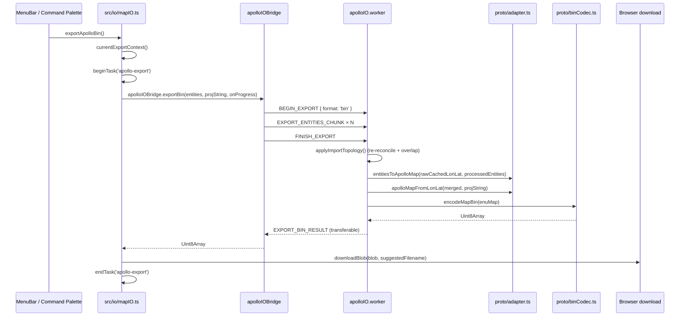

# Export / Base Map

> The codebase has **no** standalone `buildBaseMap()` function. The
> current base_map export surface is `exportApolloBin` /
> `exportApolloText` in `src/io/mapIO.ts`, which dispatches the heavy
> work into `apolloIO.worker.ts` via `apolloIOBridge`.

## Exported symbols

```ts
// src/io/mapIO.ts
export function exportApolloBin(): Promise<void>;
export function exportApolloText(): Promise<void>;
```

> Source: `src/io/mapIO.ts:91-141`.

The signatures are intentionally tiny — both functions read the
current entity table and import context from the stores:

```ts
function currentExportContext(): { info: ApolloMapImportInfo; entities: MapEntity[] } | null;
```

If `apolloMapStore.info` is null (no map imported), the helper sets a
human-readable error and returns without prompting for a save dialog.

## Sequence



## Filenames

`suggestedFilename(originalName, ext)` produces
`<base>-YYYYMMDDHHmmss.<ext>`, keeping the original base name minus
its `.bin` / `.txt` / `.pb.txt` extension. Round-tripping through
edits never overwrites the source.

## Progress

The bridge invokes `onProgress` as it streams entity chunks to the
worker (default chunk = 2000 entities):

```ts
{
  label: 'Exporting Apollo map',
  detail: 'Sending entities 4,000 / 12,345',
  progress: 0.05,
}
```

`useTaskProgressStore` debounces visibility by 1 s so quick exports
do not flash a transient spinner.

## Errors

| Cause                             | Surface                                                    |
| --------------------------------- | ---------------------------------------------------------- |
| `apolloMapStore.info` is null     | `setError('Nothing to export - import a map first.')`      |
| Worker re-reconcile throws        | `Export failed: ${msg}` + `console.error`                  |
| Worker has no cached lon/lat map  | `Error: No imported Apollo map is cached in the IO worker` |
| `Map.verify` rejects entity shape | Forwarded as `ERROR` over `apolloIOProtocol`               |
| Browser blocks anchor click       | Rare; Chromium retries per its download policy             |

## Why no `buildBaseMap()`

The reconcile + projection + encode pipeline is heavy enough to lock
the main thread on real Apollo maps, so the export logic intentionally
stays inside the worker. A synchronous helper would only be useful in
tests — and tests already import the worker code directly. Until that
calculus changes, prefer the worker bridge.

## Planned extensions

`buildSimMap` / `buildRoutingMap` do not yet exist. When they land,
extend the worker with a `runDerive` branch and widen
`apolloIOProtocol.BEGIN_EXPORT.format` to a tagged union. The `mapIO`
helpers will then expose `exportApolloSimMap` /
`exportApolloRoutingMap` without disturbing the base_map path.

## See also

- [Import / Parse Base Map](/en/api/import-parse-base-map) — the
  inverse direction.
- [io/apollo-io-bridge](/en/api/io/apollo-io-bridge) — promise gateway
  to the worker.
- [io/apollo-io-protocol](/en/api/io/apollo-io-protocol) — message
  shapes that travel over the worker boundary.
