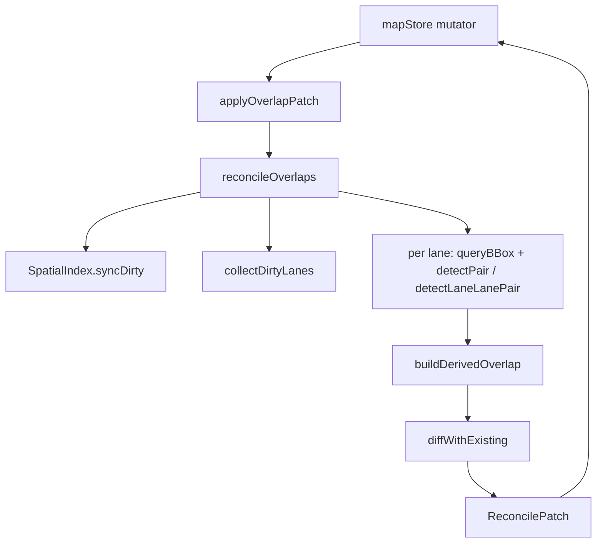

# Geo / Overlap Calculation

The overlap pipeline lives in `src/core/elements/overlap/` and is
responsible for:

1. **reconcile** — derive `OverlapEntity[]` from geometry and produce a
   set-diff patch the store applies atomically;
2. **spatial index** — RBush-based incremental R-tree, sub-millisecond
   queries at 50k entities;
3. **pair rules** — `pairTable.ts` centralises lane × secondary
   detection logic and `ObjectOverlapInfo` emission;
4. **polygon boolean** — `polygon-clipping` (Martinez) for precise
   `lane corridor × secondary polygon` regions feeding
   `RegionOverlapInfo`.

## Public API (`overlap/index.ts`)

```ts
export { reconcileOverlaps, invalidateLaneCaches } from './reconcile';
export {
  SpatialIndex,
  bboxForEntity,
  getSharedSpatialIndex,
  resetSharedSpatialIndex,
} from './spatialIndex';
export { makeOverlapId, isDerivedOverlapId } from './overlapId';
export type { ReconcileMode, ReconcilePatch, BBox, IndexNode } from './types';
```

External consumers — `mapStore`, the `apolloIO` worker, the
`recomputeOverlapsAsync` worker bridge — should depend on
`./index.ts` only. Files not exported here are `@internal`.

## Types (`types.ts`)

```ts
export interface BBox {
  minX: number;
  minY: number;
  maxX: number;
  maxY: number;
}

export interface IndexNode extends BBox {
  id: string;
  entityType: MapEntity['entityType'];
}

export type ReconcileMode =
  { mode: 'incremental'; dirtyIds: ReadonlySet<string> } | { mode: 'full' };

export interface ReconcilePatch {
  changes: Map<string, MapEntity>;
  removedOverlapIds: Set<string>;
  stats: {
    pairsTested: number;
    pairsMatched: number;
    overlapsCreated: number;
    overlapsRemoved: number;
    durationMs: number;
  };
}
```

## `reconcile.ts`

```ts
export function reconcileOverlaps(
  entities: ReadonlyMap<string, MapEntity>,
  mode: ReconcileMode,
  index?: SpatialIndex,
): ReconcilePatch;

export function invalidateLaneCaches(removedLaneIds: Iterable<string>): void;
```

Phases:

1. **R-tree sync** — `syncFromEntities` for `mode = 'full'`,
   `syncDirty` for incremental. Skipped when the caller injects an
   `index`.
2. **`collectDirtyLanes`** — resolve dirty ids to a lane set, expanding
   secondary entities to their R-tree-neighbour lanes.
3. **Pair scan** — for each dirty lane, run `detectLaneLanePair`
   (other lane neighbours) or `detectPair` with a `PairRule`. Pairs
   are deduped by sorted-participant id.
4. **`diffWithExisting`** — set-diff against the existing
   `OverlapEntity` set, merging `_userOverrides` (isMerge,
   regionOverlaps), and write back each participant's `overlapIds`.

`invalidateLaneCaches` clears the prefix-length cache used by
`computeLaneS` when a lane is deleted.

## `spatialIndex.ts`

```ts
export function bboxForEntity(entity: MapEntity): BBox | null;

export class SpatialIndex {
  build(entities): void;
  syncFromEntities(entities): void;
  syncDirty(entities, dirtyIds): void;
  insert(entity): void;
  remove(id): void;
  queryBBox(bbox): IndexNode[];
  queryNeighbors(id): IndexNode[];
  size(): number;
  getBBox(id): BBox | null;
  clear(): void;
}

export function getSharedSpatialIndex(): SpatialIndex;
export function resetSharedSpatialIndex(): void;
```

Notes:

- `bboxForEntity` falls back: lane centerline → polygon → stop_line
  (with `OVERLAP_STOPLINE_PROBE_DEG` padding) → polylines.
- Internal `bboxSig` string is the geometric-change signature; immer
  freeze swaps that do not change geometry skip R-tree mutation
  entirely.
- The shared singleton supports `reset` so workers/tests can cycle
  between fresh trees.

## `pairTable.ts`

```ts
export interface PairGeoHit {
  intersects: boolean;
  laneInterval?: { startS: number; endS: number };
  isMerge?: boolean;
  regionPolygon?: GeoPoint[];
}

export interface PairRule {
  secondaryType: MapEntity['entityType'];
  geometry: 'polygon' | 'stopLines' | 'polylines' | 'lane';
  computeRegion?: boolean;
  emitObjects(
    lane: LaneEntity,
    other: MapEntity,
    hit: PairGeoHit,
    opts?: { regionId?: string },
  ): ObjectOverlapInfo[];
}

export const PAIR_RULES: readonly PairRule[];
export function findPairRule(secondaryType: string): PairRule | null;
export function detectPair(lane, other, rule): PairGeoHit;
export function detectLaneLanePair(laneA, laneB): PairGeoHit;
export function emitLaneLaneObjects(laneA, laneB, hitForA, hitForB): ObjectOverlapInfo[];
```

`PAIR_RULES` covers: junction, crosswalk (with `computeRegion`),
clearArea, parkingSpace, pncJunction, area, signal, stopSign,
yieldSign, barrierGate, speedBump.

## `intersect.ts`

```ts
export function bboxOfPoints(points, pad?): BBox | null;
export function bboxUnion(boxes): BBox | null;
export function bboxOverlap(a, b): boolean;
export function segmentsIntersect(a1, a2, b1, b2): GeoPoint | null;
export function pointInPolygon(point, polygon): boolean;
export function polylinesIntersect(a, b): boolean;
export function polylineIntersectsPolygon(line, polygon): boolean;
export interface SegmentParam {
  segmentIndex: number;
  t: number;
}
export function polylinePolygonCrossings(line, polygon): SegmentParam[];
export function endpointsCoincide(a, b, cosLat, toleranceM): boolean;
export function polylinePolylineCrossings(a, b): SegmentParam[];
```

## `computeLaneS.ts`

```ts
export function laneArcLength(lane: LaneEntity): number;
export function projectSegmentParam(lane, segmentIndex, t): number;
export function invalidateLaneArcLength(laneId: string): void;
export function clearLaneArcLengthCache(): void;
```

## `laneCorridor.ts`

```ts
export function laneCorridorPolygon(lane: LaneEntity): GeoPoint[];
```

Returns a closed ring (first point repeated). Prefers Apollo
`leftBoundary` / `rightBoundary` curves; falls back to centerline +
sample widths via `offsetPolylineDeg`.

## `polyClip.ts`

```ts
export function intersectPolygons(a, b): GeoPoint[][];
export function largestRing(rings): GeoPoint[] | null;
```

Uses `polygon-clipping` for the boolean. Drops holes — region
overlaps in the Apollo proto are simple rings. `largestRing` picks
the largest piece by approximate metre² area (cosLat-corrected).

## `overlapId.ts` / `regionId.ts`

```ts
export function makeOverlapId(participantIds): string;
export function isDerivedOverlapId(id): boolean;
export function makeRegionId(participantIds, slot?): string;
export function isDerivedRegionId(id): boolean;
```

Formats: `overlap_<sortedIds.join('_')>` and
`region_<sortedIds.join('_')>__<slot>` (slot=0 has no suffix).

## `geometryAdapters.ts`

```ts
export function curveToPolyline(curve): GeoPoint[];
export function getCenterline(lane): GeoPoint[];
export function getPolygon(entity): GeoPoint[] | null;
export function getStopLines(entity): GeoPoint[][];
export function getPolylines(entity): GeoPoint[][];
export function isOverlapParticipant(entity): boolean;
```

## `overridePaths.ts`

```ts
export function laneIsMergeOverridePath(objectIndex): string;
export const REGION_OVERLAPS_OVERRIDE_PATH: 'regionOverlaps';
export function parseLaneIsMergeOverride(path): number | null;
```

## Pipeline (mermaid)


