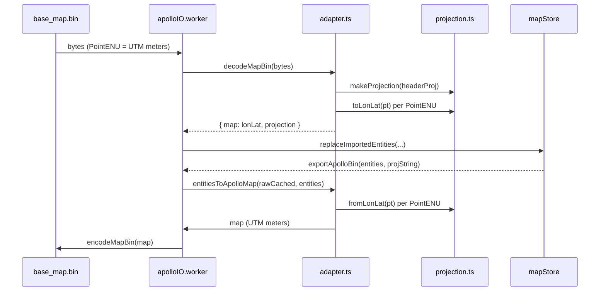

# Geo / Projection

Apollo Map Studio's projection stack lives in two files:

- **`src/lib/geo.ts`** — zero-dependency spherical measurement
  (haversine + metre ↔ degree). Sub-0.5% error at lane scale; used
  by `lane.length`, `signalTemplate`, and similar small-scale paths
  to avoid pulling proj4.
- **`src/io/proto/projection.ts`** — proj4 wrapper handling Apollo
  `header.projection.proj` strings and UTM ENU ↔ WGS84 conversions
  for the import/export path.

## `src/lib/geo.ts`

### `haversineMeters(a, b): number`

```ts
function haversineMeters(a: GeoPoint, b: GeoPoint): number;
```

Great-circle distance in metres for two `GeoPoint = { x: lng, y:
lat, z?: number }` values in degrees. Earth radius = WGS84 mean
6,371,008.8 m.

```ts
import { haversineMeters } from '@/lib/geo';

const m = haversineMeters({ x: 116.404, y: 39.915 }, { x: 116.405, y: 39.915 }); // ~85.4
```

### `polylineLengthMeters(points): number`

```ts
function polylineLengthMeters(points: readonly GeoPoint[]): number;
```

Cumulative haversine length, 0 when `points.length < 2`. Used to
derive `lane.length`.

### `metersToDegLat(): number`

Latitude degrees per metre — independent of latitude. ~8.99e-6 deg/m.

### `metersToDegLng(latDeg): number`

Longitude degrees per metre at the given latitude. Falls back to
`metersToDegLat()` when `cosLat < 1e-9` to avoid divide-by-zero at
poles.

> Source: `src/lib/geo.ts:1-57`.

## `src/io/proto/projection.ts`

### `sanitizeProjString(s): string`

```ts
function sanitizeProjString(s: string): string;
```

Strip Apollo template placeholders. `+lat_0={37.413082}` becomes
`+lat_0=37.413082`. Apollo reference maps (sunnyvale, garage) emit
`{}` around numeric arguments; proj4 rejects them, so every PROJ
string is cleaned before use.

### `PointXY`

```ts
interface PointXY {
  x: number;
  y: number;
  z?: number;
}
```

Shape-compatible with `GeoPoint` but lives in the proto path so the
projection module does not depend on `@/types`.

### `Projection`

```ts
interface Projection {
  readonly projString: string;
  toLonLat(p: PointXY): PointXY;
  fromLonLat(p: PointXY): PointXY;
}
```

Preserves `z` absence: calling `toLonLat({ x, y })` returns `{ x:
lon, y: lat }`, not `{ x, y, z: 0 }`. Round-trip fidelity matters for
proto2 — synthesized zeros leak as wire bytes on re-encode.

### `makeProjection(projString): Projection`

```ts
function makeProjection(projString: string): Projection;
```

Build a bidirectional projector from a PROJ.4 string (typically the
sanitized `header.projection.proj`).

### `utmProjString(zone, hemisphere?): string`

```ts
function utmProjString(zone: number, hemisphere?: 'N' | 'S'): string;
```

Construct a UTM PROJ string. Throws when `zone < 1 || zone > 60`.

### `utmZoneFromLon(lonDeg): number`

```ts
function utmZoneFromLon(lonDeg: number): number;
```

UTM zone covering the given longitude. 6° wide; starts at -180°.

### `UTM_PRESETS`

```ts
export const UTM_PRESETS = {
  sunnyvale: utmProjString(10, 'N'),
  beijing: utmProjString(50, 'N'),
  shanghai: utmProjString(51, 'N'),
  shenzhen: utmProjString(50, 'N'),
} as const;
```

The IO bridge picks `UTM_PRESETS.beijing` as `FALLBACK_PROJ` when the
projection dialog is cancelled.

> Source: `src/io/proto/projection.ts:1-81`.

## Flow



## Conventions

- **Internal coordinates are always WGS84 degrees**. Overlap,
  topology, and snap modules each apply cosLat corrections locally
  to a metre space; degrees never leak back into the proto / ENU
  path.
- **No global projection singleton.** Every import constructs a
  fresh `Projection`. The IO worker keeps the most recent one only
  until it receives a `CLEAR` message.
- **proj4 caches forward/inverse pipelines internally** per (src,
  dst) pair, so re-calling `makeProjection` with the same PROJ
  string is cheap.

## See also

- [Proto / Loader](/en/api/proto-loader) — schema source.
- [Proto / Adapter](/en/api/io/proto-adapter) — combines projection
  with `transformPointsInMessage` for the recursive PointENU walk.
- [Geo / Lane Geometry](/en/api/geo-lane-geometry) — uses `lib/geo`
  for `lane.length` and topology endpoint matching.
