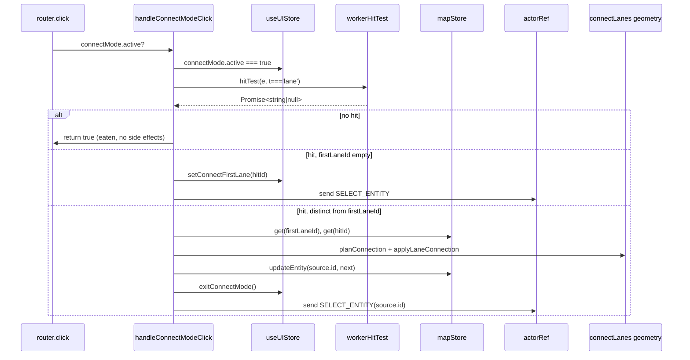

# Map Event Router internals

> Source: `src/hooks/mapEventRouter/{connectMode,cursorScheduler,hitTest,inputDedup,keyboard,selectionDrag,snap}.ts`

[`useMapEventRouter`](./use-map-event-router.md) splits FSM-state-aware
event handling into 7 atomic modules. Each module exposes pure or
factory functions and never participates in the React lifecycle. This
page documents their API surfaces, side effects, and invariants.

## Module index

| Module               | Exports                                                    | Purpose                                                      |
| -------------------- | ---------------------------------------------------------- | ------------------------------------------------------------ |
| `hitTest.ts`         | `toLngLat` / `hitBbox` / `pixelToRadius` / `workerHitTest` | Bridge from MapLibre pixel space to worker `HIT_TEST`        |
| `inputDedup.ts`      | `sampleInput` / `isDuplicateInput`                         | Drops dblclick's synthetic click                             |
| `cursorScheduler.ts` | `createCursorScheduler`                                    | RAF-coalesced 60fps cursor write to uiStore                  |
| `connectMode.ts`     | `handleConnectModeClick`                                   | Click branch for connect-lanes mode                          |
| `selectionDrag.ts`   | `handleSelectedMouseDown`                                  | Vertex / handle / center / smooth-toggle paths in `selected` |
| `keyboard.ts`        | `handleMapKeyDown`                                         | Esc / Enter / Del / Backspace handling                       |
| `snap.ts`            | `applySnap`                                                | Wraps `findSnapTarget` and writes `currentSnapTarget`        |

---

## `hitTest.ts`

```ts
export type HitFilter = (entityType: string) => boolean;

export function toLngLat(e: maplibregl.MapMouseEvent): LngLat;
export function hitBbox(point: maplibregl.PointLike): [PointLike, PointLike];
export function pixelToRadius(map: maplibregl.Map, px: number): number;
export function workerHitTest(
  map: maplibregl.Map,
  bridge: SpatialWorkerBridge | null,
  e: maplibregl.MapMouseEvent,
  filter?: HitFilter,
): Promise<string | null>;
```

| Function        | Role                                                                                                                          |
| --------------- | ----------------------------------------------------------------------------------------------------------------------------- |
| `toLngLat`      | Wraps `[lng, lat]` for FSM dispatch                                                                                           |
| `hitBbox`       | Expands a point to a `HIT_BBOX_PADDING_PX` square for `queryRenderedFeatures`                                                 |
| `pixelToRadius` | Pixel radius → degrees approximation: `(px*360) / (512 * 2^zoom)`                                                             |
| `workerHitTest` | Sends `HIT_TEST` to the spatial worker and resolves the first matching entity id; optional `filter` keeps only one entityType |

### Invariants

- `bridge === null` returns `Promise.resolve(null)` immediately; callers
  don't need null guards (line 32).
- `result.hits` is sorted ascending by distance. Without a filter, take
  `hits[0]`; with a filter, take the first hit that matches.

---

## `inputDedup.ts`

```ts
export type InputSample = { x: number; y: number; ts: number };

export function sampleInput(e: maplibregl.MapMouseEvent): InputSample;
export function isDuplicateInput(prev: InputSample | null, next: InputSample): boolean;
```

`isDuplicateInput` evaluates a px+ms window:

```ts
// inputDedup.ts:3-4, 16-21
const DBLCLICK_PX_TOLERANCE = 4;
const DBLCLICK_MS_WINDOW = 350;
//
return Math.hypot(dx, dy) < DBLCLICK_PX_TOLERANCE && next.ts - prev.ts < DBLCLICK_MS_WINDOW;
```

### Invariants

- `prev === null` must return `false` (first input is never a dup).
- Caller manages `lastDrawInput`; this module is stateless.
- Even when a duplicate hit is detected, the caller must update
  `lastDrawInput = sample`. Otherwise the next dblclick's synthetic
  click slips through.

---

## `cursorScheduler.ts`

```ts
export function createCursorScheduler(): {
  schedule(point: LngLat): void;
  dispose(): void;
};
```

Each caller owns a scheduler instance. `schedule` flushes the latest
point to `useUIStore.setCursorLngLat` inside a RAF; multiple `schedule`
calls in one frame yield one flush.

### Side effects

| Effect                                         | Trigger          | Cleanup                                |
| ---------------------------------------------- | ---------------- | -------------------------------------- |
| `requestAnimationFrame(flushCursor)`           | First `schedule` | `dispose` calls `cancelAnimationFrame` |
| `useUIStore.getState().setCursorLngLat(point)` | RAF flush        | —                                      |

### Invariants

- Multiple `schedule` calls in one frame produce exactly one store
  write.
- `schedule` after `dispose` will start a new RAF; the convention is
  that callers stop using the scheduler after disposal.

---

## `connectMode.ts`

```ts
export function handleConnectModeClick(
  actorRef: ActorRefFrom<typeof editorMachine>,
  hitTest: (e, filter?) => Promise<string | null>,
  e: maplibregl.MapMouseEvent,
): boolean;
```

Click branch for connect-lanes mode. Returns whether to swallow the
click.

### Flow



### Invariants

- `connectMode.active === false` returns `false` immediately — never
  fires hitTest.
- After the promise resolves, re-read `useUIStore.getState()` because
  Esc could have fired in between.
- `firstLaneId === hitId` is a no-op (no self-connect).
- Whether the connection plans / applies successfully or not, always
  call `exitConnectMode()` to avoid stale state.

---

## `selectionDrag.ts`

```ts
export interface SelectedMouseDownResult {
  handled: boolean;
  centerGrabOffset?: [number, number] | null;
}

export function handleSelectedMouseDown(
  map: maplibregl.Map,
  actorRef: ActorRefFrom<typeof editorMachine>,
  e: maplibregl.MapMouseEvent,
): SelectedMouseDownResult;
```

mousedown router for `selected`:

| Hit                          | altKey | Action                                                               |
| ---------------------------- | ------ | -------------------------------------------------------------------- |
| hot-points (vertex)          | true   | `toggleEntitySmooth` + `TOGGLE_SMOOTH`                               |
| hot-points (vertex / handle) | false  | `dragPan.disable()` + `START_DRAG{ index, pointType }`               |
| hot-fill                     | —      | Compute `centerGrabOffset` + `START_DRAG{ index:-2, type:'center' }` |
| other                        | —      | `handled=false`; bubble up to ordinary click path                    |

### Smooth toggle branch

```ts
// selectionDrag.ts:17-30
function toggleEntitySmooth(entityId, idx) {
  const entity = useMapStore.getState().entities.get(entityId);
  if (!entity) return;
  if (entity.entityType === 'bezier') {
    useMapStore.getState().updateEntity(entityId, toggleSmooth(entity, idx));
    return;
  }
  const src = getSource(entity);
  if (src?.drawTool === 'drawBezier' && src.anchors) {
    useMapStore.getState().updateEntity(entityId, toggleSmoothApollo(entity as ApolloEntity, idx));
  }
}
```

Supports both native `bezier` entities and Apollo entities that were
originally drawn with the bezier tool.

### Invariants

- Disabled while `connectMode.active === true` (`selectionDrag.ts:39`).
- Center drag uses sentinel `index = -2`, `pointType = 'center'`; the
  FSM's `applyDrag` branch keys off these.
- `dragPan.disable()` must precede the `START_DRAG` send — otherwise
  MapLibre handles a stray mousemove first in the same frame.

---

## `keyboard.ts`

```ts
export function handleMapKeyDown(
  actorRef: ActorRefFrom<typeof editorMachine>,
  e: KeyboardEvent,
  clearCenterGrabOffset: () => void,
): void;
```

| Key                    | Action                                                                                           |
| ---------------------- | ------------------------------------------------------------------------------------------------ |
| `Escape`               | `clearCenterGrabOffset()`; if connect-mode active → `exitConnectMode`; `CANCEL`                  |
| `Enter`                | `CONFIRM`                                                                                        |
| `Delete` / `Backspace` | `selected`: vertex mode → `deleteVertex` + re-select; otherwise `DELETE_ENTITY` + `removeEntity` |

### Invariants

- `CANCEL` is harmless even if connect-mode already exited (XState 5
  no-ops on unmatched events).
- `Delete` does nothing outside `selected` (line 24); avoids deleting
  in the middle of a draw.
- `clearCenterGrabOffset` is a closure variable owned by the router;
  this module clears it through the callback.

---

## `snap.ts`

```ts
export function applySnap(
  map: maplibregl.Map,
  actorRef: ActorRefFrom<typeof editorMachine>,
  lngLat: LngLat,
  excludeId: string | null = null,
): LngLat;
```

Projects the cursor lng/lat to the nearest snap target (when matched)
and writes the `SnapTarget` to `useUIStore.currentSnapTarget`.

### Flow

```ts
// snap.ts:15-39
1. read ui.snapEnabled + current FSM state
2. !snapEnabled || !isSnapApplicable(state) → clear currentSnapTarget, return original lngLat
3. radiusM = pixelsToMeters(SNAP_RADIUS_PX, lat, zoom)
4. findSnapTarget(point, entities, radiusM, excludeId)
5. ui.setSnapTarget(target)
6. target ? [target.point.x, target.point.y] : lngLat
```

### Invariants

- `excludeId` excludes "the entity currently being dragged" so the
  vertex doesn't snap to itself.
- `isSnapApplicable` returns true only for `editingPoint` and
  `isDrawingState`; idle / selected stays unsnapped even if the user
  enabled snap (lines 11-13).
- `ui.setSnapTarget(null)` must run even when target is null, to clear
  the previous frame's indicator.

---

## Combined collaboration

```mermaid
sequenceDiagram
    participant User
    participant Router as useMapEventRouter
    participant Snap as snap.applySnap
    participant Hit as hitTest.workerHitTest
    participant Conn as connectMode
    participant Sel as selectionDrag
    participant Cur as cursorScheduler
    participant Dedup as inputDedup
    participant Kbd as keyboard

    User->>Router: mousemove
    Router->>Cur: schedule(lngLat)
    Cur-->>useUIStore: setCursorLngLat (RAF)
    Router->>Snap: applySnap(lngLat)
    Snap-->>useUIStore: setSnapTarget(target)
    Snap-->>Router: snapped point
    Router-->>actor: MOUSE_MOVE / DRAG_MOVE

    User->>Router: click
    Router->>Conn: handleConnectModeClick
    alt eaten
        Conn-->>actor: SELECT_ENTITY
    else not connect mode
        Router->>Hit: workerHitTest
        Hit-->>Router: id|null
        Router-->>actor: SELECT_ENTITY/DESELECT/MOUSE_DOWN
    end

    User->>Router: mousedown (selected)
    Router->>Sel: handleSelectedMouseDown
    Sel-->>actor: START_DRAG / TOGGLE_SMOOTH

    User->>Router: keydown
    Router->>Kbd: handleMapKeyDown
    Kbd-->>actor: CANCEL/CONFIRM/DELETE_ENTITY

    Router->>Dedup: sampleInput / isDuplicateInput (per branch)
```

## Tests

- `src/hooks/__tests__/useMapEventRouter.test.ts` — end-to-end
  integration
- Unit tests for each module's pure functions (`isDuplicateInput`,
  `pixelToRadius`, etc.)

## See also

- [`useMapEventRouter`](./use-map-event-router.md) (high-level dispatcher)
- [Snap geometry](../core/geometry-snap.md)
- [Connect lanes geometry](../core/geometry-connect-lanes.md)
- [SpatialWorkerBridge](../core/spatial-bridge.md)

## Source map

| File                                | Key lines                                                  |
| ----------------------------------- | ---------------------------------------------------------- |
| `mapEventRouter/hitTest.ts`         | full 1-43                                                  |
| `mapEventRouter/inputDedup.ts`      | full 1-22                                                  |
| `mapEventRouter/cursorScheduler.ts` | full 1-32                                                  |
| `mapEventRouter/connectMode.ts`     | full 1-58; branches 14-56                                  |
| `mapEventRouter/selectionDrag.ts`   | full 1-87; smooth 17-30; vertex/handle 47-60; center 65-85 |
| `mapEventRouter/keyboard.ts`        | full 1-46; Escape 12-18; Delete 21-44                      |
| `mapEventRouter/snap.ts`            | full 1-40                                                  |
