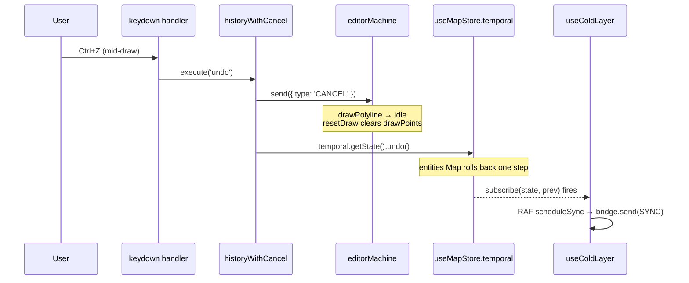

# useActionDispatcher

> Source: [`src/hooks/useActionDispatcher.ts`](https://github.com/) · Tests: `src/hooks/__tests__/undoCancel.test.ts`

`useActionDispatcher` is the central hub of Apollo Map Studio's action
layer. It binds the statically-declared
[`ActionDef`](../core/action-registry.md) set in
`@/core/actions/registry` to real runtime handlers (FSM events, Zustand
store calls, modal open callbacks), and installs the global keyboard
listener. Every user-executable action — menus, command palette,
toolstrip buttons, keyboard shortcuts — funnels through one
`execute(actionId)` entry point.

> **R1 invariant**: undo / redo MUST send `CANCEL` to the FSM **before**
> calling `temporal.undo()` / `temporal.redo()` (see
> `src/hooks/useActionDispatcher.ts:104-108`). Skipping this step leaves
> `drawPoints` / `dragPointIndex` referencing entities that have just
> been time-traveled away, corrupting the next `CONFIRM` / `DRAG_END`
> write.

## Design goals

- **Single execution entry point**: menubar, command palette, toolstrip
  buttons, and keyboard shortcuts all call `execute(actionId: ActionId)`,
  so semantics stay consistent.
- **Type safety**: `ActionId` is an `as const` literal union;
  `execute('tool:typo')` is a compile-time error and prevents drift.
- **One-time runtime registration**: `useMemo` builds
  `Map<ActionId, () => void>` and depends only on
  `[actorRef, onOpenCommandPalette, onOpenSettings, onResetLayout]`, so
  it rebuilds only when the UI shell remounts.
- **Gating**: every mutating action (`category === 'edit' | 'tool' |
'selection'`, plus the explicit `connectLanes`) is intercepted by
  `assertEditable` when the license is read-only.

## Signature

```ts
function useActionDispatcher(options: ActionDispatcherOptions): ActionDispatcher;

interface ActionDispatcherOptions {
  actorRef: ActorRefFrom<typeof editorMachine>;
  onOpenCommandPalette: () => void;
  onOpenSettings: () => void;
  onResetLayout: () => void;
}

interface ActionDispatcher {
  /** Execute an action by ActionId. Unknown ids log a console.warn. */
  execute: (actionId: ActionId) => void;
  /** Meaningful only for toggle actions; otherwise always false. */
  getToggleState: (actionId: ActionId) => boolean;
  /** All ACTION_DEFS (for menu / command palette rendering). */
  actions: ActionDef[];
}
```

## Parameters

| Name                   | Type                                 | Role                                                                                                                         |
| ---------------------- | ------------------------------------ | ---------------------------------------------------------------------------------------------------------------------------- |
| `actorRef`             | `ActorRefFrom<typeof editorMachine>` | XState 5 actor reference; every FSM event (`CANCEL` / `RESET` / `SELECT_TOOL` / `DELETE_ENTITY` …) is dispatched through it. |
| `onOpenCommandPalette` | `() => void`                         | UI shell callback that opens the command palette; backs the `commandPalette` action.                                         |
| `onOpenSettings`       | `() => void`                         | Opens the settings dialog; backs the `settings` action.                                                                      |
| `onResetLayout`        | `() => void`                         | Resets the dockview layout; backs the `resetLayout` action.                                                                  |

## Returns

| Field            | Type                        | Notes                                                                                                            |
| ---------------- | --------------------------- | ---------------------------------------------------------------------------------------------------------------- |
| `execute`        | `(id: ActionId) => void`    | Main entry point; unknown ids hit `console.warn` and return without throwing (`useActionDispatcher.ts:165-167`). |
| `getToggleState` | `(id: ActionId) => boolean` | Returns true for `toggleGrid` / `toggleSnap` / `connectLanes` / `defaultMode`; false otherwise.                  |
| `actions`        | `ActionDef[]`               | The full registry, passed through for menu / palette rendering.                                                  |

## Side effects

| Effect                                                                                        | Trigger                                                            | Cleanup                                                                        |
| --------------------------------------------------------------------------------------------- | ------------------------------------------------------------------ | ------------------------------------------------------------------------------ |
| `window.addEventListener('keydown', handler)`                                                 | When the `execute` closure changes (i.e. when `handlers` rebuilds) | Symmetric `removeEventListener` (`useActionDispatcher.ts:218-219`)             |
| `actorRef.send({ type: 'CANCEL' \| 'RESET' \| 'SELECT_TOOL' \| 'DELETE_ENTITY' \| ... })`     | `execute` call, dispatched by ActionId                             | —                                                                              |
| `useMapStore.temporal.getState().undo() / redo()`                                             | `historyWithCancel('undo' \| 'redo')`                              | —                                                                              |
| `useUIStore.getState().toggleGrid() / toggleSnap() / toggleConnectMode() / exitConnectMode()` | view / connect actions                                             | —                                                                              |
| `pickAndImportApollo()` / `exportApolloBin()` / `exportApolloText()`                          | file actions                                                       | Async; the returned promise is `void`-ed; errors are logged via `console.info` |

The keyboard handler is rebound whenever `execute` rebuilds (depends on
`[execute]`, line 220). This is mandatory — the inner closure captures
`execute`; without rebinding, it would hold a stale reference.

## Lifecycle

```
mount: useMemo builds the handlers map
  ├── file:    importApollo / exportApolloBin / exportApolloText / settings
  ├── edit:    undo (CANCEL → undo) / redo (CANCEL → redo) / delete
  ├── view:    toggleGrid / toggleSnap / resetLayout / commandPalette
  ├── default: defaultMode (CANCEL + RESET, exit connectMode)
  ├── connect: connectLanes (CANCEL, toggleConnectMode)
  └── tools:   every ACTION_DEF carrying drawTool → SELECT_TOOL

useEffect: window.addEventListener('keydown', handler)
  ├── skips non-global shortcuts when focus is in input / textarea / select
  ├── for each ACTION_DEFS w/ keybinding: matchesKeybinding → execute
  └── first match calls e.preventDefault() and returns

unmount: removeEventListener('keydown', handler)
```

## Invariants

### R1: CANCEL must precede time travel

```ts
// useActionDispatcher.ts:76-108
// R1 fix: flush any in-flight FSM draft/drag state *before* time-traveling
// the entity store. Without this, undo leaves FSM holding stale drawPoints
// or dragPointIndex pointing at an entity that just rolled back — the next
// CONFIRM/DRAG_END writes corrupted data. CANCEL is safe in every state:
// draw states → idle+resetDraw, selected → idle+deselect, editingPoint →
// selected, idle has no handler (XState 5 no-ops).
const historyWithCancel = (op: 'undo' | 'redo') => {
  actorRef.send({ type: 'CANCEL' });
  if (op === 'undo') useMapStore.temporal.getState().undo();
  else useMapStore.temporal.getState().redo();
};
map.set('undo', () => historyWithCancel('undo'));
map.set('redo', () => historyWithCancel('redo'));
```

Regression test: `src/hooks/__tests__/undoCancel.test.ts`.

### Default mode (pan/select) double-fires CANCEL + RESET

```ts
// useActionDispatcher.ts:122-132
map.set('defaultMode', () => {
  actorRef.send({ type: 'CANCEL' });
  // CANCEL is a no-op in `idle`, leaving stale activeElement; RESET
  // clears activeElement / drawPoints / bezierAnchors and is harmless
  // anywhere else.
  actorRef.send({ type: 'RESET' });
  if (useUIStore.getState().connectMode.active) {
    useUIStore.getState().exitConnectMode();
  }
});
```

### License gating

```ts
// useActionDispatcher.ts:33-38
function actionRequiresEdit(id: ActionId): boolean {
  if (id === 'connectLanes') return true;
  const def = ACTION_MAP.get(id);
  if (!def) return false;
  return def.category === 'edit' || def.category === 'tool' || def.category === 'selection';
}
```

Any action categorized `edit` / `tool` / `selection`, plus the explicit
`connectLanes`, is gated by `assertEditable(actionId)`. When the license
disallows edits, `execute` returns silently and the status bar surfaces
the reason.

## Undo CANCEL sequence



Skipping step 3 (`CANCEL`) lets step 4 roll back `mapStore.entities`
while the FSM still holds `drawPolyline` + `drawPoints`. The next
`CONFIRM` then calls `addEntity` against a stale snapshot, producing id
collisions or geometry corruption.

## Tool registration: registry-driven SELECT_TOOL

```ts
// useActionDispatcher.ts:144-150
for (const action of ACTION_DEFS) {
  if (action.drawTool) {
    const tool = action.drawTool;
    map.set(action.id, () => actorRef.send({ type: 'SELECT_TOOL', tool }));
  }
}
```

Adding a new tool only requires touching `src/core/actions/registry.ts`:
declaring `drawTool: 'drawArc'` (or any other element type) is enough.
The dispatcher discovers it on the next `useMemo` rebuild.

## Call sites

The single mount point is `WorkspaceLayoutInner` (`src/components/layout/WorkspaceLayout.tsx:89`):

```tsx
const { execute, getToggleState } = useActionDispatcher({
  actorRef,
  onOpenCommandPalette: () => setCommandPaletteOpen(true),
  onOpenSettings: () => setSettingsOpen(true),
  onResetLayout: () => dockviewRef.current?.api.fromJSON(DEFAULT_LAYOUT),
});
```

`execute` / `getToggleState` flow down via props to:

- `MenuBar` — renders menu items; click → `execute(actionId)`; toggle state → `getToggleState(actionId)`
- `ToolStrip` — toolstrip buttons → `execute(toolActionId)`
- `CommandPalette` — command search hits → `execute(actionId)`
- `StatusBar` — displays current toggle state (grid / snap)

## Failure modes

| Symptom                                                         | Root cause                                  | Fix                                                |
| --------------------------------------------------------------- | ------------------------------------------- | -------------------------------------------------- |
| `CONFIRM` after undo writes corrupt data                        | Missing R1 CANCEL closure                   | Always go through `historyWithCancel`              |
| `defaultMode` cannot clear toolstrip highlight                  | `CANCEL` is a no-op in `idle`               | Send `RESET` as well                               |
| `Ctrl+Z` swallows the browser's native undo inside an `<input>` | keybinding lacks `global: false`            | Omit `global` in `registry.ts` (defaults to false) |
| Toggle stays dark                                               | `getToggleState` falls through to `default` | Add the ActionId case to the switch                |

## Tests

- `src/hooks/__tests__/undoCancel.test.ts` — R1 closure regression test
- `src/core/actions/__tests__/registry.test.ts` — ActionId consistency between registry and dispatcher

## See also

- [Action Registry](../core/action-registry.md)
- [editorMachine FSM](../core/editor-machine.md)
- [`useDrawCommit`](./use-draw-commit.md)
- [Architecture: Action Registry (R5)](/en/architecture/)

## Source map

| Concern                           | Lines                                   |
| --------------------------------- | --------------------------------------- |
| `actionRequiresEdit` gate         | `useActionDispatcher.ts:33-38`          |
| `handlers` Map build              | `useActionDispatcher.ts:73-153`         |
| **R1 CANCEL closure**             | `useActionDispatcher.ts:76-82, 104-108` |
| `defaultMode` CANCEL + RESET      | `useActionDispatcher.ts:122-132`        |
| Registry-driven tool registration | `useActionDispatcher.ts:144-150`        |
| `execute` gating + dispatch       | `useActionDispatcher.ts:157-170`        |
| `getToggleState` switch           | `useActionDispatcher.ts:174-190`        |
| Keyboard listener effect          | `useActionDispatcher.ts:194-220`        |
