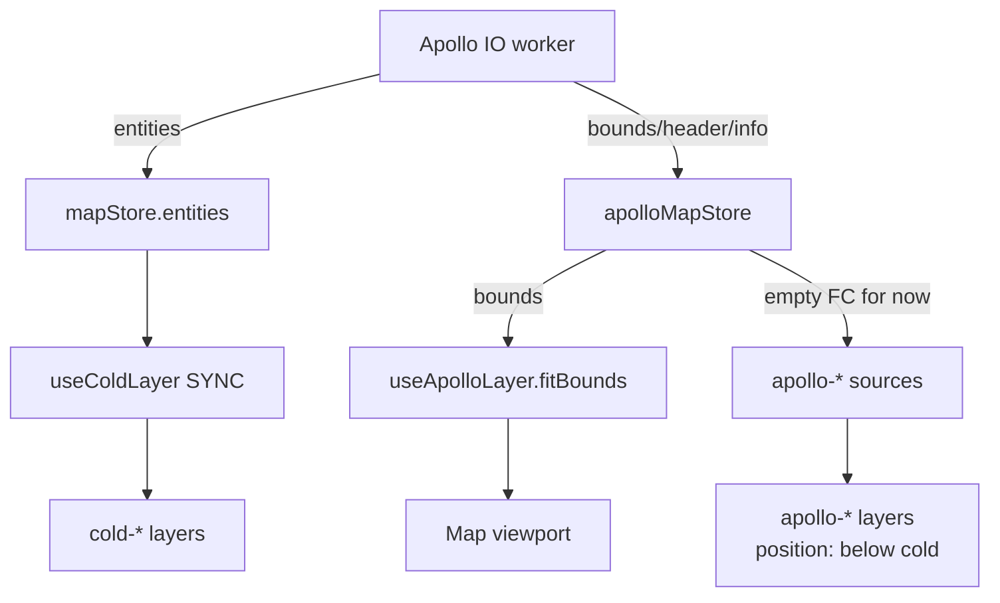

# useApolloLayer

> Source: `src/hooks/useApolloLayer.ts`

`useApolloLayer` registers the `apollo-*` sources/layers after Apollo IO
imports and auto-fits the viewport from `apolloMapStore.bounds`. It registers a set of `apollo-`-prefixed GeoJSON sources and
layers using a deliberately distinct cyan / signal-yellow palette so
imported data stays visually separate from the user's edits.

> **Current state**: every Apollo entity is bridged into
> `mapStore.entities` at import time and rendered through the cold
> layer. The sources registered by this hook stay empty at runtime
> (lines 217-220); only the layer specs remain as z-order placeholders.
> This is a transitional artifact pre-P9; full re-enablement is queued
> behind the layered-UI work.

## Current vs future

| Aspect      | Today                            | Layered-UI future                        |
| ----------- | -------------------------------- | ---------------------------------------- |
| Data flow   | Everything bridged into mapStore | Apollo sources hold raw data             |
| Editability | All routed through cold layer    | Only "user-cloned" entities are editable |
| Toggle      | Single on/off                    | Independent raw / edit layer toggles     |
| Colour      | User palette only                | Side-by-side raw + user palette          |

In the short term this hook stays as-is; sibling hook iterations
(cold / hot) don't depend on changes here.

## Design goals

- **Visual separation**: imported data uses cyan; user edits use the
  ams-\* primary palette — easy to tell apart at a glance.
- **Idempotent install**: layer installation is idempotent (lines
  191-208); repeated imports just refresh data and never re-add
  source / layer.
- **Auto-zoom**: after import, `map.fitBounds` jumps to the worker-
  computed `bounds` so the user can't lose the data after a viewport
  reset.

## Full entity-type matrix

The table aligns each `apollo-*` source with its proto type and the
edit-layer entityType.

| Source                 | Apollo proto                     | mapStore.entityType         | Editing colour       |
| ---------------------- | -------------------------------- | --------------------------- | -------------------- |
| `apollo-junction`      | `apollo.hdmap.Junction`          | `junction`                  | ams-\* fill          |
| `apollo-clear-area`    | `apollo.hdmap.ClearArea`         | `clearArea`                 | red-hatch pattern    |
| `apollo-parking-space` | `apollo.hdmap.ParkingSpace`      | `parkingSpace`              | green fill           |
| `apollo-crosswalk`     | `apollo.hdmap.Crosswalk`         | `crosswalk`                 | zebra pattern        |
| `apollo-road-boundary` | `apollo.hdmap.Road.RoadBoundary` | `boundary` (sub-kind: road) | line                 |
| `apollo-lane-boundary` | `apollo.hdmap.Lane.LaneBoundary` | `boundary` (sub-kind: lane) | line                 |
| `apollo-lane-center`   | `apollo.hdmap.Lane.center_line`  | `lane`                      | dashed line + arrows |
| `apollo-speed-bump`    | `apollo.hdmap.SpeedBump`         | `speedBump`                 | thick line           |
| `apollo-stop-sign`     | `apollo.hdmap.StopSign`          | `stopSign`                  | line + label         |
| `apollo-signal`        | `apollo.hdmap.Signal`            | `signal`                    | circle + label       |

## Data sources

- `apolloMapStore.bounds` — written by the Apollo IO worker after
  `parseAndCompile`. Bounds shape: `[[lng, lat], [lng, lat]]` (SW + NE
  corners).
- `mapStore.entities` — editable entities bridged via the entityOps
  adapter; not read here, but z-order keeps the cold layer above
  `apollo-*` layers.

## Signature

```ts
function useApolloLayer(
  mapRef: React.RefObject<maplibregl.Map | null>,
  mapLoadedRef: React.RefObject<boolean>,
): void;
```

## Parameters

| Name           | Type                                | Role                                                               |
| -------------- | ----------------------------------- | ------------------------------------------------------------------ |
| `mapRef`       | `RefObject<maplibregl.Map \| null>` | MapLibre instance from `useMapLibreInit`.                          |
| `mapLoadedRef` | `RefObject<boolean>`                | `true` once `map.on('load')` fired; gate before installing layers. |

## Returns

`void`. All effects land directly on the MapLibre instance.

## Side effects

| Effect                         | Trigger                                                             | Cleanup                                            |
| ------------------------------ | ------------------------------------------------------------------- | -------------------------------------------------- |
| `map.addSource(apollo-*, ...)` | First `apply()` → `ensureInstalled()` (`useApolloLayer.ts:191-197`) | None directly (map dispose tears them down)        |
| `map.addLayer(spec, beforeId)` | `ensureInstalled` iterating `LAYERS`                                | Same                                               |
| `src.setData(EMPTY_FC)`        | Each `apply()`                                                      | —                                                  |
| `map.fitBounds(bounds, ...)`   | When `bounds !== null` (lines 222-224)                              | —                                                  |
| `map.once('load', apply)`      | When map is not yet loaded                                          | `useEffect` cleanup calls `map.off('load', apply)` |

## Lifecycle

```
mount ──▶ ensureInstalled (idempotent)
            ├── register 10 apollo-* sources
            └── insert LAYERS below the first cold-* layer

bounds change ──▶ apply()
            ├── reset every source data to EMPTY_FC
            └── fitBounds(bounds, padding=60, duration=600)

unmount ──▶ off('load', apply)
```

## Invariants

### Install order: sources first, then layers

`ensureInstalled` (lines 188-208) strictly registers all sources before
any layer. Reversing the order makes MapLibre throw on `addLayer`
because the source isn't found.

### Layers must sit beneath the cold layer

```ts
// useApolloLayer.ts:198-201
const existingLayers = map.getStyle().layers ?? [];
const coldLayer = existingLayers.find((l) => l.id.startsWith('cold-'));
const beforeId = coldLayer?.id;
```

This keeps user edits (cold + hot + overlay) visually on top of the
imported map.

### Sources stay empty (transitional)

```ts
// useApolloLayer.ts:213-220
// All Apollo entity types are bridged into mapStore and rendered by
// the cold layer. These viewer-layer sources stay empty; they exist
// only so the layer specs below remain valid.
for (const sourceId of Object.values(SOURCE)) {
  const src = map.getSource(sourceId) as maplibregl.GeoJSONSource | undefined;
  src?.setData(EMPTY_FC);
}
```

## Source / layer matrix

| Source ID              | Render layer                                         | Type / colour                              |
| ---------------------- | ---------------------------------------------------- | ------------------------------------------ |
| `apollo-junction`      | `apollo-junction-fill`                               | fill `#0e7490` α=0.18                      |
| `apollo-clear-area`    | `apollo-clear-area-fill`                             | fill `#dc2626` α=0.15                      |
| `apollo-parking-space` | `apollo-parking-space-fill`                          | fill `#16a34a` α=0.18                      |
| `apollo-crosswalk`     | `apollo-crosswalk-fill` + `apollo-crosswalk-outline` | fill `#fbbf24` α=0.25 + line `#f59e0b` 1px |
| `apollo-road-boundary` | `apollo-road-boundary-line`                          | line `#94a3b8` 1.5px                       |
| `apollo-lane-boundary` | `apollo-lane-boundary-line`                          | line `#cbd5e1` 1px α=0.7                   |
| `apollo-lane-center`   | `apollo-lane-center-line`                            | line `#22d3ee` 1.5px dashed                |
| `apollo-speed-bump`    | `apollo-speed-bump-line`                             | line `#a855f7` 3px                         |
| `apollo-stop-sign`     | `apollo-stop-sign-line`                              | line `#dc2626` 2px                         |
| `apollo-signal`        | `apollo-signal-circle` + `apollo-signal-line`        | circle 4px + line 2px `#facc15`            |

## Call site

```tsx
// src/components/map/MapCanvas.tsx:41
useApolloLayer(mapRef, mapLoadedRef);
```

The only caller is `MapCanvas`. Each mount registers once;
`apolloMapStore.bounds` changes only refresh source data and call
`fitBounds`; `addLayer` is never re-run.

## Failure modes

| Symptom                            | Root cause                                                                | Fix                                                      |
| ---------------------------------- | ------------------------------------------------------------------------- | -------------------------------------------------------- |
| Console "no source" warning        | `ensureInstalled` returned early because `mapLoadedRef.current === false` | Wait for `map.once('load')` and apply again              |
| Apollo layers paint on top of cold | `coldLayer.id` not found (cold layer unmounted)                           | Ensure `useColdLayer` is mounted                         |
| `fitBounds` doesn't fire           | `bounds === null`                                                         | Confirm `apolloMapStore.bounds` was set by the IO worker |

## See also

- [`useColdLayer`](./use-cold-layer.md)
- [`apolloMapStore`](../store/apollo-map-store.md)
- [Apollo IO bridge](../io/apollo-io-bridge.md)

## Performance notes

- **Layer install runs once**: `installedRef` (`useRef(false)`, line 182) prevents repeat `addSource` / `addLayer` calls even when
  `bounds` updates frequently.
- **fitBounds animation 600ms**: a comfortable transition for large
  imports; setting it to 0 teleports the user and loses spatial
  context.
- **Empty sources still cost memory**: every `apollo-*` source holds a
  GL buffer handle internally. When the future "raw + editable layer
  split" UI comes online, these sources will already exist, ready to
  receive real data without an `addSource` round.

## Interplay with the cold layer



Today every Apollo entity flows through `mapStore` → cold layer; the
`apollo-*` layers exist only as z-order placeholders. The future
"original-map vs editable-overlay" split will reactivate these as the
primary path.

## FAQ

**Q: Why not just reuse the cold layer?**
A: The cold layer paints in ams-\* primary (user-edit colours); Apollo
imports must be visually distinct (cyan + signal yellow). Separate
sources + layers also make a future toggle trivial.

**Q: How is data cleared when an Apollo map is unloaded?**
A: Today: `apolloMapStore.clear()` + `mapStore.clear()`.
`useApolloLayer` does not removeSource — layer registration is
considered lifecycle-permanent. Full unload would require
`map.removeLayer` / `map.removeSource` when import context is cleared.

## Source map

| Concern                            | Lines                            |
| ---------------------------------- | -------------------------------- |
| `SOURCE` constants                 | `useApolloLayer.ts:14-25`        |
| `LAYERS` list                      | `useApolloLayer.ts:35-175`       |
| `installedRef` guard               | `useApolloLayer.ts:182`          |
| `ensureInstalled`                  | `useApolloLayer.ts:188-208`      |
| `apply()`                          | `useApolloLayer.ts:210-225`      |
| `bounds` subscription + fitBounds  | `useApolloLayer.ts:181, 222-224` |
| Empty FC backfill                  | `useApolloLayer.ts:213-220`      |
| `map.once('load', apply)` fallback | `useApolloLayer.ts:228-233`      |
