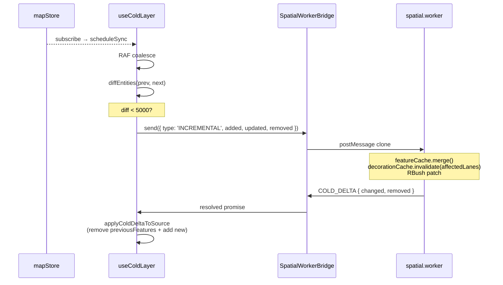

# useColdLayer

> Source: `src/hooks/useColdLayer.ts` · Protocol: `src/core/workers/protocol.ts` · Worker: `src/core/workers/spatial.worker.ts`

`useColdLayer` is the React-side scheduler for the cold-layer pipeline.
It bridges `mapStore.entities` mutations through **RAF coalescing →
SpatialWorkerBridge → spatial.worker → COLD_READY / COLD_DELTA → maplibre
`cold` source** so that:

1. Large imports or rapid edits stay throttled to one frame per write,
   avoiding setData stalls on the main thread.
2. Incremental edits travel via the `INCREMENTAL` protocol; only the
   affected lanes' boundary decoration gets recomputed (Phase E N1
   optimization).
3. Selection toggles rewrite the layer filter only — no source data
   mutation.

## Pipeline overview

```
mapStore.entities ──▶ useColdLayer.scheduleSync (RAF) ──▶ bridge.send(SYNC | INCREMENTAL)
                                                              │
                                                              ▼
                                                    spatial.worker.ts
                                                    (featureCache + decorationCache + RBush)
                                                              │
                                          COLD_READY / COLD_DELTA
                                                              │
                                                              ▼
                                       cold GeoJSONSource.setData / updateData
```

Full layering is documented in [Architecture: Cold Layer](/en/architecture/).

## Signature

```ts
function useColdLayer(
  mapRef: React.RefObject<maplibregl.Map | null>,
  mapLoadedRef: React.RefObject<boolean>,
  actorRef: ActorRefFrom<typeof editorMachine>,
  bridgeRef: React.RefObject<SpatialWorkerBridge | null>,
): void;
```

## Parameters

| Name           | Type                                     | Role                                                                                              |
| -------------- | ---------------------------------------- | ------------------------------------------------------------------------------------------------- |
| `mapRef`       | `RefObject<maplibregl.Map \| null>`      | MapLibre instance.                                                                                |
| `mapLoadedRef` | `RefObject<boolean>`                     | `true` once `map.on('load')` fired.                                                               |
| `actorRef`     | `ActorRefFrom<typeof editorMachine>`     | FSM actor; used to read `selectedEntityId` and refresh cold-layer filters when selection changes. |
| `bridgeRef`    | `RefObject<SpatialWorkerBridge \| null>` | Spatial worker bridge; if `null` the hook stays inert (cold layer is left as-is).                 |

## Returns

`void`. Effects land on the `cold` source and `cold-*` layers.

## Side effects

| Effect                                                         | Trigger                                            | Cleanup                                                   |
| -------------------------------------------------------------- | -------------------------------------------------- | --------------------------------------------------------- |
| `map.once('load', onLoad)`                                     | Map not yet loaded                                 | `map.off('load', onLoad)`                                 |
| `actorRef.subscribe(onActorChange)`                            | Mount                                              | `subscription.unsubscribe()`                              |
| `useMapStore.subscribe(...)`                                   | Mount                                              | `unsubscribeStore()`                                      |
| `requestAnimationFrame(syncColdLayer)`                         | `scheduleSync`                                     | `cancelAnimationFrame(syncFrameRef.current)`              |
| `bridge.send({ type: 'SYNC' \| 'INCREMENTAL' \| 'HIT_TEST' })` | RAF-driven sync path                               | `requestVersion` + `cancelled` flags drop stale responses |
| `src.setData(...)` / `src.updateData({ add, remove })`         | `COLD_READY` / `COLD_DELTA`                        | —                                                         |
| `map.setFilter(layerId, filter)`                               | `applyColdSelectionFilter` driven by FSM selection | —                                                         |
| `useTaskProgressStore.beginTask / endTask`                     | Full SYNC; surfaces "Rendering map layers"         | `endTask` in `finally`                                    |

## Lifecycle

```
mount
  ├── read selectedEntityId into ref
  ├── subscribe(actorRef)        ─ selection change → applyColdSelectionFilter
  ├── subscribe(useMapStore)     ─ entities change → scheduleSync
  └── if mapLoaded: onLoad() else: map.once('load', onLoad)

scheduleSync (RAF coalesced)
  ├── snapshot = clone(entities)
  ├── if !prev: SYNC (full)                  └─▶ groupsToFeatureMap + setData
  ├── diff = diffEntities(prev, entities)
  ├── if !hasChanges: return
  ├── if diffSize > 5000: SYNC               └─▶ rebuildColdSourceFromCache
  └── else: INCREMENTAL { added, updated, removed }
       └─▶ applyColdDeltaToSource(remove old features, add new ones)

unmount
  ├── cancelled = true              ─ drops in-flight worker responses
  ├── unsubscribe actor + store
  ├── cancelAnimationFrame(syncFrameRef.current)
  └── map.off('load', onLoad)
```

## RAF coalescing and version gate

```ts
// useColdLayer.ts:278-281
const scheduleSync = () => {
  if (syncFrameRef.current !== null) return;
  syncFrameRef.current = requestAnimationFrame(syncColdLayer);
};
```

A burst of `addEntity` / `updateEntity` calls in a single frame triggers
exactly one worker SYNC.

```ts
// useColdLayer.ts:194, 211
const requestVersion = ++syncVersionRef.current;
// ...
if (cancelled || requestVersion !== syncVersionRef.current) return;
```

Each entry into `syncColdLayer` grabs a monotonic `requestVersion`. A
later RAF bumps the counter; stale worker responses get dropped instead
of writing out-of-order data into the cold source.

## SYNC vs INCREMENTAL choice

```ts
// useColdLayer.ts:13-15, 237-239
const SOURCE_UPDATE_CHUNK_SIZE = 4_000;
const FULL_SYNC_ENTITY_CHANGE_THRESHOLD = 5_000;
// ...
if (diffSize(diff) > FULL_SYNC_ENTITY_CHANGE_THRESHOLD) {
  void syncAllColdFeatures('cold-layer-sync');
  return;
}
```

- First frame, or diff exceeds the threshold: `SYNC` rebuilds the entire
  feature + decoration caches in the worker.
- Otherwise: `INCREMENTAL` re-decorates only the affected lanes (per
  `LaneJunctionGraph.getDependents`) and returns `COLD_DELTA`.
- `setData` / `updateData` chunks every `SOURCE_UPDATE_CHUNK_SIZE = 4000`
  features to keep postMessage / clone bounded.

## Selection highlight (filter-only)

```ts
// useColdLayer.ts:154-159
function applyColdSelectionFilter(map: maplibregl.Map, selectedEntityId: string | null) {
  for (const layerId of COLD_LAYER_IDS) {
    if (!map.getLayer(layerId)) continue;
    map.setFilter(layerId, buildColdLayerFilter(layerId, selectedEntityId));
  }
}
```

Selection changes never trigger `setData` — only each cold-\* layer's
filter is swapped, so the selected entity gets repainted on top through
the hot layer. This is the hottest path and never round-trips through
the worker.

## Invariants

### Order: setData(empty) before updateData(add)

```ts
// useColdLayer.ts:78-94
async function rebuildColdSourceFromCache(...) {
  await setColdSourceData(src, []);                    // baseline
  let chunk: GeoJSON.Feature[] = [];
  for (const bucket of cache.values()) {
    for (const feature of bucket) {
      chunk.push(withPromotedFeatureId(feature));
      if (chunk.length >= SOURCE_UPDATE_CHUNK_SIZE) {
        await updateColdSourceChunk(src, { add: chunk });
        chunk = [];
      }
    }
  }
  if (chunk.length > 0) await updateColdSourceChunk(src, { add: chunk });
}
```

`updateData` is incremental — it requires a baseline. Sending an empty
setData first establishes the baseline; chunked add then rebuilds.
Equivalent to a full replace without flicker.

### featureId promotion is mandatory

```ts
// useColdLayer.ts:47-51
function withPromotedFeatureId(feature: GeoJSON.Feature): GeoJSON.Feature {
  const id = featureId(feature);
  if (id == null || feature.properties?.featureId === id) return feature;
  return { ...feature, properties: { ...feature.properties, featureId: id } };
}
```

The cold source uses `promoteId: 'featureId'` (see
`mapLibreInit/layers.ts:28`), so every feature emitted by the worker
must carry `properties.featureId`. This helper copies `feature.id` into
`properties.featureId` when missing.

## INCREMENTAL protocol



## Call site

```tsx
// src/components/map/MapCanvas.tsx:38
useColdLayer(mapRef, mapLoadedRef, actorRef, bridgeRef);
```

`bridgeRef` is constructed inside `MapCanvas` via `new
SpatialWorkerBridge()`. Both hook teardown and bridge disposal hang off
the `MapCanvas` effect.

## Failure modes

| Symptom                                | Root cause                                                                          | Fix                                                                                       |
| -------------------------------------- | ----------------------------------------------------------------------------------- | ----------------------------------------------------------------------------------------- |
| Cold layer never refreshes after edits | `bridgeRef.current === null` (worker bootstrap failed)                              | Check worker bootstrap; the fallback path does not auto-retry                             |
| Selection highlight doesn't toggle     | `applyColdSelectionFilter` short-circuited because `mapLoadedRef.current === false` | Wait for `onLoad` → `applySelection()`                                                    |
| Mass delete causes a stall             | Diff exceeds threshold → full SYNC + worker rebuild                                 | Tune `FULL_SYNC_ENTITY_CHANGE_THRESHOLD` (line 14) or improve worker decoration algorithm |
| Ghost features in the cold source      | The worker `add` happened without a matching `remove`                               | Verify `LaneJunctionGraph.getDependents`                                                  |

## Tests

- `src/hooks/__tests__/useColdLayer.test.ts` — diff / version-gate / RAF coalesce assertions
- `src/core/workers/__tests__/spatial.worker.test.ts` — worker-side protocol
- `bench/coldLayer.bench.ts` — Phase E baselines (`scripts/bench-budgets.json`)

## See also

- [`useHotLayer`](./use-hot-layer.md)
- [SpatialWorkerBridge](../core/spatial-bridge.md)
- [Worker protocol](../core/worker-protocol.md)
- [Architecture: Cold layer pipeline](/en/architecture/)

## Source map

| Concern                                | Lines                     |
| -------------------------------------- | ------------------------- |
| `groupFeaturesByEntity`                | `useColdLayer.ts:20-32`   |
| `withPromotedFeatureId`                | `useColdLayer.ts:47-51`   |
| `rebuildColdSourceFromCache`           | `useColdLayer.ts:78-94`   |
| `applyColdDeltaToSource`               | `useColdLayer.ts:96-115`  |
| `diffEntities`                         | `useColdLayer.ts:121-144` |
| `applyColdSelectionFilter`             | `useColdLayer.ts:154-159` |
| `syncColdLayer` main path              | `useColdLayer.ts:184-276` |
| `scheduleSync` (RAF)                   | `useColdLayer.ts:278-281` |
| Selection subscribe + `applySelection` | `useColdLayer.ts:283-305` |
| Unmount cleanup                        | `useColdLayer.ts:309-330` |
