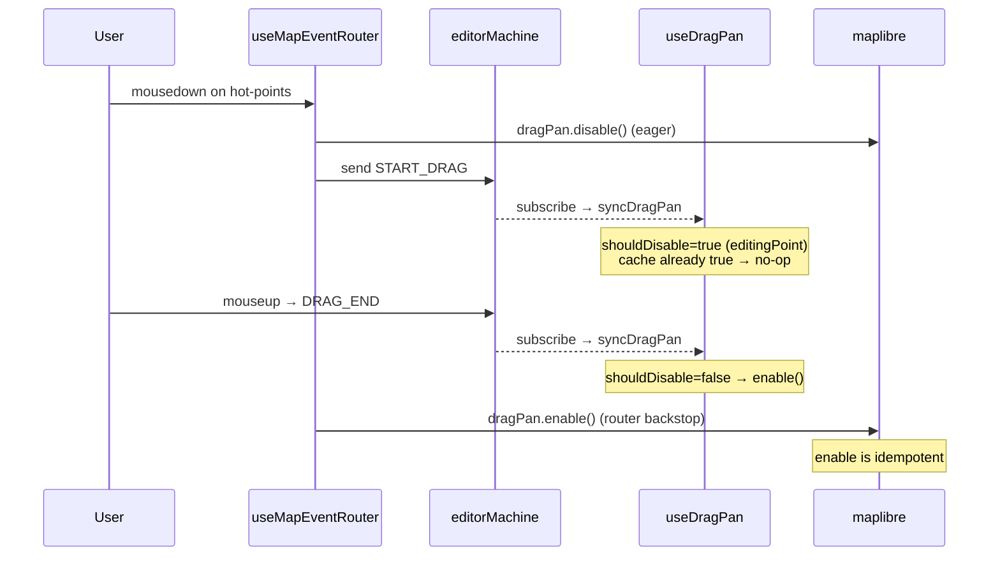

# useDragPan

> Source: `src/hooks/useDragPan.ts`

`useDragPan` is a guard hook: it calls `map.dragPan.disable()` in the
appropriate FSM states and `map.dragPan.enable()` otherwise. The logic
is a single decision function `shouldDisableDragPan`, but it prevents
a class of "the map is panning instead of editing" UX bugs.

## Decision matrix

| FSM state                                                                         | isDraggingHandle   | dragPan |
| --------------------------------------------------------------------------------- | ------------------ | ------- |
| `idle`                                                                            | false              | enable  |
| `selected`                                                                        | false              | enable  |
| `selected`                                                                        | true (handle drag) | disable |
| `drawPolyline` / `drawArc` / `drawCatmullRom` / `drawRotatedRect` / `drawPolygon` | false              | enable  |
| `drawBezier`                                                                      | —                  | disable |
| `editingPoint`                                                                    | —                  | disable |

`isDraggingHandle` is a boolean flag in the FSM context, set true by
`START_HANDLE_DRAG` and cleared by `END_HANDLE_DRAG` during the bezier
control-handle drag substate.

## Test entry points

- Unit: `shouldDisableDragPan` truth table (5 cases)
- Integration: simulate the actor entering `editingPoint` → assert
  `dragPan.disable()` was called once; on exit `enable()` is called
  once; identical state changes do not retrigger.
- E2E: Playwright confirms the map does not pan during a vertex drag.

## What dragPan disable does NOT block

It does not block:

- Mouse wheel (MapLibre's `scrollZoom`, a separate handler)
- Two-finger touch zoom (`touchZoomRotate`)
- Keyboard pan (if enabled — this project doesn't enable it)

It blocks only the mousedown → mousemove → mouseup pan path. If a
future workflow needs to disable wheel-zoom during editing, extend
`shouldDisableDragPan` into a more general gate.

## Symmetry with `useCursorManager`

`useDragPan` and [`useCursorManager`](./use-cursor-manager.md) both
subscribe to the actor and mutate MapLibre behaviour, but the targets
differ:

| Hook               | Target                         | Cache                      |
| ------------------ | ------------------------------ | -------------------------- |
| `useDragPan`       | `map.dragPan.disable / enable` | `dragPanDisabledRef`       |
| `useCursorManager` | `canvas.style.cursor`          | None (overwrite each time) |

A cursor write is a string assignment; dragPan attaches / detaches
event listeners — more expensive, hence the cache.

## Design tradeoff

Why not just disable / enable inside the router? Because the router's
mousedown path doesn't always traverse `editingPoint` — for example,
during `drawBezier` the FSM moves into a substate without surfacing a
fresh mousedown event to the router. A standalone hook subscribed to
the actor reacts to every change in flight, which is more reliable
than scattering dragPan state across mousedown / mouseup / dblclick
handlers.

## Internals of MapLibre's dragPan

`map.dragPan` is a built-in handler. When enabled, it listens for
mousedown + mousemove + mouseup and pans accordingly. `disable()` tears
down the internal listeners; subsequent pointer events flow to
application code. `enable()` re-attaches them.

The API is idempotent, but each call wires / unwires native listeners,
which is wasteful in a hot path. That's why `dragPanDisabledRef` caches
the desired state.

## Why this hook exists

- **MapLibre's dragPan is on by default**: a mousedown enters MapLibre's
  pan workflow immediately and eats subsequent mousemoves. That breaks
  vertex editing, bezier drawing, and handle drag.
- **State-driven**: caches `dragPanDisabledRef.current` and only flips
  the underlying API when the value really toggles, avoiding extra
  internal MapLibre side effects.

## Signature

```ts
function useDragPan(
  mapRef: React.RefObject<maplibregl.Map | null>,
  actorRef: ActorRefFrom<typeof editorMachine>,
): void;

export function shouldDisableDragPan(currentState: string, isDraggingHandle: boolean): boolean;
```

## Parameters

| Name       | Type                                 | Role                                                     |
| ---------- | ------------------------------------ | -------------------------------------------------------- |
| `mapRef`   | `RefObject<maplibregl.Map \| null>`  | MapLibre instance.                                       |
| `actorRef` | `ActorRefFrom<typeof editorMachine>` | FSM actor. Reads `value` and `context.isDraggingHandle`. |

## Side effects

| Effect                            | Trigger                    | Cleanup                      |
| --------------------------------- | -------------------------- | ---------------------------- |
| `map.dragPan.disable()`           | `shouldDisable=true` flip  | —                            |
| `map.dragPan.enable()`            | `shouldDisable=false` flip | —                            |
| `actorRef.subscribe(syncDragPan)` | Mount                      | `subscription.unsubscribe()` |

## `shouldDisableDragPan`

```ts
// useDragPan.ts:6-8
export function shouldDisableDragPan(currentState: string, isDraggingHandle: boolean): boolean {
  return isDraggingHandle || currentState === 'editingPoint' || currentState === 'drawBezier';
}
```

| Condition                         | Reason                                                                                     |
| --------------------------------- | ------------------------------------------------------------------------------------------ |
| `isDraggingHandle === true`       | User dragging a bezier control handle (FSM substate)                                       |
| `currentState === 'editingPoint'` | Vertex / handle / center drag in flight                                                    |
| `currentState === 'drawBezier'`   | drawBezier creates control handles via mousedown + drag; the map cannot pan simultaneously |
| Otherwise                         | Allow MapLibre to pan freely (idle / selected / drawPolyline …)                            |

## Invariants

### Cached toggle

```ts
// useDragPan.ts:14-31
const dragPanDisabledRef = useRef(false);

useEffect(() => {
  // ...
  const syncDragPan = () => {
    const snapshot = actorRef.getSnapshot();
    const shouldDisable = shouldDisableDragPan(
      snapshot.value as string,
      snapshot.context.isDraggingHandle,
    );

    if (shouldDisable === dragPanDisabledRef.current) return;
    dragPanDisabledRef.current = shouldDisable;
    if (shouldDisable) map.dragPan.disable();
    else map.dragPan.enable();
  };

  syncDragPan();
  const subscription = actorRef.subscribe(syncDragPan);
  return () => subscription.unsubscribe();
}, [actorRef]);
```

Every actor change recomputes `shouldDisable`; if it matches the cache,
skip — `dragPan.disable/enable` is not free internally.

### Belt-and-suspenders

- `useMapEventRouter.handleSelectedMouseDown` also calls
  `map.dragPan.disable()` before entering `editingPoint`
  (`selectionDrag.ts:57, 78`).
- This hook keeps it disabled throughout `editingPoint`. The overlap
  guarantees at least one site disables dragPan.

After `DRAG_END` the router explicitly calls `map.dragPan.enable()`
(`useMapEventRouter.ts:160`); this hook also enables on FSM exit.
Repeated enable is safe.

## Call site

```tsx
// src/components/map/MapCanvas.tsx:43
useDragPan(mapRef, actorRef);
```

## Failure modes

| Symptom                            | Root cause                                                | Fix                                                 |
| ---------------------------------- | --------------------------------------------------------- | --------------------------------------------------- |
| Map pans during vertex drag        | `editingPoint` not entered or `dragPan.disable()` skipped | Check the router's `START_DRAG` path                |
| Map can't pan after edit ends      | `enable()` missed                                         | Inspect `dragPanDisabledRef.current` for stuck-true |
| Frequent disable/enable causes lag | Cache not in effect                                       | Verify the `dragPanDisabledRef` comparison          |

## Tests

- `src/hooks/__tests__/useDragPan.test.ts` — `shouldDisableDragPan` truth table

## See also

- [`useMapEventRouter`](./use-map-event-router.md)
- [`useCursorManager`](./use-cursor-manager.md)
- [Editor Machine: editingPoint](../core/editor-machine.md)

## Timeline



Router-and-hook double writes are deliberate:

- The router's eager `disable` guarantees the mousedown frame takes
  effect immediately (the subscribe path runs in the next tick).
- `useDragPan` guarantees subsequent state changes (e.g. internal FSM
  substate) also drive pan correctly.

Both write to the idempotent MapLibre API; repeated calls are
side-effect-free.

## Relationship with doubleClickZoom

`useMapLibreInit` already disables `doubleClickZoom: false` at map
construction. `dragPan` is a separate interaction channel and needs
`useDragPan` to manage it.

If future work brings in more MapLibre interactions (`scrollZoom` /
`keyboard`), `shouldDisableDragPan` can grow into
`disableMapInteractions`, blocking all interactions per FSM state.

## Source map

| Concern                    | Lines                     |
| -------------------------- | ------------------------- |
| `shouldDisableDragPan`     | `useDragPan.ts:6-8`       |
| `syncDragPan` body         | `useDragPan.ts:20-31`     |
| `dragPanDisabledRef` cache | `useDragPan.ts:14, 27-29` |
| Subscribe + cleanup        | `useDragPan.ts:33-37`     |
