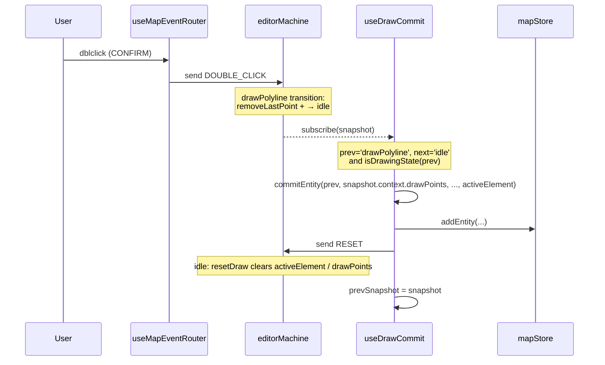

# useDrawCommit

> Source: `src/hooks/useDrawCommit.ts`

`useDrawCommit` is the bridge that **persists** an FSM drawing state
into `mapStore`. It subscribes to `actorRef` and, on every state
transition, compares `prevState` and `nextState`:

- When `prevState` is `isDrawingState` (`drawPolyline` /
  `drawCatmullRom` / `drawBezier` / `drawArc` / `drawRotatedRect` /
  `drawPolygon`) and `nextState === 'idle'`: call `commitEntity` to
  turn the current `drawPoints` / `bezierAnchors` into an entity and
  `addEntity`.
- After commit, send **another `RESET`** so `activeElement` /
  `drawPoints` / `bezierAnchors` are cleared and the toolstrip
  highlight does not leak.

Reads happen against the **POST-transition snapshot** because
transitions can carry actions like "add the last point" or "remove last
point" (`DOUBLE_CLICK`'s `removeLastPoint`). Geometry must be computed
from the post-transition context.

## Why split this out

- Single responsibility: `useMapEventRouter` only sends FSM events;
  persistence belongs here so the router stays free of store mutations.
- POST-snapshot accuracy: FSM transitions are atomic; only the snapshot
  delivered inside `subscribe` reflects the full transition effect.
- Self-consistent: commit + RESET guarantees the next `SELECT_TOOL` into
  the same draw state has a clean context.

## Signature

```ts
function useDrawCommit(actorRef: ActorRefFrom<typeof editorMachine>): void;

// Helper
export function hasGeometryForState(
  state: string,
  points: LngLat[],
  anchors: BezierAnchor[],
): boolean;
```

## Parameters

| Name       | Type                                 | Role          |
| ---------- | ------------------------------------ | ------------- |
| `actorRef` | `ActorRefFrom<typeof editorMachine>` | Editor actor. |

## Side effects

| Effect                                  | Trigger                                         | Cleanup                      |
| --------------------------------------- | ----------------------------------------------- | ---------------------------- |
| `actorRef.subscribe(...)`               | Mount                                           | `subscription.unsubscribe()` |
| `useMapStore.getState().addEntity(...)` | Drawing state exits to idle with valid geometry | —                            |
| `actorRef.send({ type: 'RESET' })`      | After commit                                    | —                            |

## Geometry validity

```ts
// useDrawCommit.ts:23-35
export function hasGeometryForState(state, points, anchors): boolean {
  return (
    (state === 'drawBezier' && anchors.length >= 2) ||
    (state === 'drawArc' && points.length >= 3) ||
    (state === 'drawRotatedRect' && points.length >= 3) ||
    (state === 'drawPolygon' && points.length >= 3) ||
    ((state === 'drawPolyline' || state === 'drawCatmullRom') && points.length >= 2)
  );
}
```

States that don't meet the minimum point count are dropped — no empty
entity is ever written.

## commit path

```ts
// useDrawCommit.ts:37-90
function commitEntity(state, points, anchors, element) {
  const { addEntity, entities } = useMapStore.getState();

  if (element) {
    if (hasGeometryForState(state, points, anchors)) {
      const { laneHalfWidth } = useSettingsStore.getState();
      addEntity(createApolloEntity(element, state, points, anchors, { laneHalfWidth, entities }));
    }
    return;
  }

  // Native entity types: polyline / catmullRom / bezier / arc / rect / polygon
  // ids generated via nextEntityId(entityType, entities); LngLat tuples
  // converted via toGeoPoint / coordsToPoints / anchorToData.
}
```

| `activeElement`                         | Branch                                       | Result entity                                                     |
| --------------------------------------- | -------------------------------------------- | ----------------------------------------------------------------- |
| `non-null` (lane / boundary / signal …) | `createApolloEntity` via `entityOps` adapter | `ApolloEntity`                                                    |
| `null`                                  | `nextEntityId` + native struct               | `polyline` / `catmullRom` / `bezier` / `arc` / `rect` / `polygon` |

## Invariants

### POST-transition snapshot

```ts
// useDrawCommit.ts:96-119
useEffect(() => {
  let prevSnapshot = actorRef.getSnapshot();

  const subscription = actorRef.subscribe((snapshot) => {
    const prevState = prevSnapshot.value as string;
    const nextState = snapshot.value as string;

    if (nextState === 'idle' && isDrawingState(prevState)) {
      // POST-transition snapshot: transition actions (like addPoint on the
      // trigger click) have already been applied; prevSnapshot is one
      // action behind.
      commitEntity(
        prevState,
        snapshot.context.drawPoints, // ← post
        snapshot.context.bezierAnchors, // ← post
        snapshot.context.activeElement, // ← post
      );
      actorRef.send({ type: 'RESET' });
    }

    prevSnapshot = snapshot;
  });

  return () => {
    subscription.unsubscribe();
  };
}, [actorRef]);
```

`drawPoints` MUST come from `snapshot.context` (post). If you read from
`prevSnapshot.context` (pre), the `addPoint` action that fires on the
final click of `drawArc` / `drawRotatedRect` is missed and the
committed entity is short by one point.

### commit must always be followed by RESET

```ts
// useDrawCommit.ts:115
actorRef.send({ type: 'RESET' });
```

The note in source: the `drawPolyline → idle` transition deliberately
skips `resetDraw` so `drawPoints` are still readable in commit. After
commit, this hook explicitly sends RESET to clear:

- `activeElement` — otherwise the toolstrip highlight stays lit.
- `drawPoints` / `bezierAnchors` — otherwise points stack on top of the
  next entry into the same draw state.

### Commit only on exit to idle

```ts
// useDrawCommit.ts:100
if (nextState === 'idle' && isDrawingState(prevState)) { ... }
```

`drawPolyline → drawCatmullRom` (user switches tool mid-draw) is never
a commit. Neither is `selected` or `editingPoint`.

## Transition timeline



`removeLastPoint` is part of the `DOUBLE_CLICK` transition itself, so
the post-snapshot already reflects it — that's why dblclick close paths
don't double-write the last point.

## Call site

```tsx
// src/components/map/MapCanvas.tsx:35
useDrawCommit(actorRef);
```

Mounted once inside `MapCanvas`.

## Failure modes

| Symptom                                    | Root cause                                                    | Fix                                                       |
| ------------------------------------------ | ------------------------------------------------------------- | --------------------------------------------------------- |
| Entity gains an extra point after dblclick | Reading `prevSnapshot.context.drawPoints`                     | Use the post-snapshot                                     |
| Toolstrip stays lit after commit           | Missing `RESET`                                               | See line 115                                              |
| Empty entity committed                     | `hasGeometryForState` missing the new state                   | Add it to the table                                       |
| Tool switch mistakenly committed           | `drawPolyline → drawCatmullRom` does not transit through idle | Only `nextState === 'idle'` triggers; the gate is correct |

## Tests

- `src/hooks/__tests__/useDrawCommit.test.ts` — commit shapes per draw state
- `src/hooks/__tests__/undoCancel.test.ts` — interplay with R1 closure

## See also

- [Editor Machine](../core/editor-machine.md)
- [`entityOps.createEntity`](../lib/entity-ops.md)
- [`useActionDispatcher`](./use-action-dispatcher.md)
- [`useMapEventRouter`](./use-map-event-router.md)

## useDrawCommit through the R1 lens

The CANCEL closure ([`useActionDispatcher`](./use-action-dispatcher.md))
ensures the FSM is already reset to idle before time travel — but
`useDrawCommit` does not need to special-case CANCEL. The transition
draw-state → idle still triggers `isDrawingState(prevState) &&
nextState === 'idle'`, but the CANCEL transition's `resetDraw` action
has already cleared `drawPoints` / `bezierAnchors` /
`activeElement`. Then `hasGeometryForState` returns false and
`commitEntity` quietly skips. Net effect: CANCEL never persists an
entity.

## Adapter vs native branch

```ts
// useDrawCommit.ts:45-90
if (element) {
  // Adapter branch: creates an ApolloEntity via entityOps.createEntity
  // with laneHalfWidth + existing entities (for nextEntityId / neighbour ids)
} else {
  // Native branch: directly constructs polyline / catmullRom / bezier / arc / rect / polygon
}
```

`activeElement` is carried by `SELECT_TOOL` from the toolstrip when the
user picks an Apollo element type (see `elements.ts`). Selecting `lane`
and then the `drawPolyline` tool leaves the FSM with `activeElement:
lane` + `value: drawPolyline`; commit takes the first branch and goes
through the entityOps adapter.

## Source map

| Concern                      | Lines                      |
| ---------------------------- | -------------------------- |
| `hasGeometryForState`        | `useDrawCommit.ts:23-35`   |
| `commitEntity` apollo branch | `useDrawCommit.ts:45-50`   |
| `commitEntity` native branch | `useDrawCommit.ts:53-89`   |
| subscribe + commit main      | `useDrawCommit.ts:96-119`  |
| **POST-snapshot comment**    | `useDrawCommit.ts:101-105` |
| **RESET comment**            | `useDrawCommit.ts:112-115` |
