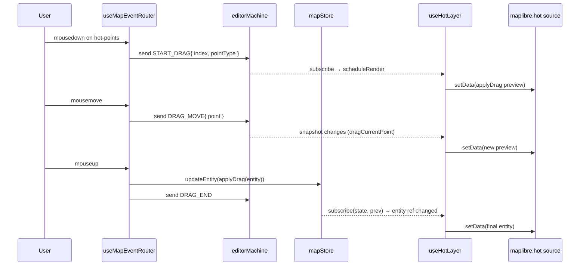

# useHotLayer

> Source: `src/hooks/useHotLayer.ts`

`useHotLayer` writes the "selected entity + drag preview" into MapLibre's
`hot` source. Unlike the cold layer:

- **No worker**: geometry is computed on the main thread by reading the
  FSM context and invoking `applyDrag`.
- **No cache**: every frame (each actor state change) recomputes the
  GeoJSON `FeatureCollection` from scratch.
- **Render guard**: `sameHotRenderState` compares 8 keys before
  triggering `setData`.

This is the Photoshop-style edit feedback — vertex drag / rotate /
translate updates the blue hot-layer overlay live under the cursor.

## When to use hot vs overlay

- **hot**: the "shaped" geometry of the selected entity + drag preview.
  Blue highlight; for entities that already exist.
- **overlay**: not-yet-committed drawing geometry (`drawPoints` /
  `bezierAnchors`). Yellow dashed; for drafts that will become entities.

Different sources, different priorities — never mixed. A rotated rect
is rendered as overlay during `drawRotatedRect`, becomes a RectEntity
on CONFIRM (rendered by cold), and is overlaid by hot when selected.

## Why no worker

- Edit feedback must hit 60fps; postMessage jitter would make the
  pointer feel laggy.
- A single selected entity's geometry is small (≤ ~100 points), so
  recomputing on the main thread is cheap.
- Output volume is tiny → `setData` doesn't drag down sibling layers.

## Signature

```ts
function useHotLayer(
  mapRef: React.RefObject<maplibregl.Map | null>,
  mapLoadedRef: React.RefObject<boolean>,
  actorRef: ActorRefFrom<typeof editorMachine>,
): void;
```

## Parameters

| Name           | Type                                 | Role                                                                                                                                       |
| -------------- | ------------------------------------ | ------------------------------------------------------------------------------------------------------------------------------------------ |
| `mapRef`       | `RefObject<maplibregl.Map \| null>`  | MapLibre instance.                                                                                                                         |
| `mapLoadedRef` | `RefObject<boolean>`                 | Readiness flag for the RAF path.                                                                                                           |
| `actorRef`     | `ActorRefFrom<typeof editorMachine>` | FSM actor. Reads `selectedEntityId` / `dragPointIndex` / `dragPointType` / `dragCurrentPoint` / `dragAltKey` / `value === 'editingPoint'`. |

## Returns

`void`. Effects target the `hot` source.

## `HotRenderState`

```ts
export type HotRenderState = {
  selectedEntityId: string | null;
  entity: MapEntity | null;
  isEditingPoint: boolean;
  dragPointIndex: number;
  dragPointType: DragPointType;
  dragCurrentPoint: LngLat | null;
  dragAltKey: boolean;
};
```

Built from the FSM snapshot plus `mapStore.entities.get(selectedEntityId)`.

## Side effects

| Effect                                  | Trigger                                             | Cleanup                           |
| --------------------------------------- | --------------------------------------------------- | --------------------------------- |
| `actorRef.subscribe(scheduleRender)`    | Mount                                               | `subscription.unsubscribe()`      |
| `useMapStore.subscribe(...)`            | Mount                                               | `unsubscribeStore()`              |
| `requestAnimationFrame(renderHotLayer)` | `scheduleRender`                                    | `cancelAnimationFrame(frameId)`   |
| `src.setData(...)`                      | Render fires and `sameHotRenderState` returns false | —                                 |
| `map.once('load', scheduleRender)`      | Map not yet loaded                                  | `map.off('load', scheduleRender)` |

## Lifecycle

```
mount
  ├── subscribe(actorRef) → scheduleRender
  ├── subscribe(useMapStore) → scheduleRender only on entities change
  └── if mapLoaded: scheduleRender() else: map.once('load', scheduleRender)

renderHotLayer (RAF)
  ├── snapshot = actorRef.getSnapshot()
  ├── entity = entities.get(selectedEntityId)
  ├── nextState = HotRenderState{...}
  ├── if sameHotRenderState(last, next): return
  ├── if !entity: setData(EMPTY_FC); return
  ├── isEditingPoint && drag → applyDrag(entity, idx, type, point, alt)
  └── setData(entityToHotFeatures(displayEntity))

unmount
  ├── unsubscribe actor + store
  └── cancelAnimationFrame(frameId)
```

## Invariants

### setData only when state actually changed

```ts
// useHotLayer.ts:30-41
export function sameHotRenderState(a: HotRenderState | null, b: HotRenderState) {
  return (
    !!a &&
    a.selectedEntityId === b.selectedEntityId &&
    a.entity === b.entity &&
    a.isEditingPoint === b.isEditingPoint &&
    a.dragPointIndex === b.dragPointIndex &&
    a.dragPointType === b.dragPointType &&
    a.dragAltKey === b.dragAltKey &&
    samePoint(a.dragCurrentPoint, b.dragCurrentPoint)
  );
}
```

`entity` uses identity comparison: `mapStore.updateEntity` returns a new
reference, triggering a re-render; pure FSM selection-state changes
(same entity) keep the reference, leaving `setData` skipped.

### Drag preview requires non-null `dragCurrentPoint`

```ts
// useHotLayer.ts:85-99
const displayEntity =
  nextState.isEditingPoint &&
  nextState.dragCurrentPoint &&
  (nextState.dragPointIndex >= 0 ||
    nextState.dragPointType === 'rotate' ||
    nextState.dragPointType === 'center')
    ? applyDrag(
        entity,
        nextState.dragPointIndex,
        nextState.dragPointType,
        nextState.dragCurrentPoint,
        nextState.dragAltKey,
      )
    : entity;
```

`dragPointIndex >= 0` covers vertex / handle drags; `rotate` and
`center` use sentinel values `-1` / `-2`. If no branch matches (e.g.
just entered `editingPoint` with no mousemove yet), the original entity
is rendered.

### Empty selection clears the hot source

```ts
// useHotLayer.ts:80-83
if (!selectedEntityId || !entity) {
  src.setData(EMPTY_FC);
  return;
}
```

Prevents leftover highlight from a previous selection.

## Selection + drag sequence



## Call site

```tsx
// src/components/map/MapCanvas.tsx:39
useHotLayer(mapRef, mapLoadedRef, actorRef);
```

## Failure modes

| Symptom                                | Root cause                                                  | Fix                                                   |
| -------------------------------------- | ----------------------------------------------------------- | ----------------------------------------------------- |
| No drag preview                        | Never entered `editingPoint`; `isEditingPoint=false`        | Confirm `selectionDrag.ts` actually sent `START_DRAG` |
| Old highlight after deselection        | Did not hit the `EMPTY_FC` branch (selectedEntityId leaked) | FSM deselect must clear `context.selectedEntityId`    |
| No preview during rotate / center drag | `dragPointType` not in `'rotate' \| 'center'`               | Check `selectionDrag.ts` branches                     |
| Duplicate setData per frame            | actor.subscribe + store.subscribe both fire                 | RAF coalescing already guards (line 103-106)          |

## See also

- [`useColdLayer`](./use-cold-layer.md)
- [`useOverlayLayer`](./use-overlay-layer.md)
- [Editor Machine: editingPoint](../core/editor-machine.md)
- [`entityMutations.applyDrag`](https://github.com/SakuraPuare/apollo-map-studio/blob/main/src/components/map/entityMutations.ts)

## Performance budget

- **Per-frame compute cost**: `entityToHotFeatures` + `applyDrag` run
  on the main thread; for entities with ≤ ~100 vertices, this is well
  under 0.5ms per frame.
- **setData cost**: the FC is typically < 50 features; MapLibre's
  internal GeoJSON parse is under 0.2ms.
- **RAF throttling**: `scheduleRender` guards on `frameId !== null` so
  the worst case is one setData per frame even when actor and store
  fire simultaneously.

Benchmarks live in `bench/hotLayer.bench.ts`; the budget at
`scripts/bench-budgets.json` caps `hot-layer-render` at 1ms/frame.

## Cooperation with useColdLayer

Cold and hot layers are complementary:

| Concern             | useColdLayer                                | useHotLayer                |
| ------------------- | ------------------------------------------- | -------------------------- |
| Data scale          | Whole map (thousands of entities)           | Single entity              |
| Compile path        | spatial worker (postMessage)                | Main-thread pure functions |
| Caching             | Three layers (feature / decoration / RBush) | None                       |
| Selection highlight | Layer filter swap (no setData)              | Rewrites hot source        |
| Frame budget        | 16ms (RAF + worker)                         | 1ms (main thread)          |

The cold layer's filter excludes the selected entity
(`buildColdLayerFilter` removes it), letting the hot layer take over
the rendering of that entity exclusively.

## Caller note

Any code path that calls `useMapStore.updateEntity` while in
`editingPoint` (e.g. the router's `mouseup`) re-renders the hot layer
because the entity reference changes. To avoid visible "snap", the
write should happen with consistent intermediate references; typically
the hot layer's own `setData(entityToHotFeatures(post))` handles this.

## Source map

| Concern                    | Lines                    |
| -------------------------- | ------------------------ |
| `samePoint`                | `useHotLayer.ts:24-28`   |
| `sameHotRenderState`       | `useHotLayer.ts:30-41`   |
| `useHotLayer` entry        | `useHotLayer.ts:43-132`  |
| `renderHotLayer` main path | `useHotLayer.ts:55-101`  |
| Drag preview branch        | `useHotLayer.ts:85-98`   |
| EMPTY_FC short-circuit     | `useHotLayer.ts:80-83`   |
| `scheduleRender` (RAF)     | `useHotLayer.ts:103-106` |
| Unmount cleanup            | `useHotLayer.ts:121-128` |
