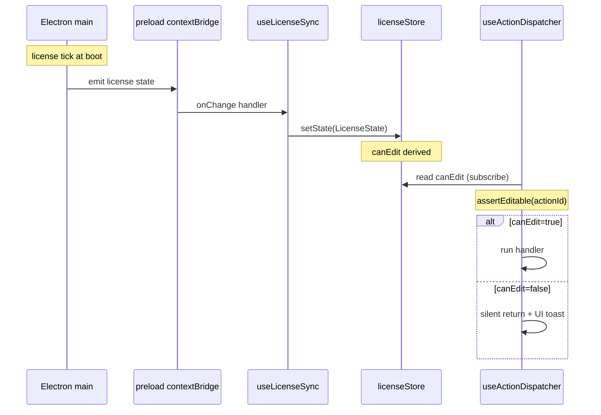

# useLicenseSync

> Source: `src/hooks/useLicense.ts` · Bridge: `src/lib/license-bridge.ts`

`useLicenseSync` is the renderer entry point for the license system. On
mount it:

1. Calls `licenseStore.hydrate()` once (which goes through
   `licenseBridge.getState()`).
2. Subscribes to main-process state pushes via
   `licenseBridge.onChange(setState)`.
3. Registers a `window` `focus` listener that hydrates again when the
   tab regains focus (covers laptop sleep).

In desktop builds, `licenseBridge` proxies through to
`window.apolloMapStudioLicense` (injected by `electron/preload.cts` via
contextBridge). In browser builds, `window` lacks that object, so the
bridge degrades to `fallbackState()` — perpetual 7-day trial,
`canEdit=true` — keeping dev / Storybook / browser preview alive.

## status semantics

| status             | canEdit | UI affordance                                             |
| ------------------ | ------- | --------------------------------------------------------- |
| `trial`            | true    | Top banner shows remaining days                           |
| `activated`        | true    | Silent                                                    |
| `expired_trial`    | false   | Red banner + activation CTA                               |
| `expired_license`  | false   | Red banner + renewal CTA                                  |
| `tampered`         | false   | Hard error (machineCode and signature don't match)        |
| `machine_mismatch` | false   | Current device differs from the license-bound machineCode |
| `invalid`          | false   | license string format error                               |
| `not_started`      | false   | Future-dated license (pre-activation)                     |

## Hot path: canEdit derivation

`useActionDispatcher` calls `assertEditable(actionId)`:

```ts
// pseudo-code
function assertEditable(id: ActionId): boolean {
  if (!useLicenseStore.getState().canEdit) {
    toast(useLicenseStore.getState().reason ?? 'License is read-only');
    return false;
  }
  return true;
}
```

Every menu / shortcut / toolstrip click consults the license store
once; this read path must be O(1) without triggering component
re-renders. zustand's `getState()` is a synchronous, render-free read —
which fits the bill.

## Why this hook exists

- **Single subscription point**: every license read goes through the
  zustand store; components never call the bridge directly.
- **Sleep recovery**: timer-driven ticks get throttled in background
  tabs and laptop sleep; `focus`-driven hydrate fills the gap.
- **Cheap deps**: `hydrate` / `setState` are stable references, so the
  effect runs once.

## Signature

```ts
function useLicenseSync(): void;
```

## Side effects

| Effect                                      | Trigger               | Cleanup                                 |
| ------------------------------------------- | --------------------- | --------------------------------------- |
| `void hydrate()`                            | Mount + `focus` event | —                                       |
| `licenseBridge.onChange(setState)`          | Mount                 | Returned `unsub()` invoked on unmount   |
| `window.addEventListener('focus', onFocus)` | Mount                 | `removeEventListener('focus', onFocus)` |

## Lifecycle

```
mount
  ├── hydrate() — bridge.getState() → setState
  ├── unsub = licenseBridge.onChange(setState)
  └── window.addEventListener('focus', () => hydrate())

unmount
  ├── unsub()
  └── window.removeEventListener('focus', onFocus)
```

## `LicenseState` fields

From `license-bridge.ts:21-32`:

```ts
export interface LicenseState {
  status:
    | 'trial'
    | 'activated'
    | 'expired_trial'
    | 'expired_license'
    | 'tampered'
    | 'machine_mismatch'
    | 'invalid'
    | 'not_started';
  canEdit: boolean;
  machineCode: string;
  trialStart: number;
  trialEnd: number;
  daysRemaining: number | null;
  hoursRemaining: number | null;
  license: { id: string; name: string; issued: number; expires: number } | null;
  checkedAt: number;
  reason: string;
}
```

`canEdit` is a hot path: every edit/tool/selection action in
`useActionDispatcher.actionRequiresEdit` gates on it.

## Fallback state (browser preview)

```ts
// license-bridge.ts:62-75
function fallbackState(): LicenseState {
  return {
    status: 'trial',
    canEdit: true,
    machineCode: 'WEB-NO-LICENSE',
    trialStart: Date.now(),
    trialEnd: Date.now() + 7 * 24 * 60 * 60 * 1000,
    daysRemaining: 7,
    hoursRemaining: 7 * 24,
    license: null,
    checkedAt: Date.now(),
    reason: 'Browser preview — licensing disabled.',
  };
}
```

There's no trusted main process in a browser, so the license system
opens up. `isDesktopBuild()` returns
`Boolean(window.apolloMapStudioLicense)`.

## Invariants

### `hydrate` / `setState` come from the store

```ts
// useLicense.ts:11-14
const hydrate = useLicenseStore((s) => s.hydrate);
const setState = useLicenseStore((s) => s.setState);
```

zustand's selector returns stable references (unless the store itself
rebuilds), so the dependency array `[hydrate, setState]` effectively
runs once between mount and unmount.

### onChange must register after hydrate

```ts
// useLicense.ts:16-22
useEffect(() => {
  void hydrate();
  const unsub = licenseBridge.onChange(setState);
  // ...
}, [hydrate, setState]);
```

`hydrate` is async (promise), but `onChange` registers immediately —
subsequent main-process pushes are captured. Reversing the order would
race the first push with the hydrate's setState; current order
guarantees hydrate's value lands first.

### `focus` listener as a backstop

```ts
// useLicense.ts:18-21
const onFocus = () => void hydrate();
window.addEventListener('focus', onFocus);
```

Main-process license ticks can be throttled in background tabs / laptop
sleep; `focus` re-hydrates so the user always sees fresh status when
they return.

## Call site

```tsx
// src/components/layout/WorkspaceLayout.tsx:42
useLicenseSync();
```

Mounted once inside `WorkspaceLayoutInner`; the whole renderer shares
the store.

## Failure modes

| Symptom                                          | Root cause                       | Fix                                                    |
| ------------------------------------------------ | -------------------------------- | ------------------------------------------------------ |
| Desktop build always reports `canEdit=true`      | Browser fallback path active     | Verify `window.apolloMapStudioLicense` is exposed      |
| License still shows expired after sleep          | `focus` doesn't fire hydrate     | See lines 19-21; ensure the listener is mounted        |
| onChange fires but store doesn't update          | `setState` reference instability | Cannot happen — zustand selectors are stable           |
| Browser build reports "activate is desktop-only" | User triggered activate in web   | `licenseBridge.activate` returns `errorCode='unknown'` |

## Tests

- `src/hooks/__tests__/useLicense.test.ts`
- `src/lib/__tests__/license-bridge.test.ts`

## See also

- [`licenseStore`](../store/license-store.md)
- [License Banner UI](../components/license-banner.md)
- [Electron preload bridge](../electron/preload.md)

## Cooperation with useActionDispatcher



`assertEditable` lives in `@/lib/editable-guard`; it reads the store
and surfaces a toast.

## activate / deactivate flow

```ts
// license-bridge.ts:84-97
async activate(code: string) {
  if (!window.apolloMapStudioLicense) {
    return {
      ok: false,
      state: fallbackState(),
      errorCode: 'unknown',
      errorMessage: 'Activation is only available in the desktop build.',
    };
  }
  return window.apolloMapStudioLicense.activate(code);
}
```

After a successful activation the main process pushes new state via
`onChange`; this hook captures it automatically — no manual hydrate
needed.

## Source map

| Concern                        | Lines                       |
| ------------------------------ | --------------------------- |
| `useLicenseSync` body          | `useLicense.ts:11-26`       |
| `LicenseStatus` union          | `license-bridge.ts:11-19`   |
| `LicenseState` interface       | `license-bridge.ts:21-32`   |
| `ActivationResult`             | `license-bridge.ts:34-46`   |
| `fallbackState`                | `license-bridge.ts:62-75`   |
| `licenseBridge` implementation | `license-bridge.ts:77-101`  |
| `isDesktopBuild`               | `license-bridge.ts:103-105` |
