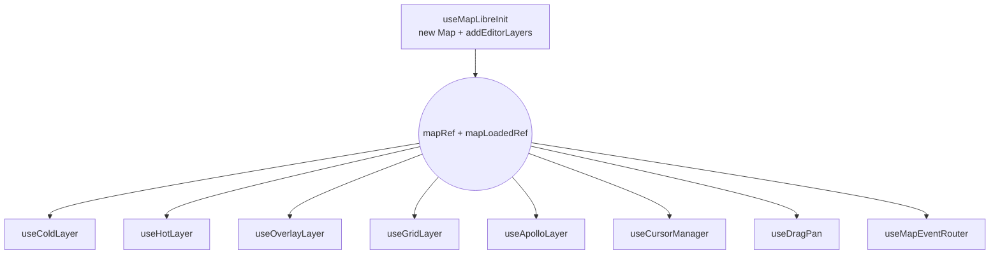

# useMapLibreInit

> Source: `src/hooks/useMapLibreInit.ts` · Submodules: `src/hooks/mapLibreInit/{layers,assets}.ts`

`useMapLibreInit` bootstraps the map runtime:

1. `new maplibregl.Map(...)` — constructs the singleton with
   `DARK_STYLE`.
2. `map.on('load')` — flips `mapLoadedRef.current = true` and calls
   `addEditorLayers(map)` to register the grid / cold / hot / overlay /
   snap source + layer set.
3. `addEditorLayers` first calls `registerRuntimeImages` to add three
   runtime images (`zebra-stripe`, `red-hatch`, `lane-arrow`) and then
   `registerMapIcons` to inject PNG icons.
4. Returns `mapRef` / `mapLoadedRef` so every downstream hook can hook
   side effects onto these two handles.
5. Reactively subscribes to `settingsStore.laneArrowSpacing` and
   propagates it to the `cold-lane-arrows` layer's `symbol-spacing`.

The contract exposed to callers is intentionally tiny — pass in
`containerRef` and consume `{ mapRef, mapLoadedRef }`.

## Initial viewport constants

`readMapCenter()` and `readMapZoom()` (from `@/store/settingsStore`)
load the last-saved viewport. First-run defaults point at a known
on-shore test landmark to avoid stranding the user mid-ocean.

## Signature

```ts
function useMapLibreInit(containerRef: React.RefObject<HTMLDivElement | null>): {
  mapRef: React.RefObject<maplibregl.Map | null>;
  mapLoadedRef: React.RefObject<boolean>;
};
```

## Parameters

| Name           | Type                                | Role                                                |
| -------------- | ----------------------------------- | --------------------------------------------------- |
| `containerRef` | `RefObject<HTMLDivElement \| null>` | DOM container; the `<div>` rendered by `MapCanvas`. |

## Returns

| Field          | Type                                | Notes                                                            |
| -------------- | ----------------------------------- | ---------------------------------------------------------------- |
| `mapRef`       | `RefObject<maplibregl.Map \| null>` | Singleton ref; reset to `null` on unmount.                       |
| `mapLoadedRef` | `RefObject<boolean>`                | `true` once `map.on('load')` fired; reset to `false` on unmount. |

## Side effects

| Effect                                                                          | Trigger                   | Cleanup                     |
| ------------------------------------------------------------------------------- | ------------------------- | --------------------------- |
| `new maplibregl.Map({...})`                                                     | Mount                     | `map.remove()`              |
| `map.on('load', ...)` flips `mapLoadedRef = true` and calls `addEditorLayers`   | Mount + load              | Disposed via `map.remove()` |
| `addEditorLayers(map)`                                                          | `load`                    | Not undone explicitly       |
| `map.setLayoutProperty('cold-lane-arrows', 'symbol-spacing', laneArrowSpacing)` | `laneArrowSpacing` change | —                           |

## Bootstrap sequence

```
mount
  ├── containerRef present? yes → new Map(container, DARK_STYLE,
  │                                       center=readMapCenter(),
  │                                       zoom=readMapZoom(),
  │                                       doubleClickZoom=false)
  ├── map.on('load', ...) →
  │     ├── mapLoadedRef.current = true
  │     └── addEditorLayers(map)
  │           ├── registerRuntimeImages(map)
  │           │     ├── addStripeImage(zebra-stripe)
  │           │     ├── addStripeImage(red-hatch)
  │           │     ├── addImage(lane-arrow, sdf=true)
  │           │     └── registerMapIcons(map)  // PNG icons
  │           ├── addGridLayer
  │           ├── addColdLayers
  │           ├── addHotLayers
  │           ├── addOverlayLayers
  │           └── addSnapLayers
  └── mapRef.current = map

useEffect (laneArrowSpacing)
  └── if mapLoaded: setLayoutProperty('cold-lane-arrows', 'symbol-spacing', spacing)

unmount
  ├── map.remove()
  ├── mapRef.current = null
  └── mapLoadedRef.current = false
```

## Invariants

### Single-shot init

```ts
// useMapLibreInit.ts:11-35
useEffect(() => {
  if (!containerRef.current) return;
  const map = new maplibregl.Map({...});
  // ...
}, []);  // eslint-disable-next-line react-hooks/exhaustive-deps
```

Empty dependencies are intentional — `containerRef` is a ref (non-
reactive), and `new Map` is expensive (boots a GPU context); we never
want to reinitialize on prop changes.

### `doubleClickZoom: false`

```ts
// useMapLibreInit.ts:19
doubleClickZoom: false,
```

Drawing states use `dblclick` as the CONFIRM boundary; MapLibre's native
double-click zoom must be disabled.

### `addEditorLayers` is one-shot

`registerRuntimeImages`, `addGridLayer`, `addColdLayers`, etc. call
`map.addImage` / `map.addSource` / `map.addLayer`; MapLibre rejects
duplicate IDs. They run exactly once, in the `map.on('load')` callback.
Subsequent layer mutations belong to the dedicated layer hooks.

## `DARK_STYLE`

```ts
// mapLibreInit/assets.ts:9-21
export const DARK_STYLE: maplibregl.StyleSpecification = {
  version: 8,
  name: 'dark-blank',
  glyphs: 'https://demotiles.maplibre.org/font/{fontstack}/{range}.pbf',
  sources: {},
  layers: [{ id: 'background', type: 'background', paint: { 'background-color': '#1a1a2e' } }],
};
```

Pure dark blank. For Apollo HD-map editing the absence of a base map is
itself a feature — fewer distractions, focus on the user's lane data.

## Runtime images

| Name           | Purpose                    | How it's built                                                    |
| -------------- | -------------------------- | ----------------------------------------------------------------- |
| `zebra-stripe` | Crosswalk fill pattern     | `addStripeImage` generates a 16×16 RGBA tile                      |
| `red-hatch`    | clear-area diagonal hatch  | `addStripeImage` diagonal mode                                    |
| `lane-arrow`   | lane direction arrow (SDF) | `createArrowSDF` paints with canvas2D, registered with `sdf:true` |

After SDF registration, the `cold-lane-arrows` layer can recolor the
arrow via `icon-color`.

## Reactive `laneArrowSpacing`

```ts
// useMapLibreInit.ts:37-42
const laneArrowSpacing = useSettingsStore((s) => s.laneArrowSpacing);
useEffect(() => {
  const map = mapRef.current;
  if (!map || !mapLoadedRef.current) return;
  map.setLayoutProperty('cold-lane-arrows', 'symbol-spacing', laneArrowSpacing);
}, [laneArrowSpacing]);
```

Tweaking "arrow spacing" in settings flows directly into the style
without touching GeoJSON. The layer registration also reads
`useSettingsStore.getState().laneArrowSpacing` as its initial value
(`mapLibreInit/layers.ts:133`).

## Call site

```tsx
// src/components/map/MapCanvas.tsx:33
const { mapRef, mapLoadedRef } = useMapLibreInit(containerRef);
```

`MapCanvas` owns the `containerRef` and passes the two refs into every
downstream layer hook: `useColdLayer`, `useHotLayer`, `useOverlayLayer`,
`useGridLayer`, `useApolloLayer`, `useCursorManager`, `useDragPan`.

## Failure modes

| Symptom                       | Root cause                                      | Fix                                                      |
| ----------------------------- | ----------------------------------------------- | -------------------------------------------------------- |
| No layers render              | `addEditorLayers` fired before `map.on('load')` | Always gate on `mapRef.current` + `mapLoadedRef.current` |
| Double-click zooms the map    | `doubleClickZoom` not disabled                  | See line 19                                              |
| Lane arrows turn black / thin | `lane-arrow` registered without `sdf:true`      | See `assets.ts:74`                                       |
| Glyph CORS errors             | `glyphs` points to a 3rd-party CDN              | Self-host the fontstack                                  |

## See also

- [`useColdLayer`](./use-cold-layer.md)
- [`useGridLayer`](./use-grid-layer.md)
- [Settings store](../store/settings-store.md)
- [`mapIcons`](../lib/map-icons.md)

## Cooperation with other hooks



Every layer hook assumes `addEditorLayers` has already registered the
corresponding sources / layers. The fixed call order in
`MapCanvas.tsx` is:

1. `useMapLibreInit` — creates map + installs layers
2. `useDrawCommit` — does not depend on mapRef
3. `useMapEventRouter` — subscribes to map events
4. cold / hot / overlay / grid / apollo layer hooks — write source data
5. `useCursorManager` / `useDragPan` — modify MapLibre behaviour

## Glyph CDN caveat

`DARK_STYLE.glyphs` points at `https://demotiles.maplibre.org/font/...`.
Production guidance:

- Self-host the fontstack (avoid 3rd-party rate limits or takedowns).
- Or omit `glyphs` (if the cold layer never renders text symbols).

The cold-labels layer currently uses `icon-image` instead of text
symbols, so glyphs only occasionally service MapLibre's internal
attribution. Impact is limited but non-zero.

## Source map

| Concern                          | Lines                            |
| -------------------------------- | -------------------------------- |
| Map instance creation            | `useMapLibreInit.ts:14-20`       |
| `load` handler                   | `useMapLibreInit.ts:22-25`       |
| `mapRef` cleanup                 | `useMapLibreInit.ts:28-32`       |
| Reactive `laneArrowSpacing` sync | `useMapLibreInit.ts:37-42`       |
| `DARK_STYLE`                     | `mapLibreInit/assets.ts:9-21`    |
| `createArrowSDF`                 | `mapLibreInit/assets.ts:23-38`   |
| `addStripeImage`                 | `mapLibreInit/assets.ts:40-69`   |
| `registerRuntimeImages`          | `mapLibreInit/assets.ts:71-76`   |
| `addGridLayer`                   | `mapLibreInit/layers.ts:8-25`    |
| `addColdLayers`                  | `mapLibreInit/layers.ts:27-144`  |
| `addHotLayers`                   | `mapLibreInit/layers.ts:146-183` |
| `addOverlayLayers`               | `mapLibreInit/layers.ts:185-232` |
| `addSnapLayers`                  | `mapLibreInit/layers.ts:234-268` |
| `addEditorLayers` entry          | `mapLibreInit/layers.ts:270-277` |
