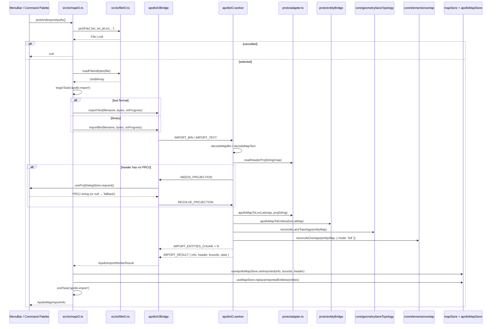

# Import / Apollo Base Map

> The editor has **no** standalone `parseBaseMap()` function. Today's
> entry is `pickAndImportApollo` in `src/io/mapIO.ts`, which routes
> decode + projection + entity bridge + reconcile through
> `apolloIO.worker` via `apolloIOBridge`.

## Exported symbols

```ts
// src/io/mapIO.ts
export function pickAndImportApollo(): Promise<ApolloMapImportInfo | null>;

// src/store/apolloMapStore.ts
export interface ApolloMapImportInfo {
  filename: string;
  counts: Record<string, number>;
  projString: string;
  importedAt: number;
}
```

Returns `null` when the file picker is cancelled. Import failures
also return `null`; the human-readable reason is recorded in
`apolloMapStore.lastError`.

> Source: `src/io/mapIO.ts:54-73`.

## Sequence



## `ApolloImportStats`

The worker reports per-phase timings:

| Field        | Meaning                               |
| ------------ | ------------------------------------- |
| `decodeMs`   | protobuf decode                       |
| `projectMs`  | UTM ENU → WGS84 projection            |
| `bridgeMs`   | `apolloMapToEntities`                 |
| `topologyMs` | `reconcileLaneTopology` (full)        |
| `overlapMs`  | `reconcileOverlaps({ mode: 'full' })` |
| `totalMs`    | total `runImport`                     |

~1.5–2.5 s for ~50k-entity maps; the main thread stays responsive
because the work is in the worker.

## Projection dialog

When `header.projection.proj` is missing the worker emits
`NEEDS_PROJECTION`:

- `apolloIOBridge` calls `useProjDialogStore.request()`, which prompts
  with sunnyvale / beijing / shanghai / shenzhen presets and a
  free-form PROJ.4 input.
- User pick → `RESOLVE_PROJECTION` reply.
- User cancel → fallback to `UTM_PRESETS.beijing`.

## Errors

| Cause                 | Surface                                               |
| --------------------- | ----------------------------------------------------- |
| Picker cancelled      | returns `null`, no error toast                        |
| Decode/verify failure | `setError('Import failed: ${msg}')` + `console.error` |
| Timeout (>10 min)     | bridge rejects with `Apollo IO request timed out…`    |
| Worker fatal error    | bridge rejects every pending request, then re-spawns  |

## See also

- [io/map-io](/en/api/io/map-io) — file containing
  `pickAndImportApollo` and the matching exporters.
- [io/apollo-io-bridge](/en/api/io/apollo-io-bridge) — worker
  gateway.
- [io/proto-adapter](/en/api/io/proto-adapter) — projection +
  recursive PointENU walk.
- [io/proto-entity-bridge](/en/api/io/proto-entity-bridge) — decoded
  plain object → typed `MapEntity[]`.
