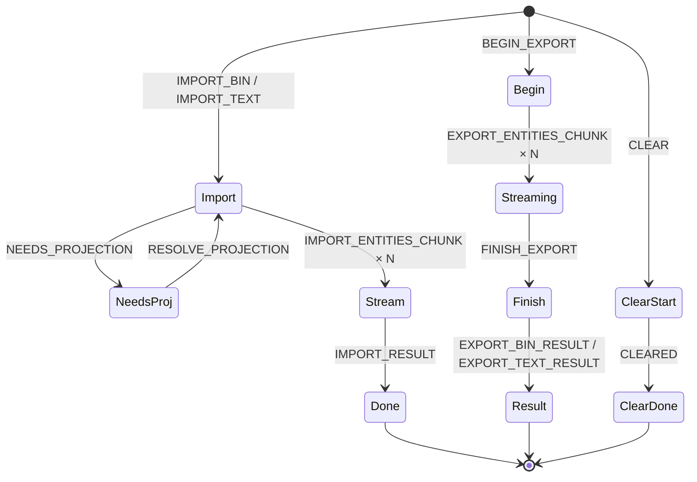

# io / apollo-io-protocol

`src/io/apolloIOProtocol.ts` defines the IPC contract for the
apolloIO worker. It exports two discriminated unions —
`ApolloIORequest` (main → worker) and `ApolloIOResponse` (worker →
main) — so both ends stay exhaustively type-checked.

## Base types

```ts
export interface ApolloIOProgress {
  label: string;
  detail?: string;
  progress: number | null;
}

export interface ApolloImportStats {
  decodeMs: number;
  projectMs: number;
  bridgeMs: number;
  topologyMs: number;
  overlapMs: number;
  totalMs: number;
}

export type ApolloExportFormat = 'bin' | 'txt';
```

## Requests (main → worker)

```ts
export type ApolloIORequest =
  | { type: 'IMPORT_BIN'; requestId: string; filename: string; bytes: Uint8Array }
  | { type: 'IMPORT_TEXT'; requestId: string; filename: string; bytes: Uint8Array }
  | { type: 'RESOLVE_PROJECTION'; requestId: string; projString: string }
  | {
      type: 'BEGIN_EXPORT';
      requestId: string;
      format: ApolloExportFormat;
      projString: string;
      total: number;
    }
  | {
      type: 'EXPORT_ENTITIES_CHUNK';
      requestId: string;
      entities: MapEntity[];
      offset: number;
      total: number;
    }
  | { type: 'FINISH_EXPORT'; requestId: string }
  | { type: 'CLEAR'; requestId: string };
```

## Responses (worker → main)

```ts
export type ApolloIOResponse =
  | { type: 'PROGRESS'; requestId: string; progress: ApolloIOProgress }
  | { type: 'NEEDS_PROJECTION'; requestId: string }
  | {
      type: 'IMPORT_ENTITIES_CHUNK';
      requestId: string;
      entities: MapEntity[];
      offset: number;
      total: number;
    }
  | {
      type: 'IMPORT_RESULT';
      requestId: string;
      info: ApolloMapImportInfo;
      header: ApolloMapHeader | null;
      bounds: ApolloMapBounds | null;
      stats: ApolloImportStats;
    }
  | { type: 'EXPORT_BIN_RESULT'; requestId: string; bytes: Uint8Array }
  | { type: 'EXPORT_TEXT_RESULT'; requestId: string; bytes: Uint8Array }
  | { type: 'CLEARED'; requestId: string }
  | { type: 'ERROR'; requestId: string; message: string; stack?: string };
```

> Source: `src/io/apolloIOProtocol.ts:1-73`.

## State machine



Any state can transition to `ERROR { message, stack? }`.

## Invariants

- `requestId` must be unique per request and is generated by the
  bridge side; the worker does not rewrite it.
- `IMPORT_BIN` / `IMPORT_TEXT` `bytes.buffer` is transferable —
  unreadable on the main thread after `postMessage`.
- `EXPORT_BIN_RESULT` / `EXPORT_TEXT_RESULT` `bytes` is also
  transferable; the worker cannot read its own buffer after sending.
- `IMPORT_ENTITIES_CHUNK.entities[i]` is structuredClone-ed across
  the boundary; mutations in the worker after sending are not
  visible to the main thread.

## See also

- [io/apollo-io-bridge](/en/api/io/apollo-io-bridge) — Promise
  gateway that produces and consumes these messages.
- [Import / Parse Base Map](/en/api/import-parse-base-map) — full
  import flow, end to end.
