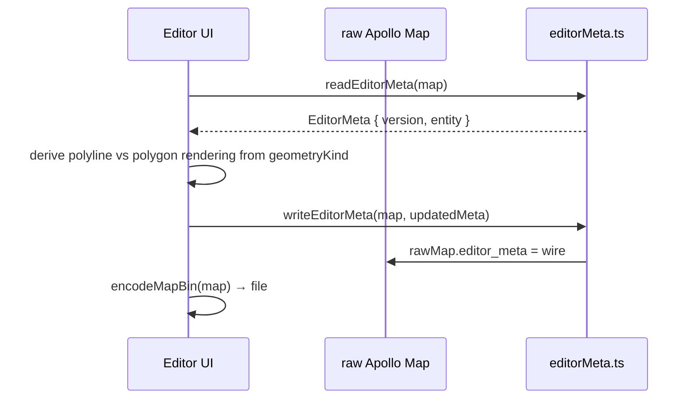

# io / proto-editor-meta

`src/io/proto/editorMeta.ts` reads and writes Apollo Map's
`editor_meta` field (proto field number 1000). This is a custom
extension Apollo Map Studio uses to persist editor-only hints (e.g.
"this entity is a closed polygon, not a polyline"). Apollo runtime
ignores the field; proto2's preserve-unknown-fields semantics keep
it across round-trip, so a single `.bin` works in both worlds.

## Exported symbols

```ts
export type EditorGeometryKind = 'LINESTRING' | 'POLYGON';

export interface EditorEntityMeta {
  geometryKind?: EditorGeometryKind;
}

export interface EditorMeta {
  version: number;
  entity: Record<string, EditorEntityMeta>;
}

export const EDITOR_META_VERSION: 1;

export function readEditorMeta(rawMap: Record<string, unknown>): EditorMeta;
export function writeEditorMeta(rawMap: Record<string, unknown>, meta: EditorMeta): void;
export function entityKey(entityType: string, id: string): string;
```

> Source: `src/io/proto/editorMeta.ts:1-84`.

## Wire format

```proto
message EditorMeta {
  optional uint32 version = 1;
  map<string, EditorEntityMeta> entity = 2;
}
message EditorEntityMeta {
  optional EditorGeometryKind geometry_kind = 1;
}
enum EditorGeometryKind {
  EDITOR_GEOMETRY_KIND_UNSPECIFIED = 0;
  LINESTRING = 1;
  POLYGON = 2;
}
```

`read` / `write` translate between the editor's camelCase + string
enum form and the wire's `keepCase: true` snake_case + numeric enum
form.

## `readEditorMeta(rawMap)`

Returns `{ version, entity }`. Missing `editor_meta` falls back to
`{ version: EDITOR_META_VERSION, entity: {} }`. Unknown
`geometry_kind` numerics are silently dropped.

## `writeEditorMeta(rawMap, meta)`

Sets `rawMap.editor_meta = wire`. `encodeEntity` does **not** emit
`geometry_kind: 0` when `geometryKind` is unset, preserving wire
fidelity.

## `entityKey(entityType, id)`

```ts
return `${entityType}:${id}`;
```

Two entities with the same id but different types do not collide
because the key bakes both in.

## Workflow



## Limitations

- Today only `geometryKind` is supported. Adding new fields requires
  bumping `EDITOR_META_VERSION` and providing forward-compat
  handling in `readEditorMeta`.
- Importing legacy Apollo `.bin` files without `editor_meta`
  defaults `wire.version` to `EDITOR_META_VERSION`.
- Apollo runtime ignores the field — safe to leave in production
  builds.

## See also

- [Proto / Schema](/en/api/proto-schema) — schema layout, including
  `editor/editor_meta.proto`.
- [io/map-io](/en/api/io/map-io) — entry that triggers
  `readEditorMeta` after import and `writeEditorMeta` before
  export.
