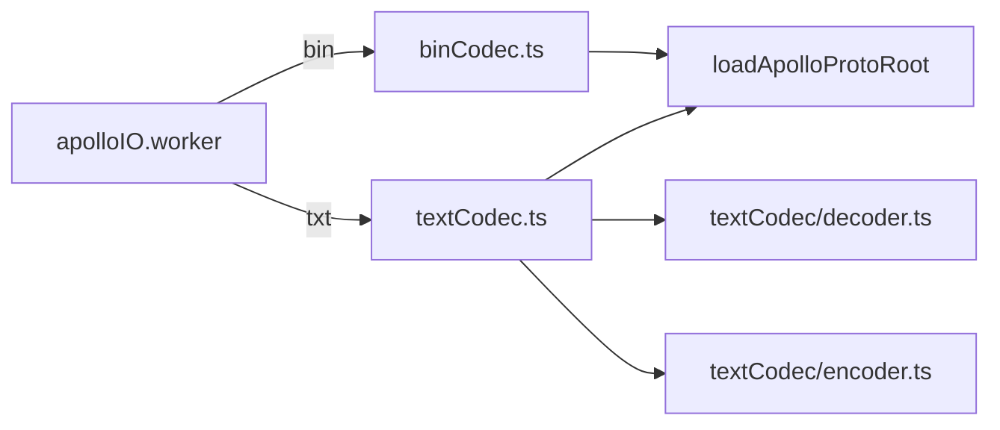

# Proto / Codec

Apollo HD-map has two on-disk shapes:

- `*.bin` — binary protobuf (production deployments);
- `*.txt` / `*.pb.txt` — protobuf text format (debugging).

The editor exposes one unified 4-function entry. Source files:
`src/io/proto/binCodec.ts` and `src/io/proto/textCodec.ts`.

## Exported symbols

```ts
export function decodeMapBin(bytes: Uint8Array): Promise<Record<string, unknown>>;
export function encodeMapBin(obj: Record<string, unknown>): Promise<Uint8Array>;
export function decodeMapText(text: string): Promise<Record<string, unknown>>;
export function encodeMapText(obj: Record<string, unknown>): Promise<string>;

// Lower-level (textCodec internals)
export function decodeMessage(type: protobuf.Type, text: string): Record<string, unknown>;
export function encodeMessage(type: protobuf.Type, msg: unknown, level?: number): string;
```

> Source: `src/io/proto/binCodec.ts:1-23` and `src/io/proto/textCodec.ts:1-16`.

## `decodeMapBin(bytes)`

```ts
const Map = await getMapType();
const msg = Map.decode(bytes);
return Map.toObject(msg, {
  longs: Number,
  enums: Number,
  defaults: false,
  arrays: true,
  objects: true,
});
```

- `longs: Number` — int64 → JS number (no overflow values in Apollo
  HD-map fields);
- `enums: Number` — numeric enums (aligned with the `*_INV` tables in
  `entityBridge/enums.ts`);
- `defaults: false` — leaves unset fields absent so a re-encode of an
  unmodified import stays byte-equal where possible;
- `arrays: true` / `objects: true` — repeated and sub-message fields
  always come back as containers, removing null guards downstream.

## `encodeMapBin(obj)`

```ts
const Map = await getMapType();
const err = Map.verify(obj);
if (err) throw new Error(`Map.verify failed: ${err}`);
const msg = Map.fromObject(obj);
return Map.encode(msg).finish();
```

`Map.verify` throws on schema mismatch — wrong types, enum out of
range, missing required fields. Common pitfalls:

- Forgetting to wrap an id (`{ id: 'x' }` instead of
  `{ id: { id: 'x' } }`);
- Using a string enum value in code that expected the numeric
  one (entityBridge's `*_INV` table is the source of truth).

## `decodeMapText(text)`

Delegates to `decodeMessage(Map, text)`. The implementation is a
hand-written parser in `textCodec/` — see
[io/proto-codec-text](/en/api/io/proto-codec-text) for token rules,
escape handling, and skip semantics.

Schema-unknown fields are silently skipped (forward compatibility).
`#` line comments are eaten by `skipWhitespaceAndComments`.

## `encodeMapText(obj)`

Delegates to `encodeMessage(Map, obj, 0)`. Output style:

- 2-space indent;
- nested message: `name { ... }` (no colon);
- enum: symbolic name when known, else numeric string;
- bytes / string: latin1-escaped quoted string;
- floats: `inf` / `-inf` / `nan` literals.

## Flow



## Error cases

| Cause                       | Surface                                                 |
| --------------------------- | ------------------------------------------------------- |
| Schema mismatch on encode   | `Error: Map.verify failed: ...`                         |
| Bad text near a known field | `Error: Expected kind ..., got kind "value" near pos N` |
| Unknown text field          | Silently skipped                                        |
| Wrong id wrap               | Caught by `Map.verify`                                  |

## Tests

`src/io/proto/__tests__/binRoundtrip.test.ts` round-trips real Apollo
maps and asserts binary byte equivalence. `textRoundtrip.test.ts` and
`curveFidelity.test.ts` cover text-format corner cases, group syntax,
and geometry-sensitive round-trip fidelity.

## See also

- [Proto / Loader](/en/api/proto-loader) — schema source for
  `getMapType()`.
- [io/proto-adapter](/en/api/io/proto-adapter) — projection applied
  on the decoded plain object before entity bridging.
- [io/proto-entity-bridge](/en/api/io/proto-entity-bridge) — the next
  step that converts the plain object into `MapEntity[]`.
