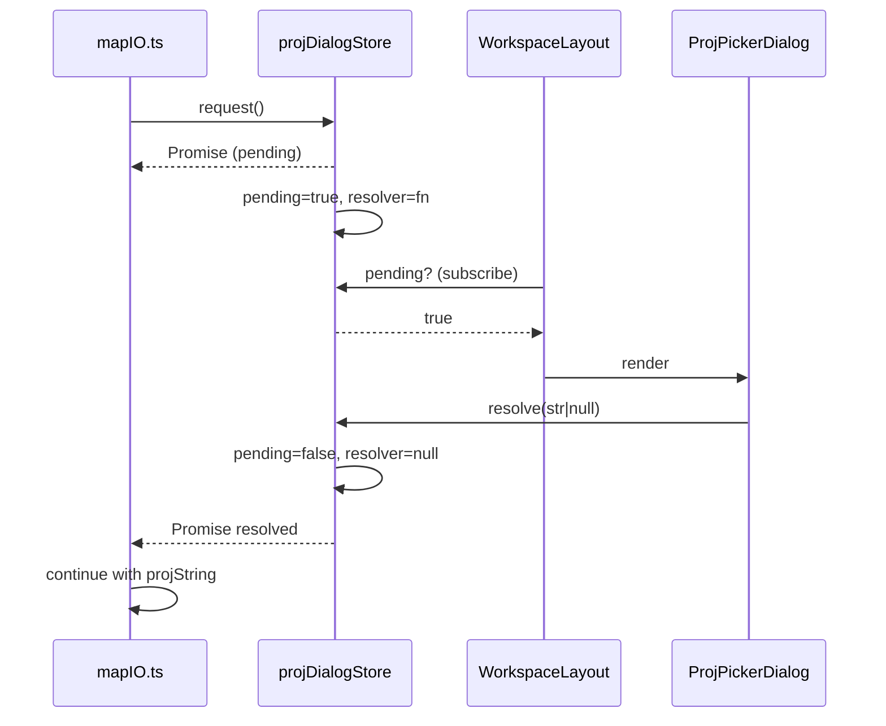
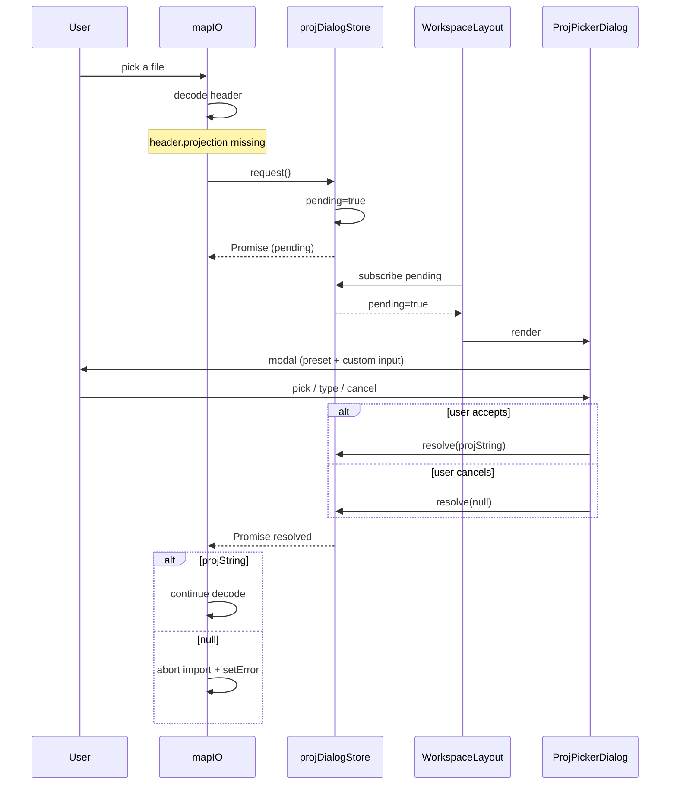

# `projDialogStore` — PROJ.4 picker modal

> Source: `src/store/projDialogStore.ts` · 44 lines · not undoable

## Purpose

Real-world Apollo `base_map` exports often omit `header.projection.proj`. Refusing to import would dead-end the user; auto-guessing is risky. The editor takes a third option: ask.

```
mapIO decodes header → projection missing → projDialogStore.request()
   ↓
WorkspaceLayout sees pending=true → mounts ProjPickerDialog
   ↓
User picks a preset or types a PROJ string → resolver(str)
   ↓
mapIO awaits the promise and continues decoding with the chosen string
```

`projDialogStore` wraps this "fire from outside, answer from inside, caller awaits" pattern into a Promise.

## Public API

| Symbol               | Kind   | Signature                                   | Summary                                |
| -------------------- | ------ | ------------------------------------------- | -------------------------------------- |
| `useProjDialogStore` | hook   | `() => ProjDialogState & ProjDialogActions` | Zustand store                          |
| `request()`          | action | `() => Promise<string \| null>`             | Caller (`mapIO`) entry point           |
| `resolve(value)`     | action | `(string \| null) => void`                  | Dialog calls this with `OK`/`Cancel`   |
| `pending`            | state  | `boolean`                                   | True while a request is in-flight      |
| `resolver`           | state  | `((value: string \| null) => void) \| null` | Stored Promise resolver (semi-private) |

## Detailed entries

### `interface ProjDialogState`

```ts
interface ProjDialogState {
  pending: boolean;
  resolver: ((value: string | null) => void) | null;
}
```

`resolver` is on state (rather than captured in closure) so the preempt logic in `request()` can see it without a `useRef`. External code should read only `pending`.

### `request(): Promise<string | null>`

```ts
request() {
  const prev = get().resolver;
  if (prev) prev(null);   // pre-empt: cancel any in-flight request
  return new Promise<string | null>((resolve) => {
    set({ pending: true, resolver: resolve });
  });
}
```

Pre-empt design: if a request is already pending (e.g. user opens a second file before answering the first dialog), settle the old promise with `null` (caller treats null as cancel) and start a new one. This avoids the "two dialogs stacked" failure mode.

### `resolve(value)`

```ts
resolve(value) {
  const { resolver } = get();
  if (resolver) resolver(value);
  set({ pending: false, resolver: null });
}
```

Called by `ProjPickerDialog`:

- OK → `resolve(projString)`
- Cancel → `resolve(null)` — `mapIO` aborts the import on null

## Sequence



## Internal notes

- Storing the resolver on state rather than in a closure makes it visible in Redux DevTools / Zustand devtools.
- The dialog component reads `pending` for mount, never `resolver` — encapsulation.
- No timeout: a never-resolved promise hangs forever. The caller must wire its own cancel-on-unmount.

## Side effects

- No IPC, no localStorage, no timers.
- Holds the resolver Promise reference until `resolve()` runs.

## Test coverage

No standalone test. Covered indirectly by `mapIO.test.ts` when exercising the no-projection branch (mocked `request()` returns a fixed string).

## Consumers

- `src/io/mapIO.ts` — `await request()` on missing projection
- `src/components/layout/WorkspaceLayout.tsx` — `useProjDialogStore(s => s.pending)` to mount the dialog
- `src/components/dialogs/ProjPickerDialog.tsx` — calls `resolve`

## Source map

| Lines | Content             |
| ----- | ------------------- |
| 14–18 | `ProjDialogState`   |
| 20–23 | `ProjDialogActions` |
| 25–43 | Store factory       |

## Usage pattern

```ts
// mapIO.ts
async function resolveProjString(header: ApolloMapHeader | null): Promise<string | null> {
  const proj = (header?.projection as { proj?: string } | undefined)?.proj;
  if (proj) return proj;
  // header lacks a projection — ask the user
  return useProjDialogStore.getState().request();
}
```

`null` is the user-cancelled signal — abort the surrounding import flow.

## Full call chain



## Cleanup on unmount

If the caller unmounts before the dialog responds (route switch / window close), it must `resolve(null)` to settle any in-flight Promise:

```tsx
useEffect(() => {
  return () => {
    if (useProjDialogStore.getState().pending) {
      useProjDialogStore.getState().resolve(null);
    }
  };
}, []);
```

Otherwise the Promise hangs forever and holds the caller's stack frame in memory.

## Non-idiomatic zustand usage

Storing a Promise resolver inside zustand state is unusual — zustand normally only holds serialisable data. The trade-offs that justify it:

1. **DevTools visibility** — easy to see whether a resolver is registered.
2. **Pre-empt logic** — `request()` needs to settle the prior resolver before installing the new one; closures would hide it.
3. **No reasonable alternative** — useRef would split state into two stores; we picked one.

Cost: `resolver` must not be externally mutated. Convention plus the TS shape enforce this loosely.

## See also

- [`apolloMapStore`](./apollo-map-store.md) — the chosen PROJ ends up in `info.projString`
- `mapIO.importBaseMap` — the actual caller
- `src/components/dialogs/ProjPickerDialog.tsx` — modal component
- `src/components/layout/WorkspaceLayout.tsx` — mount site
