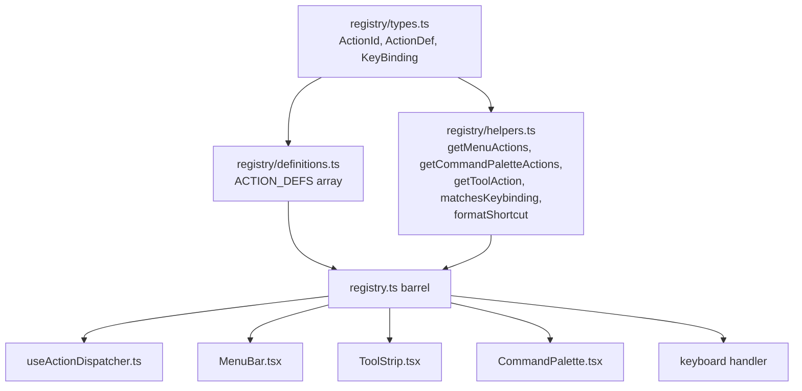
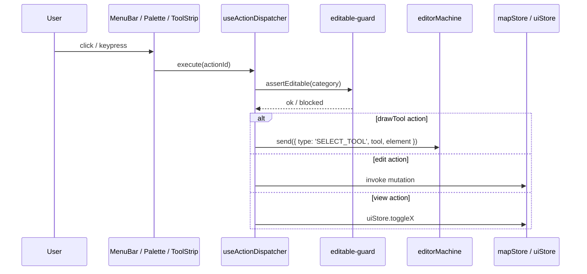

# Action Registry

`src/core/actions/registry.ts` is the **single source of truth** for every
user-executable command (R5 closure). MenuBar, command palette, ToolStrip,
keyboard handler and any future voice / API trigger all read metadata from
the same table — guaranteeing the label, shortcut, and icon never drift
across consumers.

## 1. Purpose & invariants

::: tip Goals

- Declare once, consume everywhere (MenuBar / ToolStrip / CommandPalette /
  keyboard handler).
- Adding an action = one row + one dispatcher case.
- Type-safe: `ActionId` is a literal union — typos become compile errors.
- Platform-aware: Mac glyphs (⌘⇧⌥⌃) and Win/Linux text (Ctrl+ Shift+ Alt+)
  swap automatically.
  :::

::: warning Invariants

- Every menu entry / tool button / palette row must be backed by an
  `ActionDef`. No raw strings + manual setState calls.
- `useActionDispatcher` is the only hook that imports `ACTION_DEFS`.
  Components consume `ACTION_MAP` / `getMenuActions` /
  `getCommandPaletteActions`, never the array directly.
- The dispatcher must call `assertEditable()` before any edit-class action.
  :::

## 2. Module map



## 3. ActionDef shape

```ts
// registry/types.ts:29-43
export interface ActionDef {
  id: ActionId; // literal union
  label: string; // UI text
  category: ActionCategory; // 'file' | 'edit' | 'view' | 'tool' | 'selection'
  shortcut?: string; // Mac glyphs e.g. '⇧⌘Z'
  keybinding?: KeyBinding; // actual event matcher
  icon?: IconType; // react-icons/fa6
  inCommandPalette: boolean;
  menu?: string; // 'File' | 'Edit' | 'View'
  menuOrder?: number;
  isToggle?: boolean;
  drawTool?: DrawTool; // auto-dispatch SELECT_TOOL
  uiSlot?: ToolStripSlot; // 'selection' | 'view'
  uiOrder?: number;
}
```

`KeyBinding`:

```ts
// registry/types.ts:45-51
export interface KeyBinding {
  key: string;
  ctrl?: boolean;
  shift?: boolean;
  alt?: boolean;
  global?: boolean; // fires even when input/textarea has focus
}
```

## 4. Public surface

| Symbol                     | Origin                       | Role                                       |
| -------------------------- | ---------------------------- | ------------------------------------------ |
| `ACTION_DEFS`              | `registry/definitions.ts:22` | The definition array (single source)       |
| `ACTION_MAP`               | `registry/helpers.ts:10`     | `Map<ActionId, ActionDef>` for O(1) lookup |
| `getActionsByCategory`     | `:12`                        | Filter by category                         |
| `getMenuActions`           | `:16`                        | Filter by menu, sort by menuOrder          |
| `getMenuNames`             | `:22`                        | Distinct menu names (insertion order)      |
| `getCommandPaletteActions` | `:30`                        | Only `inCommandPalette = true`             |
| `getKeyBindingActions`     | `:34`                        | Only those with `keybinding`               |
| `getToolAction`            | `:38`                        | Reverse lookup by DrawTool                 |
| `getToolStripSlotActions`  | `:42`                        | Filter by uiSlot, sort by uiOrder          |
| `matchesKeybinding`        | `:48`                        | Match a KeyboardEvent against a KeyBinding |
| `formatShortcut`           | `:98`                        | Mac → Win/Linux string conversion          |
| `isMacPlatform`            | `:69`                        | UA sniffing (memoised)                     |

## 5. ACTION_DEFS at a glance

| ActionId               | Label                    | Shortcut | Category  | Menu | drawTool / uiSlot        |
| ---------------------- | ------------------------ | -------- | --------- | ---- | ------------------------ |
| `importApollo`         | Import Apollo Map...     | —        | file      | File | —                        |
| `exportApolloBin`      | Export Apollo Map (.bin) | ⌘S       | file      | File | —                        |
| `exportApolloText`     | Export Apollo Map (.txt) | ⇧⌘S      | file      | File | —                        |
| `settings`             | Settings                 | ⌘,       | file      | File | —                        |
| `undo`                 | Undo                     | ⌘Z       | edit      | Edit | —                        |
| `redo`                 | Redo                     | ⇧⌘Z      | edit      | Edit | —                        |
| `delete`               | Delete Selection         | ⌫        | edit      | Edit | —                        |
| `toggleGrid`           | Toggle Grid              | ⌘G       | view      | View | uiSlot=view              |
| `toggleSnap`           | Toggle Snap              | —        | view      | View | uiSlot=view              |
| `resetLayout`          | Reset Layout             | —        | view      | View | —                        |
| `commandPalette`       | Command Palette          | ⌘K       | view      | —    | —                        |
| `defaultMode`          | Default (Pan)            | H        | selection | —    | —                        |
| `connectLanes`         | Connect Lanes            | C        | edit      | Edit | —                        |
| `tool:drawPolyline`    | Draw Polyline            | P        | tool      | —    | drawTool=drawPolyline    |
| `tool:drawBezier`      | Draw Bezier              | B        | tool      | —    | drawTool=drawBezier      |
| `tool:drawArc`         | Draw Arc                 | A        | tool      | —    | drawTool=drawArc         |
| `tool:drawRotatedRect` | Draw Rectangle           | R        | tool      | —    | drawTool=drawRotatedRect |
| `tool:drawPolygon`     | Draw Polygon             | G        | tool      | —    | drawTool=drawPolygon     |
| `tool:drawCatmullRom`  | Draw CatmullRom          | —        | tool      | —    | drawTool=drawCatmullRom  |

## 6. Dispatch sequence



## 7. Internals

### 7.1 Platform-aware shortcuts

Authors register one canonical form (`⌘S`, `⇧⌘Z`). `formatShortcut` returns
the original on Mac; on Win/Linux it converts `⌘`/`⌃` → `Ctrl+`,
`⇧` → `Shift+`, `⌥` → `Alt+`. The matcher (`matchesKeybinding`) treats
`ctrlKey || metaKey` as the same modifier so dispatch logic stays
platform-agnostic.

### 7.2 MenuBar render

```ts
const menus = getMenuNames(); // ['File', 'Edit', 'View']
for (const m of menus) {
  const items = getMenuActions(m); // sorted by menuOrder
  // render <DropdownMenu> ...
}
```

### 7.3 CommandPalette

```ts
const actions = getCommandPaletteActions();
// One <Command.Item value={id}> per entry;
// keyboard navigation + execute(id).
```

### 7.4 ToolStrip buttons

`ToolStrip.tsx` uses `getToolAction(currentDrawTool)` to highlight the
active tool definition; `getToolStripSlotActions('view')` renders the
grid/snap toggles.

### 7.5 Keyboard handler

`useActionDispatcher` mounts a global `keydown` listener inside
`useEffect`, walks `getKeyBindingActions()`, and runs the first action whose
`matchesKeybinding(e, action.keybinding)` returns true. `preventDefault` is
called before `execute`. `global: true` means the binding fires even when an
`<input>` has focus (e.g. Ctrl+S always exports).

## 8. SOP for adding a new action

1. Add the ID to the `ActionId` union (`registry/types.ts:6-25`).
2. Append a row to `ACTION_DEFS` (`registry/definitions.ts:22`).
3. Add a `case` to `useActionDispatcher.execute` (drawTool actions are
   forwarded automatically via `drawTool` and `SELECT_TOOL`).
4. If a new element type is required, update `core/elements.ts`.
5. If the action is a toggle, implement `getToggleState(id)` in the
   dispatcher.
6. Run `pnpm typecheck && pnpm test`.

::: tip Naming convention

- `tool:*` prefix is reserved for draw tools.
- `category` should match the menu name unless the action is not in any
  menu.
  :::

## 9. Cross-system relationships

| Subsystem       | Touchpoint                                                              |
| --------------- | ----------------------------------------------------------------------- |
| FSM             | `drawTool` field → `SELECT_TOOL` event                                  |
| mapStore        | undo / redo / delete / import / export call store actions               |
| uiStore         | toggleGrid / toggleSnap / connectLanes                                  |
| WorkspaceLayout | resetLayout / settings / commandPalette use prop callbacks (not stored) |
| License         | `assertEditable()` inside the dispatcher                                |

## 10. Common pitfalls

::: danger Importing ACTION_DEFS directly from UI
Components must consume helper functions, not iterate the array. Otherwise a
future async-registry refactor (plugins) breaks every component.
:::

::: danger Duplicate menuOrder values
Sort order is undefined when two items share a menuOrder. Convention: step
of 10 (10, 20, 30...) leaves room for inserts.
:::

::: danger Wrong `key` field
`key` must be the lowercased `KeyboardEvent.key` (`'s'`, `'z'`, `'k'`,
`'delete'`, `','`). `'KeyS'` is the `code` property and never matches.
:::

::: danger Missing `inCommandPalette: false`
Actions that should not appear in the palette (e.g. Cmd+K itself) must set
`inCommandPalette: false` explicitly. Otherwise pressing Cmd+K with the
palette open re-fires the action.
:::

## 11. Source map

- `src/core/actions/registry.ts:1-22` — barrel
- `src/core/actions/registry/types.ts:1-52` — types and ID union
- `src/core/actions/registry/definitions.ts:22-222` — ACTION_DEFS
- `src/core/actions/registry/helpers.ts:1-108` — every helper
- `src/hooks/useActionDispatcher.ts` — dispatch and R1 CANCEL
- `src/components/layout/MenuBar.tsx` — consumes `getMenuActions`
- `src/components/layout/ToolStrip.tsx` — consumes
  `getToolAction`/`getToolStripSlotActions`
- `src/components/layout/panels/CommandPalette.tsx` — consumes
  `getCommandPaletteActions`

## 12. Dispatcher responsibility breakdown

```mermaid
flowchart TB
  Exec[execute(actionId)] --> Lookup[ACTION_MAP.get(actionId)]
  Lookup --> Cat{action.category}
  Cat -- file --> File[importApollo / exportApolloBin / settings]
  Cat -- edit --> Guard[assertEditable]
  Guard --> Edit[undo/redo/delete/connectLanes]
  Cat -- view --> View[toggleGrid / toggleSnap / resetLayout / commandPalette]
  Cat -- tool --> Tool[FSM.send SELECT_TOOL]
  Cat -- selection --> Sel[FSM.send DESELECT or back to idle]
```

- `assertEditable()` blocks when the license has expired or the editor is
  read-only.
- undo / redo follow the R1 CANCEL protocol.
- `tool:*` auto-forwards to the FSM; the dispatcher does not own draw
  state.

## 13. getToggleState implementation

Some actions are toggles (Grid / Snap / Connect Lanes / Default Pan); the
UI needs the current on/off. `getToggleState(id)` in the dispatcher returns
a boolean by ID:

```ts
// Conceptual sketch (see useActionDispatcher.ts for the real code)
function getToggleState(id: ActionId): boolean | undefined {
  switch (id) {
    case 'toggleGrid':
      return useUIStore.getState().gridEnabled;
    case 'toggleSnap':
      return useUIStore.getState().snapEnabled;
    case 'connectLanes':
      return useUIStore.getState().connectMode.active;
    case 'defaultMode':
      return useSelector(actorRef, (s) => s.value === 'idle');
    default:
      return undefined;
  }
}
```

## 14. CommandPalette and fuzzy search

`cmdk` ships built-in fuzzy matching (contiguous match + character
weights). We did not write our own. Every `ActionDef.label` becomes a
palette candidate.

::: tip Naming suggestion
`label` should be a verb + object (`Toggle Grid`, not `Grid`) so fuzzy
matching has more signal.
:::

## 15. Internationalisation note

`label` is currently hard-coded English (memory: i18n not yet implemented).
A future i18next move could:

- Rewrite `label` to an i18n key (`'action.toggleGrid'`).
- Wrap helpers with a `t()` translation step.
  Out of scope for this milestone.

## 16. See also

- [Architecture Overview](./overview.md)
- [FSM Design](./fsm-design.md) — SELECT_TOOL and drawTool
- [State Management](./state-management.md) — undo / redo
- [Workspace Layout](./workspace-layout.md) — Settings / Reset / Palette
  entry points
- [License System](../../architecture/license-system.md) — assertEditable
