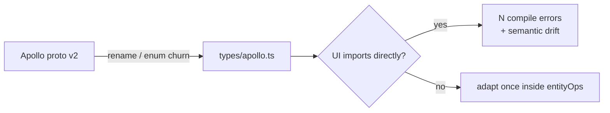
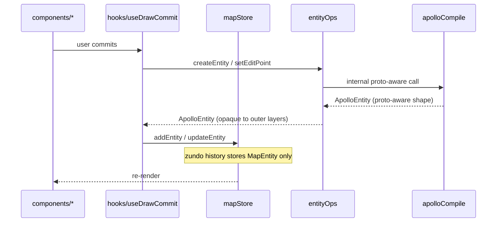

# Anti-Corruption Layer

The Apollo proto types in `src/types/apollo.ts` are the part of this codebase
**most exposed to outside change**: the Apollo HD-map proto is maintained by
upstream automotive repositories that we don't control. The moment UI / state
code reads proto fields directly (e.g. `entity.boundaryType[0].types`), a
proto v2 → v3 rename or enum reshuffle ripples through every React file that
ever read an `ApolloEntity`. This page describes that risk (audit-tracked as
**R2**), the adapter pattern we use (`src/lib/entityOps`), and a proposed CI
hook that turns the convention into a hard wall.

## 1. Purpose & invariants

::: tip Goals

- Confine knowledge of the Apollo proto schema to two directories:
  `core/geometry/apolloCompile.ts` and `lib/entityOps/*`.
- Higher layers (`store/`, `hooks/`, `components/`) see only a small set of
  proto-agnostic helpers: `getEditPoints`, `setEditPoint`, `compileEntity`,
  …
- A future protocol upgrade requires changes in entityOps internals only —
  zero edits in UI.
  :::

::: warning Invariants

- The ACL line: `src/components/**` and `src/hooks/**` must not import
  `@/core/geometry/apolloCompile` or specific `@/types/apollo` fields.
- Even `lib/*` outside `lib/entityOps` may not import apolloCompile —
  otherwise the ACL is bypassed sideways.
- A proto schema upgrade PR must update the typeguard / cascade-delete
  field lists in entityOps submodules in the same patch.
  :::

## 2. Why the ACL — R2 narrative



**Without the ACL** (counterfactual):

- `LaneInspector.tsx` reads `lane.predecessorIds` directly.
- `LaneDeleteCascade.ts` walks `lane.successorIds`.
- proto v2 splits `predecessorIds` into `topology.predecessor.id[]`.
- 30+ files require simultaneous edits, with merge conflicts and
  regression risk.

**With the ACL** (today):

- Higher layers call `getEditPoints` / `cascadeDeleteRefsFull` / `reparent`.
- The proto v2 upgrade only touches
  `lib/entityOps/cascadeDeleteRefs.ts` and `apolloCompile.ts`.
- Every other file is untouched.

## 3. Module map

```mermaid
graph TB
  subgraph Out[Outside the ACL (proto-agnostic)]
    UI[components/*]
    H[hooks/*]
    S[store/*]
  end
  subgraph Inner[ACL boundary]
    Facade[lib/entityOps.ts<br/>facade barrel]
    Edit[entityOps/edit.ts]
    Cascade[entityOps/cascadeDeleteRefs.ts]
    Reparent[entityOps/reparent.ts]
    Guards[entityOps/typeGuards.ts]
  end
  subgraph Core[Apollo proto zone]
    AC[core/geometry/apolloCompile.ts]
    Types[types/apollo.ts]
    Derive[core/elements/derive.ts]
  end
  UI --> Facade
  H --> Facade
  S --> Facade
  Facade --> Edit
  Facade --> Cascade
  Facade --> Reparent
  Facade --> Guards
  Edit --> AC
  Edit --> Derive
  Cascade --> Types
  Reparent --> Types
  Guards --> AC
```

## 4. Public-surface contract

Outer layers depend only on the 12 symbols re-exported by the
`@/lib/entityOps` barrel (full list:
[entityOps Module](./entityops.md)). That set is the **formal public API**
of the ACL — any PR that changes a signature in this list is a breaking
change and must be flagged in review.

| Category | Exported symbols                                                                                                                   |
| -------- | ---------------------------------------------------------------------------------------------------------------------------------- |
| Types    | `MapEntity`, `ApolloEntity`, `DrawingEntity`, `GeoPoint`, `BezierAnchorData`                                                       |
| Editing  | `compileEntity`, `createEntity`, `getEditPoints`, `setEditPoint`, `setAllEditPoints`, `moveEntity`, `deleteVertex`, `entityCoords` |
| Cascade  | `cascadeDeleteRefsFull`                                                                                                            |
| Reparent | `reparent`, `canReparent`                                                                                                          |
| Guards   | `isApolloEntityType`, `isAreaEntity`, `isDrawingEntity`, `isPolygonEditEntity`                                                     |

## 5. Internal adapter pattern

Each `entityOps` submodule is a **strategy / adapter** collection:

- `edit.ts` — branches on `isApolloEntityType` to dispatch to
  `apolloCompile` or to lib-local code.
- `cascadeDeleteRefs.ts` — dispatches on entityType into `cleanupLane`,
  `cleanupRoad`, `cleanupPNCJunction`, `decideOverlap`, etc.
- `reparent.ts` — a `${childType}:${targetKind}` keyed `HANDLERS` map.

Benefits:

1. **Unit-testable** — each cleanup is a pure function and can be fuzzed.
2. **New entity type without big rewrites** — adding a `signal:junction`
   reparent is one extra line in `HANDLERS`.
3. **Field renames stay local** — `cleanupLane` lists every topology
   field on a lane; renames only touch this one site.

## 6. Audit grep recipes

```bash
# 6.1 Red line: UI may not import apolloCompile
git grep "from '@/core/geometry/apolloCompile'" -- 'src/components/**' 'src/hooks/**'

# 6.2 Red line: UI may not import entityOps submodules (must use barrel)
git grep -nE "from '@/lib/entityOps/(edit|cascadeDeleteRefs|reparent|typeGuards)'" -- 'src/components/**' 'src/hooks/**'

# 6.3 Inside lib, only entityOps/* may import apolloCompile
git grep "from '@/core/geometry/apolloCompile'" -- 'src/lib/' | grep -v 'entityOps/'

# 6.4 Stores must not read Apollo proto fields directly (manual until lint catches up)
git grep -nE "(predecessorIds|successorIds|leftNeighborForwardIds)" -- 'src/store/**' 'src/components/**'
```

::: tip Any non-empty result blocks merge
Wire these into the GitHub Action PR check. Use
`git diff --name-only HEAD origin/main` to scope the searches and keep
runtime fast.
:::

## 7. Proposed CI hook (P2)

```yaml
# .github/workflows/ci.yml (draft)
- name: Anti-corruption layer audit
  run: |
    set -e
    fail() { echo "::error::ACL violation: $1"; exit 1; }
    git grep -q "from '@/core/geometry/apolloCompile'" -- 'src/components/**' 'src/hooks/**' \
      && fail "UI imports apolloCompile directly" || true
    git grep -nqE "from '@/lib/entityOps/(edit|cascadeDeleteRefs|reparent|typeGuards)'" -- 'src/components/**' 'src/hooks/**' \
      && fail "UI bypasses entityOps barrel" || true
    git grep -q "from '@/core/geometry/apolloCompile'" -- 'src/lib/' \
      | grep -v 'entityOps/' \
      && fail "lib outside entityOps imports apolloCompile" || true
    echo "ACL audit passed."
```

## 8. ACL interplay with undo, FSM, and workers



The worker boundary provides a second line of anti-corruption — workers
exchange entity ids and GeoJSON Features over the postMessage boundary,
never `ApolloEntity` objects.

## 9. Division of labour with the entityOps page

- This page: **why** the ACL exists, the risk narrative, the audit, the CI
  hook.
- [entityOps Module](./entityops.md): **how** it's implemented — every
  symbol's behaviour.

The two cross-reference each other.

## 10. Common pitfalls

::: danger UI shortcut: `keyof MapEntity` gymnastics
Even when imports come via `@/lib/entityOps`, writing
`entity.predecessorIds` still hard-codes a proto field name into the UI.
The rule: **every business field needs a helper**; if it doesn't have one,
add the helper instead of reading the field.
:::

::: danger Submodules bypassing the facade
Submodules may import each other (`edit.ts` may import `typeGuards.ts`),
but they must never import the parent `entityOps.ts` — that creates a
barrel cycle.
:::

::: danger Calling derive directly from UI
`applyDerive` is part of the private contract of `entityOps/edit.ts`.
Calling it from UI bypasses the "always re-derive after mutation"
guarantee that `entityOps.setEditPoint` makes.
:::

::: danger Re-exporting Apollo types via `types/entities.ts`
When `types/entities.ts` re-exports Apollo types, alias them or use
`type-only` exports so outer modules cannot reach proto fields via
`@/types/entities`.
:::

## 11. ROI and maintenance cost

R2 (anti-corruption) scored ~3.5/5 in the P9 architecture audit. The cost:

- Each new Apollo entity type needs a cleanup function in
  `entityOps/cascadeDeleteRefs.ts`.
- Each new reparent rule adds one line to `HANDLERS`.

The payoff:

- Proto upgrades shrink from "edit N UI files" to "edit one cleanup
  function".
- The grep checks are mechanical, so junior PRs are caught before review
  time is spent.

## 12. Source map

- `src/lib/entityOps.ts:1-39` — facade barrel
- `src/lib/entityOps/edit.ts` — editing entry points
- `src/lib/entityOps/cascadeDeleteRefs.ts` — cascade engine
- `src/lib/entityOps/reparent.ts` — reparent strategy
- `src/lib/entityOps/typeGuards.ts` — type guards
- `src/core/geometry/apolloCompile.ts` — proto-aware compiler (internal)
- `src/types/apollo.ts` — proto schema types
- `ARCHITECTURE.md:43-61` — anti-corruption section

## 13. Proto upgrade SOP

1. Pull the upstream `.proto` files and commit hash into the matching
   subdirectories under `src/proto/`.
2. Confirm `src/io/proto/loader.ts` still bundles the new files through
   `import.meta.glob('/src/proto/**/*.proto', { query: '?raw' })`, and that
   `root.load('map_msgs/map.proto', { keepCase: true })` remains the entry.
3. Inspect `git diff src/proto/**/*.proto` for field, package, and import-path changes.
4. Sync TS types in `src/types/apollo.ts`.
5. Update read/write paths in `src/lib/entityOps/cascadeDeleteRefs.ts`
   and `apolloCompile.ts`.
6. Run `pnpm typecheck && pnpm test`. If only entityOps / apolloCompile
   internal tests fire, the ACL is doing its job. If UI tests fire, the
   ACL has leaked — fix it immediately.

## 14. ACL meets the worker boundary

The worker boundary transports `MapEntity` (proto-aware shape) and GeoJSON
Features. Inside the worker, `featureCache` and `junctionGraph` exchange
entity IDs and Features — never raw `ApolloEntity` references. The worker
itself acts as a **second ACL**: it exposes a typed
`WorkerRequest` / `WorkerResponse` protocol externally and only knows
proto fields internally.

## 15. ACL meets the auto-generated Inspector form

`InspectorForms` derives every field from a zod schema in
`lib/schemas.ts`. The schema is proto-aware, but it composes inside lib.
Components see only `EntityForm` and never touch the schema directly.
That makes a proto field rename **a single edit site** — the schema —
parallel to the entityOps cleanup functions.

## 16. ACL roadmap

| Phase | Status     | Notes                                                             |
| ----- | ---------- | ----------------------------------------------------------------- |
| P1    | ✅ done    | entityOps facade landed; UI no longer imports apolloCompile       |
| P2    | 🚧 backlog | CI grep audit script                                              |
| P3    | 🚧 backlog | Custom ESLint rule replacing grep                                 |
| P4    | 💡 future  | Auto-generate entityOps submodule skeletons from the proto schema |

## 17. Failure cases vs correct usage

### 17.1 Anti-pattern: a component reading lane topology fields

```tsx
// ❌ ACL violation
import type { LaneEntity } from '@/types/apollo';

function PredecessorList({ lane }: { lane: LaneEntity }) {
  return (
    <ul>
      {lane.predecessorIds.map((id) => (
        <li>{id}</li>
      ))}
    </ul>
  );
}
```

**Problem**: when proto splits `predecessorIds` into
`topology.predecessor.id[]`, this component fails to compile, and every
component that reads lane topology must be edited.

**Fix**:

```tsx
// ✅ ACL-correct
import { getPredecessors } from '@/lib/entityOps';

function PredecessorList({ entity }: { entity: MapEntity }) {
  const ids = getPredecessors(entity); // encapsulated inside entityOps
  return (
    <ul>
      {ids.map((id) => (
        <li>{id}</li>
      ))}
    </ul>
  );
}
```

(If `getPredecessors` doesn't exist yet, add it — don't read the field
directly.)

### 17.2 Anti-pattern: `lib/foo.ts` importing apolloCompile

```ts
// ❌ ACL bypass
import { compileLane } from '@/core/geometry/apolloCompile';
```

**Problem**: lib outside entityOps must not be proto-aware. Once several
lib modules each call apolloCompile, the "single funnel" guarantee of the
ACL is broken.

**Fix**: surface the capability through `entityOps`, so `lib/foo.ts`
imports it from there.

## 18. See also

- [entityOps Module](./entityops.md) — submodule details
- [Architecture Overview](./overview.md)
- [Layered Architecture](./layered-architecture.md) — overlap with the
  five-layer rule
- [State Management](./state-management.md) — mapStore's use of entityOps
- [FSM Design](./fsm-design.md) — useDrawCommit's `createEntity`
- [Worker Protocol](../../architecture/worker-protocol.md) — the second ACL
