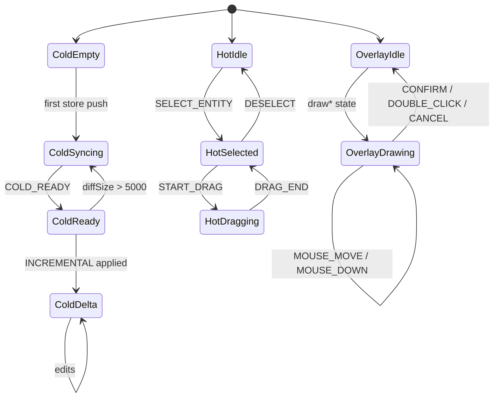
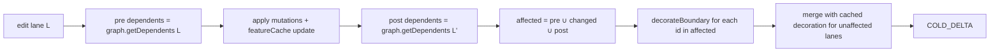
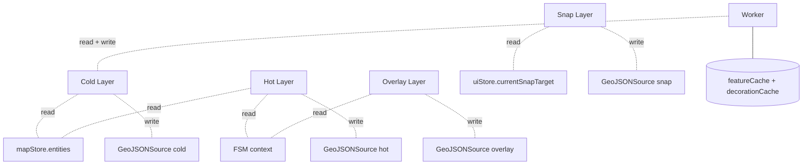

# Cold / Hot Layers

Mixing "steady-state rendering of tens of thousands of entities" and
"60fps interaction previews" on the same canvas via React + GeoJSON
diff is the obvious approach — and it inevitably stalls past 10k
entities. Apollo Map Studio's answer is **physical separation between
cold / hot / overlay layers**, each with its own data source, render
cadence, and synchronisation primitive. This page is the strict
specification.

## 1. Layer definitions

| Layer       | Source                   | Data source                                         | Writer                   | Reader         | Frequency cap              |
| ----------- | ------------------------ | --------------------------------------------------- | ------------------------ | -------------- | -------------------------- |
| **Cold**    | `cold` GeoJSON source    | `mapStore.entities` (committed)                     | `useColdLayer` (sole)    | MapLibre paint | 60fps (steady-state ~5fps) |
| **Hot**     | `hot` GeoJSON source     | FSM `selectedEntityId` + `dragCurrentPoint`         | `useHotLayer` (sole)     | MapLibre paint | per mousemove              |
| **Overlay** | `overlay` GeoJSON source | FSM `drawPoints` / `bezierAnchors` / `previewPoint` | `useOverlayLayer` (sole) | MapLibre paint | per mousemove              |

> The two ancillary layers (grid and snap) behave like an overlay but
> **subscribe to `uiStore` and do not participate in the cold/hot
> split**; treat them as their own concern.

## 2. Read/write permission matrix

| Resource            | Owner of writes                                             | Notes                                                |
| ------------------- | ----------------------------------------------------------- | ---------------------------------------------------- |
| `mapStore.entities` | `mapStore.addEntity / updateEntity / removeEntity`          | Undo is locked by zundo `partialize` to this slice   |
| `cold` source       | `useColdLayer.setColdSourceData` / `applyColdDeltaToSource` | No other module may call `getSource('cold').setData` |
| `hot` source        | `useHotLayer`                                               | Drag/edit preview                                    |
| `overlay` source    | `useOverlayLayer.renderOverlayLayer`                        | In-flight drawing                                    |
| `selectedEntityId`  | FSM `SELECT_ENTITY` / `DESELECT` events                     | UI must not write directly                           |
| `currentSnapTarget` | snap pipeline `applySnap`                                   | Map event router writes during mousemove             |

Any "back-channel write" (e.g. an inspector form calling
`map.getSource('cold').setData()`) is a defect: it desynchronises the
worker's `featureCache` and `decorationCache`, and the next
INCREMENTAL pass produces ghost features.

## 3. Lifecycle comparison

## 4. Performance trade-offs

| Dimension          | Cold                                  | Hot                                 |
| ------------------ | ------------------------------------- | ----------------------------------- |
| Data scale         | tens of thousands                     | 1 (at most one selected entity)     |
| Compile location   | Worker (`compileColdFeatures`)        | Main thread (`entityToHotFeatures`) |
| Sync primitive     | RAF + worker round-trip               | RAF                                 |
| Failure mode       | Stutter / main-thread long task       | Frame drop                          |
| Optimisation lever | INCREMENTAL delta + `decorationCache` | RAF + render-state dedup            |

The fundamental reason the hot layer does not run inside a worker:
**postMessage clone latency (5–15ms) exceeds single-entity compile
time (< 0.5ms)**. The 60fps mousemove path must stay on the main
thread.

## 5. Phase E: incremental decoration

Phase E (April 2026) was the cold-layer optimisation that closed an
otherwise multi-second stall: at 1k+ lanes, every INCREMENTAL ran the
full `decorateBoundary` over every lane (~3ms each), turning a single
edit into a ~3s freeze. The fix is a three-piece system:

1. **`decorationCache: Map<lane_id, Feature[]>`** in the worker —
   each lane's boundary decoration is cached individually.
2. **`LaneJunctionGraph`** — an endpoint → lane-set inverted index;
   `getDependents(id)` returns lanes sharing an endpoint with `id` in
   O(K).
3. **Affected-set computation** — on INCREMENTAL,
   `affected = pre-update dependents ∪ changed lanes ∪ post-update dependents`.
   Only those lanes are re-decorated; the cache fills in the rest.

Engineering invariants (violations cause ghost / stale features):

- `decorationCache` keys must match `LaneJunctionGraph` lane ids —
  both are `entity.id`.
- Junction stitching still runs over every junction every time; only
  decoration is incremental.
- Lane deletions must call `decorationCache.delete(id)` inside
  `removeEntity`.

Source:

- `src/core/workers/spatialState.ts:22-31` — state shape
- `src/core/workers/spatialFeatures.ts:65-118` — `buildFeatureCollection`
- `src/core/workers/spatialRequests.ts:117-137` — `handleIncremental`

## 6. Public surface

| Hook / function               | Responsibility                              |
| ----------------------------- | ------------------------------------------- |
| `useColdLayer`                | Sole writer of the `cold` source            |
| `useHotLayer`                 | Sole writer of the `hot` source             |
| `useOverlayLayer`             | Sole writer of `overlay` and `snap` sources |
| `compileColdFeatures(entity)` | Entity → cold-layer feature array (worker)  |
| `entityToHotFeatures(entity)` | Entity → hot-layer features (main thread)   |
| `buildOverlayFeatures(state)` | Drawing state → overlay features            |

## 7. Pitfalls

1. **Do not filter the selected entity out of cold**: an early version
   tried `id !== selectedId` and produced a one-frame flicker on
   selection (cold disappeared before hot finished setData). Today
   `buildColdLayerFilter` keeps the selected entity visible in cold by
   design.
2. **Hot dragPoint index semantics**: `-2` means "center drag", `-1`
   is the default, `>= 0` is a vertex index. Changing this convention
   requires updating the FSM, `selectionDrag.ts`, and `applyDrag` in
   lockstep.
3. **Cross-layer selected entity needs dual source-of-truth sync**:
   the FSM's `selectedEntityId` and `useColdLayer`'s
   `selectedEntityIdRef` are aligned in `actorRef.subscribe` — never
   read FSM state inside React render.
4. **Phase E cache invalidation is per-lane**:
   `decorationCache.delete(id)` only clears one entry. When lane
   geometry indirectly affects neighbours through a junction,
   `getDependents` must catch them. Bypassing the graph (e.g. by
   pre-computing `affected` outside the worker) is a footgun.

## 8. Source map

| Concept                 | File                                                | Lines   |
| ----------------------- | --------------------------------------------------- | ------- |
| Cold pipeline           | `src/hooks/useColdLayer.ts`                         | 161-334 |
| Cold filter / selection | `src/components/map/coldLayerConfig.ts`             | 1-60    |
| Hot pipeline            | `src/hooks/useHotLayer.ts`                          | 43-132  |
| Overlay pipeline        | `src/hooks/useOverlayLayer.ts`                      | 219-285 |
| Cold compiler           | `src/core/geometry/compile.ts`                      | 67-101  |
| Hot compiler            | `src/lib/geoJsonHelpers.ts` (`entityToHotFeatures`) | —       |
| Decoration cache        | `src/core/workers/spatialState.ts`                  | 22-44   |
| Decoration delta        | `src/core/workers/spatialFeatures.ts`               | 65-118  |

## 9. Testing notes

Relevant tests live in `src/hooks/__tests__/` and
`src/core/workers/__tests__/`:

| Test                      | Path covered                                                         |
| ------------------------- | -------------------------------------------------------------------- |
| `useColdLayer.test.ts`    | `diffEntities` add/update/remove; `groupFeaturesByEntity` regrouping |
| `useHotLayer.test.ts`     | `sameHotRenderState` dedup; selectedEntityId switching               |
| `useOverlayLayer.test.ts` | `buildOverlayFeatures` dispatch table                                |
| `spatialFeatures.test.ts` | `decorationCache` invalidation and replay                            |
| `spatialRequests.test.ts` | `INCREMENTAL` affected-set closure                                   |

Conventions: vitest + happy-dom; MapLibre is stubbed (only
`getSource` / `setData` / `updateData` are mocked); the FSM uses a
real actor, not a mock.

## 10. History and decisions

- **2026-02 P1**: introduced the `COLD_DELTA` protocol to replace the
  full-payload `COLD_READY` on every edit. Context: at 5k entities,
  every mousemove triggered a 200ms postMessage and editing was
  unusable.
- **2026-04 Phase E**: introduced `decorationCache` +
  `LaneJunctionGraph`, dropping incremental decoration from O(L) to
  O(K). Context: at 1k+ lanes, decoration consumed 95%+ of
  INCREMENTAL latency.
- **2026-04 R1 closure**: the undo dispatcher sends `CANCEL` to the
  FSM **before** calling `temporal.undo()`, fixing the "mid-draw
  Ctrl+Z then next CONFIRM crashes" bug. See
  `useActionDispatcher.ts:76-82` and
  `__tests__/undoCancel.test.ts`.
- **2026-04 R2 anti-corruption**: all Apollo entity writes flow
  through `lib/entityOps.ts`; UI code no longer imports
  `core/geometry/apolloCompile/*` directly.

## 11. Decision log

| Decision                                         | Date    | Trade-off                                                                                                          |
| ------------------------------------------------ | ------- | ------------------------------------------------------------------------------------------------------------------ |
| GeoJSON instead of vector tiles                  | 2025-11 | At 10k-scale entities the main thread handles GeoJSON; vector tiles require server-side slicing and add complexity |
| Physical separation between cold and hot sources | 2025-12 | The alternative (cold-fill filter "exclude selected") flickered on selection during testing                        |
| RAF coalesced setData                            | 2026-01 | Prevents mousemove storms from saturating the main thread and collapses multiple store pushes per frame            |
| postMessage clone for the worker                 | 2026-02 | SharedArrayBuffer requires COOP/COEP headers, expensive in Electron packaging                                      |
| Phase E incremental decoration                   | 2026-04 | Decoration accounted for 95% of latency; incrementalisation was non-negotiable                                     |
| `promoteId: featureId`                           | 2026-04 | Lets MapLibre track feature ids stably across delta updates                                                        |

## 12. Debugging tips

- **Cold layer stops updating**: check that `prevEntitiesRef.current`
  is being assigned correctly; use worker devtools to verify SYNC /
  INCREMENTAL messages are being received.
- **Hot layer flicker**: usually `sameHotRenderState` is missing a
  field comparison, causing setData to fire repeatedly.
- **Drag preview jumps**: `centerGrabOffset` isn't locked at drag
  start, or the hot layer's `applyDrag` reads a stale entity in the
  selected state (reference-switching issue).
- **Overlay leaves residue**: when the FSM exits a draw\* state, the
  overlay's `setData(EMPTY_FC)` did not fire; check that
  `isDrawingState(currentState)` flips to false immediately at the
  FSM transition.

## 13. Coupling with neighbouring systems

The four GeoJSON sources have completely disjoint writers — that is
the "sole writer" rule in geometry. Implementations (hooks) enforce
it.

## 14. Observability

| Signal                                          | Source                   | Purpose                                                 |
| ----------------------------------------------- | ------------------------ | ------------------------------------------------------- |
| `useTaskProgressStore`'s `cold-layer-sync` task | useColdLayer's bulk sync | StatusBar shows "Rendering map layers (5,000 entities)" |
| Worker `console` output                         | `spatial.worker.ts`      | Visible in Chrome devtools' Workers panel               |
| FSM transition log                              | XState devtools          | Verify hot/overlay state switching                      |

## 15. Performance / memory data

| Item                                         | Value                                                       |
| -------------------------------------------- | ----------------------------------------------------------- |
| Cold source GeoJSON size (50k entities)      | ~30MB string / ~10MB binary                                 |
| Hot source GeoJSON size                      | < 5KB                                                       |
| Overlay source GeoJSON size                  | < 2KB                                                       |
| MapLibre entity ceiling (usable in practice) | Sustained 50fps+ during edits at 50k entities               |
| `entityFeatureCacheRef` size                 | ~3 features × ~200B per entity = ~600B; ~30MB for 50k       |
| `decorationCache` size                       | ~10 features × ~150B per lane = ~1.5KB; ~75MB for 50k lanes |

The last two are dual-copied between main thread and worker (the
worker holds the source of truth; the main thread keeps a mirror —
but **only keys + reference bytes, not feature payload**).

## 16. Glossary

| Term                    | Definition                                                          |
| ----------------------- | ------------------------------------------------------------------- |
| Cold layer              | The render layer for committed entities, sized in tens of thousands |
| Hot layer               | Real-time drag preview of the selected entity                       |
| Overlay layer           | In-flight drawing state preview                                     |
| Snap indicator          | The cyan ring at the cursor showing the current snap target         |
| Incremental decoration  | The Phase E mechanism that incrementalises lane boundary decoration |
| Affected set            | The set of lanes that must be recomputed during INCREMENTAL edits   |
| Endpoint reverse lookup | LaneJunctionGraph's O(K) `getDependents`                            |

## 17. See also

- [Rendering Pipeline](./rendering-pipeline.md)
- [Junction Stitching](./junction-stitching.md)
- [Junction Graph](./junction-graph.md)
- [Map Event Router](./map-event-router.md)
- [State Management](./state-management.md) — undo / zundo against the cold layer
- [FSM Design](./fsm-design.md) — how drag/edit states drive the hot layer
- [Inspector System](./inspector-system.md) — form writes and cold/hot sync
