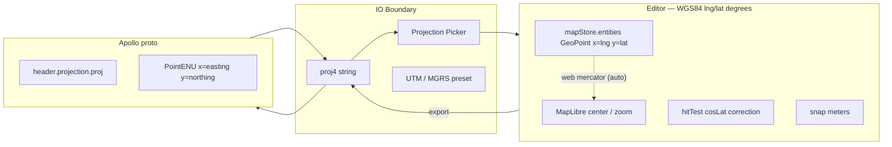

# Coordinate System

Coordinates are the load-bearing wall of the IO boundary in Apollo HD
maps: a single mismatch and the exported proto will offset by
kilometres on the vehicle. Apollo Map Studio's design rule is
unambiguous: **inside the editor everything is WGS84 lng/lat in
degrees; projection only happens at the proto IO boundary**. This
page lays out every coordinate frame in use, the conversion paths,
and how PROJ.4 strings are parsed.

## 1. The full picture



## 2. Frames in use

| Name               | Where                             | Meaning                                                   |
| ------------------ | --------------------------------- | --------------------------------------------------------- |
| WGS84 lng/lat      | `mapStore`, every geometry module | Standard geographic coordinates (degrees)                 |
| Web Mercator       | MapLibre internal                 | Auto-projected by maplibre from lng/lat to screen         |
| Local ENU (meters) | snap / hit / topology internals   | cosLat-corrected local meter space; **never persisted**   |
| UTM                | Apollo `PointENU` field           | 6° zone projection; described by `header.projection.proj` |
| MGRS               | UI label of the projection picker | Grid encoding of UTM, easier to read                      |

> The editor **never** stores UTM meters. Every persisted layer is
> lng/lat.

## 3. Web Mercator pixel ↔ meter

`pixelsToMeters(pixels, lat, zoom)`
(`src/core/geometry/snap.ts:87-91`) is the canonical conversion used
by snap radius:

```ts
const EARTH_CIRC = 40_075_016.686; // meters
const metersPerPixel = (Math.cos((lat * Math.PI) / 180) * EARTH_CIRC) / (512 * Math.pow(2, zoom));
return pixels * metersPerPixel;
```

Meaning: MapLibre uses 512px tiles, so at zoom z each pixel covers
`360 / (512 · 2^z)` lng-degrees, multiplied by cosLat × earth
circumference for meters per pixel.

## 4. PROJ.4 string parsing

Apollo's `header.projection.proj` is a PROJ.4 string, e.g.:

```
+proj=tmerc +lat_0=37.413082 +lon_0=-122.012573 +k=1.0 +x_0=0 +y_0=0 +ellps=WGS84 +datum=WGS84 +units=m +no_defs
```

Or a garage map's templated form with literal braces:

```
+proj=tmerc +lat_0={37.413082} +lon_0={-122.012573} +k=1.0 ...
```

`src/io/proto/projection.ts` exposes three primitives.

### 4.1 `sanitizeProjString(s)`

Strips template braces — Apollo's reference Sunnyvale / garage maps
wrap numeric arguments in `{}`, which proj4 rejects. **All proj-string
entry points must call sanitize first.**

```ts
export function sanitizeProjString(s: string): string {
  return s.replace(/\{([^}]+)\}/g, '$1').trim();
}
```

### 4.2 `makeProjection(projString)`

Returns a `Projection` object exposing `toLonLat` and `fromLonLat`.
Internally, proj4 builds two converters from source CRS (typically
UTM meters) to / from WGS84 degrees:

```ts
const toWgs84 = proj4(clean, WGS84);
const fromWgs84 = proj4(WGS84, clean);
```

`WGS84 = '+proj=longlat +datum=WGS84 +no_defs'` is the lng/lat-degree
PROJ representation.

### 4.3 UTM helpers

| Function                          | Purpose                                                                      |
| --------------------------------- | ---------------------------------------------------------------------------- |
| `utmProjString(zone, hemisphere)` | Build a UTM PROJ string (`+proj=utm +zone=10 +ellps=WGS84 +units=m`)         |
| `utmZoneFromLon(lonDeg)`          | Infer UTM zone from longitude (each zone covers 6°)                          |
| `UTM_PRESETS`                     | City presets: sunnyvale (10N), beijing (50N), shanghai (51N), shenzhen (50N) |

> ⚠ UTM zone **cannot be inferred from `(x, y)` alone** — the same
> easting/northing exists in every zone because UTM is per-zone local
> coordinates. The user must specify the zone (via the projection
> picker) or it must be read from an existing PROJ string.

## 5. Projection picker

The projection picker is the IO Settings dialog UI: it lets the user
choose a CRS when `header.projection` is missing. Its state machine:

```mermaid
stateDiagram-v2
  [*] --> Detect
  Detect --> HasHeader : header.projection.proj non-empty
  Detect --> NoHeader : missing
  HasHeader --> Sanitize --> Ready
  NoHeader --> AskUser
  AskUser --> PickPreset : pick preset (sunnyvale / beijing / …)
  AskUser --> EnterCustom : paste a custom PROJ string
  AskUser --> InferFromLng : approximate longitude → utmZoneFromLon
  PickPreset --> Ready
  EnterCustom --> Sanitize --> Ready
  InferFromLng --> Ready
```

Result: the chosen CRS is written into
`apolloMapStore.projection`. The IO worker uses it to convert
`PointENU → GeoPoint` on import, and the export pipeline writes it
back to `header.projection.proj`.

## 6. The `header.projection` field

The Apollo `Header` proto carries (only the coordinate-relevant
fields):

| Field                                | Meaning                                               |
| ------------------------------------ | ----------------------------------------------------- |
| `header.projection.proj`             | PROJ.4 string (the editor's persisted source CRS)     |
| `header.left / right / top / bottom` | Map bounds in meter space                             |
| `header.geo_reference`               | Optional alternate PROJ string (e.g. raw `+proj=utm`) |
| `header.zone_id`                     | Optional numeric UTM zone                             |

Policy: **`header.projection.proj` is the single source of truth**.
On export, the editor recomputes the other fields from it; on import
they are not read.

## 7. Conversion paths

### 7.1 Apollo → Editor (import)

```text
proto.PointENU(x=586217.5, y=4143000.0)   // UTM 10N meters
   └── makeProjection(header.projection.proj).toLonLat
       └── proj4.forward([586217.5, 4143000.0])
           └── GeoPoint(x=-122.012573, y=37.4131)
```

### 7.2 Editor → Apollo (export)

```text
GeoPoint(x=-122.012573, y=37.4131)
   └── makeProjection(...).fromLonLat
       └── proj4.forward([lon, lat])
           └── PointENU(x=586217.5, y=4143000.0)
```

### 7.3 Internal distance measurement

```text
two GeoPoints
   └── haversineMeters (lib/geo.ts) → meters
        ↑ used for lane.length
   or
   └── project to ENU (snap.ts: project) → cosLat correction → meters
        ↑ used for snap / hit / connect
```

## 8. Internal local ENU

snap / hitTest / laneTopology project to a local ENU and compute
Euclidean distances:

```
x = lng * cosLat * DEG_TO_M
y = lat * DEG_TO_M
```

`DEG_TO_M = 111320`, `cosLat = cos(referenceLat)`. The approximation
is **valid only locally** — error stays below 0.5% within a few
kilometres. **Never persist these ENU values**; they are scratch
coordinates for one geometry computation.

## 9. Public surface

| Entry                                      | File                           | Purpose                                                             |
| ------------------------------------------ | ------------------------------ | ------------------------------------------------------------------- |
| `sanitizeProjString`                       | `src/io/proto/projection.ts`   | Strip template braces                                               |
| `makeProjection`                           | `src/io/proto/projection.ts`   | Build `{ toLonLat, fromLonLat }`                                    |
| `utmProjString` / `utmZoneFromLon`         | same                           | UTM helpers                                                         |
| `UTM_PRESETS`                              | same                           | sunnyvale / beijing / shanghai / shenzhen                           |
| `pixelsToMeters`                           | `src/core/geometry/snap.ts:87` | px → m for snap radius                                              |
| `haversineMeters` / `polylineLengthMeters` | `src/lib/geo.ts`               | WGS84 great-circle distances                                        |
| `metersToDegLat` / `metersToDegLng`        | `src/lib/geo.ts`               | meters → degrees, used for sub-meter geometry like signal templates |

## 10. Pitfalls

1. **Do not mix `pixelsToMeters` with `metersToDegLng`**: the first
   depends on zoom, the second on latitude; using the wrong one
   yields cosine-scale errors.
2. **Do not retain stale `proj4` instances**: `makeProjection` closes
   over two converters. When the user switches projection, drop the
   old instance — keeping it parses new data with the old zone.
3. **PROJ strings may contain `\r\n`**: pasted text often carries
   Windows line endings. `sanitizeProjString.trim()` only handles
   leading/trailing whitespace; if multi-line PROJ input is allowed,
   collapse internal whitespace via `replace(/\s+/g, ' ')` in the
   picker.
4. **`header.bounds` does not auto-update**: changing
   `projection.proj` without recomputing `header.left/right/top/bottom`
   produces a vehicle that crops to stale bounds.
5. **UTM ≠ MGRS**: MGRS is a shorter, more readable grid encoding;
   parsing logic differs. The picker's MGRS UI is just a label —
   storage is always a UTM PROJ string.

## 11. Source map

| Concept                            | File                          | Lines   |
| ---------------------------------- | ----------------------------- | ------- |
| PROJ.4 parsing / construction      | `src/io/proto/projection.ts`  | 1-80    |
| WGS84 distances                    | `src/lib/geo.ts`              | 1-57    |
| pixels ↔ meters                    | `src/core/geometry/snap.ts`   | 87-91   |
| Local ENU projection               | `src/core/geometry/snap.ts`   | 256-290 |
| Apollo IO (projection application) | `src/io/apollo/*` (IO worker) | —       |

## 12. Testing notes

| Test                            | Covers                                                                   |
| ------------------------------- | ------------------------------------------------------------------------ |
| `projection.test.ts` (IO layer) | sanitize template; UTM zone inference                                    |
| `geo.test.ts`                   | haversine and metersToDeg round-trip                                     |
| `snap.test.ts`                  | pixelsToMeters across zoom + latitude                                    |
| Integration                     | full import → export round trip on garage map's `header.projection.proj` |

## 13. FAQ

**Q: Why does the editor not store UTM meters directly?**

A: Consistency. Web base maps (OSM tiles) are natively lng/lat;
MapLibre uses Web Mercator internally. Storing UTM would force a
conversion on every render and require zone information. Sticking to
lng/lat means store / worker / inspector never need to think about
zones.

**Q: What happens to existing geometry when the projection is
switched?**

A: Geometry **does not change** — it is still lng/lat. What changes
is "how PointENU is computed at export time". The picker is therefore
free to switch CRS without altering the data.

**Q: Are there issues at high latitudes (lat > 70°)?**

A: Three places to watch:

- `pixelsToMeters`: a higher lat shrinks cosLat and meters-per-pixel
  (correct).
- `cosLat` in hit / snap: near the poles cosLat → 0 would inflate
  horizontal radius; `Math.max(cosLat, 1e-6)` guards against
  divide-by-zero.
- UTM is undefined for lat > 84° / < -80°; UPS (Universal Polar
  Stereographic) would be needed. The picker does not support UPS
  today — known limitation.

**Q: What about non-UTF-8 PROJ strings?**

A: `sanitizeProjString` does not transcode; it only strips template
braces. Imported files carrying UTF-8 BOM or GBK encoding require
the IO layer to detect encoding (current default assumes UTF-8).

## 14. History

- Early versions kept `projection` inside `mapStore.metadata`. Later
  we realised undo/redo should also revert projection switches, so
  the field moved to `apolloMapStore` to keep its bin separate from
  entities.
- `UTM_PRESETS` is a stop-gap. Long-term we want automatic zone
  inference based on the map's bounds, but we have to handle multi-
  zone garage maps that straddle a UTM boundary.

## 15. See also

- [Geometry Engine](./geometry-engine.md)
- [Spatial Index](./spatial-index.md)
- [Map Event Router](./map-event-router.md)
- [Derive Engine](./derive-engine.md)
- [Export Engine](./export-engine.md)
- [Inspector System](./inspector-system.md) — projection picker UI
