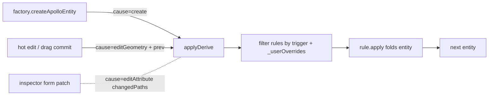
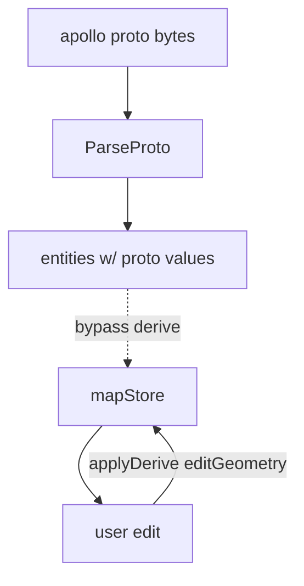
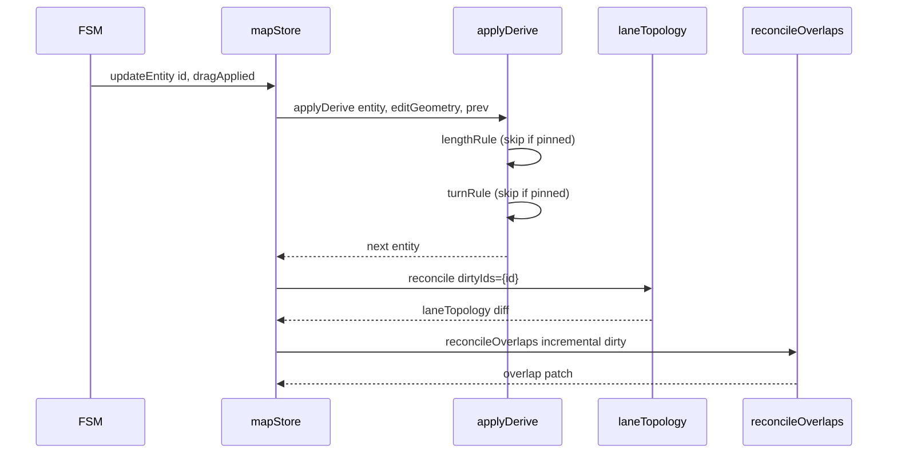
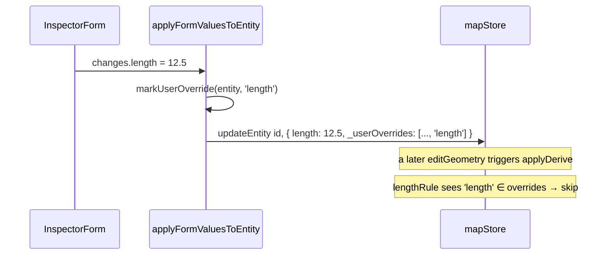

# Derive Engine

`src/core/elements/derive/` is Apollo Map Studio's "auto-closure
hub": when the user edits a lane's centerline, **derived fields**
like `length`, `turn`, and `boundaryType[0]` should update
automatically without forcing the inspector form to do the work.
This page documents the lifecycle triggers, change detection, the
user-pinning trade-offs (`_userOverrides`), and the rationale behind
"do not derive on import".

## 1. Design goals

| Goal                                    | Mechanism                                                               |
| --------------------------------------- | ----------------------------------------------------------------------- |
| Derived fields require no manual upkeep | `applyDerive(entity, ctx)` closes the loop on `create` / `editGeometry` |
| User edits are not stomped              | `_userOverrides: string[]` lists owned-but-pinned field paths           |
| Imported Apollo values are preserved    | derive does not run on import; only during editing + factory create     |
| Modular, testable rules                 | each rule is a `DeriveRule { id, owns, on, apply }`                     |

## 2. Lifecycle triggers



`DeriveCause` has three values:

```ts
// types.ts:19-27
export type DeriveCause = 'create' | 'editGeometry' | 'editAttribute';

export interface DeriveContext<E extends MapEntity> {
  cause: DeriveCause;
  prev?: E;
  changedPaths?: readonly string[];
}
```

| Cause           | Trigger                                                             | Note                                                 |
| --------------- | ------------------------------------------------------------------- | ---------------------------------------------------- |
| `create`        | After `createApolloEntity`                                          | Includes "first-time fill" rules like `boundarySeed` |
| `editGeometry`  | After drag commit / source-aware edit / connectLanes                | All geometry-bound fields close the loop             |
| `editAttribute` | After inspector form writes (interface kept; not widely used today) | Pairs with `changedPaths` for fine-grained gating    |

## 3. Registry

```ts
// index.ts:26-29
const REGISTRY: Partial<Record<MapEntity['entityType'], readonly DeriveRule<MapEntity>[]>> = {
  lane: laneRules,
  parkingSpace: parkingSpaceRules,
};
```

Two entity types currently have rules. Adding more requires a new
file under `derive/rules/` and a registry entry.

## 4. Lane rules

```ts
// rules/lane.ts:24-64
export const laneRules: DeriveRule<LaneEntity>[] = [lengthRule, turnRule, boundarySeedRule];
```

| Rule                | owns                                                          | on                    | Behaviour                                                        |
| ------------------- | ------------------------------------------------------------- | --------------------- | ---------------------------------------------------------------- |
| `lane.length`       | `['length']`                                                  | create + editGeometry | `polylineLengthMeters(centerPoints(e))` (haversine)              |
| `lane.turn`         | `['turn']`                                                    | create + editGeometry | `inferLaneTurn(centerPoints)` from start/end heading delta       |
| `lane.boundarySeed` | `['leftBoundary.boundaryType', 'rightBoundary.boundaryType']` | **create only**       | Seed empty `boundaryType` arrays with `[{s:0, types:[DEFAULT]}]` |

**boundarySeed runs only on create** — once the inspector has shown
the user the field (let alone allowed editing it), subsequent
`editGeometry` ticks must not "reset" it to the default.

## 5. ParkingSpace rules

```ts
// rules/parkingSpace.ts:13-22
const headingFromRectRule: DeriveRule<ParkingSpaceEntity> = {
  id: 'parkingSpace.headingFromRect',
  owns: ['heading'],
  apply: (e) => {
    const rect = e._sourceRect;
    if (!rect) return e;
    return rect.rotation === e.heading ? e : { ...e, heading: rect.rotation };
  },
};
```

When a parkingSpace is drawn with `drawRotatedRect`, the rotation
handle updates `_sourceRect.rotation`. `heading` is the proto-side
field; both must stay synced — hence the rule.

## 6. `_userOverrides` pinning

```ts
// index.ts:42-57
export function applyDerive<E extends MapEntity>(entity: E, ctx: DeriveContext<E>): E {
  const rules = REGISTRY[entity.entityType];
  if (!rules || rules.length === 0) return entity;

  const overrides = readOverrides(entity);
  let next: MapEntity = entity;

  for (const rule of rules) {
    const triggers = rule.on ?? DEFAULT_TRIGGERS;
    if (!triggers.includes(ctx.cause)) continue;
    if (rule.owns.some((path) => overrides.has(path))) continue;
    next = rule.apply(next, ctx);
  }
  return next as E;
}
```

Workflow:

1. The inspector user edits `lane.length`. The form's
   `applyFormValuesToEntity` calls
   `markUserOverride(entity, 'length')`.
2. `_userOverrides` gains `'length'`.
3. The next `editGeometry` invokes `applyDerive`.
   `lengthRule.owns = ['length']` intersects overrides, so **the
   whole rule is skipped**; the manual length stays.
4. To "release" back to auto-derivation, call
   `clearUserOverride(entity, 'length')`.

```ts
// index.ts:62-79
export function markUserOverride<E extends MapEntity>(entity: E, path: string): E { ... }
export function clearUserOverride<E extends MapEntity>(entity: E, path: string): E { ... }
```

## 7. Import vs editor



Policy: **derive does not run on import**. Why:

- Imported Apollo data may use a different length convention
  (haversine vs flat Euclidean vs the proto's own `length` field).
  Forcing derive overwrites the proto's "ground truth".
- `boundaryType` may be empty in the proto (empty = "inherit
  defaults"), but the user has not stated a preference yet; seeding
  `[{s:0, types:['UNKNOWN']}]` would semantically pollute the data.

Derivation only kicks in once the user **edits** — at that point the
data already carries the user's intent.

## 8. Public surface

| Export                                         | File          | Purpose                   |
| ---------------------------------------------- | ------------- | ------------------------- |
| `applyDerive(entity, ctx)`                     | `index.ts:42` | Main entry                |
| `markUserOverride(entity, path)`               | `index.ts:62` | Inspector field writes    |
| `clearUserOverride(entity, path)`              | `index.ts:74` | "Release back to auto" UI |
| `DeriveCause` / `DeriveContext` / `DeriveRule` | `types.ts`    | Types                     |
| `laneRules` / `parkingSpaceRules`              | `rules/*.ts`  | Independent unit tests    |

## 9. Always-derive vs preserve-on-import field policies

| Field                                | Policy                                        | Why                                                          |
| ------------------------------------ | --------------------------------------------- | ------------------------------------------------------------ |
| `lane.length`                        | always derive on create + editGeometry        | Geometry derivation is more trustworthy than the proto value |
| `lane.turn`                          | always derive                                 | Heading-delta classifier is deterministic                    |
| `lane.boundaryType[0]`               | create only                                   | Once edited, editGeometry should not roll back               |
| `lane.predecessorIds / successorIds` | Owned by `laneTopology.reconcile`, not derive | Cross-entity coordination belongs in reconcile               |
| `parkingSpace.heading`               | always derive when `_sourceRect` exists       | `_sourceRect` is the ground truth                            |
| `lane.speedLimit`                    | not derived                                   | Pure attribute, geometry-independent                         |

## 10. Pitfalls

1. **No side effects in rule.apply**: `apply` must be pure. Avoid
   even `console.log` (logging from a hot worker path is expensive).
2. **`owns` paths must match inspector field paths**: form fields
   write `length` → rule `owns: ['length']`. If a nested path like
   `leftBoundary.boundaryType` ever changes, update both `owns` and
   the inspector form path strings together.
3. **Regenerate vs identity short-circuit**: each rule.apply does a
   "next === e ? e : { ...e, ...patch }" identity short-circuit so
   Zustand references stay stable and unchanged states do not wake
   downstream subscribers.
4. **Do not call `reconcileOverlaps` from inside derive**: that's the
   store layer's job. Each layer minds its own concerns.

## 11. Source map

| Concept                    | File                                             | Lines |
| -------------------------- | ------------------------------------------------ | ----- |
| Main entry                 | `src/core/elements/derive/index.ts`              | 1-79  |
| Types                      | `src/core/elements/derive/types.ts`              | 1-38  |
| Lane rules                 | `src/core/elements/derive/rules/lane.ts`         | 1-64  |
| ParkingSpace rules         | `src/core/elements/derive/rules/parkingSpace.ts` | 1-23  |
| `inferLaneTurn`            | `src/core/geometry/apolloCompile/factory.ts`     | —     |
| `polylineLengthMeters`     | `src/lib/geo.ts`                                 | 35-42 |
| `markUserOverride` callers | Inspector form adapter layer                     | —     |

## 12. Testing notes

| Test                                | Covers                                        |
| ----------------------------------- | --------------------------------------------- |
| `derive/index.test.ts`              | applyDerive trigger filtering; overrides skip |
| `derive/rules/lane.test.ts`         | length / turn / boundarySeed rules            |
| `derive/rules/parkingSpace.test.ts` | headingFromRect sync                          |
| `markUserOverride.test.ts`          | Idempotence; `clearUserOverride` restoration  |

## 13. Workflow examples

### 13.1 User drags a lane vertex



`derive` only closes single-entity fields; `topology` and `overlap`
handle cross-entity coordination. None of them call each other.

### 13.2 User edits `length` in the inspector



## 14. FAQ

**Q: What if two rules own the same field?**

A: They fold in `laneRules` array order — the later rule wins. In
practice we avoid such overlap; each field has exactly one owner.

**Q: Does derive run on the main thread or the worker?**

A: Main thread. `applyDerive` is invoked inside
`mapStore.updateEntity` as part of the Zustand action. The worker
does not run derive.

**Q: If derive changes `length`, won't that trigger another
`editGeometry` and loop forever?**

A: No. `updateEntity` only accepts writes from **external callers**;
the store action computes derive within the same transition and
writes back without re-triggering itself.

## 15. Debugging tips

- **Derive does not run**: log `cause` and `entity._userOverrides`
  at the top of `applyDerive`; if any owns path is in overrides, the
  rule is skipped.
- **Imported data gets overwritten**: confirm the import path does
  **not** call `applyDerive`; only `mapStore.addEntity` /
  `setEntities` should trigger derive.
- **Inspector edits keep getting clobbered**: confirm
  `applyFormValuesToEntity` calls `markUserOverride`, and the owns
  path matches the form field path.

## 16. Extension guide

Adding derive support for a new entity type:

1. Create `derive/rules/<type>.ts` exporting a `DeriveRule[]`,
   declaring `id` / `owns` / `on` / `apply` for each rule.
2. Register it in `derive/index.ts` `REGISTRY[<type>]: <type>Rules`.
3. `apply` must be a pure function with identity short-circuit
   (`return next === e ? e : ...`) for reference stability.
4. Tests: mock a simple entity and assert `applyDerive` output for
   the three scenarios (`create`, `editGeometry`, with
   `_userOverrides`).

Adding a new rule to an existing type:

1. Define the `DeriveRule` instance.
2. Push to the **end** of `<type>Rules` (order-sensitive).
3. Cover the owns paths and trigger causes in unit tests.

## 17. See also

- [Geometry Engine](./geometry-engine.md)
- [Overlap Derivation](./overlap-derivation.md)
- [Inspector System](./inspector-system.md)
- [State Management](./state-management.md)
- [Anti-corruption Layer](./anti-corruption-layer.md)
