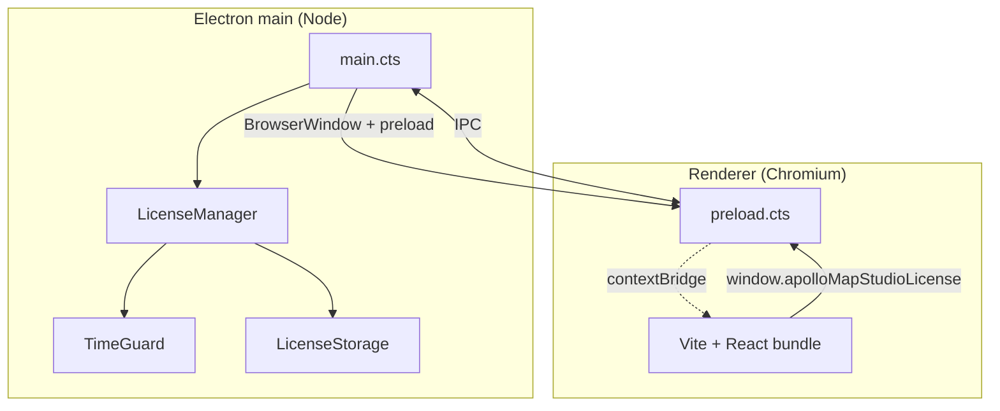

# Electron Integration

> Key files:
>
> - `electron/main.cts` — main process entry
> - `electron/preload.cts` — preload bridge
> - `electron/license/manager.cts` — license IPC registry
> - `electron-builder.yml` — packaging config
> - `package.json` scripts: `electron:dev`, `package:linux/mac/win`

## 1. Goals

- **One React renderer for both targets**: browser and desktop share
  the same `dist/`. Electron is a privileged BrowserWindow + main
  process around it.
- **Zero runtime third-party deps in main**: license, machine-id, and
  crypto all use Node's built-in `crypto`.
- **Strict sandbox**: `contextIsolation: true` + `nodeIntegration:
false` + `sandbox: true`. The renderer never reaches `require` /
  `process`.

## 2. Process topology



- Main: 1 BrowserWindow, single-instance lock, license state
  broadcast.
- Renderer: 1 React app; license IPC goes through `licenseBridge`.

## 3. Main: `main.cts`

`electron/main.cts:18-54` creates the window:

```ts
const mainWindow = new BrowserWindow({
  width: 1440,
  height: 960,
  minWidth: 1024,
  minHeight: 700,
  title: 'Apollo Map Studio',
  backgroundColor: '#101318',
  show: false,
  webPreferences: {
    preload: getPreloadPath(),
    contextIsolation: true,
    nodeIntegration: false,
    sandbox: true,
  },
});
```

- `show: false` + `ready-to-show` listener avoids the white flash.
- `setWindowOpenHandler` denies all `window.open` calls; HTTP/HTTPS
  links open in the system browser via `shell.openExternal`.

### 3.1 Single-instance lock

```ts
// main.cts:62-79
const gotSingleInstanceLock = app.requestSingleInstanceLock();
if (!gotSingleInstanceLock) {
  app.quit();
} else {
  app.on('second-instance', () => {
    const [mainWindow] = BrowserWindow.getAllWindows();
    if (!mainWindow) return;
    if (mainWindow.isMinimized()) mainWindow.restore();
    mainWindow.focus();
  });
  ...
}
```

A second launch focuses the existing window — two LicenseManagers
would otherwise race for the userData lock.

### 3.2 Vite dev URL handoff

```ts
// main.cts:6, 47-54
const rendererUrl = process.env.ELECTRON_RENDERER_URL;
...
if (rendererUrl) {
  await mainWindow.loadURL(rendererUrl);
  mainWindow.webContents.openDevTools({ mode: 'detach' });
  return;
}
await mainWindow.loadFile(getRendererIndexPath());
```

`pnpm electron:dev` orchestrates with concurrently:

```json
"electron:dev": "concurrently -k -n vite,electron -c cyan,magenta
  \"vite --host 127.0.0.1\"
  \"wait-on tcp:127.0.0.1:5173 && pnpm build:electron &&
   cross-env ELECTRON_RENDERER_URL=http://127.0.0.1:5173 electron .\""
```

- vite serves on port 5173;
- `wait-on` blocks until the port is reachable;
- electron picks up the URL via env, `loadURL` enables HMR;
- detached DevTools auto-open.

Production builds use `loadFile(dist/index.html)` — no environment
variables involved.

### 3.3 License startup ordering

```ts
// main.cts:81-94
app.whenReady().then(() => {
  // wire LicenseManager BEFORE creating any window so the renderer
  // can request state from a fully-initialised IPC surface.
  licenseManager = new LicenseManager();
  licenseManager.start();
  void createMainWindow();
  app.on('activate', () => { ... });
});
```

LicenseManager registers four IPC handlers before the renderer
appears, so the renderer's first frame never sees an undefined IPC.

`app.on('before-quit', () => licenseManager?.stop())` lets TimeGuard
persist its final timestamp.

## 4. preload.cts — contextBridge

`electron/preload.cts` exposes exactly two read-only globals:

```ts
// preload.cts:13-20
contextBridge.exposeInMainWorld('apolloMapStudio', {
  platform: process.platform,
  versions: { chrome, electron, node },
});

// preload.cts:22-47
contextBridge.exposeInMainWorld('apolloMapStudioLicense', {
  getState():        ipcRenderer.invoke('license:get-state'),
  getMachineCode():  ipcRenderer.invoke('license:get-machine-code'),
  activate(code):    ipcRenderer.invoke('license:activate', code),
  deactivate():      ipcRenderer.invoke('license:deactivate'),
  onChange(handler): ipcRenderer.on('license:state', listener); return unsub;
});
```

Design highlights:

- **Never expose ipcRenderer itself**: the renderer can only call the
  four named methods.
- **No Node API**: `fs`, `path`, `child_process` are all gone.
- **Broadcast over named channel**: `license:state` is the channel
  for state pushes; `onChange` returns an unsubscribe closure.

## 5. IPC channel inventory

| Channel                    | Direction     | Payload        | Implementation                            |
| -------------------------- | ------------- | -------------- | ----------------------------------------- |
| `license:get-state`        | renderer→main | —              | `LicenseManager.start()` registers invoke |
| `license:get-machine-code` | renderer→main | —              | same                                      |
| `license:activate`         | renderer→main | `code: string` | → `LicenseManager.activate`               |
| `license:deactivate`       | renderer→main | —              | → `LicenseManager.deactivate`             |
| `license:state`            | main→renderer | `LicenseState` | `LicenseManager.broadcast()`              |

See [License System](./license-system.md) for full semantics.

## 6. Renderer-side consumer: `license-bridge.ts`

`src/lib/license-bridge.ts:77-101` wraps the preload-exposed API with
a "works in browser too" fallback:

```ts
export const licenseBridge: LicenseApi = {
  async getState() {
    return window.apolloMapStudioLicense?.getState() ?? Promise.resolve(fallbackState());
  },
  ...
};

export function isDesktopBuild(): boolean {
  return typeof window !== 'undefined' && Boolean(window.apolloMapStudioLicense);
}
```

`fallbackState()` returns a permanent `canEdit: true` 7-day trial mock
in the browser so Storybook / web preview is not blocked by licensing.

## 7. Packaging: electron-builder

`electron-builder.yml`:

```yaml
appId: com.apollo-map-studio.app
productName: Apollo Map Studio
directories: { output: release }
files:
  - dist/**/*
  - dist-electron/**/*
  - package.json
  - '!node_modules/**/*'
asar: true
extraMetadata:
  main: dist-electron/main.cjs
  dependencies: {}
mac: { target: [{ target: dmg, arch: [x64, arm64] }, { target: zip, arch: [x64, arm64] }] }
win: { target: [{ target: nsis, arch: [x64] }, { target: zip, arch: [x64] }] }
linux: { target: [{ target: AppImage, arch: [x64] }, { target: deb, arch: [x64] }] }
```

Highlights:

- `extraMetadata.dependencies: {}` — overwrites the packaged
  `package.json` deps so the asar archive does not double-ship React /
  proj4 / etc., which Vite already bundled into `dist/`.
- `asar: true` — compression + a basic reverse-engineering hurdle.
- `npmRebuild: false` — every native module is prebuilt; only
  `electron` and `electron-winstaller` are in
  `pnpm.onlyBuiltDependencies`.

Scripts:

```json
"package":       "pnpm build:desktop && electron-builder --dir --publish never",
"package:linux": "pnpm build:desktop && electron-builder --linux --x64 --publish never",
"package:mac":   "pnpm build:desktop && electron-builder --mac --x64 --arm64 --publish never",
"package:win":   "pnpm build:desktop && electron-builder --win --x64 --publish never",
"build:desktop": "pnpm build:web && pnpm build:electron",
"build:electron": "tsc -p tsconfig.electron.json"
```

- `build:web` outputs to `dist/`.
- `build:electron` runs `tsc -p tsconfig.electron.json` and emits to
  `dist-electron/*.cjs`.
- `extraMetadata.main` points at `dist-electron/main.cjs`.

## 8. Security model

| Defense layer            | Implementation                                                          |
| ------------------------ | ----------------------------------------------------------------------- |
| `contextIsolation`       | renderer & preload run in separate V8 isolates; preload exposes one-way |
| `nodeIntegration: false` | renderer cannot `require`                                               |
| `sandbox: true`          | renderer process sits in the OS sandbox                                 |
| `setWindowOpenHandler`   | popups blocked; outlinks delegated to system browser                    |
| Single-instance lock     | only one process touches userData                                       |
| ASAR                     | not encryption — packaging                                              |
| License verification     | Ed25519 signature + AES-GCM at-rest storage                             |

## 9. Platform notes

| Platform | App ID / nuance                                                                      |
| -------- | ------------------------------------------------------------------------------------ |
| Windows  | `app.setAppUserModelId('com.apollo-map-studio.app')` for taskbar grouping            |
| macOS    | `darwin` does not quit on `window-all-closed`, matching dock-app convention          |
| Linux    | AppImage + deb; maintainer `Apollo Map Studio <maintainers@apollo-map-studio.local>` |

## 10. Performance notes

- `BrowserWindow.backgroundColor` matches the CSS theme background to
  avoid white flashes on launch.
- The main process does no CPU-intensive work — license calculation
  is < 1 ms per IPC call; TimeGuard ticks once per minute.
- preload is kept under ~100 LOC with zero third-party imports to
  avoid sandbox conflicts.

## 11. Debugging

- `electron:dev` opens detached DevTools — convenient on dual screens.
- Main-process logs go straight to stdout; the `pnpm electron:dev`
  terminal sees them.
- Renderer errors land in the DevTools console / network tab.
- Main-process crashes: `crashReporter` is not wired yet (TBD).

## 12. Pitfalls

1. **Editing main.cts without `pnpm build:electron`** — the stale
   `.cjs` keeps running. `electron:dev` rebuilds before launching.
2. **Importing third-party modules in preload** triggers sandbox
   warnings — any `require()` can break `nodeIntegrationInWorker: false`.
3. **`window.require` from renderer** is unreachable; always go
   through the contextBridge-exposed API.
4. **electron-builder produces a non-launching binary** — 99% of the
   time it's a missing `extraMetadata.main` or a forgotten
   `dist-electron/**/*` in `files`.
5. **userData differs across builds** — dev userData on macOS is
   `~/Library/Application Support/Electron`, prod is
   `~/Library/Application Support/Apollo Map Studio`. License storage
   does not roam across them.

## 13. Public API (renderer side)

```ts
// window.apolloMapStudio
{
  platform: NodeJS.Platform;
  versions: { chrome: string; electron: string; node: string };
}

// window.apolloMapStudioLicense
{
  getState():        Promise<LicenseState>;
  getMachineCode():  Promise<string>;
  activate(code):    Promise<ActivationResult>;
  deactivate():      Promise<LicenseState>;
  onChange(h):       () => void;     // returns unsubscribe
}
```

Types: `electron/license/types.cts` (canonical) and
`src/lib/license-bridge.ts` (mirror).

## 14. Tests

- Renderer side: `isDesktopBuild()` returns false in tests; license
  API uses the fallback. No Electron dependency.
- Main process: no spectron/playwright-electron yet.
- Manual smoke test: `pnpm package`'s output in `release/` is
  launched and exercises an import → export round trip.

## 15. Source map

```
electron/
├── main.cts                  ← BrowserWindow + LicenseManager startup
├── preload.cts               ← contextBridge exposure
├── license/                  ← see license-system.md
│   ├── manager.cts
│   ├── machine-id.cts
│   ├── time-guard.cts
│   ├── storage.cts
│   ├── crypto.cts
│   ├── public-key.cts
│   └── types.cts
└── (no third-party deps)

src/lib/license-bridge.ts     ← renderer adapter
src/lib/editable-guard.ts     ← assertEditable cross-cutting helper

tsconfig.electron.json        ← tsc main-process config
electron-builder.yml          ← packaging config
.github/workflows/ci.yml      ← desktop-package matrix job
```

## 16. See also

- [License System](./license-system.md)
- [Build & Bundle](./build-and-bundle.md)
- [Design Tokens](./design-tokens.md)
