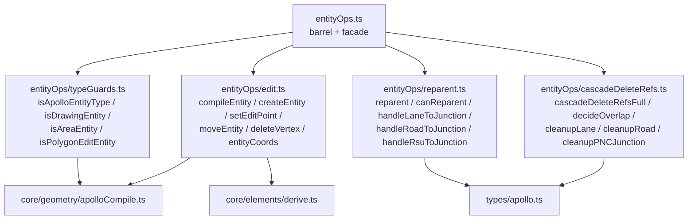
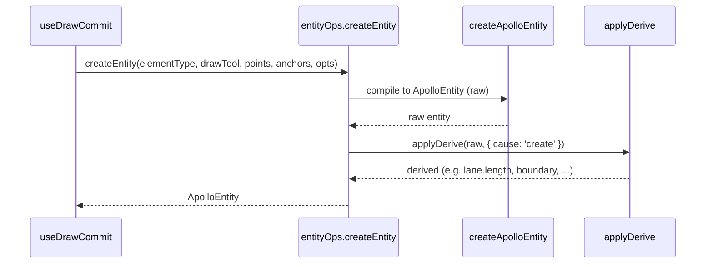

# entityOps Module

`src/lib/entityOps.ts` (40 lines) is a **facade**: it exposes every
Apollo-proto-aware operation — geometry, editing, validation, cascade
deletion, reparenting, type guards — as a proto-agnostic `MapEntity` API.
Components, hooks, and stores import only `@/lib/entityOps`; they never
reach into `@/core/geometry/apolloCompile.ts` or specific
`@/types/apollo` fields.

## 1. Purpose & invariants

::: tip Goals

- A proto upgrade (e.g. Apollo v2 changing `lane.boundaryType`) only
  affects `entityOps` internals — UI and stores stay untouched.
- Provide one entry for "parametric geometry → GeoJSON" compilation
  (`compileEntity`) so cold/hot layers don't depend on `apolloCompile`.
- Concentrate proto-aware complex operations (cascade-delete-refs,
  reparenting) in the lib layer.
  :::

::: warning Invariants

- Only modules under `lib/entityOps/*` may import
  `core/geometry/apolloCompile` and `types/apollo`.
- `lib/entityOps.ts` exports do not expose Apollo type fields directly —
  only `MapEntity`, `ApolloEntity` (as opaque), `GeoPoint`,
  `BezierAnchorData`, and `DrawingEntity`.
- Cascade deletion exposes only `cascadeDeleteRefsFull`; callers must handle
  `cascadeRemoved`.
  :::

## 2. Module map



## 3. Public surface

| Symbol                                                                       | Origin                 | Role                                              |
| ---------------------------------------------------------------------------- | ---------------------- | ------------------------------------------------- |
| `MapEntity`, `ApolloEntity`, `DrawingEntity`, `GeoPoint`, `BezierAnchorData` | `entityOps.ts:7-10`    | Type re-exports (Apollo types remain opaque)      |
| `compileEntity(entity)`                                                      | `edit.ts:69-74`        | `MapEntity` → GeoJSON Features                    |
| `createEntity(elementType, drawTool, points, anchors, options)`              | `edit.ts:76-85`        | Build an ApolloEntity (with derive)               |
| `getEditPoints(entity)`                                                      | `edit.ts:19-35`        | List of editable control points                   |
| `setEditPoint(entity, index, point)`                                         | `edit.ts:37-43`        | Update a single control point + re-derive         |
| `setAllEditPoints(entity, points)`                                           | `edit.ts:45-51`        | Replace all control points                        |
| `moveEntity(entity, dx, dy)`                                                 | `edit.ts:53-59`        | Translate the entity                              |
| `deleteVertex(entity, index)`                                                | `edit.ts:61-67`        | Drop a vertex; null = degenerate                  |
| `entityCoords(entity)`                                                       | `edit.ts:87-92`        | All coords as `LngLat[]`                          |
| `cascadeDeleteRefsFull`                                                      | `cascadeDeleteRefs.ts` | Returns `{ changes, cascadeRemoved }`             |
| `reparent`                                                                   | `reparent.ts:195-204`  | Move a child under a new parent                   |
| `canReparent`                                                                | `reparent.ts:206-212`  | Permission check                                  |
| `isDrawingEntity`                                                            | `typeGuards.ts:7-9`    | polyline/bezier/arc/rect/polygon                  |
| `isApolloEntityType`                                                         | `typeGuards.ts:11-13`  | Apollo business entity                            |
| `isAreaEntity`                                                               | `typeGuards.ts:15-18`  | Area-shaped (rect / polygon / area Apollo entity) |
| `isPolygonEditEntity`                                                        | `typeGuards.ts:25-28`  | Edit points form a closed polygon ring            |

## 4. createEntity responsibility chain



The derive engine (`core/elements/derive.ts`) computes read-only fields per
element type: lane length, parking-space polygon vertices, signal
stop-line associations, and so on.

## 5. cascadeDeleteRefs internals

```mermaid
flowchart TB
  In[removedIds: Set<id>] --> Iter[walk allEntities]
  Iter --> Branch{ entity.entityType }
  Branch -->|overlap| Decide[decideOverlap]
  Branch -->|lane| Lane[cleanupLane: clear junctionId / pred-succ-neighbor]
  Branch -->|road| Road[cleanupRoad: strip section.laneIds / junctionId]
  Branch -->|pncJunction| PNC[cleanupPNCJunction: strip passages.*Ids]
  Branch -->|rsu| RSU[junctionId null]
  Decide -->|<2 remaining| Remove[add to cascadeRemoved]
  Decide -->|partial| Patch[changes.set(id, patched)]
  Iter --> Stripped[stripOverlapIds]
  Stripped -->|cascadeRemoved non-empty| Cleanup[cleanupCascadedOverlapIds]
```

- `decideOverlap` (`cascadeDeleteRefs.ts:116-121`): when an overlap's
  `objects` drop below 2, the overlap entity is itself removed and added
  to `cascadeRemoved`.
- `cleanupCascadedOverlapIds` runs a second pass to strip references to
  cascaded overlap ids from every other entity's `overlapIds` array.

## 6. reparent strategy table

```ts
// reparent.ts:184-193
const HANDLERS = {
  'lane:junction': handleLaneToJunction,
  'lane:road': handleLaneToRoad,
  'lane:roadSection': handleLaneToRoadSection,
  'lane:none': handleLaneToNone,
  'road:junction': handleRoadToJunction,
  'road:none': handleRoadToNone,
  'rsu:junction': handleRsuToJunction,
  'rsu:none': handleRsuToNone,
};
```

- `lane → junction`: set `lane.junctionId`; strip the lane from every
  road's sections.
- `lane → roadSection`: clear `lane.junctionId`; insert the lane into the
  named section; remove from other roads. Creates a section if its id
  doesn't exist yet.
- `lane → road`: equivalent to `lane → roadSection(sections[0])`,
  defaulting to `roadId_s0`.
- `road → junction`: set `road.junctionId`.
- `rsu → junction`: set `rsu.junctionId`.
- `* → none`: detach.

::: warning Rejection strings
When the target shape is wrong (e.g. relocating a lane onto a stopSign),
`reparent` returns `{ changes: new Map(), rejected: 'cannot reparent X → Y' }`.
The UI should toast the rejection.
:::

## 7. typeGuards design

The `DRAWING_TYPES` set (`polyline | catmullRom | bezier | arc | rect |
polygon`) defines "generic drawing geometry". Every other entity type is
an Apollo business entity. `isApolloEntityType` is simply the negation of
`isDrawingEntity` — meaning **adding a new Apollo entity type does not
require touching typeGuards.ts**.

## 8. Internals: the isApolloEntityType branch in `edit.ts`

```ts
// edit.ts:19-35
export function getEditPoints(entity: MapEntity): GeoPoint[] {
  if (isApolloEntityType(entity)) return getApolloEditPoints(entity);
  switch (entity.entityType) {
    case 'polyline':
    case 'catmullRom':
    case 'polygon':
      return entity.points;
    case 'bezier':
      return entity.anchors.map((a) => a.point);
    case 'arc':
      return [entity.start, entity.mid, entity.end];
    case 'rect':
      return [entity.p1, entity.p2];
  }
}
```

Drawing-class entities are edited directly in lib (their schemas live in
lib too). Apollo business entities delegate to `getApolloEditPoints`.

## 9. derive engine relationship

`applyDerive` runs after every mutation entry: `setEditPoint`,
`setAllEditPoints`, `moveEntity`, `deleteVertex`, `createEntity`. It takes
`{ cause, prev }`:

- `cause: 'create'` — initialise derived fields.
- `cause: 'editGeometry'` — re-derive `length` / polygon / boundary, etc.
- Future: scoped causes for property-only edits.

::: tip Derive lives only at entityOps exits
Any path that mutates an entity must run derive, otherwise stale
`length` / polygon / boundary creep into the store.
:::

## 10. Common pitfalls

::: danger Direct apolloCompile import
The fundamental ACL line. `from '@/core/geometry/apolloCompile'` in
components or hooks is a PR blocker.
:::

::: danger Ignoring cascadeRemoved
`cascadeDeleteRefsFull` returns `cascadeRemoved` for orphan-overlap removals.
Every new feature must apply it.
:::

::: danger Mutating entity fields without setEditPoint
`mapStore.updateEntity` accepts an entity reference. If callers mutate
without going through entityOps, derive does not run and `length` /
polygon / boundary fall out of sync.
:::

::: danger Forgetting to apply reparent results
`reparent` returns a `changes` map. Callers must write it back to the
store. `mapStore.reparentEntity` (`mapStore.ts:218-234`) does this for
you; custom scripts must mirror that pattern.
:::

## 11. Source map

- `src/lib/entityOps.ts:1-39` — facade
- `src/lib/entityOps/edit.ts:1-92`
- `src/lib/entityOps/typeGuards.ts:1-28`
- `src/lib/entityOps/cascadeDeleteRefs.ts:1-214`
- `src/lib/entityOps/reparent.ts:1-212`
- `src/types/apollo.ts` — proto field definitions (internal)
- `src/core/elements/derive.ts` — derive engine
- `src/core/geometry/apolloCompile.ts` — internal proto-aware compiler

## 12. Performance and call boundaries

| Entry                   | Complexity              | Notes                                                                    |
| ----------------------- | ----------------------- | ------------------------------------------------------------------------ |
| `compileEntity(entity)` | O(features × points)    | Lane corridor with boundaries dominates; junction stitching is elsewhere |
| `createEntity(...)`     | O(point count) + derive | derive depends on entity type; lane goes through corridor compile        |
| `setEditPoint(...)`     | O(1) + derive           | A lane edit re-derives `length`                                          |
| `cascadeDeleteRefsFull` | O(N entities)           | Single sweep + second-pass `stripOverlapIds`                             |
| `reparent(...)`         | O(roads × sections)     | Only when the child is a lane; otherwise O(1)                            |

::: tip Call frequency
`compileEntity` is invoked by the worker on the cold-layer path (cached by
`featureCache`). UI must not call it inside render.
:::

## 13. derive cause shapes

```ts
type DeriveCause =
  | { cause: 'create' }
  | { cause: 'editGeometry'; prev: MapEntity }
  | { cause: 'editProperty'; prev: MapEntity; field: string }; // future
```

Only the first two are in use. A future `editProperty` cause can let
derive skip geometry-derived fields and re-derive only property-driven
fields (e.g. when `lane.type` changes, recompute boundary colour without
recomputing `length`).

## 14. Test matrix

| Module                 | Key cases                                                                                                                |
| ---------------------- | ------------------------------------------------------------------------------------------------------------------------ |
| `cascadeDeleteRefs.ts` | Deleting a lane clears related road sections; deleting a junction nulls `lane.junctionId`; orphaned overlaps are removed |
| `reparent.ts`          | lane → junction, lane → roadSection, lane → none; reject illegal child:target                                            |
| `typeGuards.ts`        | All six drawing types match; unknown entityType routes through the Apollo branch                                         |
| `edit.ts`              | `setEditPoint` triggers derive; `deleteVertex` returns `null` at the degenerate boundary                                 |

## 15. Public-contract stability

| Symbol                                             | Stability | Notes                                          |
| -------------------------------------------------- | --------- | ---------------------------------------------- |
| `compileEntity` / `createEntity` / `getEditPoints` | stable    | Primary API; no breaking changes               |
| `cascadeDeleteRefsFull`                            | stable    | Main path                                      |
| `reparent` / `canReparent`                         | stable    | HANDLERS can be extended                       |
| `isXxx` guards                                     | stable    | Adding an entity type does not require changes |

## 16. Usage examples

### 16.1 Create a lane

```ts
import { createEntity } from '@/lib/entityOps';
import type { LngLat } from '@/core/geometry/interpolate';

const points: LngLat[] = [
  [121.5, 31.2],
  [121.501, 31.2],
  [121.502, 31.201],
];
const lane = createEntity('lane', 'drawPolyline', points, [], { laneHalfWidth: 1.75 });
useMapStore.getState().addEntity(lane);
```

### 16.2 Reparent a lane to a junction

```ts
import { useMapStore } from '@/store/mapStore';

const result = useMapStore
  .getState()
  .reparentEntity('lane_xxx', { kind: 'junction', id: 'junction_yyy' });
if (result.rejected) toast(result.rejected);
```

### 16.3 Delete a lane with cascade

```ts
useMapStore.getState().removeEntity('lane_xxx');
// mapStore internally calls cascadeDeleteRefsFull
```

### 16.4 Edit a single vertex

```ts
import { setEditPoint } from '@/lib/entityOps';

const lane = useMapStore.getState().entities.get('lane_xxx')!;
const next = setEditPoint(lane, 0, { x: 121.499, y: 31.2 });
useMapStore.getState().updateEntity('lane_xxx', next);
```

## 17. See also

- [Anti-Corruption Layer](./anti-corruption-layer.md) — broader treatise
- [Architecture Overview](./overview.md)
- [State Management](./state-management.md) — how `mapStore` calls
  cascadeDeleteRefsFull / reparent
- [FSM Design](./fsm-design.md) — `useDrawCommit` calls `createEntity`
- [Geometry Engine](../../architecture/geometry-engine.md)
- [Derive Engine](../../architecture/derive-engine.md)
