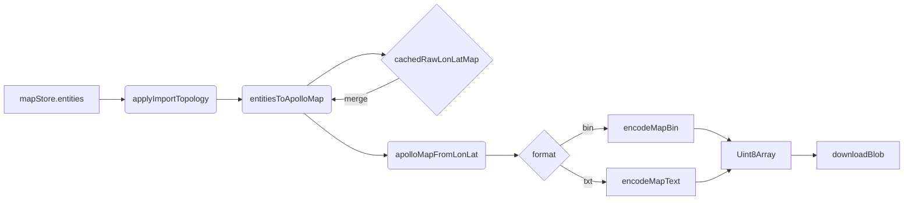

# Export Engine

> Current implementation: `src/io/apolloIO.worker.ts` +
> `src/io/apolloIOBridge.ts`. Unlike the discrete
> `buildBaseMap.ts` / `buildSimMap.ts` / `buildRoutingMap.ts` modules
> sketched in ARCHITECTURE.md, this codebase implements export through a
> single worker that "keeps the original raw map → swap entities →
> reverse-project → encode" pipeline.

## 1. Pipeline overview



| Step                  | File:line                                               | Purpose                                                                |
| --------------------- | ------------------------------------------------------- | ---------------------------------------------------------------------- |
| `applyImportTopology` | `src/io/apolloIO.worker.ts:94-114`                      | reconcileLaneTopology + reconcileOverlaps (mode: 'full')               |
| `entitiesToApolloMap` | `src/io/proto/entityBridge/map.ts`                      | overlay edited entities onto the raw map's per-type arrays             |
| `cachedRawLonLatMap`  | `src/io/apolloIO.worker.ts:27`                          | the raw lon/lat map cached at import time — preserves untouched fields |
| `apolloMapFromLonLat` | `src/io/proto/adapter.ts:72`                            | WGS84 → UTM ENU reverse projection                                     |
| `encodeMapBin`        | `src/io/proto/binCodec.ts:17`                           | protobufjs binary encode                                               |
| `encodeMapText`       | `src/io/proto/textCodec.ts:13` / `textCodec/encoder.ts` | Apollo text protobuf encode                                            |

## 2. Entry: `mapIO.ts`

`src/io/mapIO.ts:95-141` exposes two user commands:

```ts
export async function exportApolloBin(): Promise<void>;
export async function exportApolloText(): Promise<void>;
```

Both share `currentExportContext()` — it asserts
`apolloMapStore.info` exists (must have imported first), then pulls
the entity array from `mapStore.entities` and calls
`apolloIOBridge.exportBin/Text(entities, projString, onProgress)`.
The result is a Uint8Array which `downloadBlob(blob, suggestedFilename(...))`
hands to the browser.

Filename rule:

```ts
// mapIO.ts:75-79
function suggestedFilename(originalName: string, ext: 'bin' | 'txt'): string {
  const base = originalName.replace(/\.(bin|txt|pb\.txt)$/i, '') || 'apollo-map';
  const stamp = new Date().toISOString().replace(/[-:T]/g, '').slice(0, 14);
  return `${base}-${stamp}.${ext}`;
}
```

`<base>-YYYYMMDDhhmmss.{bin|txt}`.

## 3. Bridge: chunked + transfer

`ApolloIOBridge.exportBin/exportText`
(`apolloIOBridge.ts:138-178`):

1. Register `pending[requestId]` with onProgress / resolve / reject.
2. `BEGIN_EXPORT { format, projString, total: N }` switches the
   worker into accumulation mode.
3. `EXPORT_ENTITIES_CHUNK { entities, offset, total }` — 2000
   entities per batch, each batch awaits `yieldToMain()` so the main
   thread is not flooded by `postMessage` calls. PROGRESS frames keep
   the UI updated.
4. `FINISH_EXPORT` triggers actual encoding.
5. Worker replies with `EXPORT_BIN_RESULT { bytes }` /
   `EXPORT_TEXT_RESULT { bytes }`; bridge resolves the Uint8Array.

`bytes` is sent with `[bytes.buffer]` transfer, avoiding a 50 MB
double-allocation.

## 4. Worker stage

```ts
// src/io/apolloIO.worker.ts:199-243
async function runExport(requestId, entities, projString, format) {
  if (!cachedRawLonLatMap) {
    throw new Error('No imported Apollo map is cached in the IO worker.');
  }
  // 1. derive: full topology + overlap recompute
  const processed = applyImportTopology(entities);
  // 2. merge: overlay edited entities onto cached raw map
  const merged = entitiesToApolloMap(cachedRawLonLatMap, processed.entities);
  // 3. project: lon/lat → ENU
  const { map: enuMap } = await apolloMapFromLonLat(merged, projString);
  // 4. encode: bin or text
  if (format === 'bin') {
    const bytes = await encodeMapBin(enuMap);
    postWithTransfer({ type: 'EXPORT_BIN_RESULT', requestId, bytes }, [bytes.buffer]);
  } else {
    const text = await encodeMapText(enuMap);
    const bytes = TEXT_ENCODER.encode(text);
    postWithTransfer({ type: 'EXPORT_TEXT_RESULT', requestId, bytes }, [bytes.buffer]);
  }
}
```

Each step pushes a PROGRESS frame: 12% Recomputing overlaps → 35%
Merging → 55% Projecting → 80% Encoding → 100% done.

## 5. derive: topology + overlap

```ts
// apolloIO.worker.ts:94-114
function applyImportTopology(entities) {
  const entityMap = new Map(entities.map((e) => [e.id, e]));

  // 1) lane topology: predecessor/successor/neighbor endpoint linking
  const { changes: topoChanges } = reconcileLaneTopology(entityMap);
  for (const [id, e] of topoChanges) entityMap.set(id, e);

  // 2) overlap: lane × signal/stopSign/junction/... full recompute
  const patch = reconcileOverlaps(entityMap, { mode: 'full' }, new SpatialIndex());
  for (const id of patch.removedOverlapIds) entityMap.delete(id);
  for (const [id, e] of patch.changes) entityMap.set(id, e);

  return { entities: Array.from(entityMap.values()), topologyMs, overlapMs };
}
```

Intent: the pre-export derive is the **last line of defence**. Even if
some interactive edits skipped reconcile, the export still emits a
topology-consistent Apollo map.

## 6. merge: preserve untouched fields

`entitiesToApolloMap(cachedRawLonLatMap, entities)`
(`entityBridge/map.ts`) does the following:

- replaces the raw map's per-type arrays (`lane`, `crosswalk`,
  `junction`, …) with the editor's entities;
- **fields the editor never modeled** (lane `function` enums, lane
  `link`, internal Apollo-private flags) are kept from the original
  raw map;
- header / hdmap_version / custom fields pass through untouched.

This is why export requires a prior import — without the raw map,
nothing is "preserved".

## 7. project: precision and units

`apolloMapFromLonLat(map, projString)` calls
`transformPointsInMessage(Map, msg, projection.fromLonLat)` to
recursively walk every `apollo.common.PointENU` sub-message
(`adapter.ts:12-39`).

The projection is proj4-driven: `makeProjection(projString)`
(`projection.ts:30-45`) builds `forward([x,y])` lookups for both
`toLonLat` and `fromLonLat`. `PointENU.z` is preserved on round trip.

## 8. encode: bin vs text

### 8.1 binCodec

```ts
// src/io/proto/binCodec.ts:17-23
export async function encodeMapBin(obj) {
  const Map = await getMapType();
  const err = Map.verify(obj); // schema check
  if (err) throw new Error(`Map.verify failed: ${err}`);
  const msg = Map.fromObject(obj);
  return Map.encode(msg).finish();
}
```

`Map.verify` catches type errors before serialisation (non-numeric
enums, missing required fields). On failure the worker emits an
`ERROR` response and the bridge rejects.

### 8.2 textCodec

`textCodec.ts` calls a custom `encodeMessage`
(`textCodec/encoder.ts`) and produces Apollo text protobuf —
snake_case field names, named enums. 5–10× larger than `.bin` but
diff-friendly.

### 8.3 When to pick each

| Scenario                   | Pick   |
| -------------------------- | ------ |
| Apollo runtime integration | `.bin` |
| Manual review / git diff   | `.txt` |
| Automated test fixtures    | `.txt` |
| CI artifact size           | `.bin` |

## 9. Header retention

`cachedRawLonLatMap.header` is passed through verbatim — this includes
`projection.proj`, `vendor`, `hdmap_version`, `zone_id`, `max/min`
bounding boxes. `apolloIO.worker.ts:75-79`'s `cloneHeader` only
`structuredClone`s a copy for the store at import time; export still
reads the cached raw header.

## 10. ProjString parsing

```ts
// src/io/proto/adapter.ts:87-98
export function readHeaderProjString(map): string | null {
  const header = map.header;
  const proj = header?.projection?.proj;
  if (proj == null) return null;
  if (typeof proj === 'string') return proj;
  if (proj instanceof Uint8Array) return new TextDecoder().decode(proj);
  if (Array.isArray(proj)) return proj.map((b) => String.fromCharCode(b as number)).join('');
  return null;
}
```

Older Apollo headers might encode the PROJ string as bytes /
`number[]`, all three need to round-trip. `sanitizeProjString`
(`projection.ts:10-12`) further strips
`+lat_0={37.413082}` template placeholders.

## 11. EditorMeta passthrough

The `editor_meta` field (proto field 1000 on `Map`) lets the editor
shove metadata that Apollo runtime ignores — "polyline vs polygon"
hints, user-override flags — into the same `.bin`. Apollo's proto2
default preserves unknown fields, so the round trip is lossless.

`src/io/proto/editorMeta.ts:49-66`:

- `readEditorMeta(rawMap)` parses wire → memory at import.
- `writeEditorMeta(rawMap, meta)` serialises memory → wire at export.

## 12. Public API

| Entry                            | File:line                           |
| -------------------------------- | ----------------------------------- |
| `exportApolloBin`                | `src/io/mapIO.ts:95`                |
| `exportApolloText`               | `src/io/mapIO.ts:121`               |
| `apolloIOBridge.exportBin`       | `apolloIOBridge.ts:88`              |
| `apolloIOBridge.exportText`      | `apolloIOBridge.ts:96`              |
| `runExport`                      | `apolloIO.worker.ts:199`            |
| `entitiesToApolloMap`            | `proto/entityBridge/map.ts`         |
| `apolloMapFromLonLat`            | `proto/adapter.ts:72`               |
| `encodeMapBin` / `encodeMapText` | `proto/binCodec.ts`, `textCodec.ts` |

## 13. Performance budget

| Stage                   | 50k-entity map (measured) |
| ----------------------- | ------------------------- |
| `applyImportTopology`   | ~150 ms                   |
| `entitiesToApolloMap`   | ~80 ms                    |
| `apolloMapFromLonLat`   | ~120 ms                   |
| `encodeMapBin`          | ~250 ms                   |
| **Total**               | **~600 ms**               |
| Bridge / chunk overhead | <50 ms                    |

CI's `scripts/bench-budgets.json` sets hard regression thresholds.

## 14. Pitfalls

1. **Exporting before import** — `runExport` throws
   `No imported Apollo map is cached`, the UI surfaces ERROR.
   `pickAndImportApollo()` must run first.
2. **`mode: 'full'` overlap is mandatory** — incremental overlap can
   miss "indirect" overlaps caused by lane-topology re-linking.
3. **`{}` placeholders in PROJ strings** — without sanitisation proj4
   throws.
4. **Forgetting to transfer `bytes`** doubles peak memory, risking OOM
   on 50MB+ exports.
5. **Manual entity edits without triggering derive** — export will
   surface inconsistencies. `applyImportTopology` is the safety net,
   but production should let the runtime reconciler run on every
   edit (already the default).

## 15. Tests

`src/io/__tests__/endToEnd.test.ts`:

1. loads fixtures from `__fixtures__/apollo/{borregas_ave, demo, dreamview}`;
2. import → edit (add/remove a lane) → exportBin → re-import;
3. asserts lossless round trip on key invariants (lane id set, lane
   topology, overlap set).

`__fixtures__/apollo/` packs three Apollo demo maps covering small,
medium, and large sizes.

## 16. Relationship to base_map / sim_map / routing_map

ARCHITECTURE.md describes three Apollo map flavours via separate build
modules. The current implementation only produces `base_map`: the
editor treats `base_map` as the single source of truth, and Apollo's
offline tools derive sim_map / routing_map from it. If we ever inline
those derivations, `runExport(format='base'|'sim'|'routing')` will
become a new dimension on the worker protocol.

## 17. Source map

```
src/io/
├── mapIO.ts                       ← exportApolloBin/Text entry
├── fileIO.ts                      ← downloadBlob and friends
├── apolloIOBridge.ts              ← chunked + transfer main-thread wrapper
├── apolloIOProtocol.ts            ← request/response shape
├── apolloIO.worker.ts             ← runExport implementation
├── proto/
│   ├── adapter.ts                 ← apolloMapFromLonLat / readHeaderProjString
│   ├── binCodec.ts                ← encodeMapBin
│   ├── textCodec.ts               ← encodeMapText
│   ├── projection.ts              ← proj4 bridge
│   ├── loader.ts                  ← protobufjs schema bundling
│   ├── editorMeta.ts              ← editor_meta passthrough
│   ├── apolloGeoJson.ts           ← import bbox computation
│   └── entityBridge/
│       ├── map.ts                 ← entitiesToApolloMap
│       ├── laneRoad.ts
│       ├── overlap.ts
│       └── simpleEntities.ts
└── __tests__/endToEnd.test.ts
```

## 18. See also

- [Worker Protocol](./worker-protocol.md)
- [Coordinate System](./coordinate-system.md)
- [Anti-corruption Layer](./anti-corruption-layer.md)
- [Overlap Derivation](./overlap-derivation.md)
- [Junction Stitching](./junction-stitching.md)
