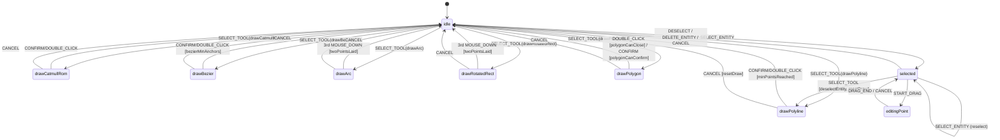
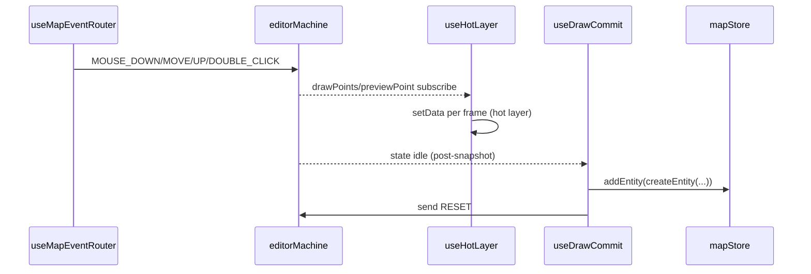
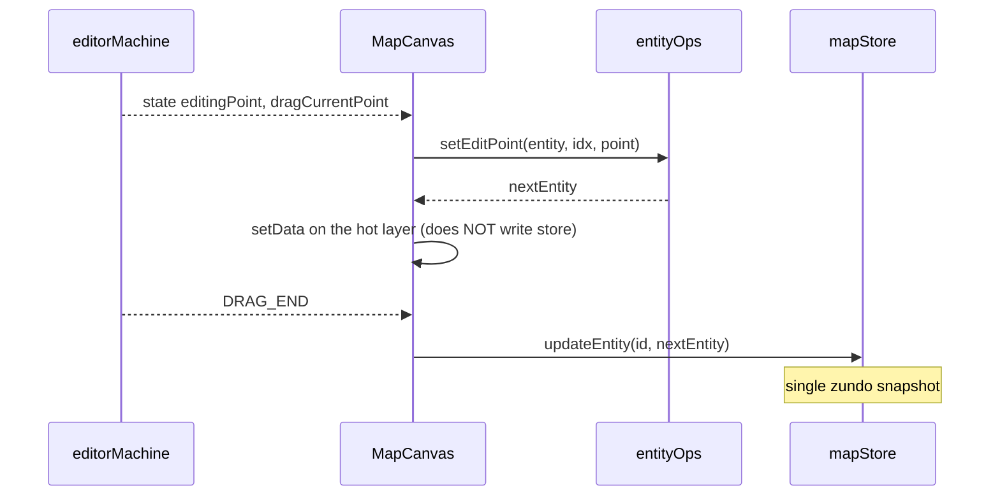

# FSM Design

`src/core/fsm/editorMachine.ts` is the **single source of truth** for editor
interaction. It uses XState 5's typed `setup({ types }).createMachine(...)`
pattern and describes 6 draw states, 3 non-draw states (idle / selected /
editingPoint), the shared draw event handlers, and the post-snapshot commit
protocol that pairs with `useDrawCommit`. This page lays out every state,
event, guard, and action.

## 1. Purpose & invariants

::: tip Goals

- Eliminate the possibility of a component shadowing editor macro-state.
- Use guards to keep invalid input out of the store (e.g. self-intersecting
  polygons can't close).
- The undo contract: CANCEL → temporal.undo() (R1 closure).
  :::

::: warning Invariants

- The whole editor uses **one** actor, created at
  `WorkspaceLayout.tsx:187`.
- Input-layer dedup is the canonical layer; the FSM no longer compensates
  with `slice(-1)`.
- Commit transitions into `idle` carry **no actions** so `useDrawCommit`
  can read the post-snapshot.
  :::

## 2. State / event landscape



## 3. Context

```ts
// editorMachine.ts:32-44
export interface EditorContext {
  drawPoints: LngLat[];
  previewPoint: LngLat | null;
  bezierAnchors: BezierAnchor[];
  isDraggingHandle: boolean;
  selectedEntityId: string | null;
  dragPointIndex: number;
  dragPointType: DragPointType;
  dragCurrentPoint: LngLat | null;
  dragAltKey: boolean;
  activeElement: MapElementType | null;
}
```

`activeElement` lets the ToolStrip know which Apollo element is being drawn
(lane vs polyline). `previewPoint` feeds the hot-layer with the next
candidate point.

## 4. Events

```ts
// editorMachine.ts:46-65
type EditorEvent =
  | { type: 'SELECT_TOOL'; tool: DrawTool; element?: MapElementType }
  | { type: 'MOUSE_DOWN'; point: LngLat }
  | { type: 'MOUSE_MOVE'; point: LngLat }
  | { type: 'MOUSE_UP'; point: LngLat }
  | { type: 'DOUBLE_CLICK'; point: LngLat }
  | { type: 'CONFIRM' }
  | { type: 'CANCEL' }
  | { type: 'RESET' }
  | { type: 'SELECT_ENTITY'; id: string }
  | { type: 'DESELECT' }
  | { type: 'START_DRAG'; index: number; pointType: DragPointType; altKey?: boolean }
  | { type: 'DRAG_MOVE'; point: LngLat }
  | { type: 'DRAG_END'; point: LngLat }
  | { type: 'DELETE_ENTITY' }
  | { type: 'TOGGLE_SMOOTH'; index: number };
```

::: warning CANCEL vs RESET
Both return to `idle`, but their semantics differ:

- `CANCEL` is user-initiated abort (Esc / pre-undo). It runs `resetDraw`.
- `RESET` is fired by `useDrawCommit` **after** commit. Without it,
  `activeElement` lingers and ToolStrip stays highlighted on the wrong
  tool.
  :::

## 5. Guards

| Guard                    | Role                                                                |
| ------------------------ | ------------------------------------------------------------------- |
| `minPointsReached`       | drawPoints ≥ 2 — required for polyline / curve / catmull-rom commit |
| `bezierMinAnchors`       | bezierAnchors ≥ 2                                                   |
| `isDraggingHandle`       | currently dragging a Bezier control handle                          |
| `twoPointsLaid`          | exactly two points placed → next click commits (Arc / RotatedRect)  |
| `polygonNoSelfIntersect` | the candidate point would not introduce self-intersection           |
| `polygonCanClose`        | ≥3 points and currently non-self-intersecting (DOUBLE_CLICK)        |
| `polygonCanConfirm`      | same shape check for CONFIRM                                        |

## 6. Actions

| Action                | Purpose                                                                                              |
| --------------------- | ---------------------------------------------------------------------------------------------------- |
| `resetDraw`           | Clears drawPoints / previewPoint / bezierAnchors / isDraggingHandle; resets activeElement from event |
| `addPoint`            | Appends MOUSE_DOWN point to drawPoints                                                               |
| `updatePreview`       | Stores MOUSE_MOVE point as previewPoint                                                              |
| `bezierAddAnchor`     | Appends a BezierAnchor and sets isDraggingHandle                                                     |
| `bezierDragHandle`    | Updates the latest anchor's handleIn/handleOut via mirrorPoint                                       |
| `bezierConfirmHandle` | On MOUSE_UP, releases the handle; if distance is tiny, sets handleIn/Out to null (sharp corner)      |
| `bezierPreview`       | Updates previewPoint when not dragging                                                               |
| `selectEntity`        | Writes selectedEntityId; clears drag context                                                         |
| `deselectEntity`      | Clears selectedEntityId and drag context                                                             |
| `startDrag`           | Records dragPointIndex / type / altKey                                                               |
| `dragMove`            | Stores dragCurrentPoint                                                                              |

## 7. Shared draw event handlers

```ts
// editorMachine.ts:89-105
const sharedDrawEvents = {
  SELECT_TOOL: selectToolTransitions,
  MOUSE_DOWN: { actions: 'addPoint' },
  MOUSE_MOVE: { actions: 'updatePreview' },
  DOUBLE_CLICK: { guard: 'minPointsReached', target: 'idle' },
  CONFIRM: { guard: 'minPointsReached', target: 'idle' },
  CANCEL: { target: 'idle', actions: 'resetDraw' },
};
```

`drawPolyline` and `drawCatmullRom` share this handler — removing one
breaks ToolStrip highlighting on the other.

`threeClickCommitEvents` is the Arc / RotatedRect variant: a third
MOUSE_DOWN gated on `twoPointsLaid` commits directly.

## 8. The `removeLastPoint` history

The comment block at `editorMachine.ts:83-87` explains: a dblclick fires two
mousedowns, so the FSM used to receive an extra point and `slice(-1)` on
DOUBLE_CLICK to compensate. Once `useMapEventRouter`'s `isDuplicateInput`
swallows the second click at the **input layer**, the FSM only sees one
MOUSE_DOWN. **Double compensation actually deletes a real point**, leaving
"polyline missing its last point". The current code trusts `drawPoints`.

## 9. XState 5 typing pitfall

The comment at `editorMachine.ts:120-128` explains why `assign(...)` calls
must remain **inline** inside `setup.actions`:

> XState 5's `assign` signature requires 5 type parameters (TContext,
> TExpressionEvent, TParams, TEvent, TActor). Inlined inside the typed
> `setup`, inference flows. Hoisted to a top-level constant, the resulting
> `_out_TEvent` widens to `EventObject`, breaking the structural match
> against the `setup.actions` map.

> Earlier revisions carried `// @ts-nocheck` due to this; the file is now
> typed (no `// @ts-nocheck`), but the inlining constraint remains.

## 10. drawBezier: dedicated handler

Bezier needs MOUSE_UP for handle release plus an `isDraggingHandle` branch:

```ts
// editorMachine.ts:332-353
drawBezier: {
  on: {
    SELECT_TOOL: selectToolTransitions,
    MOUSE_DOWN: { actions: 'bezierAddAnchor' },
    MOUSE_MOVE: [
      { guard: 'isDraggingHandle', actions: 'bezierDragHandle' },
      { actions: 'bezierPreview' },
    ],
    MOUSE_UP: { actions: 'bezierConfirmHandle' },
    DOUBLE_CLICK: { guard: 'bezierMinAnchors', target: 'idle', actions: assign({ isDraggingHandle: false }) },
    CONFIRM: { guard: 'bezierMinAnchors', target: 'idle' },
    CANCEL: { target: 'idle', actions: 'resetDraw' },
  },
},
```

## 11. drawPolygon: guard-heavy

MOUSE_DOWN is gated on `polygonNoSelfIntersect` — candidates that introduce
self-intersection are dropped silently. DOUBLE_CLICK uses
`polygonCanClose`; CONFIRM uses `polygonCanConfirm`. Both require ≥3 points
and non-self-intersection.

## 12. selected / editingPoint

`selected` receives `START_DRAG` (→ `editingPoint`), `DESELECT` /
`DELETE_ENTITY` / `CANCEL` (→ `idle`), or `SELECT_TOOL`
(`deselectEntity` then to draw state). `editingPoint` accepts `DRAG_MOVE` /
`DRAG_END` / `CANCEL`. **Actual entity mutation runs in MapCanvas on
DRAG_END**; the FSM does not own write semantics.

## 13. Outer-system interaction



## 14. Common pitfalls

::: danger Maintaining "am I drawing" outside the FSM
Any `useState<boolean>('isDrawing')` is a bug. The single source is
`useSelector(actorRef, s => isDrawingState(s.value as string))`.
:::

::: danger Adding actions to a commit transition
If `DOUBLE_CLICK` carries `actions: 'resetDraw'`, the post-snapshot sees
empty drawPoints and commit fails. **Keep commit transitions target-only.**
:::

::: danger Re-ordering deselect/reset on `selected → draw*`
`idle` uses `selectToolTransitions` (`resetDraw` only); `selected` uses
`selectToolFromSelected` (`deselectEntity` first, then `resetDraw`). The
order matters.
:::

::: danger Putting `selectedEntityId` into zundo
zundo persists only `mapStore.entities`; FSM context never enters history.
After undoing an entity delete, `selectedEntityId` may still point at the
gone id — InspectorForms must tolerate misses.
:::

## 15. Source map

- `src/core/fsm/editorMachine.ts:10-25` — `DrawTool` and `DRAW_STATES`
- `:32-44` — Context
- `:46-65` — Events
- `:67-79` — `selectToolTransitions` / `selectToolFromSelected`
- `:81-117` — `sharedDrawEvents` / `threeClickCommitEvents`
- `:130-249` — `setup({ types, guards, actions })`
- `:249-384` — `createMachine` body
- `src/hooks/__tests__/undoCancel.test.ts` — R1 regression test
- `src/hooks/useDrawCommit.ts` — post-snapshot commit + RESET

## 16. selectToolTransitions factory

```ts
// editorMachine.ts:67-73
const selectToolTransitions = DRAW_STATES.map((tool) => ({
  guard: ({ event }) => event.type === 'SELECT_TOOL' && event.tool === tool,
  target: tool,
  actions: ['resetDraw'] as const,
}));
```

One transition per draw state, identical structure except for the tool
name. Generated from the `DRAW_STATES` single source of truth so we can't
keep six hand-written rows in sync. `selectToolFromSelected` prefixes
`deselectEntity` to each.

## 17. When addPoint / updatePreview run

| Event      | Expected frequency    | Data path                                                     |
| ---------- | --------------------- | ------------------------------------------------------------- |
| MOUSE_DOWN | user click (~1 Hz)    | writes `drawPoints` → useHotLayer rerenders once              |
| MOUSE_MOVE | mouse move (60 Hz)    | writes `previewPoint` only → useHotLayer redraws at full rate |
| MOUSE_UP   | bezier handle release | drawBezier-only                                               |

`useHotLayer` subscribes to `s.context.previewPoint` via a selector, so
`updatePreview` does not cause whole-tree re-render.

## 18. dragMove → real entity mutation



::: tip No store writes during drag
Mid-drag the hot layer is updated directly. Writing the store on every
frame would fire immer producers, zundo snapshots, and worker
INCREMENTAL. The single commit happens at DRAG_END.
:::

## 19. TOGGLE_SMOOTH purpose

```ts
// editorMachine.ts:304-308
TOGGLE_SMOOTH: {
  target: 'selected',
}
```

Only a self-transition; the real "sharp ↔ smooth" toggle is performed by
MapCanvas after catching the event and calling entityOps to flip
`anchor.handleIn` / `handleOut`. The FSM merely records that "Alt+click on
an anchor" happened.

## 20. See also

- [Architecture Overview](./overview.md)
- [Action Registry](./action-registry.md) — origin of `SELECT_TOOL`
- [State Management](./state-management.md) — R1 CANCEL closure
- [Map Event Router](../../architecture/map-event-router.md) — input dedup
- [Geometry Engine](../../architecture/geometry-engine.md) — what happens after addPoint
